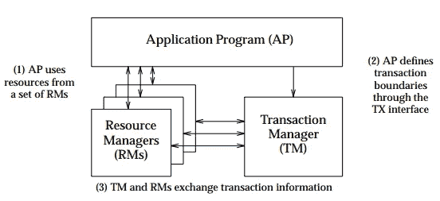
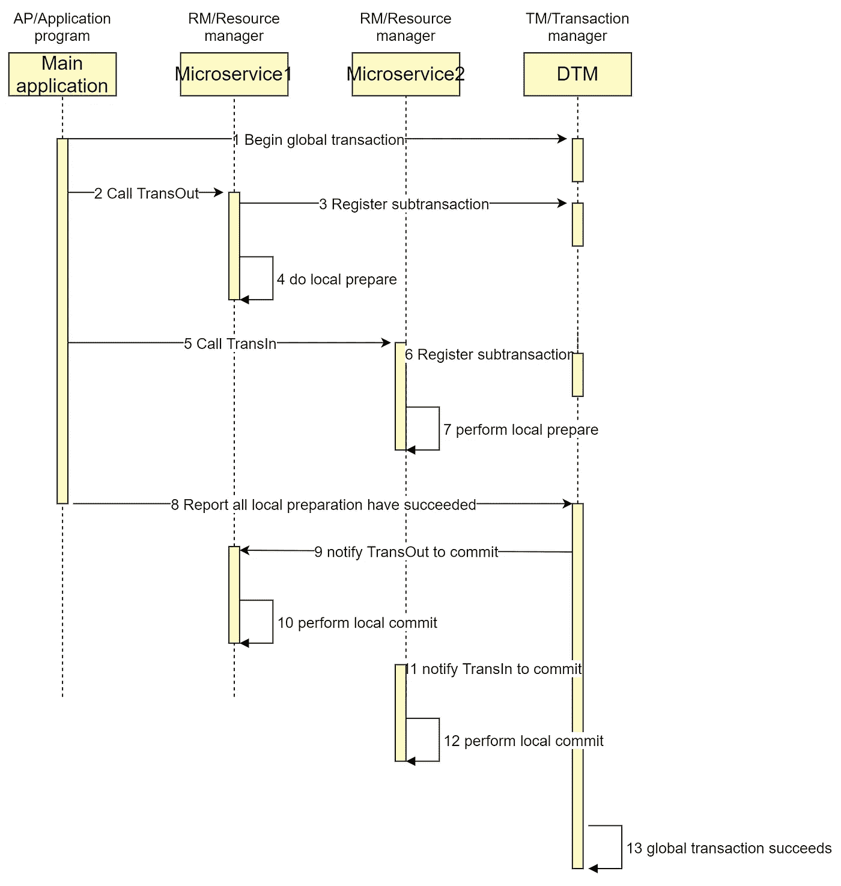
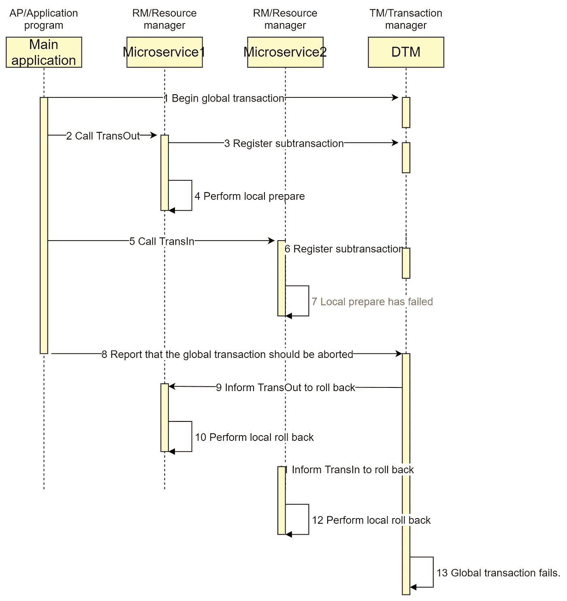

# 用 Go 中的实例理解 XA 事务

> 原文：<https://betterprogramming.pub/understanding-xa-transactions-with-practical-examples-in-go-67e99fd333db>

## XA 事务处理原理初探


在 [Unsplash](https://unsplash.com?utm_source=medium&utm_medium=referral) 上由[Towfiqu barb huya](https://unsplash.com/@towfiqu999999?utm_source=medium&utm_medium=referral)拍摄的照片

XA 是由 X/Open 组织提出的分布式事务规范。X/Open 分布式事务处理(DTP)模型由三个软件组件组成:

*   应用程序(AP)定义事务边界并指定构成事务的动作。
*   资源管理器(RM，如数据库或文件访问系统)提供对共享资源的访问。
*   一个称为事务管理器(TM)的独立组件为事务分配标识符，监控它们的进程，并负责事务完成和故障恢复。

下图说明了 X/Open DTP 模型定义的接口。



XA 分为两个阶段。

*   阶段 1(准备):所有参与的 RM 准备执行它们的事务并锁定所需的资源。当每个参与者准备好时，它向 TM 报告。
*   阶段 2(提交/回滚):当事务管理器(TM)接收到所有参与者(RM)都准备好了时，它向所有参与者发送提交命令。否则，它会向所有参与者发送回滚命令。

目前，几乎所有流行的数据库都支持 XA 事务，包括 Mysql、Oracle、SqlServer 和 Postgres。

# Mysql 中的 XA

让我们用下面的代码看看数据库 Mysql 是如何支持 XA 的:

# 业务场景

跨行转账是一种典型的分布式交易场景，其中 A 需要通过银行向 B 转账。取款和存款都可能成功或失败，并且要求 A 和 B 的余额之和在转账完成后不应发生变化，无论发生任何错误。

# 实现分布式 XA 事务

分布式 XA 事务可以解决上述业务问题。本文提出了一个基于 [dtm-labs/dtm](https://github.com/dtm-labs/dtm) 的解决方案。DTM 是一个流行的分布式事务框架，支持 XA、Saga、OutBox 和 TCC 模式。

下图说明了一个成功的全局事务:



在 Go 中实现它的代码非常简单:

上面的代码首先注册一个全局 XA 事务，然后调用两个子事务:`TransOut`、`TransIn`。在成功执行子事务之后，全局 XA 事务被提交给 DTM。DTM 收到 XA 全局事务的提交，然后调用所有子事务的`XA commit`，最后将全局事务的状态更改为成功。

其他语言的代码示例可以在这里找到:[SDK](https://en.dtm.pub/ref/sdk)

# 运行它

您可以通过运行以下命令来运行上面的示例。

## 运行 DTM

```
git clone https://github.com/dtm-labs/dtm && cd dtm
go run main.go
```

## 运行示例

```
git clone https://github.com/dtm-labs/dtm-examples && cd dtm-examples
go run main.go http_xa
```

# 失败时回滚

如果任何一个`prepare`操作失败，DTM 将调用每个子事务的`XA rollback`进行回滚，最终将全局事务的状态改为失败。

让我们在 XaFireRequest 的请求负载中传递`TransInResult="FAILURE"`来触发一个失败。

```
req := &busi.TransReq{Amount: 30, TransInResult: "FAILURE"}
```

故障时序图如下:



## 注意

*   第二阶段的命令也被发送到 API `BusiAPI+"/TransOutXa"`，在这个服务内部，`dtmcli.XaLocalTransaction`会自动调用`XA commit` | `XA rollback`。所以请求的主体是 nil，解析主体操作，比如前面的`reqFrom`，需要放在`XaLocalTransaction`里面。否则，主体解析将导致错误。

# TM 故障

两阶段提交的复杂性来自所有可能出现的失败场景。最讨厌的失败发生在参与者已经确认并准备好之后，收到决策之前，比如协调者的失败。

我们对此故障的解决方案非常简单和健壮。由于大多数云供应商提供高可用性数据库，我们可以在这些数据库中存储子事务的进度，并运行多个 TMs 实例。每个实例将轮询暂停的事务并继续处理它们。

云供应商负责处理数据库故障，并可能使用 Paxos/Raft 来可靠地选出一个健康的实例。

# 优点和缺点

与 SAGA 和 TCC 等其他模式相比，XA 全球事务的优势在于:

*   简单易懂
*   业务自动回滚，无需手动写补偿

XA 的缺点是:

*   需要来自底层数据库的 XA 事务
*   从数据修改到提交，数据被锁定，这比其他模式要长得多。不适合高度并发的业务。

# **结论**

本文介绍了 XA 事务的基本原理，并给出了一个应用实例。读者可以很容易地按照这个例子来处理自己的业务。

欢迎你来参观 github.com/dtm-labs/dtm。这是一个致力于使微服务中的分布式事务更容易的项目。它支持多种语言和模式，如两阶段消息、Saga、TCC 和 XA。