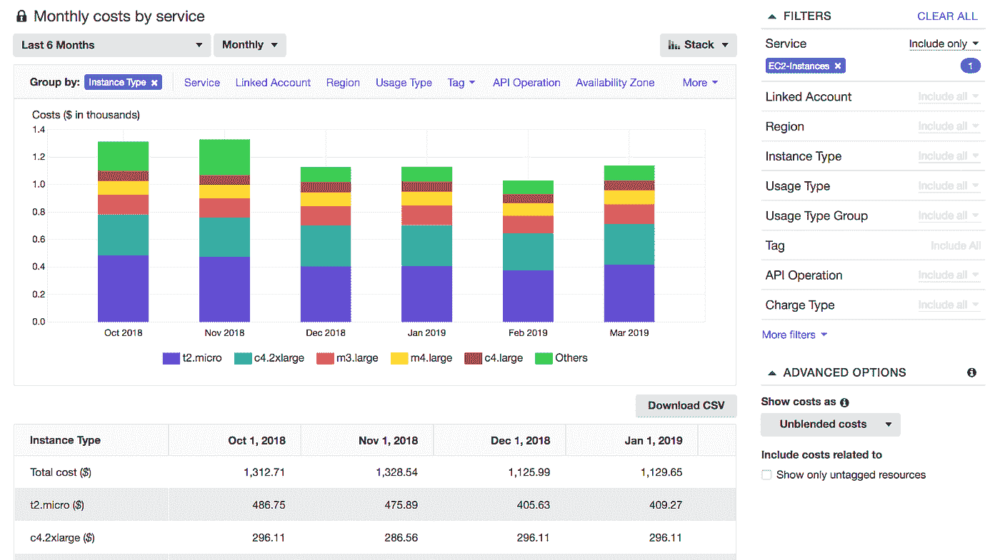
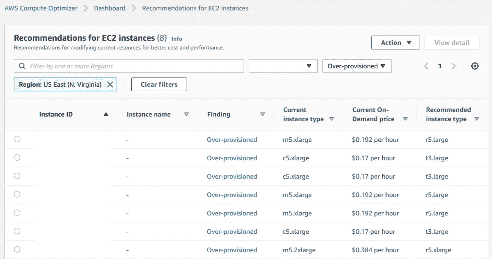
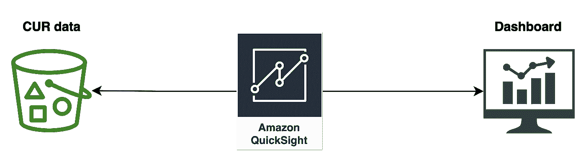
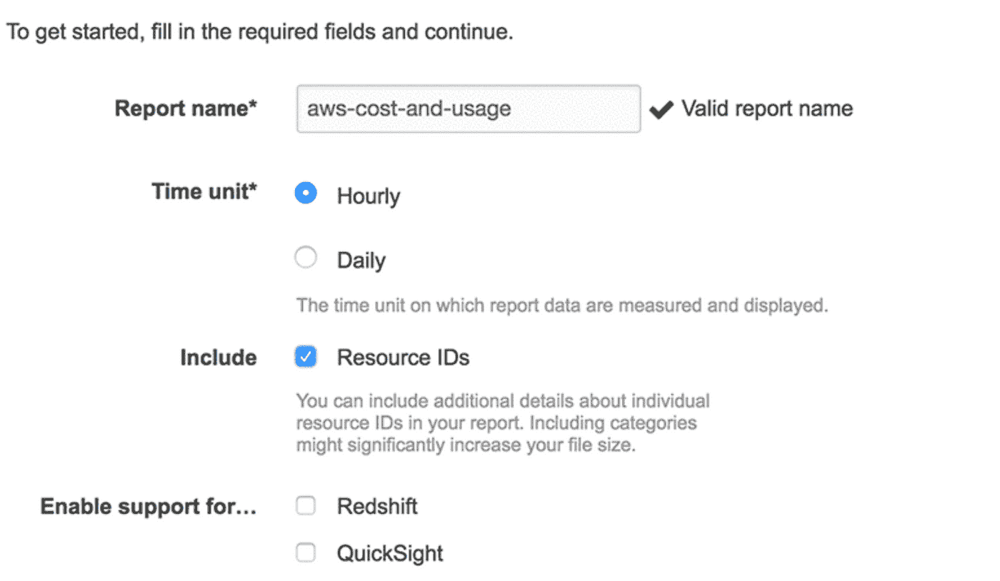
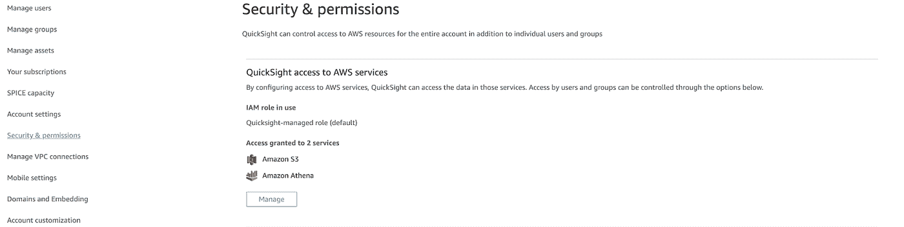
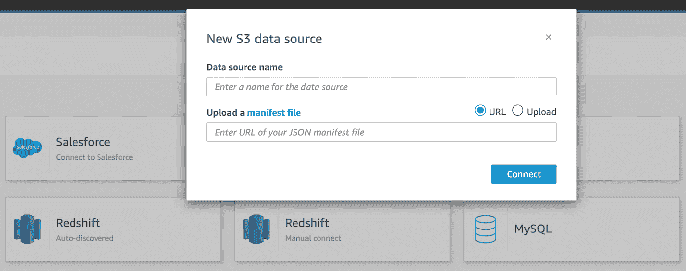
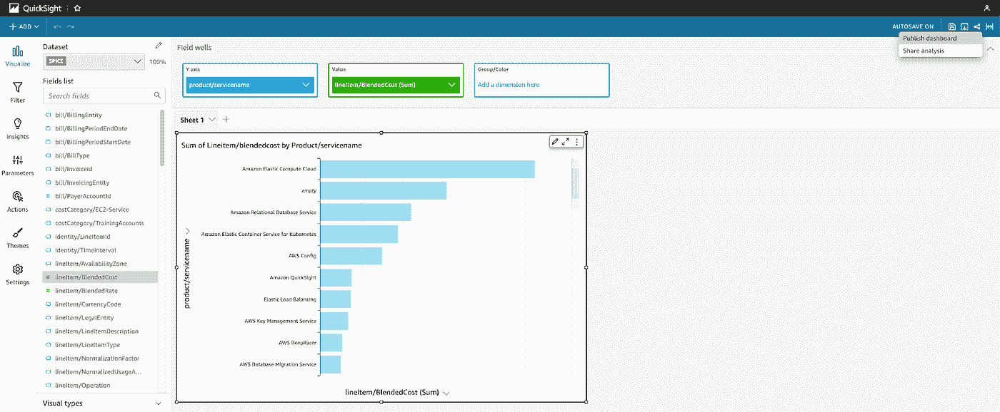

# 了解您的云成本数据，以便做出更好的决策

> 原文：<https://betterprogramming.pub/understanding-your-cloud-cost-data-for-better-decision-making-f6925ec05e3d>

## 你不能优化你不能测量的东西

[JESHOOTS.COM](https://unsplash.com/@jeshoots?utm_source=medium&utm_medium=referral)在 [Unsplash](https://unsplash.com?utm_source=medium&utm_medium=referral) 上拍照

随着我们走出疫情，迎接未来一年左右的潜在衰退，我们面临着许多业务挑战。许多公司在几个方面关注效率，其中之一是成本。除了成本之外，关键是要明白，优化任何东西都需要首先深入了解你想让什么变得更有效率。这与 FinOps 的[生命周期相一致，这是一种在我们试图充分利用云计算时出现的实践。](https://www.finops.org/framework/phases/)

[FinOps Foundation](https://www.finops.org/introduction/what-is-finops/) 将 FinOps 定义为*“一种不断发展的云财务管理规则和文化实践，通过帮助工程、财务、技术和业务团队协作制定数据驱动的支出决策，使组织能够获得最大的商业价值。”*

简而言之，我们正在谈论云成本管理或云经济。在大多数情况下，技术、采购和财务团队不得不(或旨在)以最佳方式计划购买硬件来增强其数字产品和服务的日子是漫长的。云计算行业打破了这一局面，因为我们进入了一个时代，在这个时代，点击一个按钮和按秒付费的模式可以在眨眼之间提供基础设施。

然而，一个问题是，在云中敏捷而有效地管理成本所需的成熟度很难达到。当您迭代地、增量地走这条路时，有多个文化和技术挑战需要解决。其中之一是数据可见性和问责制。

# **数据可见性和可访问性**

毫无疑问，你不能优化你看不到的东西。因此，我想我可以用几个步骤展示我将如何解决在特定团队中的登陆问题，以获得云金融前景的第一印象。

首先，一些免责声明。我们在这里试图实现的是确定按另一个方面(例如，按服务)分解的云成本，并获得总体支出的第一印象。我在这个例子中使用 AWS，但是它的相同或类似版本可以在其他云中实现。

此外，通过云供应商自己提供的一些开箱即用的解决方案或服务，您也有多种方式来实现同样的目标。不管任何技术解决方案如何，与拥有基础设施的人，如平台团队、FinOps 团队等密切合作总是一个好的方法。

如果您处于某种成熟的状态，并且可以访问运行您的资源的云帐户，您应该检查您的供应商的 cost explorer 解决方案(或任何其他可供您使用的解决方案),并在您交付新功能时将它放在手边。他们很擅长告诉你你的支出是多少，并允许你从多个方面进行筛选。

按例程类型显示 EC2 成本的 AWS 成本浏览器

这些受管工具不仅能很好地向您展示您当前的支出，还能为您的基础架构提供可行的建议。 [AWS 计算优化器](https://aws.amazon.com/compute-optimizer/)、 [AWS 合理调整建议](https://docs.aws.amazon.com/cost-management/latest/userguide/ce-rightsizing.html)等等，都是云供应商服务的好例子，它们有效地提供了这些见解，并确切地告诉您如何做才能省钱。

这些也适用于购买特定的计算产品，即云供应商可以基于历史数据分析其服务的利用率，以建议您可以购买多少[承诺和抢先使用](https://www.incredibuild.com/blog/whats-the-difference-between-on-demand-reserved-and-spot-instances)。这些大大降低了您的云支出，因为您的费用要低得多。

针对过度调配的 EC2 实例的 AWS 计算优化器建议

## **定制的技术方案**

假设我们想要一个更适合我们需求的解决方案，我们仍然有几种方法来实现它。在这种特殊情况下，我描述的解决方案涉及 AWS S3 和 AWS QuickSight 上托管的[成本和使用报告](https://docs.aws.amazon.com/cur/latest/userguide/what-is-cur.html) (CUR)数据。

使用 AWS S3 和 AWS QuickSight 的简单成本智能解决方案

首先，您必须确保您[启用并创建了 AWS 的成本和使用报告](https://docs.aws.amazon.com/cur/latest/userguide/cur-create.html)特性。当你这样做的时候，你可以选择在 S3 存放数据的格式。在这种情况下，我选择了 AWS QuickSight。

创建 AWS S3 CUR 报告

完成这个过程后，您将在指定的 S3 存储桶中获得 CUR 数据(可能需要一两天才能交付)。接下来是启动 AWS QuickSight 来可视化和分析这些数据。

[AWS QuickSight](https://docs.aws.amazon.com/quicksight/index.html) 是一款商业智能工具，可以对您的数据进行快速和专门的分析，这非常符合我们的目的。设置它的过程非常简单。首先，您需要打开服务并确保它可以访问其他相关的 AWS 服务。

为 AWS QuickSight 启用权限

在我的例子中，我已经设置好让 QuickSight 访问 S3 和雅典娜。接下来，您将根据托管在 S3 上的数据创建一个新数据集。

在 AWS QuickSight 中创建数据源/数据集

您将为 CUR 数据所在的 S3 时段输入数据源名称和 URI。一旦创建了数据集，它就可以随时用于创建分析和仪表板。下面是一个分析的例子，我按服务对[混合成本](https://docs.aws.amazon.com/awsaccountbilling/latest/aboutv2/con-bill-blended-rates.html)进行了分解。您可以添加多个这样的仪表板，以便以后作为仪表板发布。

显示混合成本/服务名称细分的简单数据分析

这是迈向成本智能的第一步，最终更先进的解决方案可能会像[这样](https://aws.amazon.com/blogs/aws-cloud-financial-management/a-detailed-overview-of-the-cost-intelligence-dashboard/)。

**注意:**请注意，在使用 AWS QuickSight 进行锻炼时，您需要[相应地管理您的香料量](https://docs.aws.amazon.com/quicksight/latest/user/managing-spice-capacity.html)。

# **结论**

云成本管理是在全球不确定性和 IT 基础设施财务优化的背景下出现的一门学科。有几个工具可以用来解释这个问题。其中一些是现成的，问题是在创建和维护数字产品时要将它们结合起来。另一方面，云供应商提供了一套丰富的工具，可以进一步分析和调查您的云使用数据。

最终，和往常一样，这项技术可以投入使用了。更重要的是，在现代数字业务的任何团队拓扑和级别中，都应该鼓励问责文化的改变。我认为，这就是挑战所在。