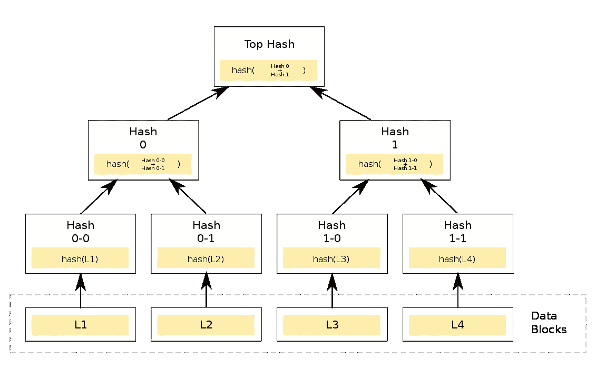
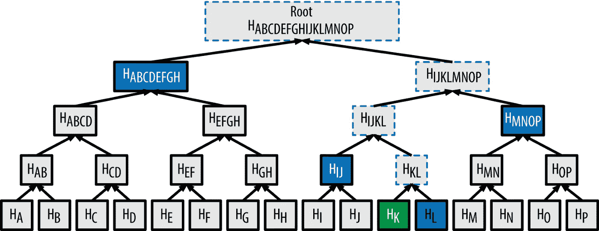
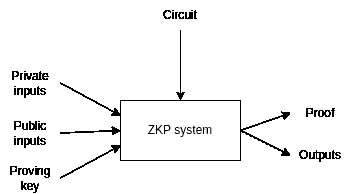
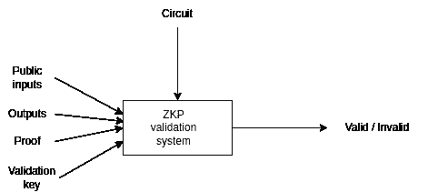
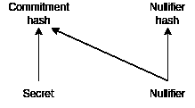

# 通过 Tornado Cash 的源代码理解零知识证明

> 原文：<https://betterprogramming.pub/understanding-zero-knowledge-proofs-through-the-source-code-of-tornado-cash-41d335c5475f>

## 零知识证明，深入智能合同的世界


来源:https://unsplash.com/photos/JrrWC7Qcmhs

基于[维基百科](https://en.wikipedia.org/wiki/Zero-knowledge_proof)，零知识证明(ZKP)的定义如下:

> …零知识证明或零知识协议是一种方法，通过这种方法，一方(证明者)可以向另一方(验证者)证明给定的陈述是真实的，同时证明者避免传达除了陈述确实是真实的事实之外的任何附加信息。零知识证明的本质是，通过简单地揭示信息来证明一个人拥有某种信息的知识是微不足道的；面临的挑战是在不披露信息本身或任何其他信息的情况下证明这种拥有。

ZKP 的技术可以广泛应用于许多不同的领域，如匿名投票或匿名转账，这些问题很难在区块链这样的公共数据库中解决。

[Tornado Cash](https://tornado.cash/) 是一个硬币混合器，你可以用它来匿名化你的以太坊交易。因为区块链的逻辑，每一笔交易都是公开的。如果你的账户上有一些 ETH，你不能匿名转账，因为任何人都可以在区块链上跟踪你的交易历史。像 Tornado Cash 这样的硬币混合器可以通过使用 ZKP 打破源地址和目的地址之间的链上链接来解决这个隐私问题。

如果你想匿名化你的一笔交易，你必须在 Tornado 现金合约(例如:1 ETH)。过一会儿，你可以用不同的账户提取这笔钱。诀窍在于，没人能在储户账户和取款账户之间建立联系。如果数百个账户在一边存入 1 ETH，而其他数百个账户在另一边提取 1 ETH，那么没有人能够跟踪资金流动的路径。技术上的挑战是，智能合约交易也像以太坊网络上的任何其他交易一样是公开的。这就是 ZKP 的相关之处。

当你在合同上签字时，你必须提供一份“承诺”。该承诺由智能合约存储。在对方撤回 1 ETH 的时候，你要提供一个“作废器”和一个零知识证明。作废者是与承诺相关联的唯一 ID，ZKP 证明了这种关联，但是没有人知道哪个作废者被分配给了哪个承诺(除了存款人/提款账户的所有者)。

再次声明:我们可以证明其中一个承诺被分配给我们的取消者，而不暴露我们的承诺。

取消者由智能合约跟踪，因此我们只能通过一个取消者提取一个存放的 ETH。

听起来很容易？不是的！:)让我们深入技术内部。但在此之前，我们必须了解另一件棘手的事情，那就是 [Merkle 树](https://en.wikipedia.org/wiki/Merkle_tree)。



来源:https://en.wikipedia.org/wiki/Merkle_tree

Merkle 树是散列树，其中叶子是元素，每个节点是子节点的散列。树的根是 Merkle 根，它代表整个元素集。如果您添加、删除或更改树中的任何元素(叶子)，Merkle 根将会改变。Merkle 根是元素集的唯一标识符。但是怎么用呢？



还有一个东西叫 Merkle proof。如果我有一个 Merkle 根，你可以发给我一个 Merkle 证明，证明一个元素在这个根所代表的集合中。下图显示了它是如何工作的。如果你想向我证明 H *K* 在集合中，你得把 H *L* ，H *IJ* ，H *MNOP* ，H *ABCDEFGH* 哈希发给我。使用这些散列，我可以计算出 Merkle 根。如果根与我的根相同，那么 H *K* 在集合中。我们可以在哪里使用它？

一个简单的例子就是白名单。想象一个智能契约，它有一个只能被白名单中的用户调用的方法。问题是有 1000 个白名单账号。如何将它们存储在智能合约中？简单的方法是将每个账户都存储在 mapping 中，但是代价非常大。一个更便宜的解决方案是构建一个 Merkle 树，并且只存储 Merkle 根(1 个 hash vs 1000 也不错)。如果有人想调用这个方法，她必须给出一个 Merkle 证明(在本例中是 10 个散列的列表),这个证明很容易被智能契约验证。

**同样:Merkle 树用于用一个散列(Merkle 根)来表示一组元素。一个元素的存在可以用 Merkle 证明来证明。**

接下来我们要了解的是零知识证明本身。有了 ZKP，你可以证明你知道一些事情，而不用透露你知道的事情。为了产生 ZKP，你需要一个电路。电路就像一个小程序，有公共输入、输出和私有输入。这些私人输入是你为了验证而不透露的知识，这就是为什么它被称为零知识证明。有了 ZKP，我们可以证明给定电路的输入可以产生输出。

一个简单的电路是这样的:

```
pragma circom 2.0.0;

include "node_modules/circomlib/circuits/bitify.circom";
include "node_modules/circomlib/circuits/pedersen.circom";

template Main() {
    signal input nullifier;
    signal output nullifierHash;

    component nullifierHasher = Pedersen(248);
    component nullifierBits = Num2Bits(248);

    nullifierBits.in <== nullifier;
    for (var i = 0; i < 248; i++) {
        nullifierHasher.in[i] <== nullifierBits.out[i];
    }

    nullifierHash <== nullifierHasher.out[0];
}

component main = Main();
```

使用这个电路，我们可以证明我们知道给定散列的来源。该电路有一个输入(零化器)和一个输出(零化器散列)。输入的默认可访问性是私有的，而输出总是公共的。该电路使用 Circomlib 中的 2 个库。 [Circomlib](https://github.com/iden3/circomlib) 是一组有用的电路。第一个库是 bitlify，包含位操作方法，第二个库是 pedersen，包含 Pedersen 哈希函数。彼得森哈希法是一种可以在 ZKP 电路中高效运行的哈希方法。在主模板的主体中，我们填充散列值并计算散列值。(关于 circom 语言的更多信息，请查看 [circom 文档](https://docs.circom.io/))

为了生成零知识证明，您将需要一个证明密钥。这是 ZKP 最敏感的部分，因为使用用于生成证明密钥的源数据，任何人都可以生成伪造的证明。这些源数据被称为必须丢弃的“有毒废物”。因此，有一个生成证明密钥的“仪式”。该仪式有许多成员，每个成员都对证明密钥做出贡献。只有一个非恶意成员就足以生成有效的证明密钥。使用私有输入、公共输入和证明密钥，ZKP 系统可以运行电路并生成证明和输出。



验证密钥有一个验证密钥，可用于验证。验证系统使用公共输入、输出和验证密钥来验证证据。



Snarkjs 是一个全功能的工具，可以通过仪式生成证明密钥和验证密钥，生成证明并验证它。它还可以生成一个用于验证的智能契约，任何其他契约都可以使用它来验证零知识证明。更多信息，请查看 [snarkjs 文档](https://github.com/iden3/snarkjs)。

现在，我们有一切来了解龙卷风现金(TC)如何工作。当你在 TC 合同上存入 1 ETH 时，你必须提供一个承诺散列。这个提交散列将被存储在 Merkle 树中。当你用不同的账户提取这个 1 ETH 的时候，你要提供 2 个零知识证明。第一个证明默克尔树包含了你的承诺。这个证明是一个 Merkle 证明的零知识证明。但这是不够的，因为你应该只被允许撤回这第一次。因此，您必须为承诺提供一个唯一的取消符。合同中储存了这个作废器，这可以确保你不能提取存入的钱超过一次。

承诺生成方法确保了取消符的唯一性。该承诺由无效符和一个秘密通过散列产生。如果您更改取消符，则承诺也会更改，因此一个取消符只能用于一个承诺。由于散列的单向性质，不可能将承诺和无效符联系起来，但是我们可以为它生成一个 ZKP。



理论完了，我们来看看 TC 的[撤电路是什么样子的:](https://github.com/tornadocash/tornado-core/blob/master/circuits/withdraw.circom)

```
include "../node_modules/circomlib/circuits/bitify.circom";
include "../node_modules/circomlib/circuits/pedersen.circom";
include "merkleTree.circom";// computes Pedersen(nullifier + secret)
template CommitmentHasher() {
    signal input nullifier;
    signal input secret;
    signal output commitment;
    signal output nullifierHash; component commitmentHasher = Pedersen(496);
    component nullifierHasher = Pedersen(248);
    component nullifierBits = Num2Bits(248);
    component secretBits = Num2Bits(248);
    nullifierBits.in <== nullifier;
    secretBits.in <== secret;
    for (var i = 0; i < 248; i++) {
        nullifierHasher.in[i] <== nullifierBits.out[i];
        commitmentHasher.in[i] <== nullifierBits.out[i];
        commitmentHasher.in[i + 248] <== secretBits.out[i];
    } commitment <== commitmentHasher.out[0];
    nullifierHash <== nullifierHasher.out[0];
}// Verifies that commitment that corresponds to given secret and nullifier is included in the merkle tree of deposits
template Withdraw(levels) {
    signal input root;
    signal input nullifierHash;
    signal private input nullifier;
    signal private input secret;
    signal private input pathElements[levels];
    signal private input pathIndices[levels]; component hasher = CommitmentHasher();
    hasher.nullifier <== nullifier;
    hasher.secret <== secret;
    hasher.nullifierHash === nullifierHash; component tree = MerkleTreeChecker(levels);
    tree.leaf <== hasher.commitment;
    tree.root <== root;
    for (var i = 0; i < levels; i++) {
        tree.pathElements[i] <== pathElements[i];
        tree.pathIndices[i] <== pathIndices[i];
    }
}component main = Withdraw(20);
```

第一个模板是 CommitmentHasher。它有两个输入，零化符和秘密，这是两个随机的 248 位数字。该模板计算无效散列和承诺散列，后者是我之前写的无效散列和秘密的散列。

第二个模板是取款本身。它有两个公共输入，Merkle 根和 nullifierHash。需要 Merkle 根来验证 Merkle 证明，智能合约需要 nullifierHash 来存储它。私有输入参数是 Merkle 证明的 nullifier、secret、pathElements 和 pathIndices。该电路通过从无效符和秘密生成承诺来检查无效符，并且还检查给定的 Merkle 证明。如果一切正常，将生成可由 TC 智能契约验证的零知识证明。

您可以在回购的[合同文件夹](https://github.com/tornadocash/tornado-core/tree/master/contracts)中找到智能合同。验证符是从电路中产生的。Tornado 合同使用它来验证给定无效哈希和 Merkle 根的 ZKP。

使用契约最简单的方法是[命令行界面](https://github.com/tornadocash/tornado-core/blob/master/src/cli.js)。它是用 JavaScript 写的，源代码相对简单。您可以很容易地找到参数和 ZKP 是在哪里生成并用于调用智能合约的。

零知识证明在密码领域相对较新。背后的数学真的很复杂，很难理解，但是像`snarkjs`和`circom`这样的工具让它很容易使用。我希望，这篇文章能帮助你理解这项“神奇”的技术，并且你能在你的下一个项目中使用 ZKP。

快乐编码…

更新:我有一篇关于这个话题的新文章:

[](/zero-knowledge-proofs-using-snarkjs-and-circom-fac6c4d63202) [## 使用 SnarkJS 和 Circom 的零知识证明

### JavaScript 教程

better 编程. pub](/zero-knowledge-proofs-using-snarkjs-and-circom-fac6c4d63202) 

另一篇文章是关于我如何基于 Tornado Cash 的源代码为匿名投票构建了一个 JavaScript 库。这是一个包含 circom、Solidity 和 JavaScript 代码的分步教程:

[](https://thebojda.medium.com/an-introduction-of-zk-merkle-tree-a-javascript-library-for-anonymous-voting-on-ethereum-using-79caa3415d1e) [## zk-merkle-tree 介绍，一个用于以太坊匿名投票的 JavaScript 库，使用…

### 投票的匿名性是基本要求之一，但在像区块链这样的公共网络上，这不是小事…

thebojda.medium.com](https://thebojda.medium.com/an-introduction-of-zk-merkle-tree-a-javascript-library-for-anonymous-voting-on-ethereum-using-79caa3415d1e)