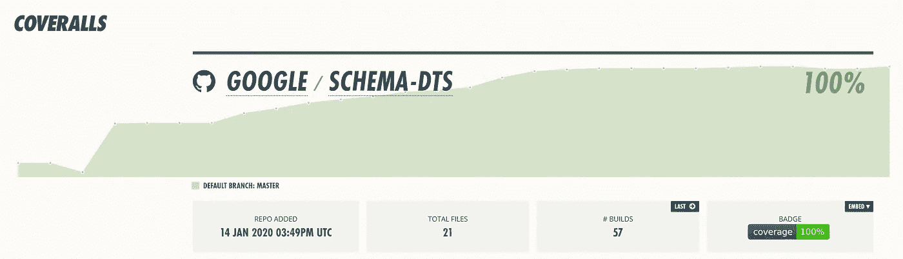

# 来自 100%测试覆盖率的意外教训

> 原文：<https://betterprogramming.pub/unexpected-lessons-from-100-test-coverage-eebeee211b7a>

## 我从测试一切中学到的

软件工程界的传统观点认为，争取 100%的测试覆盖率是徒劳的。它不一定能帮助你发现所有的错误，而且在你写代码的时候，它可能会把你引向有问题的道路。

我最近对 100%测试覆盖率的尝试告诉我答案要微妙得多。有时，为了覆盖范围，我很想做一些有问题的代码更改。有些时候，我屈服了。然而我发现通常有一种开明的方法来覆盖一个分支*和*使代码对它更好。盲目的 100%覆盖会导致我们做出不可接受的妥协。但是，如果我们约束自己只做更好的代码库，考虑 100%的覆盖率会改变我们对代码库的看法。我尝试 100%测试覆盖率的故事是一个有好有坏的故事。

去年，我看到了 NPM 创始人 Isaac Z. Schlueter 提倡 100%测试覆盖率的帖子:

Schlueter 提到了一个开发者实现的*心态转变*，这引起了我的兴趣:

# 通往 100 岁的道路

我决定 [schema-dts](https://github.com/google/schema-dts) 将是 100%测试覆盖实验的完美候选。给定 [N-Triples](https://en.wikipedia.org/wiki/N-Triples) 作为输入，schema-dts [生成描述该本体的有效 JSON-LD 文字](https://blog.eyas.sh/2019/05/modeling-schema-org-schema-with-typescript-the-power-and-limitations-of-the-typescript-type-system/)的 TypeScript 类型。我最近对让它变得稳定非常感兴趣，并试图了解代码库中还有哪些空间。

# 设置

首先，我没有办法计算我的项目在当前状态下的测试覆盖率。为了得到支持，我最终把我的测试跑步者从茉莉换成了摩卡。不过，这是一个打字稿项目，我必须启用源地图，并使用它们来获得我的实际`.ts`源的覆盖率。我使用伊斯坦堡的`[nyc](https://istanbul.js.org/)`在当地进行覆盖运行。`[Coveralls](https://coveralls.io/)`与`nyc`很好地集成在一起，主持代码覆盖时间的在线跟踪。工作服还可与 Travis CI 无缝集成，并根据其δ覆盖率控制所有 PR([PR # 57](https://github.com/google/schema-dts/pull/57))。

设置好之后，我的第一次*真实*运行有一个 [%78.72 的测试覆盖率](https://coveralls.io/builds/28108326)。我想，这还不算太糟。

这些基线测试肯定*覆盖了*很多他们没有真正执行的代码行，这也是为什么这个数字很高的部分原因。这本身就可以证明 100%的测试覆盖率是一个没有意义的数字。然而，Schlueter 对 100%测试覆盖率的承诺是，*到达那个长尾*的行为可以对*我如何思考我自己的代码*产生变革性的影响。我想在第一手牌上试试运气。如果我们想对我们被覆盖的代码行被真正地*测试*更有信心，那么[突变测试](https://en.wikipedia.org/wiki/Mutation_testing)可能会比测试覆盖更有效果。

# 快乐时光:低垂的果实

类似 Schema.org 的本体可以通过用一个 `[supersededBy](https://schema.org/supersededBy)`谓词标记某个类、属性或枚举值，将它声明为*弃用的*。`schema-dts`用两种方式之一来处理这个问题:要么在代码中用`@deprecated` JSDoc 注释来标记它，要么完全去掉那些声明。

查看我的覆盖率报告，大量未测试的代码变得很明显。例如，我[从未试图生成一个](https://coveralls.io/builds/28108326/source?filename=src/ts/class.ts#L125) `[@deprecated](https://coveralls.io/builds/28108326/source?filename=src/ts/class.ts#L125)` [*类*](https://coveralls.io/builds/28108326/source?filename=src/ts/class.ts#L125) 。好吧，我们来解决这个问题。我[发现了一个我的几个单元测试没有发现的真正的 bug](https://github.com/google/schema-dts/pull/60) 。我增加了 9.8%的覆盖率，添加了一些不赞成的基线测试，并添加了一些我从来没有做过的 N 重解析单元测试。

测试我的 Argparse 设置告诉我[我的一个默认标志值是错误的](https://github.com/google/schema-dts/pull/76)(尽管是无害的)。

# 可疑的时代

## 日志测试？

我看到的许多未覆盖的行都与记录我们跳过或丢弃的内容的语句有关，或者与我们处理的可恢复条件有关。这些日志中有很多是发生在真实 Schema.org N 重文件中的警告。例如，我们从不处理描述属性的`sameAs`或`inverseOf`三元组。如果我们看到两个描述同一个类或属性的评论，新的那个获胜。

直觉告诉我们，日志语句不应该被测试。但是出于好的和不好的原因，我认为对日志输出进行一些基线测试可能是可取的。

当一个单元测试已经足够时，我用它来为多注释情况添加一个日志测试。这很值得怀疑——但是我被我的热情所吸引！

某种程度的基于日志的测试可能是合理的，因为(1)我们正在观察用户交互的变化，以及(2)它记录了我们代码的警告/限制。也许人们可以将某些基于日志的测试视为等同于屏幕截图区分 UI 测试？也可能我真的在努力解释自己。尽管如此，我对添加[一个在解析一个常见的三元组](https://github.com/google/schema-dts/pull/64/commits/2da73f6df3a04c17777e3e33ea45c9694addbe2d)时显示警告的测试的感觉没有对那个注释测试的感觉那么糟糕。

## 代码高尔夫？

另一种避免这些`if (case) { Log(...); }`情况的方法是改为编写`warnIf(case, ...)`。我想大多数人都会同意这样的改变是无益的。有人可能会提出马基雅维利式的论点，认为这样的代码高尔夫从结果来看是合理的:一旦你达到了 100%的测试覆盖率，你就会停留在那里，并且你会批判性地思考你所有的未来差异。

# 将自己约束在中立和积极的“代码高尔夫”上

我中途尝试做的一件事是，确保我不会以测试覆盖的名义参与任何使代码库变得更糟的代码高尔夫。(取决于您如何定义 code golf，它可能同义反复地意味着它使代码库变得更糟。在这里，我真的只是指为了覆盖而对代码进行的任何创造性的重新排列。)

但是我发现一些代码高尔夫实际上帮助我更清楚地思考代码。即使在代码库本身看起来相同的情况下，我现在也有了一个新的词汇来谈论错误条件。在其他一些情况下，覆盖代码行驱使我从在代码中做运行时保证转向在代码中做编译时保证(肯定是积极的)。

让我们看一些例子。

## 中立:澄清断言与错误

我有转换函数，它接受 RDF 三元组并把它们转换成类的中间表示。这些功能存在一些问题:

**案例研究 A:内部功能不可能性**

在我的代码中有一行[我的测试从未涉及到。它看起来像这样:](https://coveralls.io/builds/28158052/source?filename=src/transform/toClass.ts#L91)

正如你所看到的，只要阅读这个函数就知道:`(classes.size === 0)`永远不会发生。首先，上面有一个`classes.set(K, V)`。我们从这个硬编码的`wellKnownTypes`数组中设置一些其他的键值对，使其总是具有固定数量的元素。

我们可以试着理解这个错误的意义:它可能表明我们得到的 RDF 三元组没有一个被转换成类(在这种情况下，我们可能想比较`classes.size`和`wellKnownTypes.length + 1`)。或者，当我们对正确构建类不太有信心，并且对这些众所周知的类型没有清晰的概念时，这可能是一个不恰当的验证。

在我的例子中，创建一个只有知名人物的地图似乎没问题。如果本体是空的或者缺少数据，我们可能会在更早的步骤或者更晚的步骤中发现它。该错误没有给出关于哪里出错的清晰上下文。所以，对我来说，答案是杀死它:

**案例研究 B:函数间断言**

我看到的另一个错误是这样的:

在这种情况下，第 21 行从未发生过(并且`(!cls)`条件始终为假)。这应该是有意义的:`ForwardDeclareClasses`检查一个`TypedTopic`是否满足`IsClass()`，如果满足，*无条件地*将它添加到地图中。`BuildClasses`断言匹配`IsClass`的主题存在于地图中。

获得该行测试覆盖率的一种方法是导出`BuildClasses`并测试它。但这似乎违背了让代码库变得更好的精神。更好的方法是询问这行代码试图做什么。

## **插曲:期望、错误和断言**

有时，我们断言事物是因为它们要么…

*   *错误情况*是指由于数据或输入不良而可能在野外发生的情况，
*   *不应该发生*，而*如果他们发生了*那就是我们代码中有 bug 的迹象，或者
*   *不应该发生*，如果发生了*那就是宇宙辐射的迹象。*

*我决定区分这些。如果我的测试覆盖报告抱怨一个未覆盖的:*

*   *错误情况—我应该测试一下。如果我不能，我应该重构我的代码，使其可测试；*
*   *断言*
*   ***完全不可能的断言**——也许我应该删除它。*

*我将#1 称为**错误条件—** *测试这些*。*

*对于断言，我经常发现#2 和#3 之间的界线通常是*函数*的边界(这并不总是正确的)。*函数内*断言的例子(就像上面的**案例研究** **A** 一样)看起来是如此的无用，以至于我们最好移除它们。*交互函数*断言的情况(就像这个例子)看起来足够有用。*

## ***修复***

*我发现这种区别不仅有助于吹毛求疵——对阅读代码的人也很有帮助。这个错误是*在正常操作*中可能发生的还是*是一个 bug* 的标志？我决定澄清这一点:*

*   *正常错误情况:`if` + `throw`，或类似情况。*
*   *Bug 断言:`assert`和`assertXyz`变种。*

*就这样，我结束了[这个变化](https://github.com/google/schema-dts/pull/73/commits/11c9f64397e0ddbe29f09ac1b8945fd72d7ad213):*

*在这里，考虑覆盖一行代码从根本上帮助我更有效地交流我的代码做了什么。我不得不做的许多“移动东西”在很大程度上是语义代码高尔夫(令人高兴的是*碰巧给出了更好的测试覆盖分数)，但我更愿意认为这是一个净积极因素。**

## **正面:重构代码以实现编译时保证，而不是运行时保证**

**我已经展示了一些*永远不会*被测试运行覆盖的行是断言*永远不会发生*。有时，我们可以重构代码，对代码的结构做出编译时声明，而不是担心它。**

**我会说得更具体:我的代码有一个`[parseComment](https://coveralls.io/builds/28179594/source?filename=src/ts/util/comments.ts#L32)`函数，它使用`[htmlparser2](https://www.npmjs.com/package/htmlparser2)`将 HTML 注释转换成 [JSDoc](https://jsdoc.app/) 标记的注释。在这段代码中，我们定义了一个新的`htmlparser2.Parser`，它处理已知的标签并抛出未知的标签。它看起来像这样:**

**最初，上面代码片段中的第 11 行和第 18 行没有被覆盖。`onopentag`中的第 11 行很简单——我添加了一个未知标签的测试，发现它失败了。很好——我们的测试范围现在包括了这一行。**

**不过，我没法搞定 18 号线。如果存在未知的开始标记，它将抛出 on open。自结束标签算作开始标签。关闭一个从未打开的标签是不好的 HTML，但实际上并没有注册为关闭的标签。[这是有效的 HTML](https://html.spec.whatwg.org/multipage/parsing.html#tokenization) :没有匹配开始标记的结束标记不是有效的标记。**

**换句话说，第 18 行永远不会触发。**

## ****修复****

**我们应该移除它吗？好了，现在，有了上面提到的代码，这一行实际上有了*一些实用程序*:如果开发人员为开始标签添加了一些处理程序(例如`<table>`或`<td>`，如果我们忽略添加结束标签处理程序，我们会注意到一个运行时错误。**

**这还挺有用的。但是使用 TypeScript 的好处是，我们可以构造我们的代码，这样运行时保证就变成了编译时保证。**

**在我们的例子中，[这个变化](https://github.com/google/schema-dts/pull/80)使事情变得更好。以下是一个总结版本:**

**通过在开始和结束标签之间统一标签处理程序，用户不会忘记添加结束标签处理程序，反之亦然，因为编译器为处理标签定义了统一的接口。**

**一般来说，关于并行代码结构的断言和保证(例如，并行开关情况等。)和并行数据结构(例如并行列表或映射)是脆弱的。如果你有两个结构(代码或数据结构),需要就它们有什么元素达成一致，等等。从结构上重新安排它们可能会让你受益匪浅。谷歌的测试博客在其[代码健康:痴迷于原语？](https://testing.googleblog.com/2017/11/obsessed-with-primitives.html#docs-internal-guid-c44fb159-b745-02ec-a269-ec156b175826)插曲。**

# **揭开历史的选择和修复**

**我们从未涉及的一些行看起来很明显像是针对*或*的边缘案例或修复。然而，边缘案例是什么或者我们为什么要这样做，往往并不清楚。**

**理想情况下，当一个人引入对边缘情况的修正时，他们也会引入测试它们的测试。但是如果你跳过引入一个测试，你可能永远不会有时间去做它；直到你看到你的测试覆盖运行的结果。**

**一旦我们看到一个未覆盖的行，这就成了一个很好的机会来跟踪*为什么添加了*并追溯性地为其添加测试。像`git blame`和`git log`这样的工具是及时查明边缘情况并找到相关提交消息的绝佳资源。**

**我遇到了两种情况:[一个被跳过的解析器级术语](https://github.com/google/schema-dts/pull/73/commits/df8c97e199bc235cba76a008ab15b5cde8a24a97#diff-38d6d4505badf711e266526e2c572310)和一些[特定的枚举处理](https://github.com/google/schema-dts/pull/74/commits/3beea7319520c8ddaa5956947c46563287a08f88#diff-55504ee5640737677ebdfceb255d5bd5)。这两个问题看起来像是 Schema.org 3.4 中的大问题，后来都被悄悄地解决了。在这两种情况下，我都添加了注释来解释导致这种情况的三元组，在哪里可以找到它，并添加了测试来练习这种情况。太好了！**

# **简化代码的机会**

**随着测试覆盖率接近 100%，它开始成为代码不可及性分析的代理。虽然有时它会简单地指出测试中的缺点(这也是好的)，但有时它会指出传统静态分析工具检测不到的代码。这是因为测试覆盖率是在实际运行的代码上计算的，而不是对控制流图的一些检查。**

**这里有一个例子:**

**这里，测试没有覆盖第 25 行。这是有意义的——只有当`parentNode`为空并且`propLiteral`没有成员时，才会出现这一行。除了当`propLiteral`没有父代时，它总是至少有一个成员(`@id`)。**

**关于这个分支的另一个有趣的部分是，`propLiteral`本身就是一个类型文字节点。因此，如果`propLiteral.members.length === 0`，它将等同于第 25 行返回的节点—一个空类型的文字节点。**

**在这里，[修复](https://github.com/google/schema-dts/pull/72/files#diff-0d6e1b40580e3ffa5cb049dd023d0610)很简单:**

# **对 100 的反思**

**虽然活到 100 岁需要做出一些牺牲，但这也让我能够:**

*   **修复了很多 bug，**
*   **捕捉并修复代码中的冗余，**
*   **关于我不可及的代码的原因，**
*   **在*错误*案例和*断言*之间仔细描绘，以及**
*   **仔细考虑将运行时断言转换为编译时保证。**

**值得吗？解决这个问题的一个方法是量化负面影响的危害，并将其与正面影响的收益进行比较。使用这种方法，对我来说，达到 100 显然是一个净积极的。**

**然而，真正的问题不仅仅是这些不利因素是否值得这些有利因素:而是如果没有这些不利因素，这些有利因素是否能够实现。我认为，这就是反对 100%测试覆盖率的真正原因。**

**我认为我可以通过查看测试覆盖率运行来实现这些缺点，而不必纠结于达到 100%。也许大多数，我不确定。然而，我发现事实是:**

*   **沉迷于每一条未覆盖的线帮助我思考可达性，如果我只是看一眼未覆盖的线，我不会这样想；**
*   **上面概述的一些有趣的案例可能不会在红色海洋中被发现。**

**对我来说，我对代码的许多有趣的反思和我对代码所做的许多有趣的更改，如果我没有达到 95%的覆盖率，似乎很难发现和思考它们。**

**最终，我的感觉是 100%的测试覆盖率绝对是至少要做一次的*有用的练习*。多做几次可能也是一个有用的练习。对于我和`schema-dts`，我将保持 100%的测试覆盖率。我怎么能不——毕竟，100 只是一个非常非常好的数字！**