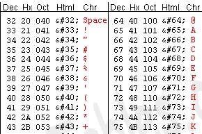

# Unicode 和字符集

> 原文：<https://betterprogramming.pub/unicode-and-character-sets-46ce89841b3>

## Unicode 系统、UTF、ASCII 和编码的简要概述


照片由 [Kelvin Yan](https://unsplash.com/@kelvinyan) 在 [Unsplash](https://unsplash.com/) 拍摄

电脑有自己的语言。他们不懂人类语言(也许你说二进制他们就懂)，除了二进制他们什么都不懂。我们如何与他们交流？

当我现在打字时，电脑不知道你看到的任何字符。我们来考虑一下 *M* 这个人物。在最低层， *M* 使用 0 和 1 的序列存储:`01001101`。在我们继续之前，让我们回忆一下两个基本定义:

**位** —最小的存储单位，只能存储 0 或 1 个
字节**字节** —一个字节= 8 位。就是这样。

# 统一码

[Unicode 标准](http://unicode.org/standard/standard.html):

> Unicode 标准是一种字符编码系统，旨在支持世界范围内不同语言和现代技术领域的书面文本的交换、处理和显示。此外，它支持许多书面语言的经典和历史文本。

简单地说， **Unicode 给每个字符分配一个唯一的编号**(称为代码点)，而不管平台、程序或其他什么。

# 字符集

字符集是符号的固定集合。例如，أ到ي是代表阿拉伯字母的字符集。

另一个例子是著名的 ASCII 表:一个七位字符代码，其中每个序列代表一个独特的字符。ASCII 可以表示 27 (= 128)个字符(包括不可打印的)，但可悲的是，它不能表示爱💔 😔、希伯来语、俄语、阿拉伯语字母以及更多有用的字符。但是为什么呢？

因为任何文件都必须经过编码/解码才能正确存储，所以您的计算机需要知道如何将您的语言书写系统的字符集转换为 0 和 1 的序列。这个过程叫做*字符编码。*你可以把它想象成一张桌子。为了让你对“表格”的含义有一个直观的认识，请看下图:



ASCII 表

*一个*字符由 65 位十进制值表示(在 7 位二进制中是 1000001)。所以现在的问题是，我们如何表示超出这个范围的字符？

# 编码系统

区分*字符集*和*编码系统*概念非常重要。第一个是您可以使用的一组字符，而后者是这些字符在内存中的存储方式(作为字节流)，因此对于一个给定的字符集可以有多种编码。

就像 ASCII 方案一样，还有许多其他编码系统:

*   **UTF-8**
*   **UTF-16**
*   **UTF-32**
*   **EUC**

在本文中，我们将讨论 **UTF-X** 系统。

## UTF-32

这个方案需要 **32 位**(四个字节)来编码任何字符。例如，为了用这个方案来表示*一个*字符码位，我们需要用 32 位二进制数写 65:

```
00000000 00000000 00000000 01000001
```

如果仔细观察，您会注意到在使用 ASCII 模式时，最右边的七位实际上是相同的。但是由于 UTF-32 是固定宽度的方案，我们必须附加三个额外的字节。也就是说，如果我们有两个只包含*和*字符的文件，一个是 ASCII 编码的，另一个是 UTF-32 编码的，它们的大小相应地是一个字节和四个字节。

这个方案对说英语的人来说并不好，因为现在只包含 ASCII 字符的文件，比如总大小为 X 字节的文件，将变成 4 倍字节的怪物，这是对内存的巨大浪费。

## UTF-16 (+ LE & BE)

另一个 UTF-16 形式的解决方案出现了。您可能会认为，正如 UTF-32 使用固定宽度的 32 位来表示码位一样，UTF-16 也是固定宽度的 16 位。不对！

在 UTF-16 中，码位可以用 **16 位**或 **32 位**来表示。所以这个方案是一个*变长*编码系统。比 UTF-32 有什么优势？至少对于 ASCII 来说，文件的大小不会是原来的四倍(但仍然是两倍)，所以我们仍然不是 ASCII 向后兼容的。

由于七位足以表示一个字符，我们现在可以使用两个字节，而不是像 UTF-32 那样使用四个字节。

```
00000000 01000001
```

你们中的一些人可能想知道为什么我们把字节附加在开头而不是结尾。既然我们知道需要两个字节，为什么我们不能翻转表示法，从右向左解释结果:

```
01000001 00000000
```

我们可以。一些公司实际上使用这种编码。当计算机试图读取 16 位时，让我们试着模仿它。下面是一个简单的 C 程序，它按顺序分配八个整数:

```
int *p;
p = (int *) malloc(8 * sizeof(int));
```

操作系统将返回第一个字节的地址。所以`p`将指向第一个位置，通过递增它，我们将得到下一个字节。假设我们以这种形式存储数据(下面的两个框代表两个字节):

```
+---+---+
| 0 | A |
+---+---+
```

然后，在开始读取之前，我们必须将指针向右移动，而如果我们有以下内容，它将立即被读取:

```
+---+---+
| A | 0 |
+---+---+
```

第二种格式叫做*大端* (BE)(数据存储在最高有效字节)，而后者叫做*小端* (LE)(最低有效字节)。

## UTF-8

你猜对了:在 UTF-8 中，码位可以用 **32** 、 **16** 、 **24、**或**八位**来表示，和 UTF-16 系统一样，这也是一种变长编码系统。

最后，我们可以用与使用 ASCII 编码系统相同的方式来表示 *A* :

```
01001101
```

# 操场

打开您最喜欢的文本编辑器(Vim)并创建一个包含 *A* 字符的文件。让我们看看它的编码:

```
$ xxd -b test.txt
0000000: 0100001 00001010
```

第一个`0000000`对于我们的分析并不重要；它表示偏移量。其后的字节是 ASCII 编码中 *A* 字符的二进制表示(七位)。最后，最后一位是换行符的 ASCII 编码(通过检查 ASCII 表进行验证——寻找这个数字的十进制值)。现在让我们检查文件大小:

```
$ du -b test.txt | cut -f1
2
```

太好了！预期的两个字节(不要忘记自动添加的换行)。让我们继续玩——现在我们移除 *A* 并插入δ字符:

```
$ file test.txt
test.txt: UTF-8 Unicode text
```

现在尺寸变了:

```
$ du -b test.txt | cut -f1
3
```

为什么是`3`？让我们看看文件的二进制转储:

```
$ xxd -b test.txt
0000000: 11001110 10110100 00001010
```

让我们忽略代表换行符的最后一个字节，把注意力集中在δ字符的实际编码上:

```
11001110 10110100
```

让我们回想一下，如果前三位是 110，那么字符用两个字节编码。δ的二进制表示为:

```
11001110 10110100
```

这正是我们得到的。

# UTF-8 对 UTF-16

UTF-8 和 UTF-16 都是可变长度编码。UTF-8 编码可能最少占用 8 位，而 UTF-16 编码最少需要 16 位。

对于基本的 ASCII 字符，UTF-8 将每个字符仅使用一个字节，而 UTF-16 编码将使用两个字节(这使得 UTF-8 向后兼容 ASCII)。

Now let’s talk about cases where UTF-8 encoding takes more bytes than UTF-16\. Consider the Chinese letter “語” — its UTF-8 encoding is:

```
11101000 10101010 10011110
```

而它的 UTF-16 编码更短:

```
10001010 10011110
```

希望你觉得有用。