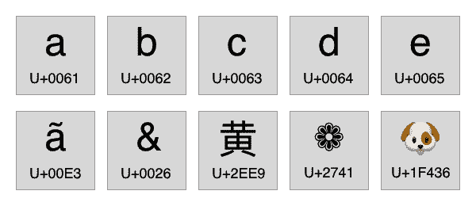
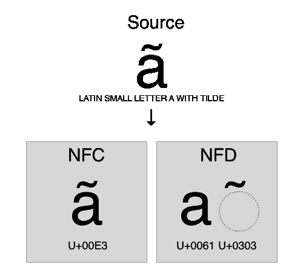
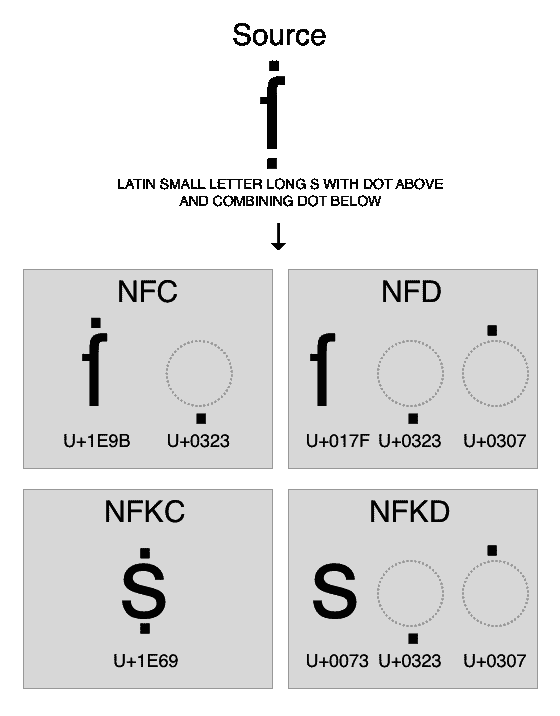

# Unicode 等价

> 原文：<https://betterprogramming.pub/unicode-equivalence-72c152e7b098>

## 并非所有表情符号都是平等的


阿玛多·洛雷罗在 [Unsplash](https://unsplash.com/s/photos/letters?utm_source=unsplash&utm_medium=referral&utm_content=creditCopyText) 上的照片

# 统一码

> 世界上的每个人都应该能够在电话和电脑上使用自己的语言。— [Unicode Consortium 主页](https://home.unicode.org/)

Unicode 标准为每个字符定义了不同的代码。它的编码基础足以支持世界上所有语言使用的书写系统。



# Unicode 等价

即使使用相同的编码标准(Unicode)，文本也可能以不同的形式表示。例如，你认为**等于 **ã** 吗？**

```
'ã' === 'ã' → false
'ã'.length → 1
'ã'.length → 2
```

**结果，同一个字符，如本例中的“*带颚化符的拉丁文小写字母 A”，*可以用不同的形式进行规范化，最终得到不同的 Unicode 表示。然而，在大多数情况下，我们可能希望独立于 Unicode 表示来比较两个字符串。这就是正常化的目的。**

# **正常化**

**规范化通过以特定顺序组合所有标记，并使用分解和组合规则将每个字符串转换为 Unicode 规范化形式之一，来确定两个字符是否等效:**

*   ****规范化形式 D (NFD)** :规范分解**
*   ****规范化形式 C (NFC)** :规范分解，
    后接规范合成**
*   ****规范化形式 KD (NFKD)** :兼容性分解**
*   ****规范化形式 KC (NFKC)** :相容性分解，
    后为规范合成**

****

**因此，在我们的示例中，第一个字符用 NFC 表示，它将值组合成一个 Unicode 值( **U+00E3** )，而第二个字符用 NFD 表示，它将字符分解成多个 Unicode 值( **U+0061 U+0303** )。**

```
'ã'.normalize('NFC') === 'ã'.normalize('NFC') → true
'ã'.normalize('NFC').length → 1
'ã'.normalize('NFC').length → 1
```

**为了解释 NFKC 和 NFKD，让我们用一个不同的例子——**ẛ̣**:**

****

**正如我们所见，在 NFKC 和 NFKD 中，它可以消除改变输出的格式差异。**

# **选择哪种归一化？**

**W3C 建议尽可能开发 WWW NFC:**

> **内容作者应尽可能对内容使用 Unicode 标准化格式 C (NFC)。请注意，NFC 并不总是适用于内容，甚至对于某些语言的内容作者也不可用。— [W3C 工作组](https://www.w3.org/TR/charmod-norm/)**

**其他规范化形式是针对我们大多数人都不会经历的特定场景。例如，NFKC 和 NFKD 可以用来将一个罗马数字分解成多个字符，比如将**ⅷ**变成**ⅷ**。NFD 可以用于模糊搜索，例如在需要忽略标记的情况下——例如，搜索 **a** 也应该包括带有**和**的结果。**

# **Java Script 语言**

**Javascript 中的文本规范化:**

```
const value = "ã"console.log('Unicode codepoint:', 
  value.charCodeAt(0).toString(16),
  value.charCodeAt(1).toString(16))
// → Unicode codepoint: 61 303console.log('Normalize:', value.normalize('NFC'))
```

**[Javascript 规范化方法文档](https://developer.mozilla.org/en-US/docs/Web/JavaScript/Reference/Global_Objects/String/normalize)**

# **戈朗**

**Go 中的文本规范化:**

```
package mainimport (
 "fmt" "golang.org/x/text/unicode/norm"
)func main() {
 value := "ã" fmt.Printf("Unicode codepoint: %U\n", []rune(value))
 //→ Unicode codepoint: [U+0061 U+0303] fmt.Println("Normalize:", string(norm.NFC.Bytes([]byte(value))))
}
```

**[Golang 定额包文档](https://pkg.go.dev/golang.org/x/text/unicode/norm?tab=doc)**

# **参考**

*   **[http://unicode.org/reports/tr15/](http://unicode.org/reports/tr15/)**
*   **[https://blog.golang.org/normalization](https://blog.golang.org/normalization)**
*   **[https://www.win.tue.nl/~aeb/linux/uc/nfc_vs_nfd.html](https://www.win.tue.nl/~aeb/linux/uc/nfc_vs_nfd.html)**