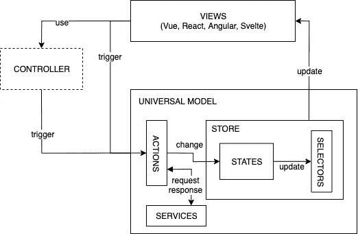

# Angular、React、Vue 和 Svelte 的统一状态管理

> 原文：<https://betterprogramming.pub/unified-state-management-for-angular-react-vue-and-svelte-36289d221afd>

## 不同框架的同一个模型？是的，有可能！

照片由乔纳斯·德尼尔在 [Unsplash](https://unsplash.com/s/photos/symmetry?utm_source=unsplash&utm_medium=referral&utm_content=creditCopyText) 上拍摄

**📕看看我的新书** [**干净代码原则和模式:软件从业者手册**](https://www.amazon.com/Clean-Code-Principles-Patterns-Practitioners-ebook/dp/B0BSDJKYQJ/ref=sr_1_1?crid=8M0CMV4CP6UQ&keywords=clean+code+principles&qid=1674980636&sprefix=clean+code+principle%2Caps%2C175&sr=8-1) ！

[通用模型](https://universal-model.github.io/)是针对最流行的现代 Web UI 框架:Angular、React、Svelte 和 Vue 的统一状态管理解决方案。

通用模型由商店、状态、动作、选择器和服务组成，它们对于每个*UI 框架都是相同的——只有视图部分不同。*

通用模型最好用一个例子来说明。

## 1.创建初始状态

## 2.创建状态选择器

## 3.创建商店

## 4.创建一些操作

## 4.创建您的视图

4.1 React 版本:

4.2 Vue 3+版本:

**📕看看我的新书** [**干净代码原则和模式:软件从业者手册**](https://www.amazon.com/Clean-Code-Principles-Patterns-Practitioners-ebook/dp/B0BSDJKYQJ/ref=sr_1_1?crid=8M0CMV4CP6UQ&keywords=clean+code+principles&qid=1674980636&sprefix=clean+code+principle%2Caps%2C175&sr=8-1) ！

# 资源

有关更多信息、API 和示例，请访问:

*   [GitHub 上的棱角](https://github.com/universal-model/universal-model-angular)
*   [通用于型号 GitHub](https://github.com/universal-model/universal-model-react)
*   [GitHub 上的苗条身材](https://github.com/universal-model/universal-model-svelte)
*   [GitHub 上的 Vue](https://github.com/universal-model/universal-model-vue)