# Uniswap 智能合同分解(第 2 部分)

> 原文：<https://betterprogramming.pub/uniswap-smart-contract-breakdown-part-2-b9ea2fca65d1>

## 通过对代码行进行分组来解释其功能

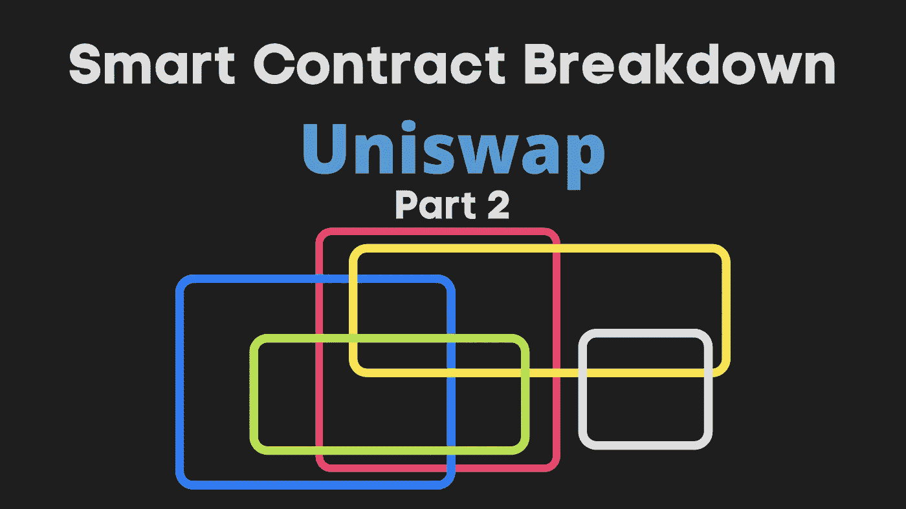

这是 Uniswap 智能合同分解的第 2 部分。在[第 1 部分](https://ilamanov.medium.com/uniswap-smart-contract-breakdown-ea20edf1a0ff)中，我们讲述了:

*   Uniswap 如何在高层次上工作
*   Uniswap 代码的组织方式
*   Uniswap 功能
*   核心合同:配对(硬):管理资金，铸造，燃烧

**在本文中，我们将介绍其余的:**

*   核心合同:配对(硬):交换、池所有权令牌、协议费用和价格 oracle
*   核心合同:工厂(简单)
*   外围合同:路由器(易)
*   完全注释的代码

# 核心合同:配对(硬)

## 交换

交易者使用`swap`功能来交换代币:

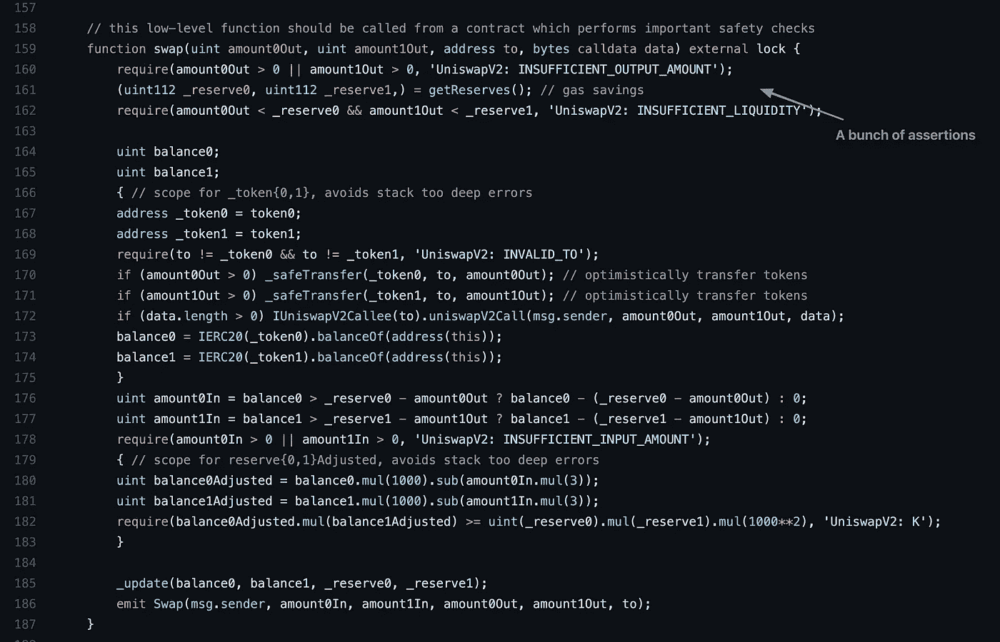

*   首先，我们有一堆断言
*   然后在第 170 和 171 行，**我们乐观地将代币转出(给交易者)**(没有确保交易者已经将相应的代币转入我们的余额。我们可以乐观地将令牌转移出去，因为我们在函数的后面有断言来检查我们是否收到了相应的令牌(外围契约应该在调用我们进行交换之前向我们发送令牌)。如果我们没有，断言将会失败，而可靠性将会恢复整个功能。
*   如果被请求，线路 172 将通知接收器关于交换。
*   然后在第 176 和 177 行，我们实际上检查我们收到了多少令牌。我们断言，我们在第 178 行至少收到了一个大于 0 的代币金额。如果这个断言失败，整个函数将恢复，什么也不会发生。
*   然后，在第 180 行和第 181 行，我们从余额中减去交易费(0.3%)，在第 182 行检查交易后 k 值(x*y=k)是否降低了。k 值永远不能降低，因为否则 Uniswap 将在交换中失败。
*   最后，我们用新的余额更新我们的已知储备，并发出一个`Swap`事件。

## 关于费用和报酬的说明

Uniswap 的运作方式是从交易者的每笔交易中收取一小部分(0.3%)的费用。然后，它随后(可选地)将这些费用中的一部分(1/6)归自己所有，并将其余部分按照流动性提供者对资金池的贡献比例分配给流动性提供者。

这些费用/奖励存放在哪里？它们实际上就储存在水池里。

当交易者支付他们的费用时，这笔费用被加到池中。后来，当流动性提供者增加或撤回资金时，流动性提供者的回报是用复杂的数学公式计算出来的。

**这又是 Uniswap 的优雅之处** —他们不是为费用/奖励创建一个单独的池/存储，而是将所有东西添加到池中，然后使用巧妙的数学公式来推导出池中有多少来自费用。Uniswap 有一种有效的方法来跟踪绝对最小量，以便在未来的任何时间点获得这些值。

## 池所有权令牌

当流动性提供者向资金池中添加资金时，他们会获得资金池所有权令牌。一段时间后，这些所有权凭证由于交易者的费用而增值。当代币被兑换回来时，流动性提供者得到的比他们存入的多。

池所有权令牌实现为标准的 ERC20 令牌。在 Uniswap 的`UniswapV2ERC20.sol`契约中实现([v2-core/contracts/unis WAP v2 ERC 20 . sol](https://github.com/Uniswap/v2-core/blob/master/contracts/UniswapV2ERC20.sol))。这是第 1 部分中图表的这一部分:

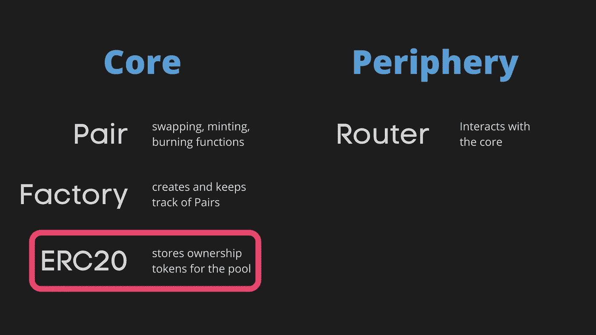

我已经在我的 [ERC20 智能合同分解](https://ilamanov.medium.com/erc20-smart-contract-breakdown-9dab65cec671)文章中对 Uniswap 的 ERC20 合同进行了分解，所以我不再重复。

Pair 契约通过扩展 ERC20 实现来访问它:

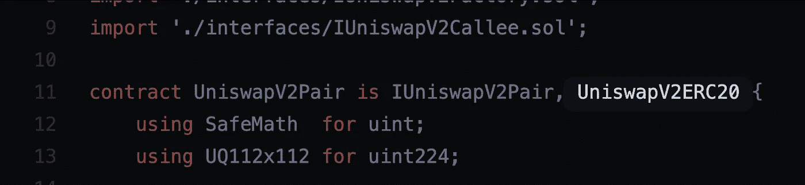

这样，Pair contract 就可以访问 ERC20 的`_mint`和`_burn`功能:

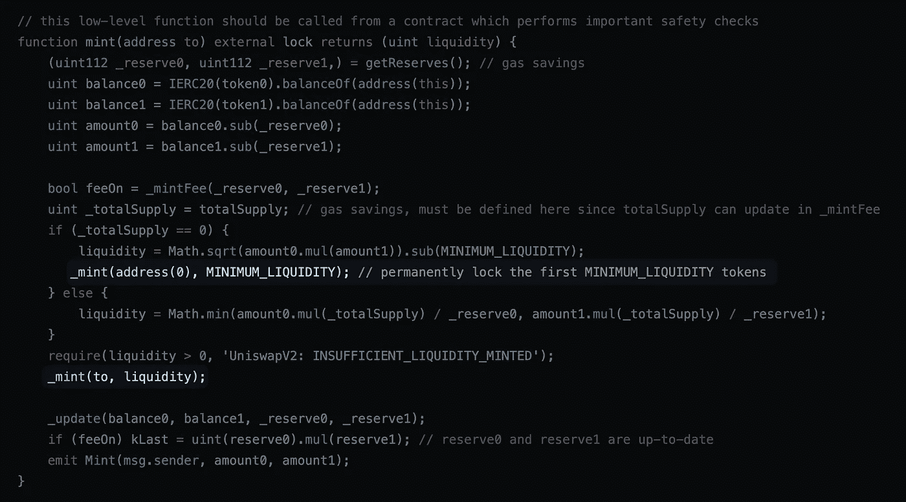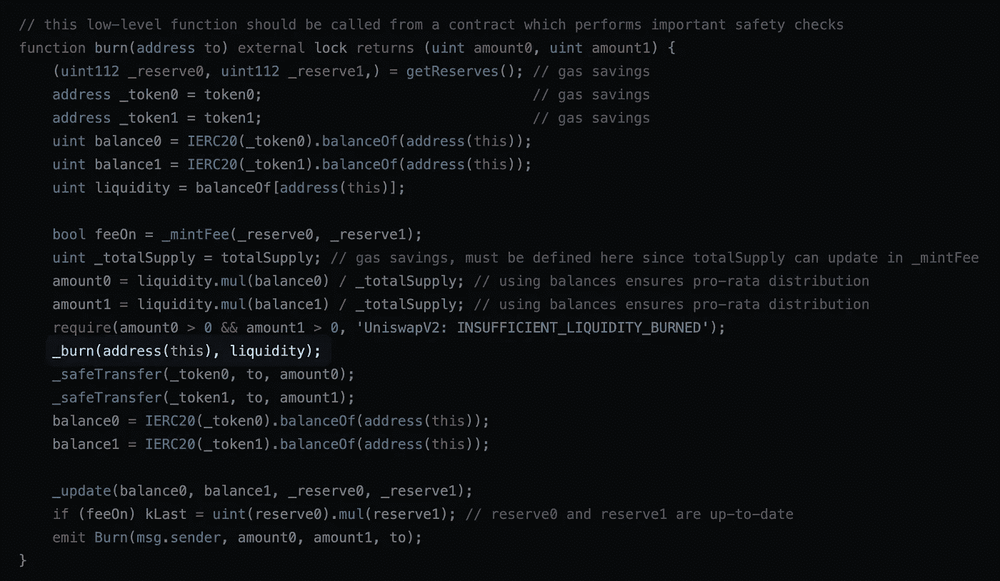

## 礼宾费

Uniswap v2 采用了一种可转换的协议费用——这种费用可由 Uniswap 开/关，由 Uniswap 维持服务。相当于交易者支付费用的六分之一。让我们检查一下在 Pair 契约中协议费用是如何处理的。

协议费的主要功能是`_mintFee`:


这个函数看起来很复杂，所以我们只关注这几行:

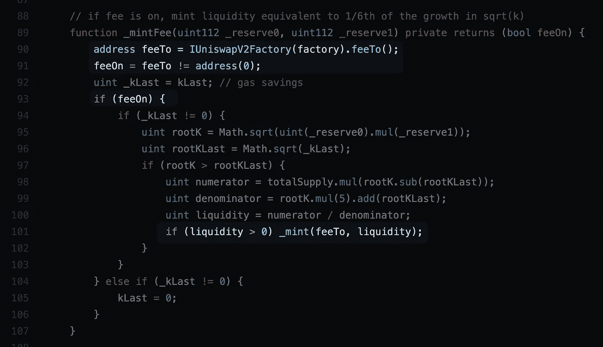

*   我们首先从`factory`得到`feeTo`地址。`factory`是创建这一对契约的契约。
*   如果它被设置为地址 0 之外的其他值，这意味着协议费用开启。`feeTo` address 表示协议费用应该发送到的地址。
*   如果收费，我们会向`feeTo`地址注入一些流动性。(`_mint`功能是 ERC20 的`_mint`功能)

剩下的代码用于计算`liquidity`。这里的流动性表示需要生成到`feeTo`地址的新池所有权令牌的数量。这就是 Uniswap 实现协议费用的方式:它只是为自己铸造新的池所有权令牌。实际上，这稀释了资金池中的所有其他人(流动性提供者)。

IMHO，`_mintFee`并不是这一功能的最佳名称，因为它有创造新流动性的副作用。更好的名字应该是`_collectProtocolFee`。

## 如何计算协议费用

实现协议费的一个直接方法是，每当有代币交换时，收取交易者费用的六分之一。但是你可能注意到了，Uniswap 不喜欢简单的出路。它绝对喜欢效率和节省汽油，即使这意味着代码变得复杂 10 倍😁

Uniswap 不会计算每笔交易的费用，因为那会在每笔掉期交易中产生额外的费用。由于每天都有很多很多的交易发生，这将导致大量的天然气成本。Uniswap 只在流动性提供者将资金存入资金池或从资金池中提取资金时才计算协议费。这比交易难得多。

所以`_mintFee`函数只能从`mint`和`burn`函数中调用。

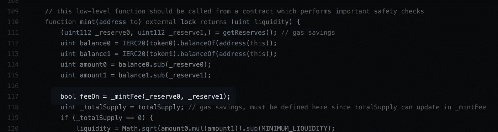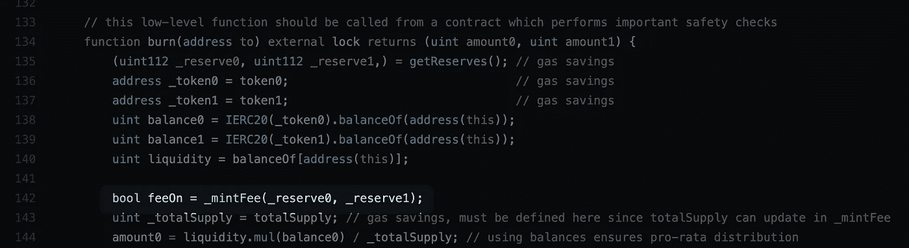

协议费是在交易过程中累积到资金池中的，因此资金池成为交换令牌、协议费和流动性提供者奖励的混合体。巧妙的数学公式让我们能够计算出每种成分的含量。

具体来说，协议费用是使用一个复杂的公式计算的，您可以在 [Uniswap V2 白皮书](https://uniswap.org/whitepaper.pdf)中找到该公式:

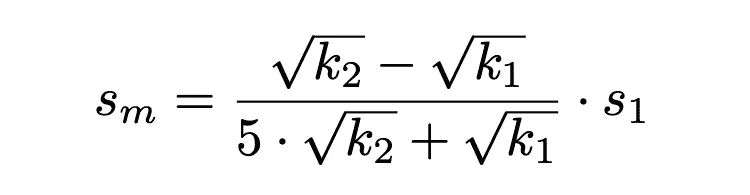

这里的 k 值是储量的乘积(k=x*y)。这就是我们在整个代码中跟踪`kLast`值的原因:`kLast`值允许我们计算到目前为止累计的协议总费用(来自每笔交易),并在 mint 或 burn 函数中一次性收集所有这些费用。

## 价格预测

Uniswap 实现了一个价格 oracle，以太坊生态系统中的其他智能合约可以使用它来查询令牌相对于彼此的价格。

为了实现价格 oracle，Uniswap 只使用了 3 个变量:`price0CumulativeLast`、`price1CumulativeLast`和`blockTimestampLast`。

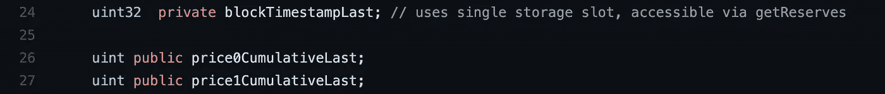

相对价格可以通过减去 2 个时间点的累计价格并除以经过的时间来计算。查看[uni WAP 白皮书的](https://uniswap.org/whitepaper.pdf)“价格预测”部分了解更多详细信息。

这里每个块只更新一次变量:

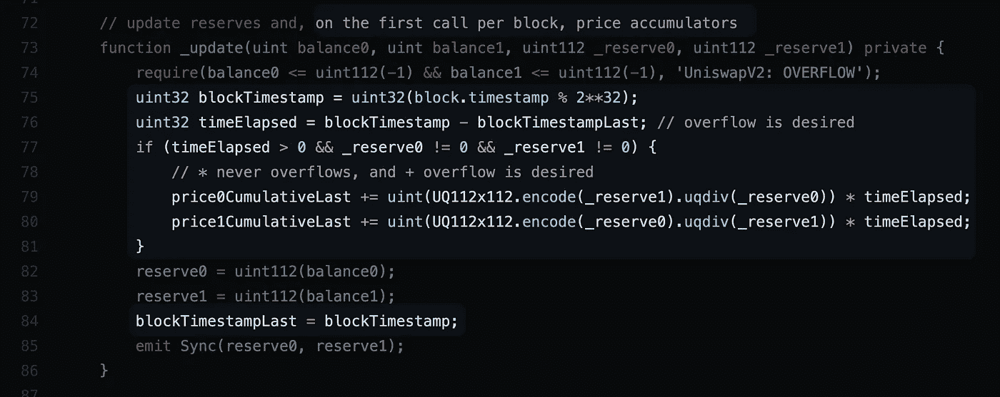

第 75–77 行计算这是否是代码第一次在特定的块中执行。

为什么我们每个块只更新一次值？因为这样某人就更难操纵价格以获取利益。请参见 [Uniswap 白皮书](https://uniswap.org/whitepaper.pdf)的“价格预测”部分，了解有关这些价格操纵器的更多详细信息。

## 混杂的

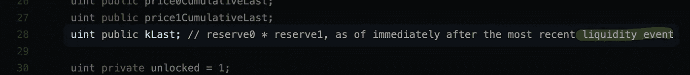

流动性事件是指流动性提供者增加或提取资金。

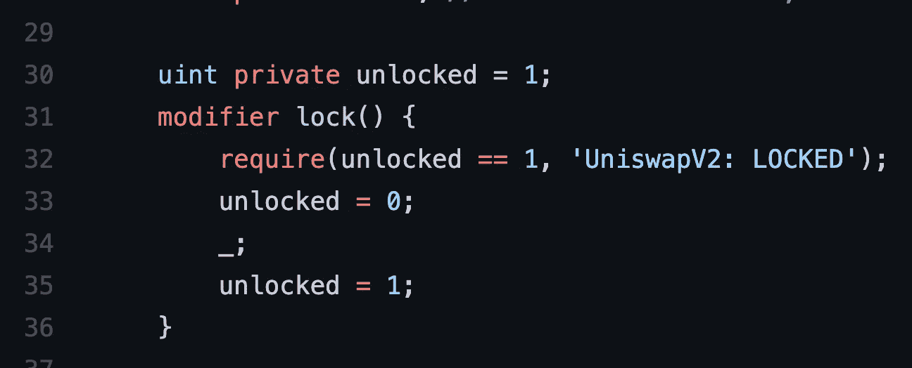

`lock`用于防止[重入滥用](https://medium.com/coinmonks/ethernaut-lvl-10-re-entrancy-walkthrough-how-to-abuse-execution-ordering-and-reproduce-the-dao-7ec88b912c14)。本质上，此功能修饰符防止此契约的两个不同部分同时执行。这有点像用单线程执行契约。

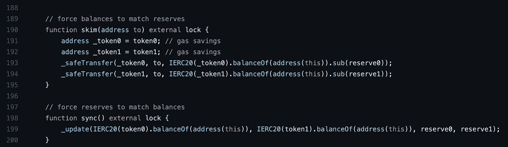

当交换令牌的 ERC20 合约上的余额与配对合约中的`reserve`变量不同步时，需要 skim 和`sync`。例如，当有人无缘无故地将一些 Dogecoin 转移到 Pair contract 的帐户时，就会发生这种情况。有两种解决方案可以使储备变量与 ERC20 合约的实际余额保持同步:

*   `skim`允许某人从 ERC20 合同中提取额外资金。任何人都可以调用这个函数！
*   `sync`更新`reserve`变量以匹配余额。

## 关于市场动态的一个说明

Uniswap 根据代币在池中的比例对代币进行定价。它们在池中的不平衡越大，价格差异就越大(有利于更稀有的代币)。

但是 Uniswap 如何确保池中令牌的相对价格与市场价格相匹配呢？**套利**。Uniswap 利用套利来确保池中的价格密切跟踪市场价格。

套利是指当一个聪明的投资者看到市场汇率和 Uniswap 汇率之间的差异时，他会利用它来获利，从而使 Uniswap 汇率更接近市场汇率。

例如，如果 Uniswap 提供的 Dogecoin 到柴犬的价格低于市场价格，聪明的投资者会在 Uniswap 上将他的柴犬换成 Dogecoin，并在市场上以更高的价格出售 Dogecoin。他将获得利润，并因此使 Unsiwap 汇率更接近市场汇率，因为他减少了 Dogecoin 的供应，并增加了 Uniswap 池中柴犬的供应(Dogecoin 到柴犬的价格将增加，因为 Uniswap 如何相对于彼此对代币进行定价)。

这种情况将持续下去，直到 Uniswap 费率与市场费率相匹配。因此，Uniswap 利率往往密切跟踪市场利率，这就是为什么它可以被用作连锁价格甲骨文。

*   正如 Uniswap v2 白皮书所言:第一个加入资金池的流动性提供者通过存放他们认为等价的 ETH 和 ERC20 代币来设定初始汇率。如果这一比例下降，套利交易者会以最初的流动性提供者为代价，使价格达到平衡。
*   [Uniswap v1 白皮书](https://hackmd.io/@HaydenAdams/HJ9jLsfTz?type=view)指出:大宗交易也会导致价格下滑，但套利将确保价格不会偏离其他交易所太远。

## 摘要

这是 Uniswap 中最复杂的合同。另外两个合同要容易得多。让我们总结一下我们学到的东西。

结对合同是一系列功能的组合:

*   管理资金
*   添加/移除流动性
*   交换代币
*   管理费用/奖励
*   计算协议费用
*   实施价格 oracle

以下是结对合同的完整注释代码，根据功能进行了颜色编码:

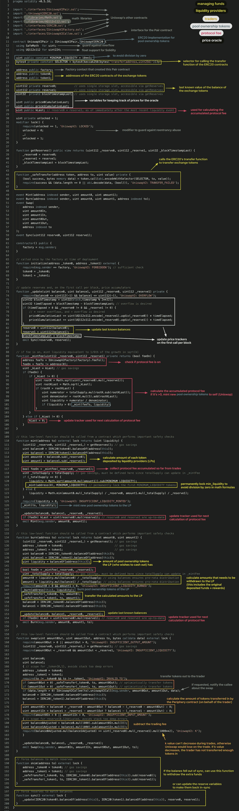

# 核心合同:工厂

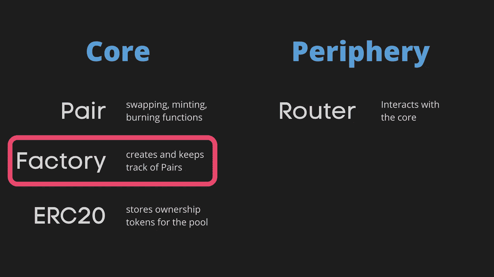

以下是工厂合同的明细([v2-core/contracts/uniswapv 2 fatory . sol](https://github.com/Uniswap/v2-core/blob/master/contracts/UniswapV2Factory.sol)):

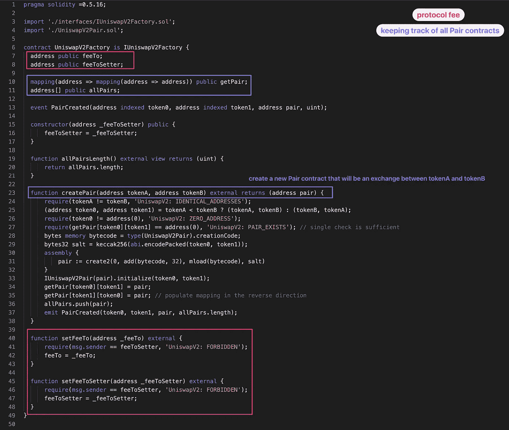

与配对合同相比非常简单

该工厂合同在整个配对合同中引用:

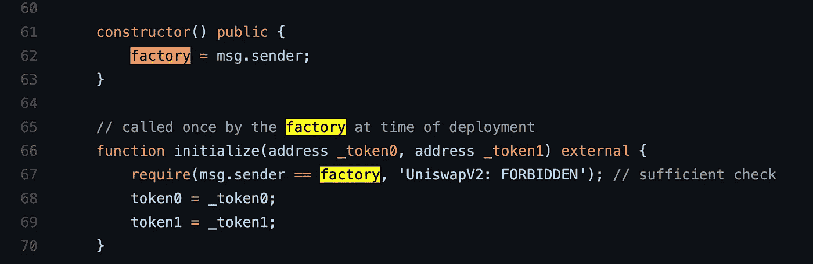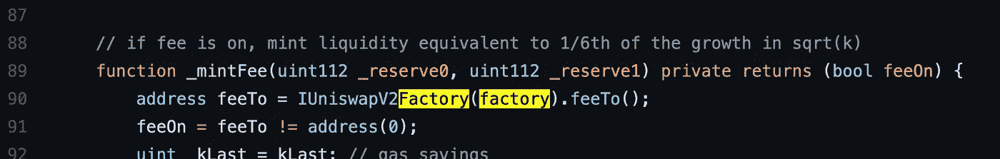

# 外围合同:路由器

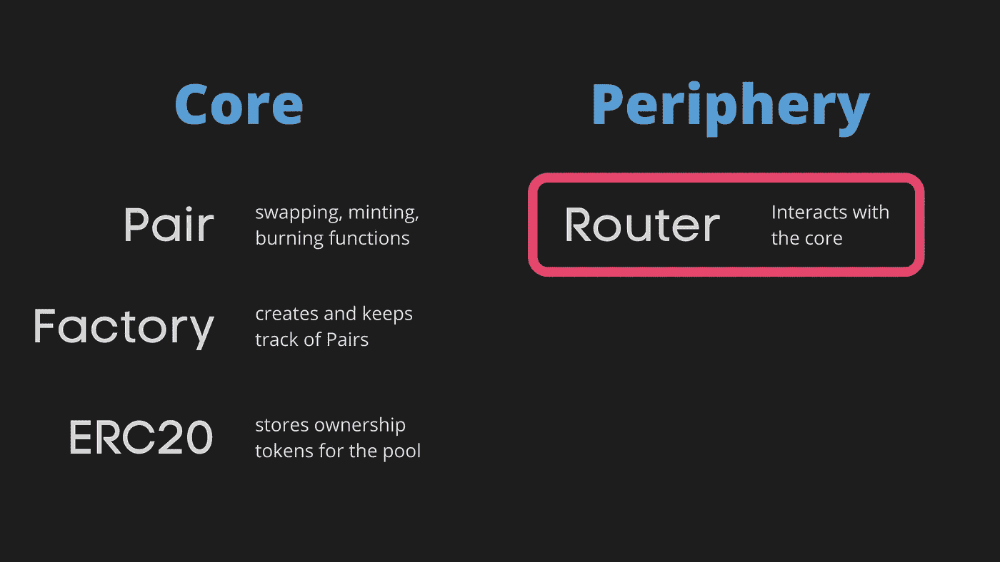

外围协定是 Uniswap 的 API。您可以直接调用核心契约，但这更复杂(外围提供包装函数)也更危险(如果不小心，您可能会赔钱)。

核心合同有检查，以确保他们没有被欺骗。但是他们不为其他人提供支票。那些支票在外围。所以如果你不想赔钱，就用外围契约和 Uniswap 互动。

让我们来分解一下路由器合同，它是外围设备中唯一的合同。可以在[v2-periphery/contracts/uniswapv 2 router 02 . sol](https://github.com/Uniswap/v2-periphery/blob/master/contracts/UniswapV2Router02.sol)找到。

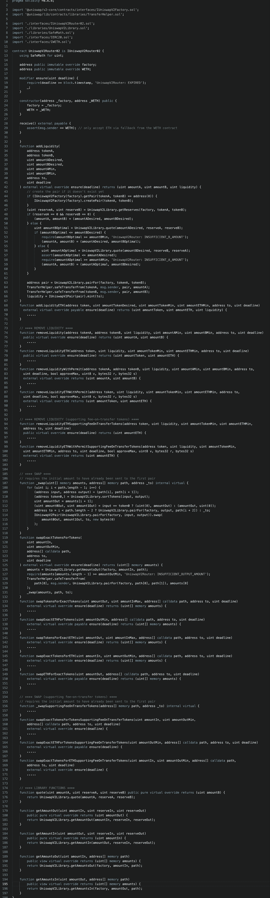

*   这种合约有一堆类似的功能，用于增加流动性、去除流动性和交换代币。不同的功能变量适用于不同的交易/流动性偏好。
*   我去掉了大部分函数的主体，因为它们非常相似。
*   来自[以太坊网站](https://ethereum.org/en/developers/tutorials/uniswap-v2-annotated-code/#UniswapV2Router01) : `UniswapV2Router01`有问题，不应该再用了。

Uniswap 到此为止！我希望这有所帮助。如果你有任何问题，请在评论中告诉我。

我计划对流行的智能合约进行更多的分解，如 **Axie Infinity** 和 **BAYC，**所以请在 Medium 或 Twitter 上关注我以获取更新。

你还可以在[solidnoob.com](https://www.solidnoob.com/)查看其他智能合约的细目分类以及更多关于 Solidity noobs 的东西。

```
**Want to Connect?**Follow me on [Twitter](https://twitter.com/nazar_ilamanov).
```