# 深入了解 Uniswap V2 协议

> 原文：<https://betterprogramming.pub/uniswap-v2-in-depth-98075c826254>

## 了解顶级 DeFi 协议如何在引擎盖下工作

欢迎来到深入的 DeFi 系列！这个系列将由几篇文章组成；每一个都包括对一个单独协议的解释。本系列的主要目的是从第一原理的角度理解顶级 DeFi 协议是如何工作的。

我们将从理论和实践层面对其进行回顾。这意味着我们将理解协议背后的理论，但我们也将深入实际的实现(代码)。

## *先决条件*

为了跟上进度，了解以下知识是很有用的:

1.  对 EVM 的总体了解
2.  对坚固性感到舒适
3.  基础数学(代数)
4.  对区块链和智能合约协议基础的一般理解

# UniSwap V2

这篇文章分为两个主要部分:第一部分，“系统组件概述”，解释了使系统工作的最重要组件背后的理论和实践。

第二部分，“系统的核心实现”，介绍实际的架构实现。

我认为，要真正深入地理解一个系统，你应该能够从头开始重写它。希望在这篇文章结束时，你能够做到这一点。

为了以结构化的方式开始学习该系统，重要的是要问自己一些对该系统至关重要的问题:

*   Uniswap 的定价机制是如何运作的？
*   谁为系统提供流动性？
*   为什么有人会向系统提供流动性？
*   系统如何表现流动性？

在这个过程中，所有的基本问题都应该通过深入理解协议来回答。

在开始之前，我们先快速说一下 Uniswap 是什么。

Uniswap 是一个分散的自动做市商协议，允许任何人将令牌 A 换成令牌 b。自动做市商的工作方式不同于传统的[订单簿模式](https://en.wikipedia.org/wiki/Order_book)。区分自动做市商(Uniswap)和传统集中式订单簿的核心原则是，前者在区块链上运行无权限代码，允许任何人参与。

在继续之前，我想说几件事。

1.  Uniswap V2 是去中心化的:去中心化不是二元的，但是从我(和许多其他人)的观点来看，去中心化的智能合约协议是一个没有中心方可以访问用户资金的协议。换句话说，没有人有可以修改合同的特殊钥匙。
2.  Uniswap 有三个版本:对于这个帖子，我们将重点关注 V2(我们将在将来发布一个 V3 帖子)。但如果你想了解 Uniswap 是如何创建的，我建议看一下[这个](https://www.youtube.com/watch?v=LpjMgS4OVzs)视频。
3.  很多 AMM 都是 Uniswap V2 的分支:Uniswap V2 比 V3 简单得多，因此更容易维护。所以一旦你知道 Uniswap V2 是如何工作的，你也会知道大部分的 AMM！

开始吧！

# 系统组件概述

为了开始了解协议是如何工作的，我们需要问自己，当我们进行简单的交换时，到底发生了什么。当然，整篇帖子的目的就是为了说明这一点。

但在基本层面上，您正在与一个智能合约(池)进行交互，该合约“持有”两种不同令牌的储备。例如，如果你用一些 wet 交换 USDC，你正在与 wet/USDC 智能合约对进行交互(我们将在后面详细说明这是如何工作的)。如果你感兴趣的话，这里的[就是以太扫描上的 WETH/USDC 智能合约对。](https://etherscan.io/address/0xb4e16d0168e52d35cacd2c6185b44281ec28c9dc)

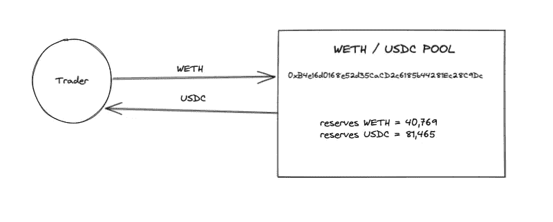

韦瑟/USDC 游泳池

因此，如果你用 WETH 买入 USDC，你就增加了 WETH 的供应量，减少了 USDC 的供应量，从而提高了 USDC 和 WETH 的相对价格。

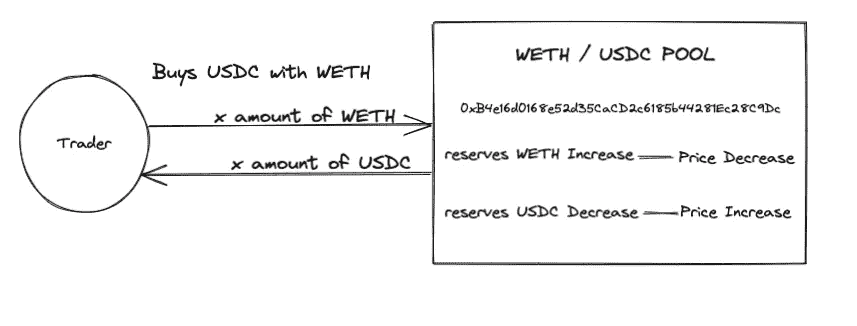

*在接下来的部分中，我们将讨论这个池是如何工作的(它背后的数学原理)。*

需要记住的一件重要事情是，UniswapV1 的池总是与 Eth 进行交易。换句话说，每个池都是 ETH/xToken。

在 Uniswap V2，每个池都是 ERC-20/ERC-20。这种方法为流动性提供者提供了更大的灵活性，因为他们不需要 100%依赖 ETH。所以，每次你把 ETH 换成另一个令牌，你的 ETH 首先被转换成 wet。

# 协议参与者

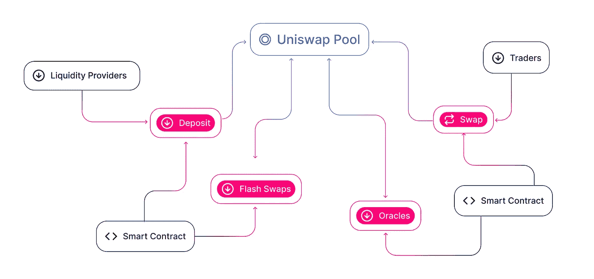

[https://docs . unis WAP . org/protocol/V2/concepts/protocol-overview/ecosystem-participants](https://docs.uniswap.org/protocol/V2/concepts/protocol-overview/ecosystem-participants)

Uniswap 的工作方式是激励不同的参与者与该系统合作，以便他们从中获利。该系统的主要参与者是:

1.  交易员:交易员可以在系统中执行几个动作；其中一些是:

*   对资产价格进行投机。
*   套利软件。例如，如果 ETH 在 Uniswap 的交易价格为 3000 美元，在比特币基地的交易价格为 3800 美元，套利者会立即买入 Uniswap 的 ETH，然后在比特币基地转售获利。
*   基本交换功能。您想将令牌`x`改为令牌`y`，以便在 Dapp 中使用它们。

2.流动性提供者(LP):LP 向令牌池提供流动性。作为回报，他们获得交易费。

3.开发人员:开发人员创建生态系统中的系统和应用程序。在 uni WAP 术语中，他们可以是核心协议开发者、与 uni WAP 集成的第三方 Dapp 开发者、钱包开发者等。

在深入研究智能合约之前，让我们先了解一下核心概念。

为了深入了解 Uniswap(以及大多数 DeFi 协议)，我们需要了解三个基本要素:常量产品公式、套利和非永久性损失。

## 费用

UniswapV2 对每笔交易收取 0.3%的固定费用。我们将在以后的章节中看到这是如何计算的。费用归流动性提供者所有，这是为了奖励人们的流动性。该协议还可以触发一个变化，将给予 Uniswap 团队 0.05%的费用，这部分费用将从 LPs 而不是交易商那里折扣。

# 深度常数乘积公式

许多自动做市商的工作要归功于恒定的产品配方。这是一个非常简单但强大的算法。

常数乘积公式是支持 Uniswap 协议(以及更多 AMMs)的自动市场算法。

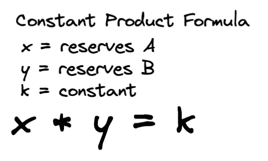

常数乘积公式

这个公式简单地说明了关于`x`和`y`的流出/流入，不变量`k`必须保持不变。

换句话说，只要`k`保持不变，你可以随意改变`x` 和`y`的值。

## 例如:

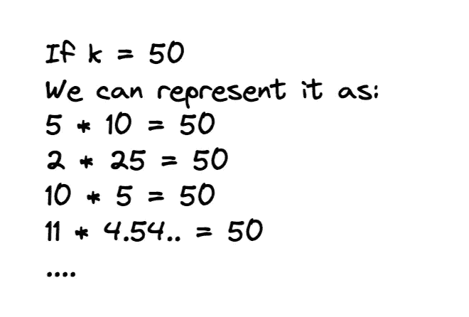

什么是`x`和`y`？

`x`和`y`是池中代币的储备。例如，如果您将 DAI 换成 WETH，您将与 DAI/WETH 智能合同库进行交互。本合同持有的 DAI 总额为`x`，WETH 总额为`y`。

很简单。这是为许多 AMM 提供动力的算法。

在实际实现中，公式有点不同。

让我们看看 Uniswap V2 使用的真实公式。

[在这里](https://github.com/Uniswap/v2-core/blob/master/contracts/UniswapV2Pair.sol#L159)，你可以找到完整的“交换”功能实现。但是我们对下面几行代码特别感兴趣:

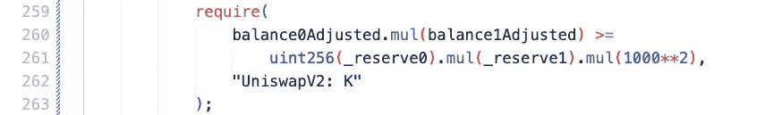

这段代码是常数乘积公式的真正实现。其他你读过或看过的都只是理论而已。这些代码行是常数乘积公式的裸机实现。

`require`语句中有四个变量:

*   `balance0Adjusted`:交易商向池中发送 tokensX 后的 **x** 准备金减去发送金额的 0.3%。
*   `balance1Adjusted`:token sy 后的 **y** 储备从池中发送给交易者。
*   `_reserve0`:互换前的代币储备`x`。
*   `_reserve1`:互换前的代币储备`y` 。

当然，`balance0Adjusted`和`balance1Adjusted`可以反过来处理。

让我们做一个例子来更好地理解这一点:

*   Uniswap 有阿呆/WETH 游泳池。
*   当前储备是 20000 DAI/10 wet，一个交易者想用 1 WETH 换 1500 DAI:

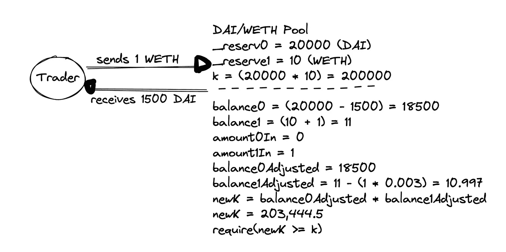

如你所见，交易者向池中发送 1 WETH 以换取 1500 DAI。他们本可以为 wet 得到更多的戴，但这里的重点是说明两件事:

1.  `k`永远不会保持不变。它总是由于交易费用而增加，但如果人们低效地使用该系统，它也会增加(如在我们的例子中，交易者可以从他们的 wet 中获得更多的 DAI)。
2.  swap 函数真正强制执行的唯一检查是新储备(减去费用)大于或等于以前的储备:`newK ≥ oldK.`

下面是上一个示例的实际代码实现:

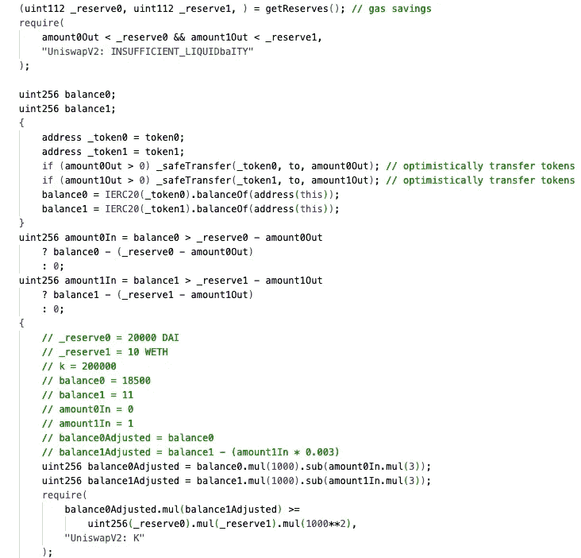

如你所见，事物被乘以 1000。这是因为 Solidity 中没有浮点数，所以这是表示 0.3%费用的必要条件。这就是为什么数量 0In 或数量 1in 要乘以 3(代表 0.3%)。

## 获取最大数量

需要理解的一件非常重要的事情是，对于给定的输入，您可以获得的最大令牌数量。

注意:在 Uniswap V2 外围设备中，您有所有的帮助器函数来实现这个数学。

示例:
我们有和 WETH 池，其储量如下:
-戴:100，000
- WETH: 20

我们想用 1 个星期来交换最高限额的戴。

我们一周(对于该池)将获得的 DAI 的最大值是 4748.29。

我们刚才做的数学也可以用代码表示(这个函数来自 V2 外围):

为了避免得到更少的输出令牌，始终保持这种数学正确是非常重要的。

关于这个话题的最后一点，你可能想知道是什么决定了变量`k`？

最初创建池时确定，然后每次有新交易时增长。如果我们回到过去的例子，如果一个交易者在我们交易之后执行了一个掉期交易，他们交易的`k`将是前一个交易的`newK` 。

# 套利

套利是理解 Uniswap 如何工作的最重要的概念之一。虽然这一概念不是 Uniswap 独有的，但它适用于几乎所有的 DeFi 项目。为了更好地理解这个概念，我们首先需要问自己的是，Uniswap 如何知道给定令牌的价格？

比如你在 Uniswap 中用 wet 换 DAI，协议怎么知道 wet 相对于 DAI 的价格是`x`？

简而言之，Uniswap 不知道真实价格是多少。现实中，由于激励因素，价格与外界相符。

为了进行成功的交换，协议真正强制执行的唯一事情是“恒定产品公式”

我们来看一个例子。

假设 Uniswap 中有阿呆/韦瑟池。在 Uniswap，WETH 的价格在 3000 DAI 左右。我们可以通过将 DAI 的储备数量除以 ETH 的储备数量来得到价格(这不是您将得到的精确数量，我们在上一节中已经计算过了)。

现在，机会来了！

WETH 在比特币基地的交易价格是 3200 美元。Uniswap 和比特币基地的天气价格相差 200 美元。这将创造一个套利机会，套利者(bot 软件)将立即在 Uniswap 买入 WETH，并在比特币基地卖出，直到价格匹配。

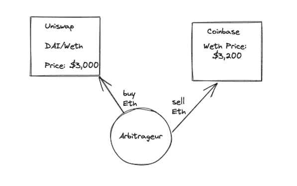

这就是 Uniswap 中的价格如何通过不断寻找套利机会的套利者与外部世界相关联。套利有不同的类型(我们就不细说了)。但是对于所示的例子，它不是原子套利。

换句话说，风险更高，因为当套利者试图在比特币基地获利时，价格可能已经处于平价(因为另一个套利者先这么做了)。这就是为什么最安全的套利是在链上进行的，因为交易是原子性的，这意味着，如果某项交易失败，整个交易将恢复(减去汽油费)。

因此，总之，Uniswap 不知道外面世界的价格。多亏了套利者，价格几乎与外界一致。

# 非永久性损失

对流动性提供者而言，非永久性损失是指他们在某个特定资金池中的总股份相对于仅仅持有这些资产的美元价值的变化。

让我们创建一个例子来更好地理解这一点。

想象一下，爱丽丝的钱包里有一些代币，所以她想成为流动性提供者，以赚取一些收益率。对于我们的示例，她将在 Uniswap 中创建新的 DAI/WETH 池。WETH 的当前市场价格是 3000 美元，因此为了避免套利，她需要通过为每只 WETH 投入 3000 DAI 来启动资金池。

她将通过投入 10 个 wet 和 30，000 DAI 来启动资金池，总价值为 60，000 美元(我们需要记住这个数字)。

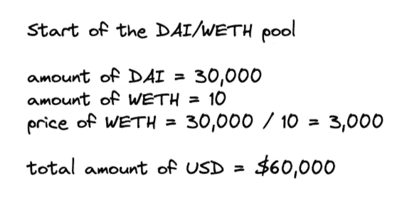

*简单来说，我们不会考虑交易费用。

太好了，所以现在爱丽丝成了这个戴/韦瑟 Uniswap 池的 LP。现在，让我们想象 WETH 的价格涨到 4687 美元。现在你应该知道，这将创造一个巨大的套利机会，因此套利者将立即购买爱丽丝池中的 ETH，直到价格与外部市场持平。

因此，在一些套利之后，Alice 的池将看起来像这样(同样，我们不考虑交易费用):

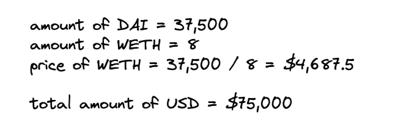

正如我们所看到的，经过一些套利，现在池中有 8 WETH 而不是 10，37，500 DAI 而不是 30，Alice 最初提供的)。该池的总金额现在是$75，000((第 8 次* $4，687.5) + 37，500))。

问题来了:如果爱丽丝只是持有资产，她会有更多的钱。记得最初，她提供了 10 WETH 和 30，000 DAI。所以，最后，她暂时损失了 1875 美元:

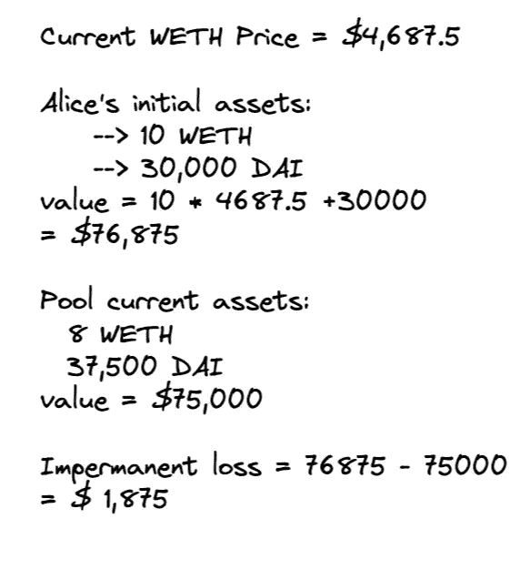

在这个例子中，我们没有考虑交易费用的利润(0.3%)，但是这个概念保持不变。

它被称为“非永久性的”,因为只有当有限合伙人在当前时间卖出时，损失才会发生。如果资产波动，那么损失可以减轻。

希望这个概念现在已经很清楚了！如果还有疑问，我强烈推荐看[这个视频](https://www.youtube.com/watch?v=8XJ1MSTEuU0)。

# 流动性/ LP 代币

大量的流动性使得 Uniswap 成为一个有吸引力的系统。没有足够的流动性，系统就会变得低效，尤其是相对于资金池的总流动性而言的大宗交易。

*注意:对于大宗交易(相对于池)，最好使用集合器来尽可能减少滑点。*

好吧！因此，我们首先需要了解的是，LP 令牌是如何铸造和焚烧的？

当流动性提供者向资金池提供流动性时，它会收到与其流动性数量成比例的 LP 令牌。

让我们打开这个。

Uniswap 池只是一个智能合约，它“持有”一定数量的储备(令牌 x 和 y)。流动性提供者提供这些储备。但是，该池还有一个内部令牌，称为“LP 令牌”这个令牌对每个池都是唯一的，主要目的是跟踪每个流动性提供者注入的流动性。你可以把这个代币看作是你流动性的证明。这种代币还收取 Uniswap 收取的 0.3%的费用。

智能合同池导入“UniswapV2ERC20.sol”(您可以在此处找到它)，这基本上是一个具有基本 ERC20 功能(铸造、刻录、转移等)的合同..).

LP 令牌“存储”在这个 UniswapV2ERC20.sol 中。每次流动性提供商提供流动性时，都会向其地址铸造一定数量的令牌。相反，每当流动性提供者取出流动性时，LP 令牌就会被烧掉。

那么，这是如何工作的呢？

如果我们从高层次考虑，流动性提供者可以 a)提供流动性，b)取出流动性。Uniswap 在两个函数中实现了这个机制:`mint()`和`burn()`。

先说薄荷功能。你可以在这里找到完整的功能实现。

为了计算流动性提供者收到的 LP 令牌，我们首先需要知道是否有流动性，或者是否有人第一次提供流动性。

下面是我们感兴趣的一段代码(在 mint 函数内部):

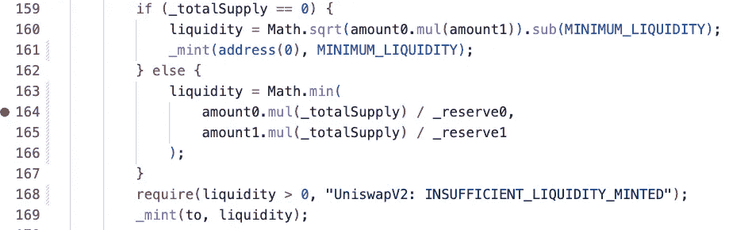

MINIMUM_LIQUIDITY 是一个常数变量，等于 1000:

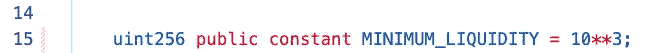

为了更好地理解这一点，我们将通过一个例子。

**注**:以太坊的计算货币是卫(ETH * 10 **18)。这也适用于大多数 ERC 20 代币。为了简单起见，我们将写没有 18 个零的数字，但是每当有一个硬编码的数字，比如 MAXIMUM_LIQUIDITY = 1000，我们将只容纳那个数字。

让我们假设 Alice(一个流动性提供者)刚刚创建了一个新的 DAI/WETH 池。

她将提供 10，000 DAI 和 2 WETH:

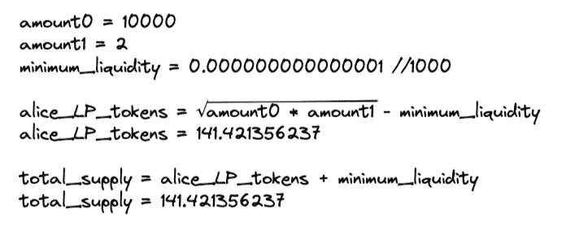

在 Alice 之前，池的总供应量为 0，因此将要发生的第一件事是向地址 0 铸造 1000 个代币(这样做是为了保持最低流动性):

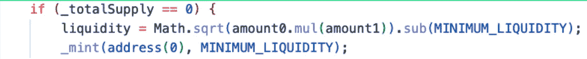

注意:*每次有一个 mint，totalSupply 变量就会更新*:

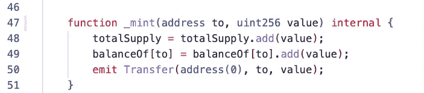

然后，我们得到将要铸造给流动性提供者(Alice)的 LP 令牌的数量。在我们的例子中，结果是 141.42。
再次说明，这是确定的公式:

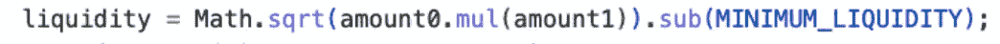

太好了，现在我们的池包括以下内容:

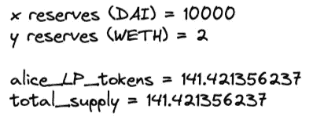

总供应量是指流通中的 LP 代币总量(不要与 x 和 y 储备混淆)。

现在，让我们想象一下，爱丽丝想收回她放进池子里的每一个戴和韦。为简单起见，我们假设储量保持不变。

为了让 Alice 移除她的流动性，她需要调用 burn 函数，但是在此之前，她需要将她的所有 LP 令牌转移到池的地址。让我们理解这是如何工作的。以下是完整的刻录功能实现:

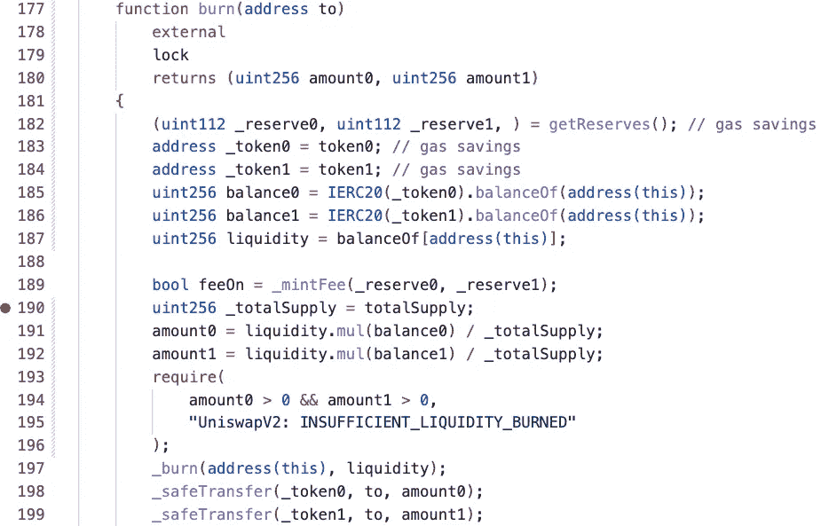

如果我们看到第 187 行，可变流动性是合同地址持有的 LP 令牌的数量。因此，这就是我提到 Alice 需要在函数调用之前转移 LP 标记的原因。然后，在行 191 和 192 中是要转移给爱丽丝的代币数量 `x`和`y`。

按照我们的例子，让我们打开这个:

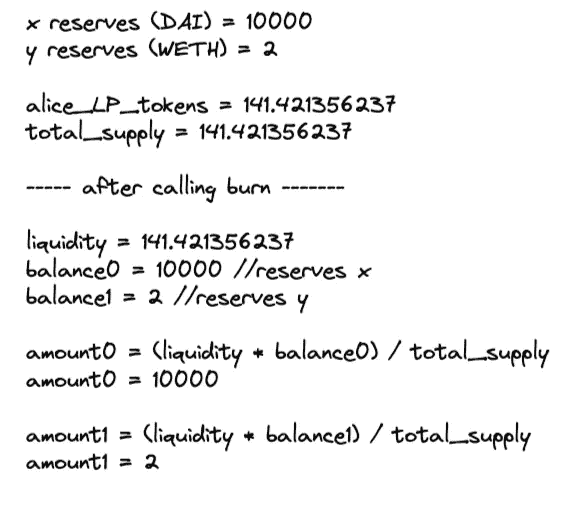

如你所见，金额 0 = 10000，金额 1 = 2。这是爱丽丝提供的初始数量！

计算出数量后，它们被转移，然后被烧掉。

这就是 LP 代币背后的魔力！

关于这个话题的最后一点说明，如果我们还记得的话，协议收取 0.3%的交易费。这笔费用归流动性提供者所有。从技术上来说，增加费用的方法是增加每笔交易中`x`和`y`的储备。这将对每个流动性提供者持有的 LP 代币数量产生积极影响(与其持有量成比例)。

如果我们回到 burn 函数，这两行代码就是计算当流动性提供者想要用 LP 令牌交换`x`和`y`令牌时发送给他们的令牌`x`和`y`的数量。

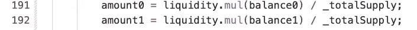

交易者每执行一次掉期，就需要发送相对于交易规模 0.3%的缓冲。这 0.3%增加了资金池的储备。因此，在刻录功能中增加`*balance0*` 和`*balance1*`的值。

# 系统的核心实现

现在我们已经对各个组件有了很好的理解，让我们开始实际的实现。

这一部分会快得多，因为核心主题已经涵盖了。

## 协议体系结构

Uniswap V2 是一个二元智能合同系统。它由 [V2 核心](https://github.com/Uniswap/v2-core)和 [V2 外围](https://github.com/Uniswap/v2-periphery)组成。

*   V2 核心是低水平的基础合同。这些智能合同负责系统的功能。
*   V2 外围是助手契约，允许前端应用程序和开发人员通过应用安全检查和抽象某些东西来与核心契约集成。

简单来说，V2 核心是协议中实现核心功能(交换、铸造、刻录等)的部分。).相比之下，V2 外围要高一层。它是一组契约和库，使得开发人员的集成更加容易。

Uniswap 团队还设计了这种模块化代码库方法，通过在 V2 核心中实现最低限度来减少安全关键漏洞。换句话说，他们只实现了 V2 核心所需的东西，因此需要审计的代码更少(因此更安全)。所有的辅助功能都被扔到了 V2 外围。

我们将只关注 V2 核心。原因很简单，如果你知道 V2 核心区是如何运作的，你也知道 V2 外围区是如何运作的(但不是反过来)。

同样，你可以在这里找到 V2 核心回购协议。

有三种主要合同:

1.  `UniswapV2ERC20.sol`:本合同负责处理 LP 代币。这是一个基本的 ERC20 合同，因此我们不会讨论它。
2.  `UniswapV2Factory.sol`:这是负责部署新池(对)并跟踪它们的工厂。
3.  `UniswapV2Pair.sol`:这是动作发生的地方(池实现)。

## Uniswap V2 工厂

同样，工厂契约主要负责创建新的契约对(UniswapV2Pair.sol)。这里的[是以太扫描](https://etherscan.io/address/0x5C69bEe701ef814a2B6a3EDD4B1652CB9cc5aA6f)上的 V2 工厂合同。

为了集中流动性，每对只能有一个智能合约。换句话说，如果已经有 WETH/UNI 对合同，工厂将不允许您创建相同的对。当然，你可以绕过这一点(通过直接部署配对合约)，但这里的核心原则是尽可能集中流动性，以避免价格滑移，并有更多的流动性。

下面是在 UniswapV2Factory 中创建对的函数:

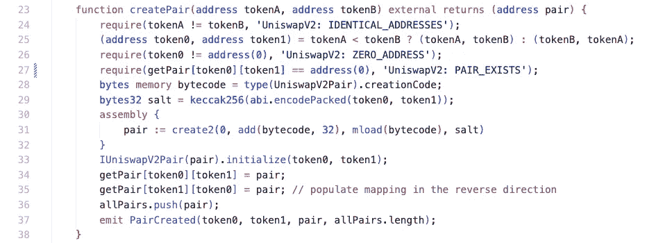

有一件事可能仍然是个问题，是什么决定了`x`和`y`的顺序？

这些对按十六进制顺序分组，如第 25 行所示:

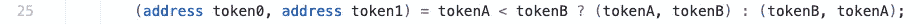

第 27 行检查该对是唯一的:

第 30–32 行使用 create2 创建对(UniswapV2Pair.sol ):

然后，它用每个令牌的地址初始化协定，并将它们添加到数组和映射中。

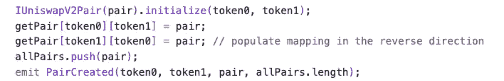

另一个重要的点是，工厂可以打开一个费用，收取一定比例的交换(你可以自己检查；相当琐碎)。

工厂到此为止。这是一个非常简单明了的工厂实现，一点也不复杂。

## Uniswap V2 对

`UniswapV2Pair.sol`是 UniswapV2 的基础。这里[是合同。](https://github.com/Uniswap/v2-core/blob/master/contracts/UniswapV2Pair.sol)

此合同负责处理唯一池(每个池=一个合同)。

本合同的基本功能是`swap`、`mint` 和`burn`。我们已经详细介绍了这些组件是如何工作的，所以我们将简单介绍一下。

`Swap()`:swap 功能是 Uniswap 的明星。每当你想用一个令牌交换另一个令牌时，这个函数就会被调用。你可以在这里看到完整的功能实现。该函数的基本任务是强制`newK`大于或等于`k`:

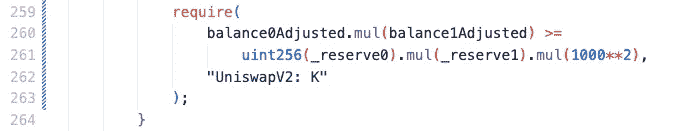

`Mint()`:每次流动性提供者提供流动性时，铸币功能负责铸造 LP 代币。这里可以找到[。](https://github.com/Uniswap/v2-core/blob/master/contracts/UniswapV2Pair.sol#L110)

`Burn()`:每次流动性提供者想把他的资产从池中拿出来的时候，burn 函数负责燃烧 LP 代币。这里可以找到[。](https://github.com/Uniswap/v2-core/blob/master/contracts/UniswapV2Pair.sol#L134)

你成功了！

您刚刚了解了大多数自动做市商的引擎是如何工作的！

## 关于快速贷款的说明

快速贷款是一个非常重要的话题，我们没有在这篇文章中讨论。原因是我们将在下一篇关于 AAVE 的文章中深入探讨。

希望你喜欢它！

参考资料:

**Uniswap V2 核心白皮书**

 [## Uniswap 如何工作| Uniswap

### Uniswap 是一个自动化的流动性协议，由一个恒定的产品配方提供动力，并在一个…

docs.uniswap.org](https://docs.uniswap.org/protocol/V2/concepts/protocol-overview/how-uniswap-works)