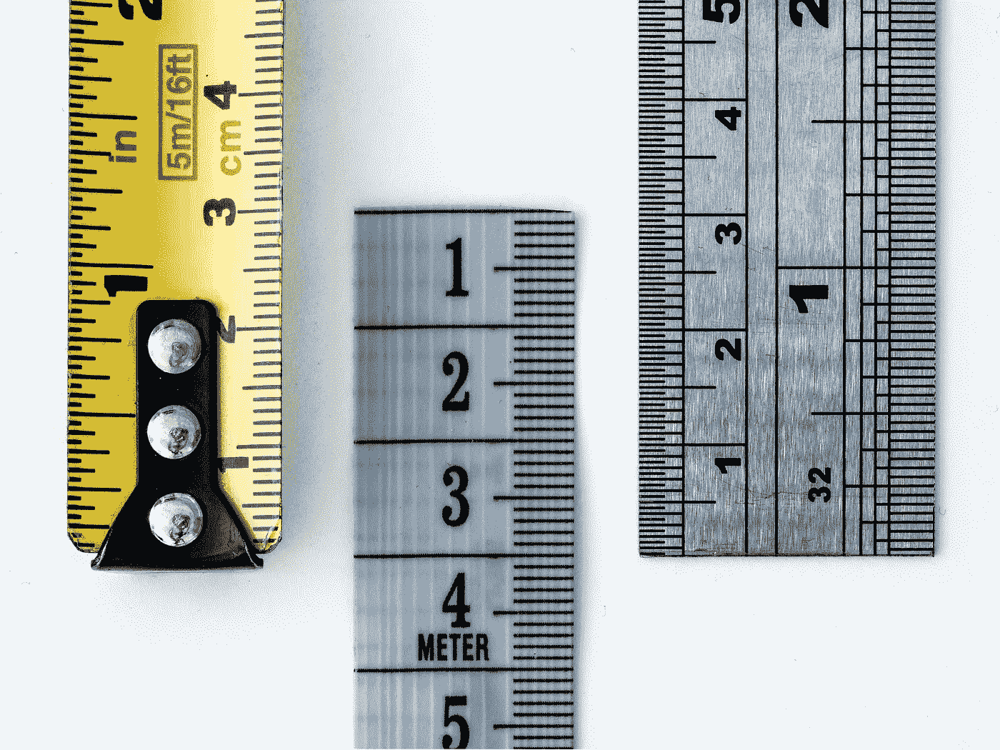

# Swift 中的单位和度量

> 原文：<https://betterprogramming.pub/unit-and-measurement-in-swift-7c6be4a25586>

## 如何以类型安全的方式使用和转换单位

图片来自 [unsplash](https://unsplash.com/photos/WahfNoqbYnM) 的 [William Warby](https://unsplash.com/@wwarby) 。

每当我们在应用程序中处理测量数据，需要将一个单位转换成另一个单位时(例如，英制单位如英寸转换成公制单位如米)，我们可以自己编写转换程序。然而，这可能变得非常复杂并且容易出错。

相反，Apple 通过提供一个名为`Measurement`的结构，提供了一种处理单位、度量及其转换的便捷方式。度量包含一个值和一个单位，并且可以转换为相同维度的其他单位。

在本文中，我们将探讨 Swift 的`Dimension`、`Unit`和`Measurement.`，为此，我们将首先了解它们是什么以及它们如何协同工作。接下来，我们将看看如何使用它们来表示和转换测量值。最后，我们将探索如何创建我们自己的定制单位和尺寸。

# 概观

让我们先来看看`Unit`、`Dimension`和`Measurement`是如何协同工作的。

## 单位

*   `Unit`类表示一个单元，它有一个称为`symbol`的字符串来描述它。
*   是`Dimension`的基类。

## 尺寸

*   `Dimension`类继承自`Unit`。
*   它有多个子类，每个子类代表一个不同的维度(例如`UnitAcceleration`、`UnitDuration`和`UnitLength`)。
*   这些子类中的每一个都定义了一个基本单位和多个附加单位，它们可以通过使用`UnitConverter`转换成相同尺寸的其他单位。
*   `UnitConverter`类有一个子类`UnitConverterLinear`，它包含一个系数和一个常数，用于将维度单位转换为其基本单位。
*   例如，`UnitLength`有符号为 *m* 的基本单位`.meters`，也有符号为 *km* 的单位`.kilometers`。`UnitConverterLinear`的系数为 1000，常数为 0，因为 1000 米等于 1 公里。
*   所有 dimension 子类的列表可以在[苹果的文档](https://developer.apple.com/documentation/foundation/dimension)中找到。

## 尺寸

*   `Measurement`结构将一个双精度值和一个单元包装在一起。
*   支持`!=`、`==`、`<`、`<=`、`>`、`>=`同一个单元的两个测量值之间的比较。
*   您可以使用`...`和`..<`运算符构建范围。
*   使用`+`和`-`可以增加或减少同一装置的两个测量值。
*   使用`*`和`/`可以将测量值乘以或除以一个双数值。

# 使用

现在我们知道了我们可以使用的工具，让我们看看如何在实践中使用它们。这里有两个简单的例子:

*   `// 1` —我们可以通过调用它的初始化器并传入一个值和一个单位来创建一个新的度量。在这里，我们创建了一个代表一升的度量单位。
*   `// 2` —将该测量值转换为尺寸相同但单位不同的测量值就像调用`converted(to:)`一样简单。在本例中，我们将之前的升测量值转换为毫升。
*   `// 3` —每个维度都一样。这是另一个例子，我们首先创建一个度数，然后将其转换为弧度。

# 创建自定义单位

但是我们可以更进一步。有些情况下，我们可能需要一个不属于标准尺寸的单元。在这些情况下，我们可以创建一个新的定制单元。Apple 推荐两种创建自定义单元的方法。

## 1.创建新单位作为现有维度的实例

*   `// 1` —我们可以通过使用我们想要添加新单元的维度的初始化器来创建现有维度的新实例。我们需要为新单位提供一个符号，并提供一个转换器将其转换为基本单位。在这个例子中，我们调用`UnitLength(symbol:converter:)`来创建维度长度的新实例，我们称之为`customLenghtUnit`。我们传入一些字符串作为它的符号，并通过创建一个新的系数为 2.0 的`UnitConverterLinear`来定义转换。这意味着无论何时该单位的测量值被转换为基本单位，在尺寸长度的情况下是`.meters`，它将被乘以 2。
*   `// 2` —我们可以使用该单位创建新的测量。
*   `// 3` —这种测量可以像使用标准装置一样使用。

## 2.扩展现有维度

*   `// 1` —添加单元的另一种方式是扩展现有的尺寸。在这里，我们添加了一个扩展维度`UnitIlluminance`来表示照射在特定区域的光量。
*   `// 2` —这个维度只容纳单位`lux`，但还有一个单位叫`foot-candle` —没错，这个[真的存在](https://en.wikipedia.org/wiki/Foot-candle)。当然，我们的应用程序中需要这个单元！我们可以通过声明一个静态变量将它添加到维度中，就像前面一样，传入一个符号和一个转换器。一个`foot-candle`等于 10.76 个`lux`。因此，转换器使用该系数。
*   `// 3` —同样，这个新单位可用于创建和转换测量值。

# 创建自定义维度

也可以通过创建一个新的子类来创建一个全新的维度。这里有一个苹果文档中使用的例子:

*   `// 1` —放射性没有标准维度，但是我们可以通过创建`Dimension`的新子类来添加一个维度。
*   `// 2` —接下来，我们需要定义这个维度的单位。这里，我们添加了`becquerel`(将用作基本单位，因此转换器的系数为 1.0)和`curie`单位。
*   `// 3` —最后，我们需要通过为`baseUnit`属性提供一个值来定义这个新维度的基本单位。

# 结论

正如我们在本文中看到的，Swift 提供了一种简单易用且功能强大的方法，以类型安全的方式定义、使用和转换度量。

由于目前有 21 个内置维度，总共约有 200 个单元，这对大多数应用程序来说已经足够了。但是正如我们已经看到的，也有可能定义和添加特殊的单位，甚至全新的维度。

感谢阅读！

# 资源

 [## 单位和测量

### 用物理尺寸标注数字量，以允许区域设置格式和相关…

developer.apple.com](https://developer.apple.com/documentation/foundation/units_and_measurement)  [## 尺寸

### 基础框架为许多最常见的物理单元类型提供了具体的子类。每个…

developer.apple.com](https://developer.apple.com/documentation/foundation/dimension#1965627)  [## 如何使用单位和度量来转换单位

### Swift 版本:5.1 Paul Hudson @twostraws iOS 10 引入了一个新的计算距离、长度、面积的系统…

www.hackingwithswift.com](https://www.hackingwithswift.com/example-code/system/how-to-convert-units-using-unit-and-measurement)  [## 英尺－烛光

### 英尺烛光(有时英尺烛光；缩写为 fc，，有时也叫 ft-c)是照度或光的非国际单位制单位…

en.wikipedia.org](https://en.wikipedia.org/wiki/Foot-candle)