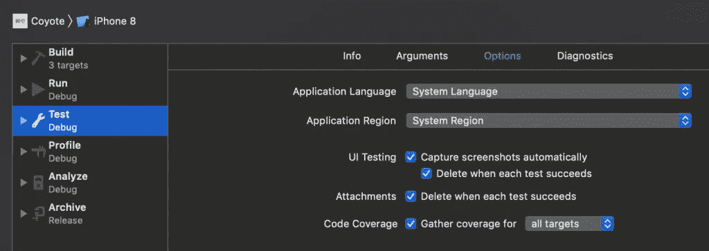
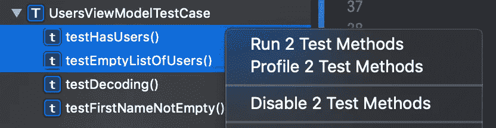
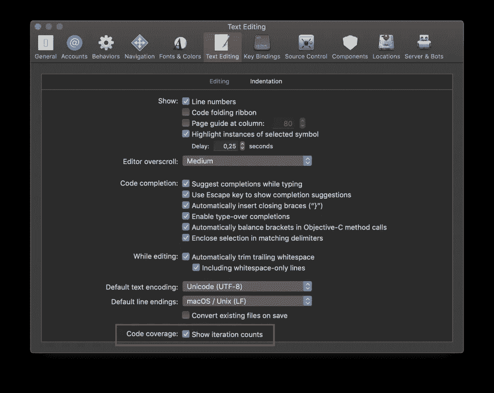
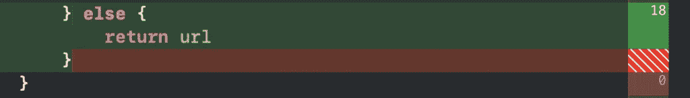

# Xcode 和 Swift 中的单元测试最佳实践

> 原文：<https://betterprogramming.pub/unit-test-best-practices-in-xcode-and-swift-bed60ba38c48>


由[马库斯·斯皮斯克](https://unsplash.com/@markusspiske)在 [Unsplash](https://unsplash.com/photos/VZnmCtD5KdI) 上拍摄的照片

编写单元测试和编写应用程序代码一样重要。当截止日期临近时，单元测试通常是第一个被跳过的。具有讽刺意味的是，这可能是项目最终放缓的原因。如果你已经写了很多单元测试来覆盖你的应用程序的大部分逻辑，一旦你的项目成长了，你会感谢你未来的自己。

这并不包括对内存泄漏的[测试](https://www.avanderlee.com/swift/memory-leaks-unit-tests/)或[编写共享扩展的 UI 测试](https://www.avanderlee.com/swift/ui-test-share-extension/)，而是主要关注编写更好的单元测试。我也将分享我的最佳实践，它帮助我开发更好更稳定的应用程序。

一旦你写好了测试，就该运行它们了。有了下面的建议，当那个时刻到来时，你会变得更有效率。

# 什么是单元测试？

单元测试是自动化测试，它运行并验证一段代码(称为*单元*)，以确保它的行为符合预期并符合其设计。

单元测试在 Xcode 中有自己的目标，并使用 [XCTest 框架](https://developer.apple.com/documentation/xctest)编写。`XCTestCase`的子类包含要运行的测试方法，其中只有以`test`开头的方法会被 Xcode 解析并可以运行。

```
/// A simple struct containing a list of users.
struct UsersViewModel {
    let users: [String]

    var hasUsers: Bool {
        return !users.isEmpty
    }
}

/// A test case to validate our logic inside the `UsersViewModel`.
final class UsersViewModelTests: XCTestCase {

    /// It should correctly reflect whether it has users.
    func testHasUsers() {
        let viewModel = UsersViewModel(users: ["Antoine", "Jaap", "Lady"])
        XCTAssertTrue(viewModel.hasUsers)
    }
}
```

# 编写单元测试时的心态

当编写高质量的单元测试时，你的心态是很重要的。有了一些基本原则，您就可以确保在编写您的应用程序最需要的测试时高效且专注。

## 您的测试代码和您的应用程序代码一样重要

在我们深入实际应用技巧之前，我首先想提一个重要的心态。就像编写应用程序代码一样，您应该尽力为测试编写高质量的代码。

考虑重用代码、使用协议、定义属性(如果它们在多个测试中使用),并确保您的测试清理所有创建的数据。这将使你的单元测试更容易维护，并防止奇怪的失败测试。

## 100%的代码覆盖率不应该是你的目标

虽然 100%的覆盖率是一个很大的目标，但是它不应该是你写测试的主要目标。确保首先至少测试您最重要的业务逻辑，因为这已经是一个很好的开始。达到 100%可能相当耗时，而且好处并不总是那么大。事实上，要达到 100%可能需要很大的努力。

最重要的是，100%的覆盖率可能会产生误导。上面的单元测试例子有 100%的覆盖率，因为它达到了所有的方法。然而，它没有测试所有的场景——它只测试了一个非空数组，也可能有一个空数组的场景，其中`hasUsers`属性应该返回 false。



可以通过编辑您的方案来启用单元测试代码覆盖率

## 在修复 bug 之前写一个测试

跳到一个 bug 上并尽快修复它是很有诱惑力的。虽然这很好，但如果您能防止将来再次出现同样的错误，那就更好了。

通过在修复 bug 之前编写单元测试，您可以确保相同的 bug 不会再次发生。将其视为测试驱动的错误修复，从现在开始被称为 TDBF。

# 用 Swift 编写单元测试

既然你已经有了正确的心态，那么是时候实际回顾一下用 Swift 编写单元测试的一些技巧了。

有多种方法可以测试相同的结果，但是当测试失败时，它们并不总是给出相同的反馈。以下提示将帮助您编写测试，这对您作为开发人员是有帮助的。

## 命名测试用例及方法

给你的测试用例和方法起一个好名字有助于你快速识别失败的测试。此外，它还帮助您探索您是否已经测试了某个场景或某段代码。

为了容易地找到某个类的测试用例，建议使用相同的命名和“测试”我们在上面的例子中做到了这一点，在这个例子中，我们根据`UsersViewModel`命名来命名`UsersViewModelTests`。

## 不要对任何事情都使用 XCTAssert

以下代码行测试了完全相同的结果:

```
func testEmptyListOfUsers() {
    let viewModel = UsersViewModel(users: ["Ed", "Edd", "Eddy"])
    XCTAssert(viewModel.users.count == 0)
    XCTAssertTrue(viewModel.users.count == 0)
    XCTAssertEqual(viewModel.users.count, 0)
}
```

如您所见，该方法正在测试一个空的用户列表。然而，我们定义的视图模型不是空的，因此，所有断言都失败了。

结果显示了为什么对验证类型使用正确的断言很重要。`XCTAssertEqual`方法为我们提供了更多关于断言失败原因的上下文。这不仅显示在红色错误中，还显示在控制台日志中，这有助于您更快地识别失败的测试。

## 安装和拆卸

在多个测试方法中使用的参数可以被定义为测试用例类中的属性。您可以使用`setUp()`方法来设置每个测试方法的初始状态，并使用`tearDown()`方法来清除。

苹果有一些关于这些方法的很棒的[文档](https://developer.apple.com/documentation/xctest/xctestcase/understanding_setup_and_teardown_for_test_methods)，可以帮助你理解如何正确地使用它们。

**提示:**您还可以向设置和拆卸方法中添加断言，使它们在每个测试中运行。

## 投掷方法

就像写应用程序代码的时候，你也可以定义一个抛出测试方法。这允许您在测试中的方法抛出错误时使测试失败。

```
func testDecoding() throws {
    /// When the Data initializer is throwing an error, the test will fail.
    let jsonData = try Data(contentsOf: URL(string: "user.json")!)

    /// The `XCTAssertNoThrow` can be used to get extra context about the throw
    XCTAssertNoThrow(try JSONDecoder().decode(User.self, from: jsonData))
}
```

当在任何进一步的测试执行中不需要抛出方法的结果时，可以使用`XCTAssertNoThrow`方法。

确保检查相反的`XCTAssertThrowsError`方法，以匹配预期的错误类型。

## 展开可选值

Xcode 11 中的新特性是`XCTUnwrap`方法，它最适合用在抛出测试方法中，因为它是一个抛出断言。

```
func testFirstNameNotEmpty() throws {
    let viewModel = UsersViewModel(users: ["Antoine", "Maaike", "Jaap"])

    let firstName =  try XCTUnwrap(viewModel.users.first)
    XCTAssertFalse(firstName.isEmpty)
}
```

`XCTUnwrap`断言可选变量的值不是`nil`，如果断言成功，则返回其值。它阻止你编写一个`XCTAssertNotNil`结合解包或者处理剩余测试代码的条件链接。

# 在 Xcode 中运行单元测试

一旦你写好了测试，就该运行它们了。

## 重新运行最新测试

使用
`⌃ Control + ⌥ Option + ⌘ Command + G`再次运行您最后一次运行的测试。

## 运行组合测试

使用 CTRL 或 SHIFT 键选择您想要运行的测试，右键单击并选择“运行 X 测试方法”



一次运行多个单元测试

## 在测试导航器中应用过滤器

test navigator 底部的过滤栏允许您缩小测试概述的范围。


测试导航器过滤栏

*   使用搜索字段根据名称搜索特定测试
*   仅显示当前所选方案的测试(如果您有多个测试方案，这很有用)
*   仅显示失败的测试(这将帮助您快速找到失败的测试)

## 在侧边栏中启用覆盖



显示测试覆盖率迭代计数

显示测试迭代计数可以向您显示在最后一次运行测试期间是否命中了某段代码。



测试覆盖率以内联方式显示

它显示迭代的次数(在上面的例子中是 18 次),当达到次数时，一段代码变成绿色。当一段代码为红色时，意味着它在最后一次运行测试中没有被覆盖。

# 结论

如您所见，您可以做很多事情来使编写单元测试变得更加容易。改变心态，使用正确的设置，不要到处使用`XCTAssert`。

谢谢！