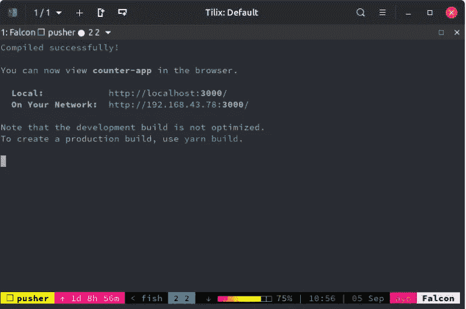
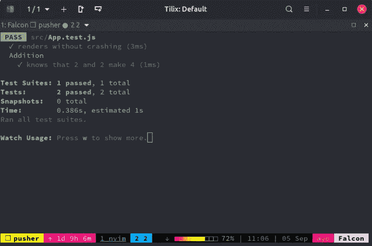
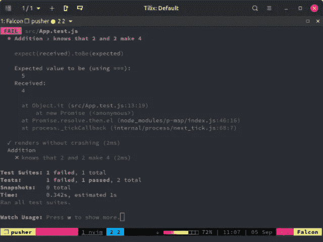
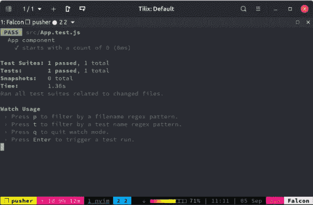
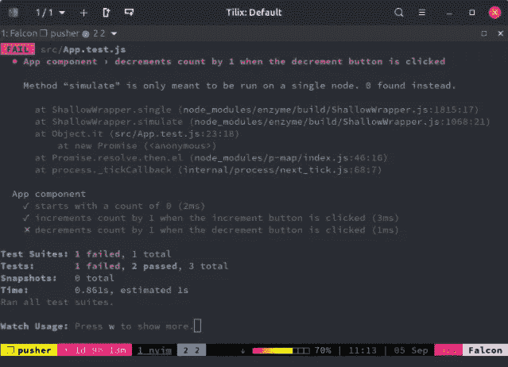
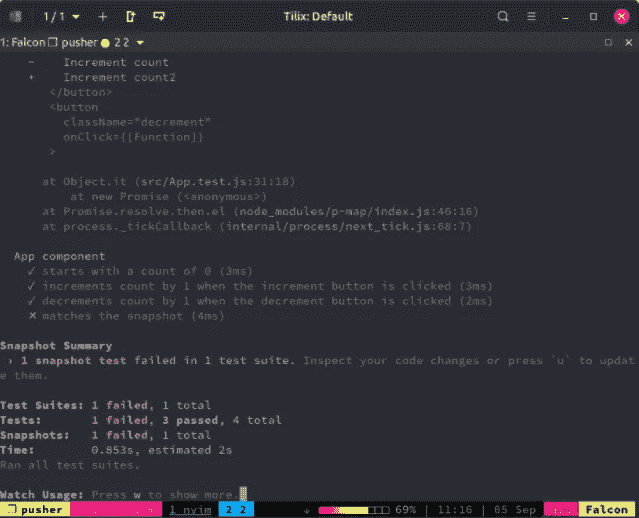

# 用 Jest 和 Enzyme 进行单元测试反应应用

> 原文：<https://betterprogramming.pub/unit-test-react-applications-with-jest-and-enzyme-7c076c2abfb0>

## 创建健壮的 React 应用程序


照片由[替代代码](https://unsplash.com/@altumcode?utm_source=medium&utm_medium=referral)在 [Unsplash](https://unsplash.com?utm_source=medium&utm_medium=referral) 上拍摄

大家好！

今天，我将教你如何用 Jest 和 Enzyme 对 react 应用程序进行单元测试。

编写自动化测试在任何现实世界的项目中都非常重要，但是众所周知它很难弄清楚，尤其是在前端世界。

Jest 是来自脸书的一个测试工具，它使得用 JavaScript 执行单元测试变得很容易。另一方面，酶具有反应特异性。它提供了一系列有用的方法来增强我们测试 React 组件的方式。

让我们看看如何利用 Jest 和 Enzyme 来创建更健壮的 React 应用程序。

# 先决条件

要完成本教程，您需要在您的机器上安装 [Node.js](https://nodejs.org/en/download/) (v6 和更高版本)和 [npm](https://www.npmjs.com/get-npm) 。你还需要安装`yarn`，因为那是`create-react-app`使用的。

```
npm install -g yarn
```

# 设置 React 应用程序

在编写任何测试之前，我们需要创建一个可以测试的应用程序。我们将创建一个简单的计数器应用程序，一旦点击一个按钮，它就会增加计数。让我们用 [create-react-app](https://github.com/facebook/create-react-app) 来启动这个项目，这样我们就可以以最小的忙乱开始运行了。

在您的终端中运行以下命令来安装`create-react-app`:

```
npm install -g create-react-app
```

然后使用以下命令创建 React 应用程序:

```
create-react-app counter-app
```

一旦应用程序被创建，进入`counter-app`目录并运行`yarn start`来启动开发服务器。您应该会看到一条消息，确认编译成功以及可以访问应用程序的端口。



现在，在您喜欢的文本编辑器中打开`counter-app`文件夹并找到`src/App.js`。将其内容更改为如下所示:

```
*// src/App.js*

    import React, { Component } from 'react';

    class App extends Component {
      constructor() {
        super();
        this.state = {
          count: 0,
        }
      }

      makeIncrementer = amount => () =>
        this.setState(prevState => ({
          count: prevState.count + amount,
        }));

      increment = this.makeIncrementer(1);

      render() {
        return (
          <div>
            <p>Count: {this.state.count}</p>
            <button className="increment" onClick={this.increment}>Increment count</button>
          </div>
        )
      }
    }

    export default App;
```

我们的 React 应用程序有一些初始状态`count`，它被设置为零，还有一个按钮，一旦被点击，它通过`increment`函数增加这个`count`状态，这个函数简单地将`count`的值加 1 并更新应用程序状态。

# 笑话基础

通常，我们需要在编写任何测试之前安装和配置 Jest，但是由于`create-react-app`已经安装了 Jest，我们不需要做任何事情。我们可以直接开始编写我们的第一个测试。

如果你看一下`src/App.test.js`，你会发现一个测试已经为我们写好了。它测试应用程序组件可以在不崩溃的情况下呈现。

```
*// src/App.test.js*

    import React from 'react';
    import ReactDOM from 'react-dom';
    import App from './App';

    it('renders without crashing', () => {
      const div = document.createElement('div');
      ReactDOM.render(<App />, div);
      ReactDOM.unmountComponentAtNode(div);
    });
```

让我们在`App.test.js`的这个下面增加一个模拟测试:

```
*// src/App.test.js*

    ...

    describe('Addition', () => {
      it('knows that 2 and 2 make 4', () => {
        expect(2 + 2).toBe(4);
      });
    });
```

我们可以继续使用运行`jest`的`yarn test`命令来运行这两个测试。屏幕上应该会打印出一条成功消息:



现在，让我们更改其中一个测试，使其失败。在`src/App.test.js`内，将`Addition`测试更改为如下所示:

```
*// src/App.test.js*

    describe('Addition', () => {
      it('knows that 2 and 2 make 4', () => {
        expect(2 + 2).toBe(5);
      });
    });
```

检查您的终端输出。您可以看到第一个测试像以前一样通过了，而第二个测试失败了，失败的原因也被打印出来。



一个`describe()`函数将相关的测试组合在一个测试套件中。它带有一个`name`参数，该参数应该描述您正在测试的组件，以及一个回调函数，其中用`it`定义了各个测试。

您可能会在一些项目中看到带有`test`的单独测试。可以肯定的是，`it`和`test`是[同一个东西](https://jestjs.io/docs/en/api.html#testname-fn-timeout)。`it`只是`test`的别名。

```
*// src/App.test.js*

    describe('Addition', () => {
      it('knows that 2 and 2 make 4', () => {
        expect(2 + 2).toBe(4);
      });

      *// is equaivalent to*

      test('knows that 2 and 2 make 4', () => {
        expect(2 + 2).toBe(4);
      });
    });
```

在调用所谓的“匹配器”函数之前，您想要测试的内容被包装在对`expect()`函数的调用中。在上面的例子中，`toBe()`是使用的 matcher 函数。它检查提供的值是否等于`expect()`函数中的代码产生的值。

# 编写您的第一个测试

在我们开始编写自己的测试之前，我们需要向我们的应用程序添加几个包，以便它能够通过 Enzyme 的浅层渲染器进行测试:

```
yarn add enzyme enzyme-adapter-react-16 --dev
```

Enzyme 旨在支持不同版本的 React。在本教程中，我使用的是 React 16 . 4 . 2 的稳定版本，但您可能会使用 React 的旧版本，比如 React 15.x。因此您还必须安装与您正在使用的 React 版本相对应的适配器。

您还需要在您的`src`文件夹中创建一个`setupTests.js`文件，告诉 Jest 和 Enzyme 您将使用哪些适配器。`create-react-app`已被配置为在我们的任何测试之前自动运行该文件，以便正确设置酶。

```
*// src/setupTests.js*

    import { configure } from 'enzyme';
    import Adapter from 'enzyme-adapter-react-16';

    configure({ adapter: new Adapter() });
```

现在，可以开始为我们的应用程序编写测试了。跳转到`src/App.test.js`,将其内容更改如下:

```
*// src/App.test.js*

    import React from 'react';
    import { shallow } from 'enzyme';
    import App from './App';

    describe('App component', () => {
      it('starts with a count of 0', () => {
        const wrapper = shallow(<App />);
        const text = wrapper.find('p').text();
        expect(text).toEqual('Count: 0');
      });
    });
```

我们正在利用 Enzyme 的浅层渲染来测试我们的应用程序的初始状态。浅层呈现是不需要 DOM 的组件树的模拟呈现。它只呈现组件的一个层次，并支持组件内容的检查以及用户交互的模拟。

在上面的代码片段中，我们的`App`组件的浅层渲染存储在`wrapper`变量中。然后，我们获取组件输出中的`p`标签内的文本，并检查该文本是否与我们传递给`toEqual`匹配器函数的文本相同。



# 测试用户交互

让我们继续编写一个新的测试，模拟点击按钮并确认计数输出增加 1。

将此添加到第一个测试下面:

```
*// src/App.test.js*

    describe('App component', () => {
      ...

      it('increments count by 1 when the increment button is clicked', () => {
        const wrapper = shallow(<App />);
        const incrementBtn = wrapper.find('button.increment');
        incrementBtn.simulate('click');
        const text = wrapper.find('p').text();
        expect(text).toEqual('Count: 1');
      });
    });
```

变量`button`上的`simulate()`函数可以模拟一个元素上的多个 DOM 事件。这里我们模拟按钮上的`click`事件。我们还设置了一个期望值，即`count`应该等于 now。

如果您检查终端输出，您应该观察到测试按预期通过。

让我们继续做一些不同的事情。我们将为一些尚不存在的功能添加一个测试，然后继续编写代码使测试通过。这种在编写代码之前编写测试的方法被称为测试驱动开发(TDD)。

在`describe()`函数中创建另一个测试，如下所示:

```
*// src/App.test.js*

    describe('App component', () => {
      ...

      it('decrements count by 1 when the decrement button is clicked', () => {
        const wrapper = shallow(<App />);
        const decrementBtn = wrapper.find('button.decrement');
        decrementBtn.simulate('click');
        const text = wrapper.find('p').text();
        expect(text).toEqual('Count: -1');
      });
    });
```

现在您应该在终端中有一个失败的测试:`Method` `"``simulate``"` `is only meant to be run on a single node. 0 found instead`。如果您不习惯使用 Enzyme，您可能会发现这个错误消息相当神秘。这意味着在一个尚不存在的元素上调用了`simulate()`方法。



现在让我们进入 React 组件，并编写将修复该测试的代码:

```
*// src/App.js*

    import React, { Component } from 'react';

    class App extends Component {
      constructor() {
        super();
        this.state = {
          count: 0,
        }
      }

      makeIncrementer = amount => () =>
        this.setState(prevState => ({
          count: prevState.count + amount,
        }));

      increment = this.makeIncrementer(1);

      decrement = this.makeIncrementer(-1);

      render() {
        return (
          <div>
            <p>Count: {this.state.count}</p>
            <button className="increment" onClick={this.increment}>Increment count</button>
            <button className="decrement" onClick={this.decrement}>Decrement count</button>
          </div>
        )
      }
    }

    export default App;
```

我们在`render()`函数中的增量按钮后添加了一个减量按钮，并添加了一个`decrement()`函数，用于将`count`的值减 1 并更新应用程序状态。此时，所有三个测试都应该成功通过。

# 用快照测试 React 组件

快照测试有助于您检查组件的呈现输出是否始终正确。当您运行快照测试时，Jest 呈现正在测试的 React 组件，并将输出存储在一个 JSON 文件中。

在进一步的测试运行中，Jest 将检查组件的输出没有偏离之前保存的内容。如果您更改了组件的输出，Jest 会通知您，您可以将快照更新到最新版本，或者修复组件，使其再次匹配快照。这种测试组件的方法可以帮助您避免组件的意外更改，因为 Jest 会在检测到差异时通知您。

要使用 Jest 的快照功能，我们需要一个额外的包， [react-test-renderer](https://www.npmjs.com/package/react-test-renderer) ，它可以通过 yarn 安装:

```
yarn add react-test-renderer --dev
```

然后在`App.test.js`顶部导入:

```
*// src/App.test.js*

    import renderer from 'react-test-renderer';

    ...
```

接下来，在所有先前创建的测试下创建一个测试:

```
*// src/App.test.js*

    it('matches the snapshot', () => {
      const tree = renderer.create(<App />).toJSON();
      expect(tree).toMatchSnapshot();
    });
```

第一次运行这个测试时，这个组件没有快照，所以 Jest 创建了它。您可以检查`src/__snapshots__`目录中快照的内容。

打开`App.test.js.snap`:

```
// src/__snapshots__/App.test.js.snap

    // Jest Snapshot v1, https://goo.gl/fbAQLP

    exports[`App component matches the snapshot 1`] = `
    <div>
      <p>
        Count: 
        0
      </p>
      <button
        className="increment"
        onClick={[Function]}
      >
        Increment count
      </button>
      <button
        className="decrement"
        onClick={[Function]}
      >
        Decrement count
      </button>
    </div>
    `;
```

您可以看到`App`组件的渲染输出保存在这个文件中。下次运行这个测试时，Jest 将确认输出是相同的。我们可以通过稍微改变`App`的渲染输出来演示这个概念。

让我们假设我们不小心把`App.js`中的增量按钮的文本改成了`**Increment count2**.`测试应该会失败。



因为我们不打算做这个改变，我们可以简单地撤销这个改变，测试将再次通过。

让我们对`App`组件做一个实际的修改。将增量按钮的文本改为`**Increment**`，将减量按钮改为`**Decrement**` **。**你的渲染函数应该是这样的:

```
*// src/App.js*

    render() {
      return (
        <div>
          <p>Count: {this.state.count}</p>
          <button className="increment" onClick={this.increment}>Increment</button>
          <button className="decrement" onClick={this.decrement}>Decrement</button>
        </div>
      )
    }
```

测试应该会再次失败。但是，由于我们实际上打算进行这种更改，我们需要将快照更新到这个最新版本。我们可以通过在运行测试的终端窗口中按下`u`来实现。一切又要变绿了！

我们已经了解了 Jest 如何使测试 React 组件变得更加容易，以及如何将它与 Enzyme 结合起来进行单元测试和快照测试。

你可以在 GitHub 上抓取本教程[中编写的所有代码，供你在本地检查和运行。](https://github.com/sbwengineer/react-jest-boilerplate)