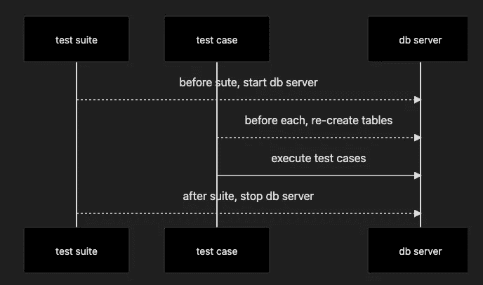
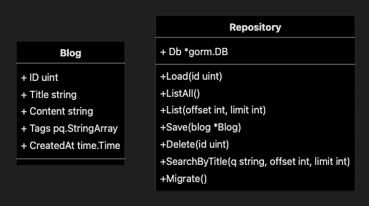

# 使用真实的数据库服务器对 GORM 应用程序进行单元测试

> 原文：<https://betterprogramming.pub/unit-testing-a-grom-application-with-a-real-db-server-81a1b95ad473>

## 通常，使用运行在 docker 中的 DB 服务器进行单元测试是比 Sqlmock 更好的选择


由[菲利斯](https://unsplash.com/@miniminion?utm_source=medium&utm_medium=referral)在 [Unsplash](https://unsplash.com?utm_source=medium&utm_medium=referral) 上拍摄的照片

大约两年前，我写了一篇[文章](/how-to-unit-test-a-gorm-application-with-sqlmock-97ee73e36526)，讨论如何用 Sqlmock 测试 GORM 应用程序。

时光飞逝，我意识到大多数开发人员并没有采用这种方法(至少在我的团队中)。使用 Sqlmock 编写测试用例太复杂，难以上手。

核心问题是您需要手动编写整个 SQL 片段，然后将其与 GORM 的输出进行比较。这种工作量已经远远超过了编写要测试的代码。毕竟，我们使用 GORM 的原因是为了避免手工编写原始 SQL。

我们需要找到更好的方法。

# 改进单元测试过程

一般来说，测试数据库应用程序是困难的。主要原因是数据库服务器本身。

*   如果开发团队共享远程数据库服务器，那么数据冲突是不可避免的。
*   如果我们在这个数据库服务器上为每个开发人员创建帐户，那么单元测试应该用不同的帐户运行。需要有人来维护这些账户。
*   如果我们要求每个开发人员在他们的本地工作站上安装和设置数据库服务器，我们增加了设置开发环境的难度。

似乎没有答案就足够好了。但是如果我们可以用 docker 在本地运行数据库服务器，并且用 docker 集成测试用例，那就完美了。

下图流程:

1.  在每个测试套件之前，用 docker 启动一个数据库服务器。打开到此服务器的 GORM 连接
2.  在每个测试用例运行之前，如果需要的话，清除数据库中的数据并重新创建表格
3.  运行所有测试用例
4.  测试套件执行后停止数据库服务器



单元测试的顺序图

理论上，我们可以用命令行控制 docker 守护进程。但是在 [dockertest](https://github.com/ory/dockertest) 的帮助下，这个目标可以轻松实现。

# Docker 中针对数据库服务器的单元测试

这里有一个分步教程，用一个运行在 docker 中的真实数据库服务器对 GORM 应用程序进行单元测试。

我们将重用上一篇文章中的示例应用程序。你可以在 [Github](https://github.com/dche423/dbtest) 上找到源代码。



类图

在本文中，我们以 Postgres 为例，但它也适用于任何其他数据库。

## **设置测试套件**

根据顺序图，我们做一系列准备工作:

*   在`BeforeSuite`中，我们创建了一个`*gorm.DB`的实例和一个清理 docker 资源的函数。功能`setupGormWithDocker`将在后面解释
*   在`AfterSuite`中，我们调用`cleanupDocker`来释放 docker 相关资源。
*   在`BeforeEach`中，我们删除默认模式，然后重新创建它，以确保数据库在每个测试用例运行之前是干净的和准备好的。

下面是对核心功能`setupGormWithDocker`的解释:

*   用`dockertest.NewPool`创建一个 docker 资源池，用于运行 docker 容器
*   用`dockertest.RunOptions`指定图像名称、图像版本和环境变量
*   `fnConfig`是控制引导策略的功能。在这种情况下，我们需要 docker 容器在停止后自动移除，并且永远不要自动重启
*   我们使用`pool.RunWithOptions`运行容器，然后创建清理函数`fnCleanup.`
*   因为启动容器需要一些时间，所以我们需要等到容器准备好。只有在这之后，我们才能返回`*gorm.DB`实例。这里，`pool.Retry`来救援了。`pool.Retry`将重复执行参数函数，直到函数返回`nil`(表示容器准备好)

## **建筑测试案例**

通过测试套件中的准备工作，我们可以获得一个可用的`*gorm.DB`实例，连接到一个本地数据库服务器，并且数据库将在每个测试用例执行之前被清空。

*   在`BeforeEach`中，我们为测试创建了一个`Repository`的实例。调用`repo.Migrate`自动创建表格，然后创建示例博客数据。
*   测试用例非常直观。我们调用 repo 方法，并验证是否返回了预期的结果。这里没有模拟，因为我们使用的是真正的数据库服务器。
*   与 Sqlmock 相比，不需要手动编写原始 SQL，我们可以用不到一百行代码完成整个测试用例。

# 其他值得注意的事项

*   dockertest 将在必要时提取图像，但没有下载进度提示。我们的建议是在第一次运行测试用例之前运行`docker pull postgres:14`。
*   运行测试套件可能需要几秒钟，因为我们需要启动 Postgres 数据库服务器。这可能比大多数内存中的单元测试要慢，但是这是可以接受的。
*   在`pool.Retry`期间，会输出一些连接错误。如果你不喜欢这种干扰，通过`&gorm.Config{Logger: logger.Default.LogMode(logger.Silent)}`到`gorm.Open`关闭日志
*   您的应用程序可能依赖于某个 [Postgres 扩展](https://wiki.postgresql.org/wiki/Extensions)。在这种情况下，您可以用自定义的 Postgres 图像替换标准的 Postgres 图像。例如，如果你需要 [postgres all](https://github.com/citusdata/postgresql-hll) ，你可以使用这个 [docker 镜像](https://github.com/vishnudxb/docker-postgres-hll)

# 结论

*   在真实的数据库服务器上测试 GORM 应用程序具有巨大的优势。
*   在`dockertest`的帮助下，本地 docker 容器可以无缝地与 golang 单元测试一起工作。
*   与`Sqlmock`不同，所有的数据库逻辑都运行在真实的数据库服务器上，不需要任何模仿，测试用例也大大简化了。
*   现在还有坚持使用 Sqlmock 的理由吗？
*   完整的源代码，请访问它的[库](https://github.com/dche423/dbtest)。

干杯！

# 资源

[如何用 Sqlmock 对 GORM 应用进行单元测试](/how-to-unit-test-a-gorm-application-with-sqlmock-97ee73e36526)。

```
**Want to Connect?**Follow me on [Twitter](https://twitter.com/dche423).
```