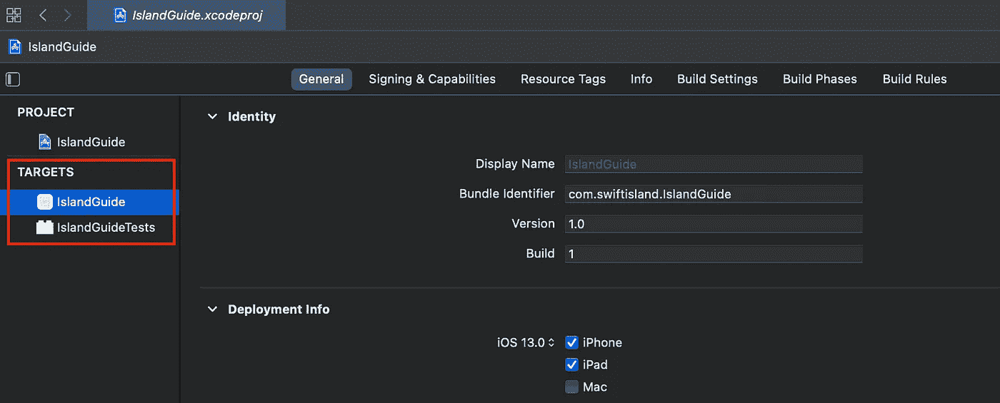
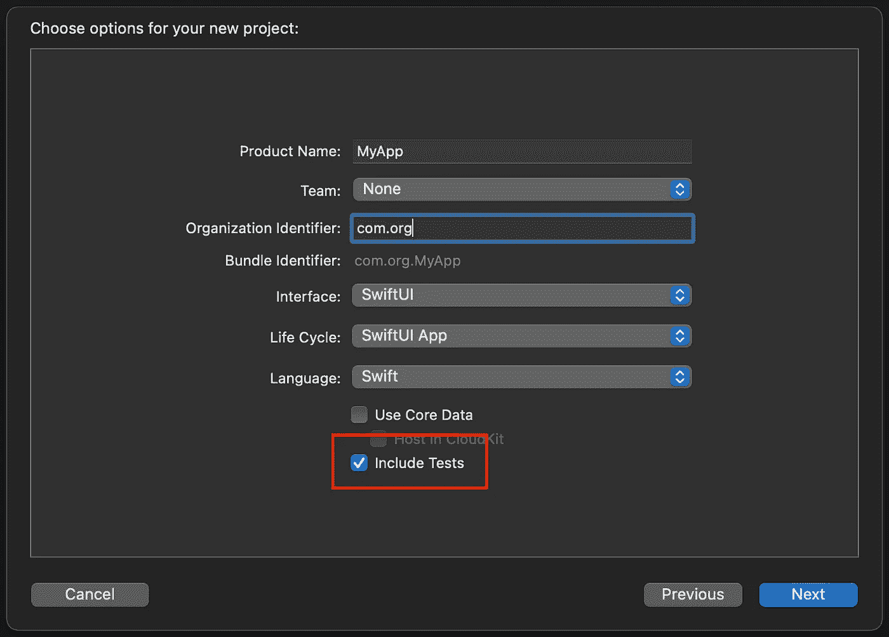

# iOS 中的单元测试——从哪里开始的实用指南

> 原文：<https://betterprogramming.pub/unit-testing-in-ios-the-pragmatic-guide-on-where-to-start-4d1718bdbfa>

## 所以你决定开始对你的应用程序代码进行单元测试。如果您对如何实现它感到不确定，那么这篇文章就是为您准备的

图片由[agency followeb](https://unsplash.com/@olloweb?utm_source=unsplash&utm_medium=referral&utm_content=creditCopyText)在 [Unsplash](https://unsplash.com/s/photos/start-learning?utm_source=unsplash&utm_medium=referral&utm_content=creditCopyText) 上拍摄。

在本文中，我将讨论在测试之旅开始时出现的真正问题。你会得到一些实用的建议，告诉你如何按照自己的步调更自信地向前迭代。

请继续阅读，了解:

*   从零开始向前迭代
*   为测试配置项目
*   何时、何地以及如何运行测试
*   是*测试*还是*单元测试*？
*   我们必须使用 TDD 吗？
*   挑选要测试的内容
*   测试不可测试的

有很多很好的资源可以学习测试。您可以了解许多主题:

*   不同种类的测试(单元测试、集成测试、端到端测试、UI 测试)
*   如何以及何时运行它们
*   如何用 XCTest 编写测试
*   您可以使用的第三方框架
*   不同的技术，如 TDD
*   如何从测试计划中获益
*   如何利用生成的测试结果
*   等等

同时，你可能会觉得你的代码不容易测试。您可能想知道这是否是将您的项目重构为更易测试的架构的好时机。你甚至会感到必须测试所有代码的压力。

弄清楚*实际上从哪里开始*会很困难，甚至让人不知所措。但事实是你不需要事先学会所有的知识。

所以让我来帮你开始吧。

# 从零开始，迭代

自动化项目测试是一个迭代的过程。我们从没有测试开始，然后一点一点地添加一些测试——或者针对现有代码，或者与新编写的代码一起添加。随着时间的推移，测试代码的数量会增加。最终，很大一部分代码会被测试，尽管通常需要一段时间。

但是如果我告诉你即使零测试也能给你的项目带来价值呢？

没错。当我们在没有测试的情况下运行测试套件时，我们已经验证了项目可以编译，并且应用程序在启动时不会立即崩溃(尽管它只适用于测试应用程序，而不是框架)。

例如，在每次提交之前运行测试可以避免您意外提交一个甚至不能编译的版本。

从那以后只会变得更好。每一个新的测试都会验证代码中的一个微小路径——不仅是为了生成结果的正确性，也是为了它不会使应用程序崩溃或挂起。

不要担心测试速度太慢。任何数量(和种类)的测试都比没有好。

# 为测试配置项目

因此，要开始从测试中获益，您需要做的就是准备好测试基础设施。从那里，您可以继续学习所有关于测试的知识，尝试不同类型的测试，等等。添加新的测试只是添加一个新的测试用例类或者一个新的功能。我们将在下面讨论这个问题。

测试是应用项目的一部分，但不是应用本身的一部分。测试存在于一个单独的目标中。目标指定要构建的产品，如 iOS、watchOS、macOS 应用程序、扩展、框架、测试套件或 UI 测试套件。一个项目可以有多种类型的目标。

如果您正在使用由 Swift Package Manager 创建的框架，目标将通过`Package.swift`文件进行配置。SPM 框架也可以有多个测试套件。下面，我们将重点放在配置应用程序项目上，但是如果你想了解如何创建一个包含测试的 Swift 包，请查看[这篇文章](https://www.avanderlee.com/swift/creating-swift-package-manager-framework/)。

## 向项目中添加测试目标

当您创建一个新项目时，选中“Include Tests”框，这样测试目标就会自动创建。

如果您有一个预先存在的代码库，只需点击几下鼠标就可以添加一个测试目标。[这个免费的指南](https://openclassrooms.com/en/courses/4554386-enhance-an-existing-app-using-test-driven-development/5095691-create-your-first-test)展示了如何给一个项目添加一个新的测试目标(我和付费课程没有关系)。

## 管理损坏的测试目标

如果项目中已经有了一个测试目标，但是它无法编译或者许多测试都失败了，那么还有一条路可以走。如果只有几个错误，请尝试修复它们。

修复旧的测试目标可能是一个更大的任务，您可能无法在它上面花费所需的时间。在这种情况下，我的建议是在项目中创建一个新的测试目标。

一个项目中可以有多个测试目标。在目标之间移动测试用例类(文件)很容易，并且您可以在以后将所有的测试合并到一个目标中。这不应该阻止你现在开始添加新的测试！

为了防止新创建的测试目标被放弃和破坏，请确保测试保持最新并定期执行。阅读下一节，了解如何操作。

# 何时、何地以及如何运行测试

测试可以在本地或远程机器上运行。远程机器通常由 CI(持续集成)系统管理。机器从源代码控制系统中提取代码，执行测试，并报告结果。不是所有的 CI 系统都提供 macOS 机器，但是很多都提供:GitHub Actions，CircleCI，Bitrise，Travis CI。一些 CI 系统，如 Jenkins，允许您连接自己的物理机器，但这是一个高级主题，我们不在这里讨论。很快， [Xcode Cloud](https://developer.apple.com/documentation/Xcode/About-Continuous-Integration-and-Delivery-with-Xcode-Cloud) 将允许从 Xcode 内部触发云中测试的执行。

有几种方法可以运行测试套件。您可以手动或通过命令行运行测试。借助内置的`xcodebuild test`命令或全能的[快速通道](https://docs.fastlane.tools/getting-started/ios/running-tests/)，可以通过命令行执行一个测试套件。通常，您只需要在通过 CI 系统远程执行测试时使用命令行工具。

*when* 也有多种选择:您可以按需手动运行(基本上只要您记得这么做)，在合并一个特性分支之前，在每个 pull 请求时(如果您练习过的话)，甚至在每次提交之前或之后。

当您刚开始测试时，您可以使用测试操作在 Xcode 中手动触发测试。

对于长期运行的项目，甚至对于单独的开发人员来说，最佳的设置是为每个合并创建一个拉请求，并通过 CI 系统自动对每个拉请求执行测试。这样，很容易回滚到上一个工作版本，并且当测试在云中运行时，您可以在其他地方工作。如果你已经在 GitHub 上托管了你的代码，GitHub Actions 是最简单的选择。

如果学习如何配置 CI 系统不是您的首要任务之一(这完全没问题)，我建议在将您的更改推送到远程之前，或者至少在合并分支之前，在本地运行测试。

*要开始使用 GitHub 动作，我推荐这本初学者友好的简短设置指南:* [*创建基本的 GitHub 动作，以便用 Xcode*](https://dev.to/ezra_black_/creating-basic-github-actions-for-testing-xcode-40ld) *进行测试。*

# 是测试还是单元测试？

术语*测试*描述了验证软件正确性的过程。然后我们区分自动化测试和手工测试。

*单元测试*是一种自动测试，它验证代码的单个单元实现的正确性——比如类、结构或函数。如果我们只有单元测试，我们必须相信*单元*被正确地组合在一起，以制作一个功能正常的应用程序。

*集成测试*验证各单元是否正常工作。*端到端测试*是更高级别的自动化测试，它从整体上验证系统，包括服务器端连接。 *UI 测试*验证 app 的界面。

这就是所谓的*测试金字塔*。来源:[测试部](https://www.ministryoftesting.com/dojo/lessons/the-mobile-test-pyramid)

我们用 XCTest 框架通过创建`XCTestCase`子类来编写所有这四种测试类型。编写 UI 测试需要我们使用一个特殊的`XCUIApplication` API 来与应用程序本身进行交互，但是其余的测试类型都是以同样的方式编码的。区别是非常语义化的:根据你测试的代码的哪一部分，你称之为单元、集成或端到端测试。

单元测试很小，一个测试目标通常有很多单元测试。最常见的情况是，单元测试构成了测试套件的大部分。因此，词语*测试*和*单元测试*有时可以互换使用。

*如果你想了解更多关于这些不同种类的测试，请查看* [*苹果的 Xcode*](https://developer.apple.com/documentation/xcode/testing-your-apps-in-xcode) *应用测试指南。要了解更多关于用 XCTest 编写断言的知识，* [*XCTest 的文档页面*](https://developer.apple.com/documentation/xctest) *是一个很好的起点。*

# 我们必须使用 TDD 吗？

TDD(测试驱动开发)是一种通常与单元测试相关联的方法。TDD 规定我们应该在编写实现之前*编写测试。*

一些人认为 TDD 是编写测试的一种真正方法。然而，在现实中，每个人的大脑都是不同的。编码是一个非常有创造性的过程，不同的人喜欢不同的方式来达到相同的结果。大多数实践测试的开发人员实际上大部分时间并不遵循 TDD。

让我提供一个简单的经验法则:如果你想让你的代码被测试覆盖，就致力于让代码与测试配对的*结果*。如何达到这一点是个人喜好。如果你实践拉请求——特别是在团队中——你可以承诺将测试和代码一起包含在每个 PR 中。

为了决定何时编写测试，尝试不同的方法，找出最适合你的方法。你可以在操场上画一个特性实现的草图，或者写/重写你的代码，想写多少次就写多少次，当你对特性感到满意的时候再写测试。或者首先根据实现的框架编写测试，并填充实际的逻辑以使测试通过。

将方法和模式视为灵感，并找到最适合您的流程、团队和项目的方法。

*如果你想了解更多关于 TDD 的基础知识，我发现 IBM 的这篇文章***是一个很好的资源。**

# *挑选要测试的内容*

*许多文章会告诉你应该测试代码库的哪些区域。但是你*必须*承诺对你*应该*做的所有事情进行单元测试吗？*

*绝对不行。正如我们上面所讨论的，有一些测试总比没有好。您可以根据您的偏好、优先级和截止日期来限制测试工作的范围。*

*以下是需要关注的三个方面:*

*   *对您的应用程序至关重要的逻辑*
*   *不太关键但模糊的逻辑，如果它被打破了，很难注意到*
*   *手动测试所有边缘案例既耗时又棘手的领域*

*这些领域的例子包括反序列化(解析)服务器响应、日期算法、自定义排序/过滤逻辑，以及保存和读回用户的本地数据。*

# *测试不可测试的*

*大多数常用的模式和架构都非常适合单元测试，而重构*将*让编写测试变得更加容易。MVVM、MVP 和依赖注入等模式是在考虑可测试性的情况下设计的。但是从单元测试开始，你绝对不需要做任何大的重构。*

*不管你认为你的代码有多不可测试，这里有一种方法*总是*有效:*

*   *将这段代码提取到助手类中一个完全独立的助手函数中。这样，代码就变得纯净了。纯代码没有副作用，只使用传入的参数，返回结果。纯代码不使用单例或全局变量。*
*   *在原来代码所在的地方用一行代码调用新函数。*
*   *新的助手函数可以进行单元测试。*

*即使剩余的代码仍然没有被测试覆盖，您也可以测试提取的函数。当然，您仍然可以以导致 bug 的方式调用函数，但是您降低了这种可能性。*

*这里有一个例子。假设我们有一个视图控制器类，其中有一个我们想要测试的逻辑:*

*您可以将这段逻辑提取到一个单独的纯函数中，并测试该函数:*

*调用`self.data = MyViewControllerHelper.sortData(self.data)`时能有多少 bug 潜入？不多。同时，我们可以确定排序逻辑按预期工作。*

*稍后，你可以把助手变成一个视图模型(你应该和 MVVM 一起去)。如果你已经对 MVVM 感到足够舒服了，那就马上开始吧。这是同时提高可测试性*和*你的应用架构的好方法。但是如果你还没有准备好进行大的重构，你仍然有办法开始测试你的代码。*

# *包扎*

*踏入未知的领域会让人不知所措。从不同的 assert APIs 到改进应用程序架构，再到配置 CI 系统，关于自动化测试有足够多的东西需要学习。*

*本文涵盖了设置测试基础设施、挑选要测试的内容、确定 TDD 是否适合您、理解不同类型的测试之间的差异，以及处理看似不可测试的代码。*

*我希望我的建议能让你对测试你的应用程序更有信心。*

*感谢阅读。我希望你喜欢这篇文章。*

*本文由作者在 NC SA 4.0 的 [CC 下授权。](http://creativecommons.org/licenses/by-nc-sa/4.0/)*

**原载于 2021 年 7 月 13 日***。***