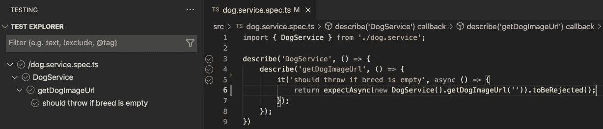

# 2023 年单元测试软件入门

> 原文：<https://betterprogramming.pub/unit-testing-software-in-2022-b3ac00962c65>

## 以荒唐的速度开发顶级软件


一个开发人员支持一个经过良好测试的存储库的图像(拉塞德西恩/[Shutterstock.com](http://shutterstock.com/)

除非你一生都生活在拇指插在耳朵里哼着[](https://www.youtube.com/watch?v=uZW4vbIstoo)*的日子里，否则你可能已经听说过测试你的软件有多重要。*

*如果你没有听说过测试软件很重要，你可能需要更好的朋友！*

*这篇文章将探讨测试软件的原因和方法，这样你就可以花更少的时间破坏东西，花更多的时间跳舞和交新朋友。*

*本文的配套资源库可以在[这里](https://github.com/bobbyg603/unit-testing-in-2022)找到。*

# *为什么我要写测试？*

*编写测试是应对不断增长的应用程序的复杂性的最佳方式。以下是为什么应该在应用程序中添加测试的一系列理由:*

*   *测试提供了关于代码实际如何工作的活文档，因此您不必依赖模糊的记忆和糟糕的假设。*
*   *编写测试需要编写可测试的代码，这鼓励良好的软件架构模式。*
*   *自动化测试的执行速度比同等的手动测试快几个数量级，并且可以添加到拉请求的自动化构建检查中，以确保贡献不会破坏现有的功能。*

*对任何新的贡献者来说，你能做的最好的事情就是向他们介绍一个架构良好、文档完善、测试良好的代码库。*

*一大套写得很好的测试可以快速准确地捕获代码行为的回归，允许团队有效地操作可有效伸缩的过程。*

# ***建立新项目***

*启动您选择的开发环境。本文将关注 VS 代码，但是任何合理的 IDE 都足够了。您还需要 Node.js。在撰写本文时，当前的 LTS 版本是 16.13.1。*

*首先，让我们初始化一个新的 Node.js 项目*

```
*npm init*
```

*让我们安装引导 TypeScript 项目所需的所有包。在本教程中，我们将使用 [Jasmine](https://jasmine.github.io) 测试框架。*

*我们的例子也将使用[节点获取](https://www.npmjs.com/package/node-fetch)。我不会在这里详细说明，但是节点模块可能会引起混乱，所以我们将在主版本 2 中保留节点获取。*

```
*npm i typescript ts-node jasmine @types/jasmine node-fetch@^2.0.0 @types/node-fetch@^2.0.0*
```

*我们来配置 Jasmine。在项目的根目录下创建一个文件`jasmine.json`。将以下内容粘贴到 JSON 文件中:*

```
*{
    "spec_dir": "src",
    "spec_files": ["**/*[sS]pec.ts"],
    "helpers": ["helpers/**/*.ts"],
    "random": true,
    "stopSpecOnExpectationFailure": true
}*
```

*我喜欢在他们测试的代码旁边定义测试，因此你会注意到`spec_folder`属性指向`src`，这也是我们放置源代码的地方。*

*将以下脚本添加到您的`package.json`文件中:*

```
*"scripts": {
    "test": "ts-node node_modules/jasmine/bin/jasmine --config=jasmine.json"
},*
```

*为了在 VS 代码测试浏览器 UI 中查看您的测试，您需要安装 [Jasmine 测试浏览器扩展](https://marketplace.visualstudio.com/items?itemName=hbenl.vscode-jasmine-test-adapter)。*

*一旦你安装了扩展，创建一个新的文件`.vscode/settings.json`，确保你创建了`.vscode`文件夹，如果它还不存在的话。*

*将以下内容粘贴到`settings.json`中，以便将 Jasmine 测试浏览器配置为使用我们的 TypeScript 设置:*

```
*{
    "testExplorer.useNativeTesting": true,
    "jasmineExplorer.config": "jasmine.json",
    "jasmineExplorer.nodeArgv": [
        "-r",
        "ts-node/register",
    ]
}*
```

# *如何编写测试？*

*在你写测试之前，你需要测试一些东西。让我们完成创建一个简单服务的练习，该服务返回一个 URL，该 URL 指向给定特定品种的狗的随机图像。*

*创建一个新文件`src/dog.service.ts`，并将下面的代码片段粘贴到该文件中:*

```
*import fetch from "node-fetch";
export class DogService {
    async getDogImageUrl(breed: string): Promise<string> {
        const response = await fetch(`https://dog.ceo/api/breed/${breed}/images/random`);
        const json = await response.json() as DogResponse;
        return json.message;
    }
}
export interface DogResponse {
    status: 'success' | 'error';
    message: string;
}*
```

*我们可能想要确保我们的函数不被传递一个空字符串，这似乎是合理的。让我们添加一个在品种字符串为空时抛出的保护。*

```
*import fetch from "node-fetch";
export class DogService {
    async getDogImageUrl(breed: string): Promise<string> {
        if (!breed) {
            throw new Error('Must specify a valid doggo!');
        }
        const response = await fetch(`https://dog.ceo/api/breed/${breed}/images/random`);
        const json = await response.json() as DogResponse;
        return json.message;
    }
}*
```

*让我们添加一个测试来练习 guard 子句。在`src`文件夹中创建一个文件`dog.service.spec.ts`。在新的等级库文件中粘贴以下内容:*

```
*import { DogService } from './dog.service';
describe('DogService', () => {
    describe('getDogImageUrl', () => {
        it('should throw if breed is empty', async () => {
            return expectAsync(new DogService().getDogImageUrl('')).toBeRejected();
        });
    });
});*
```

*这个测试应该显示在您的测试浏览器 UI 中。让我们运行它！*

**

*VS 代码测试资源管理器 UI*

*如果您右击列表中的一个测试并选择 **Debug Test** ，您还应该能够设置一个断点并在所需的行上停止调试器。*

# ***潜得更深***

*到目前为止，我们已经编写了一个非常简单的测试，让我们把它提高一个档次，探索一些更高级的概念。测试我们用包含我们传递给`getDogImageUrl`的品种的字符串调用 fetch 似乎是合理的。*

*测试我们是否正确地调用了`fetch`,需要我们稍微重新架构一下我们的函数。我们需要引入一个 seem，它允许我们用一个模拟的版本替换真实的 fetch 实现，这个版本允许我们检查 fetch 被调用的方式。使代码可测试的一个常见方法是引入依赖注入。*

*依赖注入有 3 种类型:构造函数、参数和属性注入。当对象中的大多数函数使用特定的依赖关系时，构造函数注入最有意义。当只有一个函数使用依赖项时，将依赖项作为参数注入到函数中是一个可接受的选择。第三种方法是使用属性注入。当一个类有一个很少需要替换的合理的默认依赖时，属性注入是有意义的。*

*在我们的例子中，构造函数注入是最有意义的，但是为了好玩，我们来看一下这三个例子。*

# ***创建一个伪实现***

*在开始我们的依赖注入示例之前，让我们创建一个假的实现，我们可以用它来验证周围的实现是否工作正常。*

*让我们给`dog.service.spec.ts`添加一个`beforeEach`块来配置一个 [Jasmine Spy](https://jasmine.github.io/tutorials/your_first_suite#section-Spies) 。间谍是可以跟踪它们被调用的方式，并返回预先配置的值的函数。我们的间谍将模拟来自 [dog.ceo](https://dog.ceo) API 的返回值。*

```
*let fetch: jasmine.Spy;
let message: string;
beforeEach(() => {
    const status = 'success';
    message = 'https://images.dog.ceo/breeds/pug/n02110958_12589.jpg';
    fetch = jasmine.createSpy();
    fetch.and.resolveTo({
        json: async() => ({
            status,
            message
        })
    });
});*
```

# ***构造函数注入***

*构造函数注入是最可取的方法，框架通常提供工具来简化这一过程。让我们修改`dog.service.ts`，这样我们就可以将我们的假获取实现注入到构造函数中。*

```
*import { RequestInfo, RequestInit, Response } from "node-fetch";
export class DogService {
    constructor(private _fetch: Fetch) { }
    async getDogImageUrl(breed: string): Promise<string> {
        if (!breed) {
            throw new Error('Must specify a valid doggo!');
        }

        const response = await this._fetch(`https://dog.ceo/api/breed/${breed}/images/random`);
        const json = await response.json() as DogResponse;
        return json.message;
    }
}
export type Fetch = (url: RequestInfo, init?: RequestInit) => Promise<Response>;*
```

*注意，我们为参数定义了一个接口。这个接口是从节点获取声明文件中复制的，所以我们的`DogService`类可以准确地指定它需要什么。*

*让我们写一个测试来验证我们在`getDogImageUrl`中正确地使用了 fetch:*

```
*it('should call fetch with url containing breed', async () => {
    const breed = 'pug';
    await new DogService(fetch).getDogImageUrl(breed);
    expect(fetch).toHaveBeenCalledWith(jasmine.stringMatching(/pug/));
});*
```

# ***参数注入***

*在某些情况下，通过函数参数注入依赖项可能是有意义的。下面是一个示例(您需要从构造函数注入示例中复制 Fetch 的类型声明):*

```
*async getDogImageUrl(fetch: Fetch, breed: string): Promise<string> {
    if (!breed) {
        throw new Error('Must specify a valid doggo!');
    }
    const response = await fetch(`https://dog.ceo/api/breed/${breed}/images/random`);
    const json = await response.json() as DogResponse;
    return json.message;
}*
```

*您的测试现在将如下所示:*

```
*it('should call fetch with url containing breed', async () => {
    const breed = 'pug';
    await new DogService().getDogImageUrl(fetch, breed);
    expect(fetch).toHaveBeenCalledWith(jasmine.stringMatching(/pug/));
});*
```

# ***物业注入***

*资产注入曾经是我远离的一种方法。有了 TypeScript，我改变了主意。如果你正在使用一个自动注入依赖项的框架，你应该总是在属性注入上使用它。让我们稍微尝试一下属性注入。*

```
*import fetch from 'node-fetch';
export class DogService {
    private _fetch: Fetch = fetch;
async getDogImageUrl(breed: string): Promise<string> {
        if (!breed) {
            throw new Error('Most specify a valid doggo!');
        }

        const response = await this._fetch(`https://dog.ceo/api/breed/${breed}/images/random`);
        const json = await response.json() as DogResponse;
        return json.message;
    }
}*
```

*你可能已经注意到了`_fetch`是私有的。这是故意的。这是因为在生产场景中，我们真的不想让任何人交换这种依赖性。我们通过将它设为私有来明确表示我们不打算让任何人覆盖这种依赖性。*

*TypeScript 允许我们做一些真正有趣的事情。下面的技巧是我建议你永远不要在产品代码中使用的。然而，出于测试的目的，这是一个合理的技巧:*

```
*it('should call fetch with url containing breed', async () => {
    const breed = 'pug';
    const service = new DogService();
    (service as any)._fetch = fetch;
    await service.getDogImageUrl(fetch, breed);
    expect(fetch).toHaveBeenCalledWith(jasmine.stringMatching(/pug/));
});*
```

*通过将我们的服务强制转换为`any`,我们能够消除关于访问私有属性的 TypeScript 警告，并仍然进行属性注入。您也可以使用一个公共属性，但这意味着您打算让消费者在产品代码中覆盖该属性，这在本例中没有多大意义。*

*本文概述了为什么您应该测试您的软件，并提供了如何开始的基本示例。*

```
***Want to Connect?**If you found the information in this tutorial useful please subscribe on [Medium](http://bobbyg603.medium.com), follow me on [GitHub](https://github.com/bobbyg603), and/or subscribe to my [YouTube](https://www.youtube.com/c/bobbyg603) channel.*
```