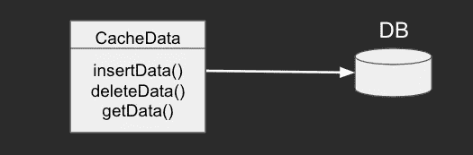
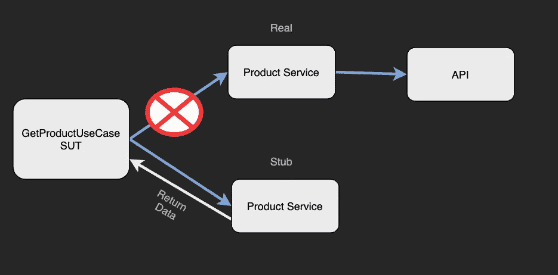
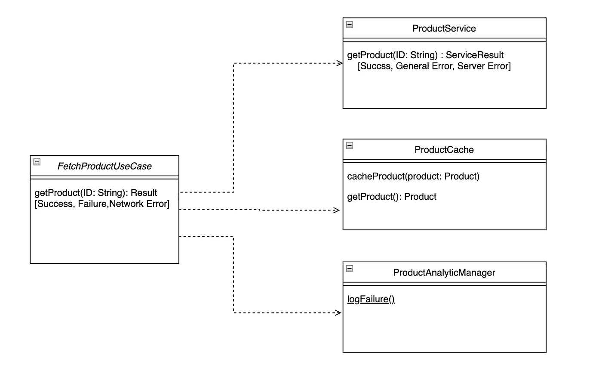

# 单元测试测试加倍并探索 Kotlin 中的模拟框架

> 原文：<https://betterprogramming.pub/unit-testing-test-doubles-and-the-mocking-framework-in-kotlin-4378fbb64d6a>

## 这个有用程序的深入指南

照片由 [Mari Helin](https://unsplash.com/@mari?utm_source=medium&utm_medium=referral) 在 [Unsplash](https://unsplash.com?utm_source=medium&utm_medium=referral) 上拍摄

如果你对单元测试一无所知，可以看看我之前的文章:[Android 单元测试基础](/android-unit-testing-basics-78a04a66124a)和 [Android 单元测试——选择命名约定和测试用例](/android-unit-testing-choosing-naming-convention-and-test-cases-d1a3122ac28a)。

# 什么是测试替身

双测试用于替代外部依赖来初始化被测系统。

注意:被测系统(`sut`)是我们正在测试的类或单元。

在一个单元测试中，当我们测试一个特定的单元(类)时，我们不会对它的外部依赖使用真实的实现；相反，我们使用测试替身，因为真正的实现是缓慢和不可靠的。

此外，我们一次只需要测试一个单元(单独测试每个单元)，所以如果出现任何错误，我们确保错误在当前单元中。

# 测试双精度类型

## 骗子

一个对象，它具有专门为测试目的而创建的轻量级实现。不适合生产代码。例如，CacheData。

下面是一个真实的实现:

一个假的实现:

# 烟蒂

生成预定义的输出。

# 模拟的

验证是否调用了特定的函数。

如果是，它被调用了多少次？

调用时传递了哪些参数？

# 测试双打示例

在没有外部依赖的情况下，我们通过将输入分成组和边界来依赖它，并基于此，我们期待结果。

对于外部依赖，我们依赖于这些依赖的结果，所以我们的目标变成了测试`FetchProductUseCase` ( `sut`)如何与外部依赖交互。

因此，我们需要模拟这些依赖关系，以涵盖所有可能的情况，并根据这些情况查看`sut`如何与这些依赖关系交互。

我们将`FetchProductUseCase` ( `sut`)与其他外部依赖项隔离开来进行测试，因此我们需要模拟这些依赖项，通过用测试替身来替换它们，以适应每个测试用例。

因此，我们需要为`sut`所需的每个外部依赖项创建一个`Test Double`类。在这种情况下，将会有三个`Test Double`类:`ProductService`、`ProductCache`和`ProductAnalyticManager`。

让我们看一个例子，让它更清楚。

首先，`setup`功能如下:

`ProductService`类中`getProduct`函数的返回类型是`ServiceResult`，如下所示:

# 测试案例 1

我们需要使`productService`测试双返回`Success`中的`getProduct`来确定`FetchProductUseCase`是否调用`logFailure`的`Success`状态。在这种情况下，根本不应该调用它。

因此，我们的测试用例将包含以下内容:

*   准备测试替身:准备`ProductService`的测试替身返回`Success`
*   验证结果:确保`ProductAnalyticManager`的 TestDouble 中的`logFailure`根本没有被`sut` ( `FetchProductUseCase`)调用。

*注:以上两点将包含在接下来的测试用例中，不再每次提及。*

## 准备测试双打

为此，我们需要两个`Test Double`类。

第一个是告诉`ProductService` Test Double 返回`Success`,这样我们就可以确保行为符合`Success`案例的预期。

因为这个 Test Double 返回数据，所以这是一个存根。

还有一个就是保证`AnalyticManager`测试双中的`logFailure`是否被`sut` ( `FetchProductUseCase`)调用。在这种情况下，不应该调用`logFailure`。

如果`logFailure`被调用，那么`failureCounter`将增加，这样我们就可以知道它是否被调用。

因此这是模拟的，因为我们已经验证了是否调用了`logFailure`函数。

# 验证结果

我们的测试功能，包括验证结果，将如下所示:

# 测试案例 2

我们需要使`productService`中的`getProduct`返回`GeneralError`。这将保证`FetchProductUseCase`是否调用`logFailure`的`GeneralError`状态。在这种情况下，`logFailure`应该被调用一次。

## 准备测试双打

为此，我们需要对`ProductService`的 Test Double 进行一些修改。

使`ProductService`测试双返回`GeneralError`，这样我们可以确保在`GeneralError`情况下的行为是预期的。代码如下:

不需要改变`ProductAnalyticManager`测试 Double，因为我们已经准备好确保`ProductAnalyticManager`的测试 Double 中的`logFailure`是否被`sut` ( `FetchProductUseCase`)调用。在这种情况下，`logFailure`应该被调用一次。

## 验证结果

所以我们的测试函数如下:

# 测试案例 3

我们需要确保`productService`中的`getProduct`返回`ServerError`，这样我们就可以确定在`ServerError`状态下`FetchProductUseCase`是否调用`logFailure`。在这种情况下，`logFailure`应该被调用一次。

## 准备测试双打

为此，我们需要对`ProductService`的 test double 进行一些修改。

使`ProductService`测试双回路`ServerError`如下:

此外，在这里，没有必要改变`ProductAnalyticManager`的测试双。

## 验证结果

因此，我们的测试函数如下:

在上面的测试案例中，我们查看了模拟和存根示例。对于假的，我们可以以`ProductCache`的测试替身为例。代码如下:

为了不使它太长，你可以从[这里](https://github.com/haythamayyash/android-unit-testing-course)通过 GitHub 找到代码和我如何在测试用例中使用它。还可以看到`FetchProductUseCaseTest`文件。

# 模拟框架

Mocking 框架通过用存根和 mocks 之类的对象替换它们来促进测试用例的使用。

有多个嘲讽框架，例如，Mockito，Mockk 等。如果你理解了上面的基本原理，你会发现所有的框架都很容易。

我们将使用 Mockito 作为例子，因为它是最受欢迎的。

首先，我们需要为测试类添加`@RunWith(MockitoJUnitRunner::class)`注释，以使用 Mockito 注释。

在上面的例子中使用的任何一个 test double 类，我们可以在字段级用`@Mock`注释来注释它，那么这个类就是一个空的 Test Double。

**注意**:`@Mock`mock ITO 框架中的注释并不意味着模拟测试 double。它可能是一个模拟或存根。

让我们以上面的例子为例，用 Mockito 的结构替换测试替身。

# 测试案例 1

不用创建一个`Test Double`类来返回`Success`，我们可以用下面的代码来实现:

如果您是 Mocking 框架的新手，您可能会发现语法很奇怪，但是您会很快习惯它。

正如上面的语法所说，当调用`getProduct`函数时，那么请返回我们测试用例需要的任何内容。这种情况下，我们需要返回`success`。

因此，上面的代码是一个存根。

到目前为止，我们的代码如下:

此外，我们可以使用来自 Mockito 的 verify 方法，而不是在`ProductAnalyticManager` Test Double 中使用计数器。我们可以使用`verifyNoMoreInteractions`函数确保特定对象上没有交互。

因此，我们的代码如下:

如您所见，使用 Mockito 进行准备和验证非常简单。

# 测试案例 2 和 3

这个测试类似于测试用例 1，但是不同之处在于我们需要确保`logFailure`被调用一次。

像`verify`和`verifyNoInteractions`这样的验证方法让我们知道函数是否被调用了，以及被调用了多少次。因此该验证为`Mock(Mock Test Double)`。

因为伪 test double 是我们的伪实现，所以即使使用 Mocking 框架，您也可以保持原样，或者像处理模拟 Test Double 一样处理它。你可以在这里找到完整的例子。

我们不只有上面提到的功能。Mockito(或其他框架)为我们提供了许多功能和选项，让嘲讽的生活变得更加轻松。

有些开发人员使用框架，有些根本不用，还有一些混合使用。这种偏好取决于每个开发人员。

*感谢阅读！*

*敬请期待更多。*