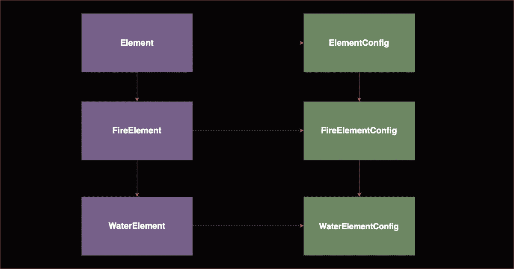

# 统一生产模式:与仿制药的一致关联

> 原文：<https://betterprogramming.pub/unity-production-patterns-consistent-association-with-templates-e90af258e503>

## 看看有缺陷的方法和更好的解决方案

在使用 Unity 开发时，经常会遇到这样的情况，您希望在两个或更多类型的孩子之间建立一对一的关系。如果有什么不同的话，这是很多应用程序中非常常见的情况。

例如，在一个每张牌都召唤一个怪物的纸牌游戏中，每种类型的牌都可以与特定类型的怪物相关联。每次我们玩一个`DragonCard`，它就会召唤一条龙。

假设我们将为第一个(例如`Card`)的每种类型实现一个子类，并为第二个(例如`Monster`)的每种类型实现一个子类，我们将学习如何使它们显式关联，以及这如何有助于创建健壮的设置和干净的、可调试的、可扩展的产品代码。

让我们从一个更简单的方法的变体开始，看看为什么这个模式可以帮助我们清理我们的实现。
假设每个`Enemy`类型都与一个`EnemyAnimator`引用相关联。

# 糟糕的生产方法#1

我经常看到的一种常见方法是为敌人职业的每个孩子设置一个序列化的字段，该字段对应于所需的敌人类型。(有时根本没有基类，每个孩子都将完全独立地工作)

## 为什么这样不好？

这种结构在短期内可能看起来不错，但从长期来看，实际上可能会降低产量，原因有很多。

首先，你没有建立任何规则。所以当和别人一起工作时(包括来自未来的你)..他们可能想要添加一个新的敌人类型，但是不知道(或者完全忘记)任何想要的架构。所以他们可能会创建一个新的不继承 EnemyAnimator 的动画类。当你没有建立结构的时候，这个*确实会发生很多次*。

这将导致更多的非通用错误，使您的代码更难调试和跟踪，更难理解或扩展。

你也没有很好地利用继承。如果你能访问任何敌方引用的动画，那么你就能有更多的通用基类逻辑，这将节省你在子类中的重复代码。

但是，如果我们突然决定，当我们做某个动作时，需要立即停止并重置每一个灌肠剂，该怎么办？

# 糟糕的(但不是非常糟糕的)生产方法#2

我看到的另一种方法是在基类上有一个受保护的 EnemyAnimator。

现在，任何一个`Enemy`类的子类，比如说`EnemyGoomba`，都有一个`EnemyAnimator`引用，你可以通过检查器来设置它，并且你可以将它转换为`EnemyAnimatorGoomba`。

这实际上要好得多。但是，我们不应该在每个孩子身上都引用这个词。

但是从我的经验来看，最大的问题可能是你现在可以将`EnemyAnimatorGoomba`分配给`EnemyKoopa`。如果你的游戏中会有很多敌人，特别是如果你和其他人一起创建预设的设置，你需要尽可能的清楚这些设置。而且拿任何`EnemyAnimator`做参照物都太宽松了。当其他人看到`EnemyAnimator`时，并不会告诉他们在设置过程中应该使用哪个脚本。减少设置中的混乱和事故总是值得的。

# 泛型方法

确保显式关联非常简单。

简单来说，我们可以使用泛型。这意味着每当我们实现一个新的`enemy`类型时，我们必须给它一个继承自`EnemyAnimator`的类，另一个继承自`EnemyConfig`(这只是一个在三个类型之间创建关联的例子)。

从一个非普通的敌人基类中继承`Enemy<AT,CT>`看起来没什么用，但是当我们想在某个地方有一个敌人数组时，这将变得很有用。

仅此而已。我们的`EnemyGoomba`类现在可以这样了。

更少的代码，更高的设置一致性，以及编写通用逻辑的能力。这就是优秀建筑的回报。

# 传递公共参考

这是我发现的另一个有用的模式，可以与前面提到的模式结合使用，以获得更高的一致性。

使用 Unity 时需要解决的一个非常常见的架构问题是:如何传递公共引用？例如，在播放过场动画时，你希望过场动画可以访问你的摄像机、视觉处理类、音频管理器，甚至你的播放器。

有两种常见的方法可以分配这些引用。

1.  **检查器分配** — 最简单的方法是将检查器中的公共引用分配给每个需要它们的脚本。这有时是一种有效的方法，但在生产或更大的项目中通常是一个坏主意。很简单，因为在很多情况下，你会多次分配相同的引用。例如，这会增加设置场景的时间，并增加出错的几率。但也很没必要。
2.  **参考抓取** — 这包括有时使用`GetComponent<T>`或`GameObject.Find<T>()`。这会增加很多性能开销，尤其是在移动设备上。但是这样做的一个常见方法是将您的公共控制器类作为单件。这在很多情况下是非常可靠和现实的。

第三种方式在某些情况下非常合适，那就是利用参数和泛型传递这些引用，提供脚本需要的精确引用。这只能在一个入口点初始化某种顶级游戏系统的层级中起作用，然后这个层级会使用参数来初始化其他功能。

注意:这并不是在所有情况下都是最好的主意

# TL；速度三角形定位法(dead reckoning)

*   建立规则创造一致性
*   将相关的类关联在一起明显减少了实现、调试或设置相关特性的痛苦
*   诸如此类的模式只是帮助您更好地规划工作流的可用工具