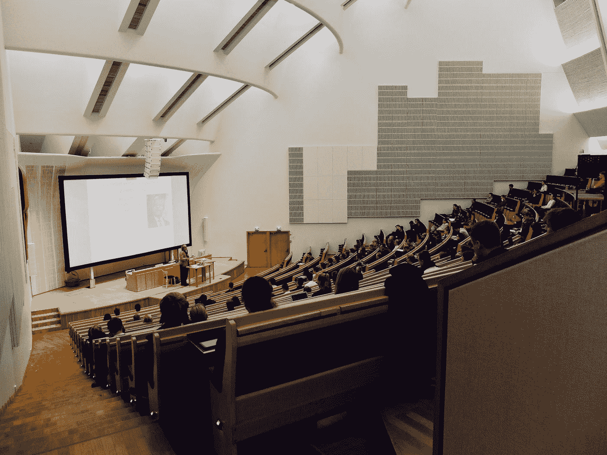

# 大学必须减少讲座以留住计算机科学学生

> 原文：<https://betterprogramming.pub/universities-must-decrease-lectures-to-retain-computer-science-students-654d756faf37>

## 三个小时的讲座不起作用——是改变的时候了

在 [Unsplash](https://unsplash.com?utm_source=medium&utm_medium=referral) 上由 [Dom Fou](https://unsplash.com/@domlafou?utm_source=medium&utm_medium=referral) 拍摄的照片

2021 年春季学期，我上了硕士项目的最后一堂大学课。

不，我不会毕业的。我决定退学。

我觉得在疫情开始前体验了课堂教学后，我浪费了数千美元。当我们过渡到 Zoom 讲座时，这种感觉只会变得更糟。

每学期结束时，学校都会给我发邮件，对教授的表现和我对这门课的感受进行评分。

在每一张纸上，我都写道，“它需要更多的互动。”没想到一个计算机专业的硕士项目，招生的时候也这么以讲座为主。如果大学希望学生注册计算机科学和信息技术的课程，他们需要从讲座转向基于活动的课程。

## 讲课有什么不好？

我已经教了五年高中了。我知道那种对你所教的东西感到兴奋，并想永远交谈下去的感觉。有些话题，如大屠杀或希腊诸神，是值得讨论的激情。

然而，并不是所有的讲座都是吸引人的，但无论如何它们都需要被教授。无论是封建主义还是埃及王国的崩溃，有些事情不值得讨论。有些话题除非应用到日常生活中，否则不值得理解。

当我报名参加 IT 硕士项目时，我希望学习如何编码、诊断和修复技术，以及防止黑客攻击。

相反，我了解了搜索引擎的历史以及它们被创造出来的原因。那次讲座持续了两周。在接下来的几周里，我学习了搜索引擎中的数学知识。我的教授不止一次解释如何编写搜索引擎代码。今天，学生们也没有学会识别搜索引擎的问题。

每节课都是一周三小时的单向讨论。

我不知道教授的内容是否会在现实生活中使用；我还是记了笔记，但随着课程的进行，我意识到大多数内容我在日常生活中不会用到。

作为家庭作业，他希望我们学会用 Python 创建一个搜索引擎。他给了我们一个文件索引，他希望搜索引擎能够搜索并产生一个结果。

他不止一次教我们如何做这件事；他希望我们用自己的时间来学习这个。我在课外花了几个小时试图完成作业，而不是阅读下节课的章节。

讲座的问题很简单:幻灯片上的大部分内容在现实生活中不会用到。大多数继续为谷歌、脸书、苹果或微软工作的人不需要知道搜索引擎背后复杂的数学方程式。大多数人只需要知道如何识别它的代码，诊断它，并产生更快或更准确的搜索结果。

如果大学希望留住计算机科学和信息技术领域的学生，讲座必须缩短或完全取消。

## 有什么选择？

教了五年历史后，我意识到学生从我的课上学得不好。他们可以更好地互相学习。

我教过的最有成效的课是学生们互相辩论的时候。在一堂课上，我让学生们阅读一份关于为什么法国工人阶级反抗君主制的文件。然后，我让学生们辩论工人阶级反抗国王和王后是否正当。

虽然大多数学生同意，但许多人认为工人阶级使用暴力是错误的。其他人不同意，说暴力是正当的，因为其他方法不起作用。那些认为暴力是错误的人扩展了他们的观点，说非暴力手段本来是可以使用的。

辩论持续了 20 多分钟，我才让学生写下他们的想法。然后我给了他们多种情景让他们自己解决，在每种情景中问他们是加入工人阶级还是捍卫君主制。

同样的课程也可以在计算机科学或信息技术课堂上进行。可以给学生一个较短的讲座，解释网络爬虫的目的和功能。然后，学生可以组成小组，并得到一篇文章，他们必须向小组成员解释优点和缺点。当他们在他们的小组中时，他们可以得到代码来解决涉及网络爬虫的问题。

一旦他们完成了小组内的任务，学生就可以自己解决更多的问题，包括代码或网络爬虫应用于搜索引擎的理论场景。

## 为什么会这样？

另一种方法是可行的，因为老师会全程指导学生。在我的课堂上，当学生在辩论时，老师会引导他们，并确保辩论富有成效。当学生开始独立工作时，老师会回答他们对工作表上的场景可能有的任何问题。

在一个硕士项目中，如果团队不能解释一个概念或者不确定如何用代码解决问题，教授应该在场。

在现状中，研究生被期望在家里自己解决这些问题。

然而，现实世界并非如此。程序员和 IT 专家不在家工作。他们和其他同事一起解决工作中的问题。如果他们不确定解决方案，他们可以问他们的主管。他们的主管可以回答他们的任何问题，最好地解决他们的顾虑。

大学课堂应该是职场的反映。现在不是。

## 最后的想法

如果大学希望留住计算机科学和信息技术专业的学生，他们需要重组教室，让它反映工作场所。大学教授必须限制或结束讲座，转向更具互动性的环境。通过这样做，学生可以更好地互相学习，并将继续和完成该计划。

*点击* [*这里*](https://ajkrow.medium.com/membership/) *如果你想在媒体上无限制地访问我更多的作品和其他东西。注意这是一个联盟链接，我会收到你的一部分会员费，这有助于支持我的写作！*