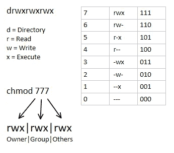

# 11 个 Unix 技巧，带来乐趣和生产力

> 原文：<https://betterprogramming.pub/unix-tips-for-everybody-489f7d3ab6b5>

## 有用的基本 Unix 命令的实践示例


由 [Kasya Shahovskaya](https://unsplash.com/@kasya?utm_source=medium&utm_medium=referral) 在 [Unsplash](https://unsplash.com?utm_source=medium&utm_medium=referral) 上拍摄的照片

[](https://jorgepit-14189.medium.com/membership) [## 用我的推荐链接加入媒体-乔治皮皮斯

### 阅读乔治·皮皮斯(以及媒体上成千上万的其他作家)的每一个故事。您的会员费直接支持…

jorgepit-14189.medium.com](https://jorgepit-14189.medium.com/membership) 

在前一周，[我们发表了一篇关于一些非常流行的 Unix 技巧的帖子](/5-tips-in-bash-scripting-for-beginners-e113a2cf1510)，这让我相信有必要提供 Unix 和 Bash 脚本示例和技巧。

因此，今天，我们将提供一些 bash 命令的实用示例，您会发现这些命令对您的日常任务很有用。

# 1.如何从一个 bash 脚本运行多个命令

您可以使用`;`或`&&`运行多个命令。例如:

```
echo "George" ; echo "Pipis"
```

我们得到:

```
George 
Pipis
```

同样，我们可以跑

```
echo "George" && echo "Pipis"
```

我们再次得到相同的输出:

```
George
Pipis
```

你可能想知道`;`和`&&`有什么区别，因为它们都是用来运行多个命令的。答案是:

*   `A ; B` #跑甲然后跑乙，不管甲是否成功
*   `A && B` #当且仅当 A 成功时运行 B

*来源:* [*问 Ubuntu*](https://askubuntu.com/questions/334994/which-one-is-better-using-or-to-execute-multiple-commands-in-one-line)

# 2.如何返回到多个目录

我们知道`cd`命令代表“更改目录”。如果我们想后退一步，我们只需键入:

```
cd ..
```

如果我们想在一个命令中后退两步呢？然后我们可以键入:

```
cd ../..
```

类似地，您可以添加更多向后的步骤，如下所示(n=3)。

```
cd ../../..
```

最后，如果您想转到上一个目录，可以运行以下命令:

```
cd -
```

# 3.如何更改权限

我们可以使用`chmod` 命令更改文件或目录的权限。

你很可能在文件和目录中看到过符号`-rwxrwxrwx`。第一个三元组是指用户，第二个是指组，第三个是指所有其他用户。


`r`用于**读**`w`用于**写**`x`用于**执行**。例如，如果你想给`my_file.txt`以下权限:

*   用户(u)拥有完全权限，即读(r)、写(w)、执行(e)
*   组(g)只能读取(r)和执行(e)
*   其他人(o)只能读(r)

然后，您可以键入:

```
chmod u=rwx,g=rx,o=r my_file.txt
```

注意，u、g、o 分别指用户、组和其他，r、w、x 分别指读、写和执行。我们可以使用八进制符号运行相同的命令，如下所示:

```
chmod 754 my_file.txt
```

其中每个数字代表每个成员的权限。所以 7 代表`user`，5 代表`group` ，4 代表`other`。这些数字是通过将二进制数转换成十进制数得到的，如下图所示:



如果你想了解更多关于如何将二进制数转换成十进制数的信息，请访问[酷转换](https://coolconversion.com/math/binary-octal-hexa-decimal/Convert__number_111_in__)。所以 111 二进制是十进制的 7。

# 4.如何改变所有权

该命令具有以下结构:

**对于文件:**

```
chown user:group filename
```

**对于目录**:

```
chown user:group directoryname
```

对于目录，我们改变目录的所有权，但不改变目录中文件的所有权。如果我们想改变内部文件，我们应该使用`-R`:

```
chown -R user:group directoryname
```

请注意，它可以通过仅指定用户或组来工作:

**仅用户:**

```
chown user filename
```

**仅分组:**

```
chown :group filename
```

最后，请记住，可能没有权限更改所有权，您可能需要使用`sudo`运行命令:

```
chown sudo user:group filename
```

# 5.如何创建嵌套目录

假设您想用一个命令在 Unix 中创建嵌套目录。您可以通过在`mkdir`后添加`**-**p`，然后指定路径来实现这一点。

假设我想创建一个目录`my_pictures`，然后在这个文件夹中添加另一个名为 my `my_wedding`的目录。我们只需输入:

```
mkdir -p my_pictures/my_wedding
```

通过键入以下命令，我们可以确认这两个文件夹已按预期创建:

```
$ tree ..
└── my_pictures
    └── my_wedding
```

# 6.如何用 sudo 运行最新的命令

一个非常好的技巧是命令`sudo !!`，它运行最新的命令，但是使用 sudo。

例如，假设您试图查看一个您无权访问的文件

```
$ cat myfile.txtPermission denied
```

然后，我们可以运行:

```
sudo !!
```

这相当于:

```
sudo cat myfile.txt
```

# 7.系统信息命令

我们将为您提供一些有用的 Unix 命令，您可以从中获得有关您的系统的信息。

*   date:返回当前日期时间。

```
$dateMon Oct 25 19:54:48 EEST 2021
```

*   正常运行时间:它返回系统运行的时间。

```
$uptime19:57:02 up 2 days, 30 min,  0 users,  load average: 0.52, 0.58, 0.59
```

*   `users`:返回所有登录系统的用户。
*   `who`:它返回已登录的用户，并给出每个登录用户的列表
*   `whoami`:调用该命令时，返回当前用户的用户名

```
$ whoamig_pipis
```

*   `uname`:返回操作系统的名称。

```
$ unameLinux
```

如果你想了解更多的细节，你可以添加`-a`选项。

```
uname -a
```

*   **df** :返回磁盘上的空闲空间量

```
df -h
```

*   **du** :返回文件或目录的大小

```
du -h /path
```

或者，如果您想查看目录中每个文件的大小。

```
du -ha /path
```

# 8.如何获取所有正在运行的进程

命令是:

```
ps aux
```

或者，您可以运行:

```
top
```

# 9.如何创建符号链接

Unix 中的符号链接称为“符号链接”，类似于快捷方式或别名。该命令的结构是:

```
ln -s filname symlinkname
```

注意`-s`标志是用于符号链接的。您需要知道的其他事情是，它引用的是文件路径，而不是文件，当文件被移动或删除时，它会中断。

# 10.如何在 cat 命令中显示行号

`cat`命令返回文件的内容，而`nl`命令也添加行号。例如:

```
$ cat myfile.txtthis is the first line
this is the second line
and this is the third
this should be the forth
```

现在，如果我们也想获得行号，我们可以运行:

```
$ nl myfile.txt 1  this is the first line
     2  this is the second line
     3  and this is the third
     4  this should be the forth
```

另一个选项是使用带有`-n`选项的`cat`命令，例如:

```
$ cat -n myfile.txt 1  this is the first line
     2  this is the second line
     3  and this is the third
     4  this should be the forth
```

# 奖金部分:如何创建横幅

在许多`README.txt`文件中，一些作者会添加横幅。我们可以在 Unix 的 bash 中使用`figlet`很容易地做到这一点。

```
$ sudo apt-get install figletfiglet Predictive Hacks
```


您可以使用不同字体的`-f`选项。比如:

```
figlet -f slant Predictive Hacks
```


# 想要更多提示吗？

你可以找到更多关于 R、Python、SQL、AWS、Snowflake 和 Unix 的技巧