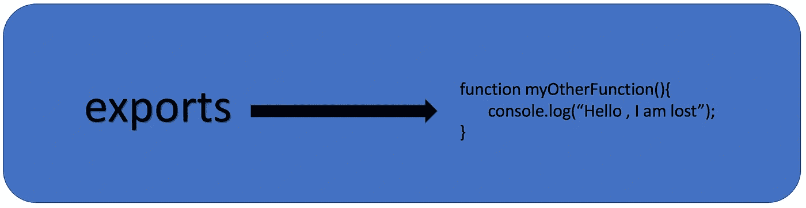

# Node.js 中关于导出和 module.exports 的鲜为人知的事实

> 原文：<https://betterprogramming.pub/unknown-facts-about-exports-and-module-exports-in-node-js-d06b65a8057d>

## 学习导出和模块导出的更好方法


导出和模块导出

当我们在 Node.js 中编写代码时，我们以模块化的方式编写代码。我们将代码写入不同的文件，并通过使用`exports`和`module.exports`来公开这个文件。

Node.js 为我们在每个文件中编写的每段代码创建了一个函数包装器。它还提供对该文件中一些全局对象的访问— `Object` 就是其中之一。

模块`object`包含并导出属性。但是，在这个名单中，还有一个`exports.global`。同时拥有`exports.global`和`object`模块可能会令人困惑。

## 为什么它们令人困惑？

假设我们从一个模块中导出几个东西，其中一个是函数:`myFunction()`。

现在，您可以在另一个模块中要求它，如下所示:

```
require(‘./file.js’).myFunction();
```

如果您想使用`module.exports`将其导出，您可以这样做:

```
module.exports.myFunction=function(){
 console.log(“Its myFunction()”);
}
```

这段代码运行良好。

你也可以用`exports`全局变量做同样的事情:

```
exports.myFunction() = function(){
 console.log(“its myFunction()”);
}
```

这个它也很好用。所以以上两个代码都没有问题。

那么问题出在哪里呢？我们在哪里感到困惑？

比方说，我正试图`exports`从模块中取出一个函数，我们将在使用此代码的其他模块中使用该函数:

`require(‘./file.js’)();`

我们给函数赋值`module.exports`,如下所示:

```
module.exports=function myFunction(){
 console.log(“Hello World”);
}
```

这很好。但是当我们试图用`exports`变量这样做时，我们得到一个错误:

```
exports= function(){
   console.log(“Hello World”);
}
```

这里出了什么问题？

每当我们从任何其他模块内部使用任何一个模块时，我们都会得到一个对 module 对象上的`exports`属性的引用，node 使该对象在该模块内部可用。

默认情况下，任何其他模块可以从这个模块访问的唯一东西就是`module.exports`所指向的东西，它是一个空的 JavaScript 对象。

```
module={
       exports:{}
}
```

让我们来看看这段代码:

```
module.exports.key1=10
```

或者这里:

```
module.exports.key2 = {
                        key3:10
}
```

我们只是给`module.exports`对象添加关键点:

```
module.exports={
                key1:10,
                key2:{
                       key3:10 
                }
}
```

这些键(`key1`、`key2`、`key3`)将在`module.exports`对象与其他文件一起暴露时被导出，如果我们将`module.exports`的引用分配给一个函数，如下所示:

```
module.exports=function(){
         console.log(“”Hello World);
}
```

当节点与所需文件共享`module.exports`时，也应该公开该引用。

`exports.global`变量是对将被导出的`module.exports`对象的引用。

因此，如果我们向`exports`添加属性，我们实际上是向`module.exports`对象添加属性，如下所示:

```
exports.key1=10;
exports.key2={key3:10};
```

和这个一样:

```
module.exports={
      key1:10,
      key2:{key3:10}
}
```

这些将按预期导出。

然而，当我们想要导出一个函数并将`export`变量赋给该函数时，像这样怎么办呢？：

```
exports= function myOtherFunction(){
    console.log(“Hello , I am lost”);
}
```



**导出一个函数并分配导出变量**

在上面的代码中，我们丢失了对`module.exports`对象的引用，现在我们的`exports`指向一个函数，如下所示:

IMG:丢失了对**模块的引用。导出**


丢失了对**模块的引用。导出**

在 node.js 中，`module.exports`对象总是暴露的，对`myOtherFunction()` 函数一无所知。

# 结论

结论是`module.exports`的引用将总是在节点模块中导出，而`exports`只是`module.exports`的别名，我们使用它来使我们的暴露变得容易。

我们还确保没有改变`module.exports`的参考值。如果因为任何原因我们改变了参考，我们就失去了`exports`的目的。

*如果你对 node.js 感兴趣，那么这些文章会很有帮助:*

*   [为你的 node app | Profiling nodeJS app 创建火焰图](https://medium.com/@svsh227/create-a-flame-graph-for-your-node-app-profiling-nodejs-app-e0a91e5ed585)
*   [检测您的节点应用程序|分析节点应用程序中的内存泄漏](https://medium.com/swlh/profiling-node-app-detect-the-memory-leak-in-your-node-app-3663f61cb02f)
*   [检测节点 app 的内存使用情况](https://medium.com/@svsh227/profiling-nodejs-application-detect-the-memory-uses-of-node-app-use-of-inspect-d3f6a723c513)
*   [创建 V8 堆的转储，并为您的节点应用程序检查它](https://medium.com/better-programming/make-a-dump-of-the-v8-heap-and-inspect-for-your-node-app-b69f7b68c162)
*   [为您的节点应用程序](https://medium.com/@svsh227/create-your-own-error-handler-library-and-its-response-model-for-your-node-app-5422db5658e1)创建您自己的错误处理程序库及其响应模型

*感谢阅读！*