# 在您的工作流程中释放 GitHub 环境

> 原文：<https://betterprogramming.pub/unleashing-github-workflow-environments-40e550fde009>

## 如何控制您的多环境部署

美国国家海洋和大气管理局在 [Unsplash](https://unsplash.com?utm_source=medium&utm_medium=referral) 拍摄的照片

GitHub actions 是构建和管理 CI/CD 管道的一个很好的工具。最近 GitHub 增加了环境，为环境保护规则、环境秘密和人工批准提供支持。

让我们看看如何充分利用这些新功能来管理我们的多环境部署。为此，让我们考虑一个场景，我们希望将我们的应用程序部署到两个环境中— *试运行*和*生产*。

当我们提交对*主*分支的更改时，我们希望我们的应用程序被自动部署到*暂存*环境中。一旦发生这种情况，我们将在将这些更改手动部署到*生产*环境之前，验证这些更改是否按预期执行。

让我们从使用下面的 GitHub 工作流文件实现一个简单的 CI/CD 管道开始。

工作流由推送到主分支的更改触发，它有 2 个部署作业，每个环境一个。第一个作业部署到*暂存*，它没有条件，所以它将立即运行。另一个作业部署到*生产，它*依赖于第一个作业的成功完成。

注意，每个部署也使用一个秘密作为部署的一部分。在实际的部署工作中，我们可能会使用一个秘密来存储登录公共云帐户或容器注册表所需的凭据。

如果我们提交对主分支的更改，那么这将触发工作流，该工作流运行作业以部署到*准备*和*生产*。

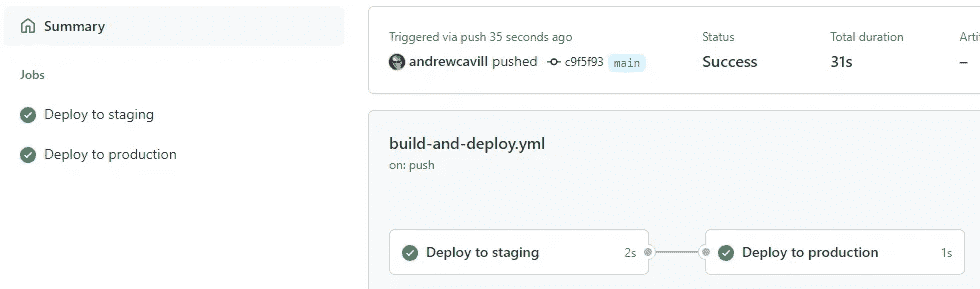

这是一个很好的开始，我们甚至还没有利用 GitHub 的环境。然而，我们当前的解决方案有一些明显的弱点。

*   没有保护措施来防止我们意外地将代码从一个分支部署到错误的环境中。如果开发人员向*分支*数组中添加了另一个分支，那么这可能会导致变更被不经意地部署到生产中。
*   部署到生产环境中会立即发生，即使我们在开始时指定我们希望这是在验证阶段中的更改之后的手动步骤。
*   我们需要为每个笨拙且难以维护的环境命名不同的秘密，尤其是随着环境数量的增长。

让我们看看如何使用 GitHub 的环境来帮助我们通过解决这些弱点来改进工作流程。

## 设置环境

让我们从在存储库和工作流文件中设置暂存和生产环境开始。我们将导航到*设置* - > *环境*并点击*新环境*按钮。

我们将输入第一个环境的名称— *Staging* —并单击 *Configure environment* 按钮。

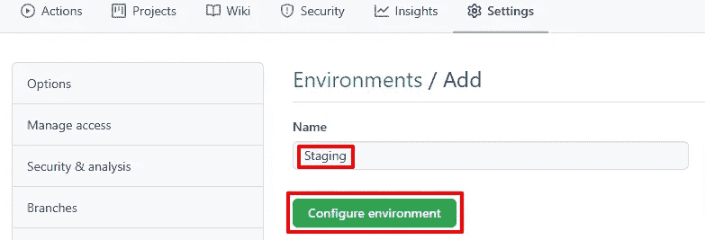

这将为我们呈现一个包含各种配置选项的页面。我们很快会回到这一页，但是让我们首先添加*生产*环境。

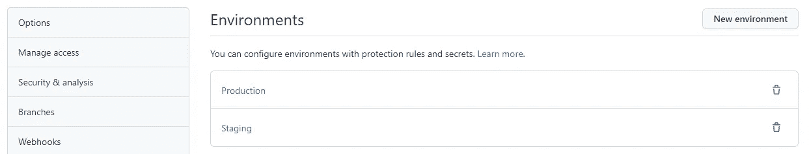

现在我们需要更新我们的工作流文件，并在作业中引用这些环境。请注意，每个作业只能引用一个环境。

## 限制可以部署到环境中的分支

目前，只有当我们将变更推送到主分支时，工作流才会触发。但是如果我们决定对其他分支的变更触发工作流，但是我们想要确保那些变更不能被部署到*阶段*或者*生产*中，该怎么办呢？让我们通过添加一条规则来防范这种风险，即只有主分支可以用于部署到*准备*和*生产*。

回到环境设置页面，让我们深入到*暂存*环境，在这里我们将看到*配置暂存*页面。让我们点击*所有分支*下拉菜单，选择*选定分支*。

然后我们点击*添加部署分支规则*，输入 *main* 作为分支名称，点击*添加规则*。

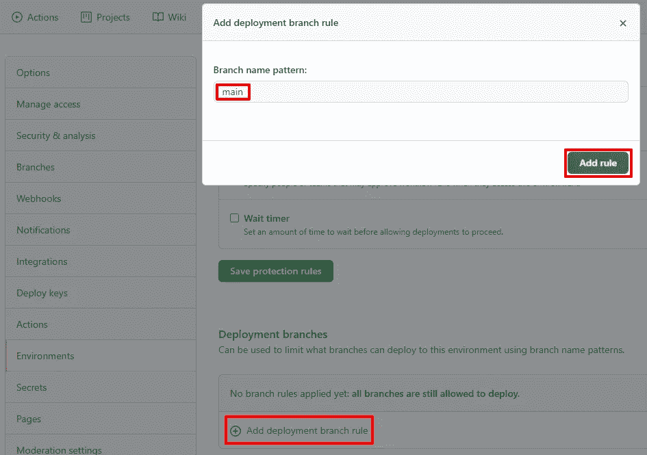

这意味着 *main* 现在是唯一可以用来部署到 *Staging* 环境的分支。

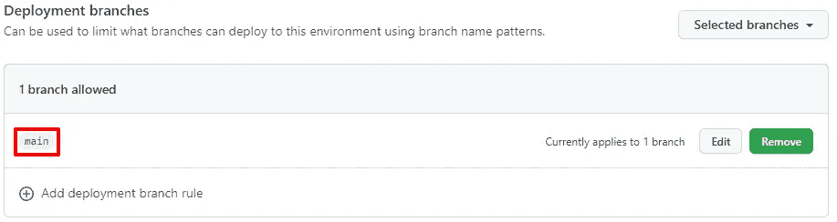

然后，我们应该对*生产*环境重复此操作。

因此，让我们假设将来某个开发人员现在更新了工作流文件，这样它就会被对*测试*分支的更改所触发。也许他们正在添加一个新任务来部署到一个*测试*环境中，但是他们没有意识到*部署-暂存*任务也将运行。

当对测试分支的提交触发工作流时，它将尝试运行部署-暂存作业，但是由于我们上面添加的规则，它将失败。

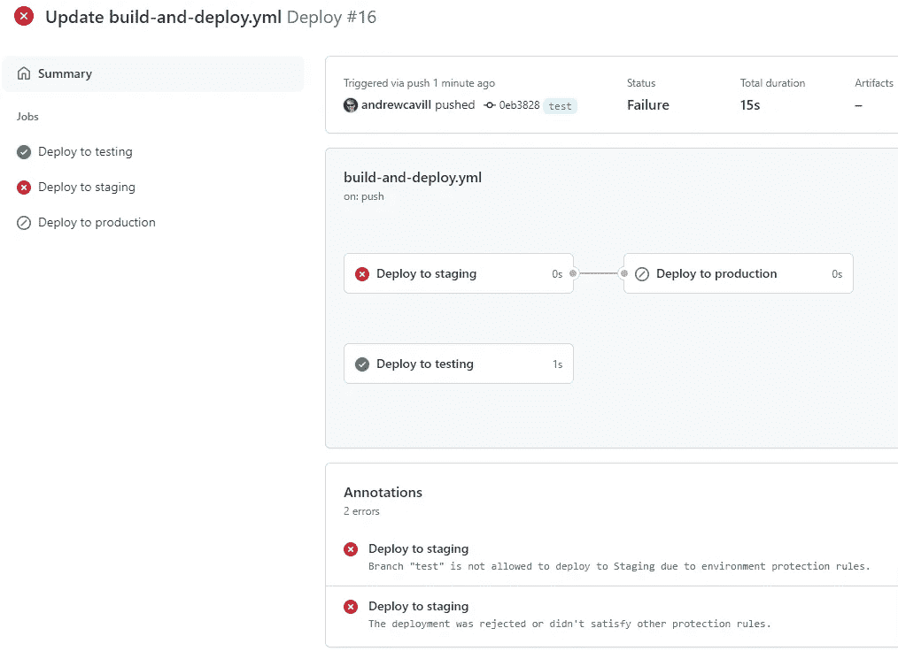

当然，既然构建已经因为我们添加的规则而失败，我们将希望每次都防止它发生。实现这一点的方法是向每个作业添加一个条件语句，以便它们仅在向相关分支提交时运行。

## 手动批准生产部署

目前，部署到*生产*由部署到*准备*的成功完成自动触发。然而，我们实际上想先在*试运行*中测试我们的变更，然后当我们对变更按预期运行感到满意时，我们将手动触发部署到*生产*。

从*环境*页面，我们点击*生产*进入*配置生产*页面。我们将单击*所需的审查者*，然后在单击*保存保护规则*按钮之前，我们可以键入最多 6 个可以审查和批准部署到*生产*的人员。请注意，您还可以输入团队的名称。

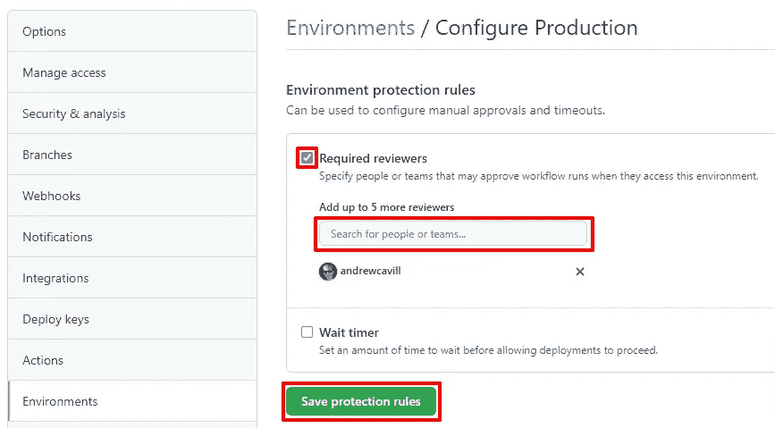

现在，当我们提交对主分支的变更时，它将像以前一样部署到*暂存*，但是之后它将停止并在部署到*生产*之前请求审查。

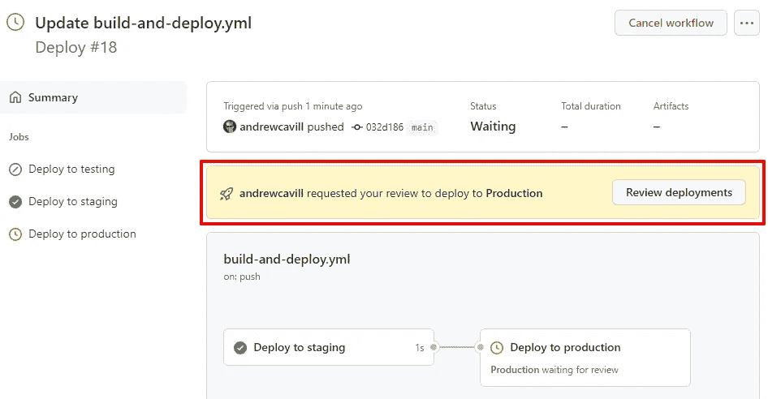

一旦我们验证了*准备*部署，我们将返回到这里并单击*查看部署*按钮。这将打开一个模式窗口，我们可以在其中查看挂起的部署。我们可以勾选*生产*复选框，然后点击*批准并部署*，这将触发*部署到生产*作业运行。

## 环境秘密

正如我们可以为一个组织或存储库设置秘密一样，我们也可以为一个环境添加秘密。

让我们返回到*配置生产*页面，并滚动到底部，在那里我们会找到*环境机密*部分。我们将单击“添加密码”链接。

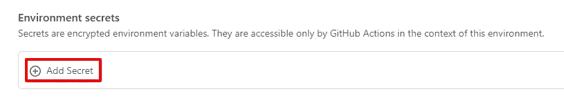

这将打开一个模态对话框，在单击 Add secret 按钮之前，我们可以在其中添加秘密的名称和值。

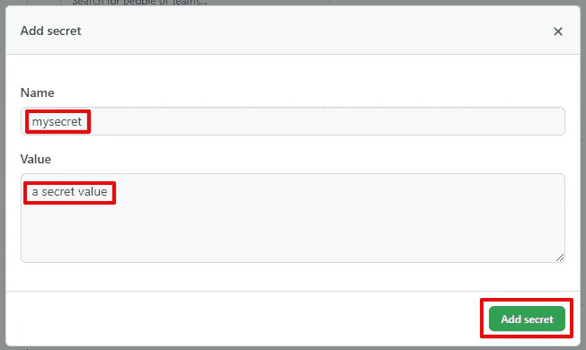

现在我们可以看到秘密已经被存储，如果我们愿意，可以选择更新或删除它。

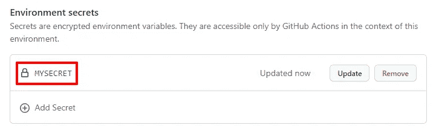

我们应该对每个环境重复这一步骤，对每个环境使用相同的机密名称，因为作业将被赋予它们所引用的环境的正确机密。现在我们可以更新我们的工作流文件，以便它引用这些秘密。

## 包装它

我希望这能让您对如何利用 GitHub 环境来改进您的工作流程有所了解。如果您再看一下环境配置页面，您会注意到一些我在这里没有提到的其他特性，那么为什么不也尝试一下呢？

尽管我很喜欢 GitHub 环境提供的特性，但对我来说有一个明显的弱点。目前，环境只能在存储库级别创建，因此只能与单个存储库相关。这意味着，如果您的组织中有许多存储库(例如，您可能每个微服务都有一个存储库)，并且您希望拥有跨这些存储库的环境，那么您实际上无法做到这一点，只能在每个存储库中复制环境。

当一个环境中的每个存储库都有相同的秘密时，事情就会变得非常混乱。例如，在分段环境中，您可能让所有的微服务通过消息总线进行通信，并且您希望连接字符串是保密的。如果您将它作为环境密码添加，那么了解连接字符串的人需要在每次添加存储库时将它作为密码添加，并且如果值有变化，那么这需要单独应用于每个存储库。

也许下一步是允许在组织级别定义环境，然后允许该组织中的存储库继承这些环境。

无论如何，毫无疑问 GitHub 环境是一个很好的补充，为管理多环境部署提供了一些非常有用的特性。