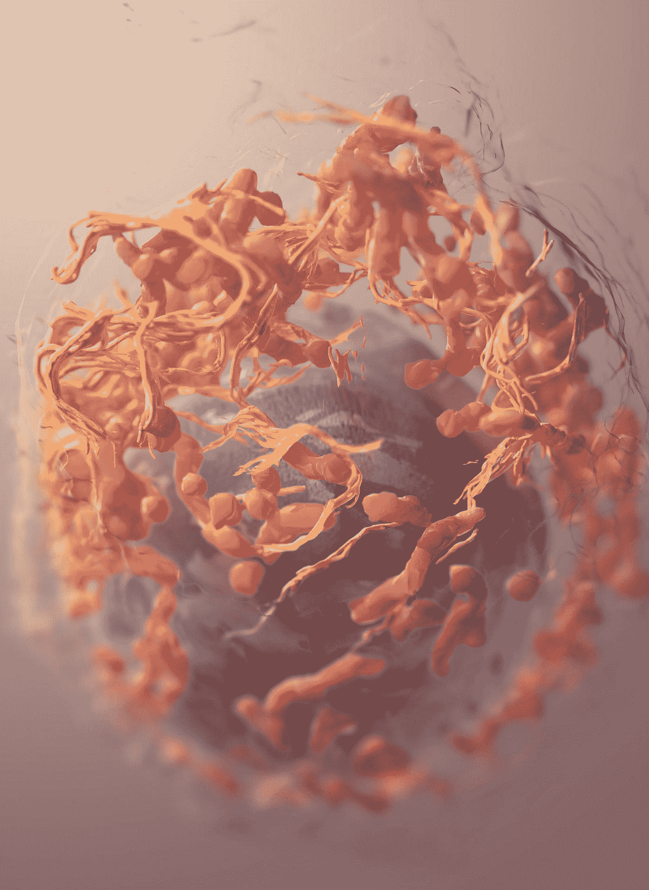
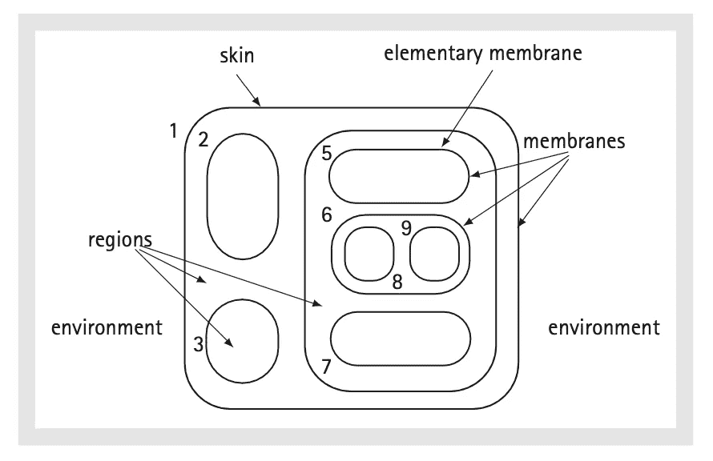
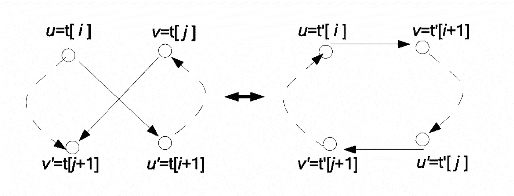

# 利用膜计算释放生物启发的并行能力

> 原文：<https://betterprogramming.pub/unleashing-the-power-of-bio-inspired-parallelism-with-membrane-computing-c450a225a770>

## 开放式 MPI 膜计算的快速实用介绍

[国家癌症研究所](https://unsplash.com/@nci?utm_source=medium&utm_medium=referral)在 [Unsplash](https://unsplash.com?utm_source=medium&utm_medium=referral) 上拍摄的照片

也许你们大多数人已经听说过量子计算、量子位、纠缠和其他一些看起来很“酷”的东西，只是因为它们的名字中含有“量子”。你不知道的是，目前所有这些“量子”的东西在实践中是不可行的。

是的，我们有一些真正的量子计算机，如 [IBM-Q](https://en.wikipedia.org/wiki/IBM_Q_System_One) 或 [Google Sycamore](https://en.wikipedia.org/wiki/Sycamore_processor) ，但它们只能解决一些难题的玩具例子。更糟糕的是，我们无法从量子物理学中获得灵感，为我们的经典计算机创建一个高效的计算模型。这是因为我们无法在经典芯片上实现量子效应。

在这个故事中，我想向你们展示一种新的计算模型，它是由活细胞的结构和功能启发而来的——膜计算。更确切地说，这个模型是受到细胞膜在细胞结构中的作用的启发。

# 模型的快速概述

细胞膜将细胞内的两个部分隔开，允许一些化学物质从一个方向或另一个方向通过。所有的化学物质都按照一定的进化规则进化。一个规则可以是一个重写规则，如果它描述了一个隔间内的化学物质的转化，或者它可以是一个通信规则，如果它描述了化学物质从一个隔间到另一个隔间的移动。所有的化学物质都被称为物体。

膜计算中的主要数据结构是多重集。多重集代表一个集合，其中每个元素都有多重性。在多重集中，顺序不算。通俗地说，膜可以被视为三维欧几里得空间中的球。膜结构的组成部分如图 1 所示。

膜结构

生化反应通过多重集重写规则来建模。规则接收一个多重集作为输入，并返回一个多重集和一些标签。标签指示规则如何在膜之间移动对象。例如，规则 aabc->cbd 将一份 c 中的两份 a 和一份 c 转化为 a d，b 具有催化剂的作用。这个规则所涉及的所有对象都不会离开由膜所界定的区域。

规则可以将对象发送到当前区域之外，也可以将对象导入当前区域。例如，规则 aabc->a(here)d(out)c(in)在当前区域中维护对象 a，并将对象 d 和 c 分别发送到较高和较低的邻居。在当前膜具有多个较低邻居的情况下，对象被非确定性地发送到其中一个。

规则 u->v 在特定区域中的应用只有在该区域包含所需多重性的所有对象时才是可能的。规则销毁由 u 描述的对象，并在规则指定的位置(上邻居或下邻居)创建由 v 描述的对象。

有两种类型的通信规则:同向端口和反向端口。符号规则的形式为(u，in)或(v，out)。当应用规则(u，in)时，来自多集 u 的对象从当前区域中被破坏，并被创建到较低的邻居之一中。类似地，当应用规则(v，out)时，来自多重集 v 的对象从当前区域中被销毁，并在上部邻居中被创建。反向传输规则的形式为(u，outv，in)。这种类型的规则同时破坏来自当前区域的 u 和 v 的对象，并且将它们分别创建到上邻居和下邻居中。非正式地，一个膜结构和一组进化规则被称为 P 系统(P 来自[Gheorghe P un](https://en.wikipedia.org/wiki/Gheorghe_Păun)——膜计算之父)。

# 最大并行度

现在你对什么是膜结构，物体如何通过规则的应用而进化有了一个概念。这种计算模式的能力取决于我们如何应用这些规则。所有的规则都被应用，使得它们被最大程度地并行化。

这种应用模式的灵感来自于活细胞生物化学反应的平行性质。例如，假设该区域包含对象 abbc。考虑规则 r1: ab->v1 和 r2:bc->v2。如果我们只应用第一个规则一次，那么我们也必须在同一区域应用第二个规则。如果我们应用第一个规则两次，我们不能应用第二个规则。其思想是，如果该区域有足够多的对象，可以再应用一个规则，则应用该规则。

# 理论到此为止

好了，我们有了一个受活细胞功能启发的计算模型。我们如何应用这个模型来解决现实生活中的问题？尽管膜计算有许多应用，特别是在生物学中，但该模型在计算机科学中最重要的应用是并行算法的设计。基本上，我们观察细胞如何并行处理信息，并使用这些见解来创建新的并行算法。

让我们来看一个实际的例子:一个求解 [TSP(旅行商问题)](https://www.geeksforgeeks.org/travelling-salesman-problem-set-1/)的薄膜算法。解决问题的一个算法是 [2-opt](https://en.wikipedia.org/wiki/2-opt) 。这个想法很简单:给定问题的一个可能的解决方案(一次旅行),计算该旅行的所有邻居，并选择最有效的一个。如果我们可以通过交换两条路线从一个解决方案获得另一个解决方案，那么这两个解决方案就是邻居。下图给出了直观的表示:

两个邻居旅游

求解 TSP 的膜算法由三个部分组成:

1.  许多区域被膜隔开。
2.  来自每个区域的对象是 TSP 实例的潜在解决方案。
3.  重写规则由优化算法表示，如 2-opt，它进化当前对象。通信规则由将解决方案从一个区域移动到另一个区域的机制来表示。

该算法本身具有以下步骤:

1.  所有区域使用优化算法(例如 2-opt)同时更新它们的对象(TSP 的潜在解)。
2.  在每个区域中，改善的解决方案被发送到较低的相邻区域，而效率变低的解决方案被发送到较高的相邻区域。
3.  重复更新和传输步骤，直到满足最终条件。
4.  算法从最里面的区域输出问题的解。

上述算法代表了一种新的并行算法，用于解决由活细胞的膜结构所启发的 TSP 问题。很酷，不是吗？

# 让我们编码

我们将使用 Open MPI 用 C 实现上述膜算法。如果你想在 Mac M1 上使用 CLion 的开放式 MPI，请查看我的教程。

区域包含 TSP 问题的一些潜在解决方案作为对象，因此我们可以通过以下结构对区域建模:

对于这个例子，我们从如下文件中读取初始膜结构:

在第一行，我们有地区的数量。在第二行，我们有来自每个地区的潜在解决方案的数量。最后，在第三行，我们有每个区域的初始解。

为了读取输入文件并初始化膜结构，我们使用函数`initialize_regions_from_file`:

为了查看每个区域的当前对象(解决方案)，我们使用函数`display_regions`:

为了在区域之间移动解决方案，我们使用函数`move_solution`调用函数`add_solution_to_region`将解决方案添加到下一个区域，调用函数`remove_solution_from_region`从当前区域移除解决方案:

每个解都由 2-opt 算法更新，该算法由函数 two_opt_local_search 实现:

来自一个区域的解决方案由功能`evolve_region`更新:

使用 [Open MPI](https://www.open-mpi.org) 我们为每个区域分配一个进程。根据膜算法的规范，所有过程并行工作。根进程通过调用函数`distribute_work_on_regions`为其他进程分配一个区域:

由于 Open MPI 不知道如何发送 region 类型的变量，我们编写了函数`serialize_region`，它将一个区域转换成一个字节数组:

类似地，当根进程从另一个进程接收到一个字节数组形式的区域时，我们需要将该数组转换成类型为`region` *的变量。*我们通过使用函数`deserialize_region`来做到这一点:

更新解决方案后，每个流程都将该区域发送回根流程。这是通过调用函数`receive_work_from_regions`来完成的:

函数`update_region`实现了解决方案在相邻区域之间的传输机制；

分发和接收步骤被打包到一个名为`distribution_step`的函数中:

每个进程通过调用函数`evolution_step`从相应的区域演化出解:

在主函数中，根进程多次调用函数`distribution_step`，而其余进程调用函数`evolution_step`:

下面是简单的[五个](https://people.sc.fsu.edu/~jburkardt/datasets/tsp/tsp.html)输入区域的演变:

最有效的解决方案的成本是 19。

# 结束语

在这个故事中，我们只是揭开了薄膜计算领域的冰山一角。这是一种新的强大的计算模型，与量子计算不同，它可以激发许多新的并行算法，这些算法可以使用我们当前的计算机来实现。

如果你想了解膜计算如何影响计算机科学的其他领域，如机器学习或优化，请查看这篇新论文。完整的源代码可以在[这里](https://github.com/miiip/MembraneAlgorithmSimulator)找到。

# 资源

关于计算机科学中薄膜计算应用的[调查](https://www.researchgate.net/publication/357765052_A_Comprehensive_Survey_on_the_Recent_Variants_and_Applications_of_Membrane-Inspired_Evolutionary_Algorithms/):

一篇[论文](https://sci-hub.se/10.1142/s012905410700539x)描述了 TSP 问题的一个更复杂的薄膜算法

[牛津膜计算手册(Oxford Handbooks)](https://www.amazon.com/Oxford-Handbook-Membrane-Computing-Handbooks/dp/0199556679)

P 系统的[网站](http://ppage.psystems.eu)。

[旅行销售员问题的 TSP 数据](https://people.sc.fsu.edu/~jburkardt/datasets/tsp/tsp.html)