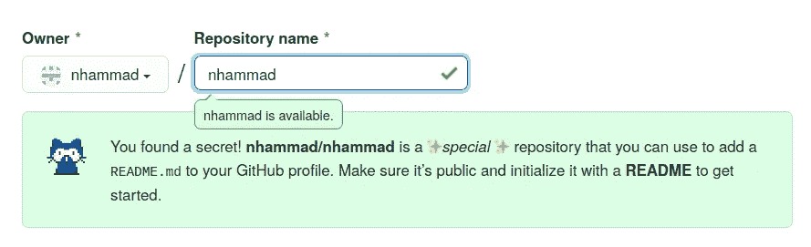
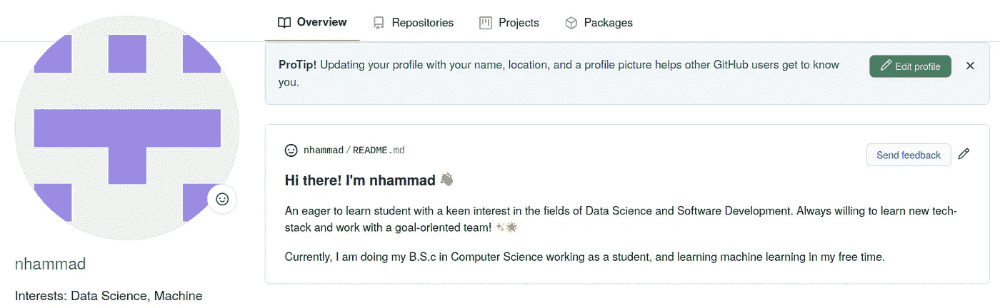

# 解锁 GitHub 秘密:个人简介自述文件

> 原文：<https://betterprogramming.pub/unlock-a-github-secret-profile-bio-readme-8035dec3b3bb>

## 发现一个新的秘密 GitHub 功能

[沃伦·王](https://unsplash.com/@wflwong?utm_source=medium&utm_medium=referral)在 [Unsplash](https://unsplash.com?utm_source=medium&utm_medium=referral) 上的照片。

如果你和计算机科学世界有一点点关系，你就会知道 GitHub 是什么以及它有多强大。如果你和我一样是开发人员，我打赌 GitHub 是你的工作伙伴。但是你知道 Github 有很多你可能还不知道的秘密吗？

最近发现了其中一个，想和全世界分享一下。

# **那么有什么秘诀呢？**

如果您用自己的 GitHub 用户名创建一个存储库，它会自动变成一个特殊的存储库:

是不是很酷？

一旦你用一个`Readme.MD`初始化这个 repo，你在 Readme 文件中写的任何东西都会变成你整个 GitHub 概要文件的 Readme。确保为此创建一个公共存储库。

所以当有人访问你的 GitHub 账户时，他们会看到类似生物的描述。这意味着你可以简单地把你的 GitHub 账户变成一份简历:

你可以概述你的项目，谈论你的工作/教育，夸耀你的成就，提及你的社交媒体账户，或者写任何你想写的东西！

你知道还有其他 GitHub 的秘密等待被发现吗？请在下面的评论中告诉我。