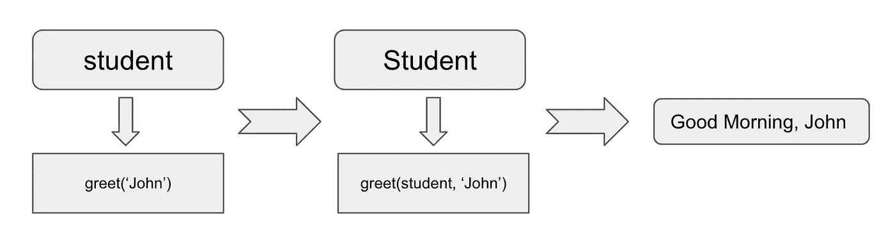

# 在 Python 中解开自我的 4 个秘密

> 原文：<https://betterprogramming.pub/unlock-the-4-mysteries-of-self-in-python-d1913fbb8e16>

## 在 Python 中使用 self


兰迪·雅各布在 [Unsplash](https://unsplash.com?utm_source=medium&utm_medium=referral) 上拍摄的照片。

几乎没有例外，每门结构化的 Python 课程都有一个关于类的讲座——类是 Python 和任何其他面向对象编程语言的基本构建块之一。

当您通过一些例子学习它时，您会注意到 Python 类中定义的许多函数都将`self`作为它们的第一个参数。例如，在下面的代码片段中，我们声明了一个名为`Student`的类，它的`greet()`方法将`self`作为第一个参数。更何况函数体根本不用`self`，这是很多初学者的第一个不解之谜。这到底是什么？

奇怪的是，我们在使用这个函数的时候，并没有给`self`参数设置任何东西，这也是困扰我的另一个谜团。当我进一步探索 Python 中的`self`时，我发现了更多的秘密，但最终能够弄清楚它是什么。因此，在这篇文章中，我想在一些 Python 学习者中分享这些普遍的奥秘。更重要的是，让我们一起来解开这些谜团。


图像由[转化为来自](https://pixabay.com/users/intographics-2633886/?utm_source=link-attribution&utm_medium=referral&utm_campaign=image&utm_content=1599527)[像素库](https://pixabay.com/?utm_source=link-attribution&utm_medium=referral&utm_campaign=image&utm_content=1599527)的图形。

# 1.它代表什么？

在我们开始解决这个谜之前，我们需要理解两个相关的基本概念:类和实例。当然，解决所有这些谜团需要除了类和实例之外的额外知识，这一点我将在我们继续前进时阐明。如果你对这两个都很了解，你可以跳过下一段，这只是对这两个概念的简单概述。

创建 Python 类就是声明一种新的对象类型，它提供了一种将数据和功能捆绑在一起的机制。在上面的例子中，我们创建了一个名为`Student`的类，使用它我们创建了一个名为`student`的`Student`类型的对象。这个对象被称为`Student`类的一个实例。除此之外，这个类还可以提供一些特定的功能，一般称为属性，比如例子中的`greet()`函数。我们使用三个内省(参见我的[上一篇文章](https://medium.com/better-programming/the-5-most-useful-introspection-functions-in-python-7084e3bf9f01)关于 Python 的内省)函数(`type()`、`isinstance()`和`hasattr()`)来检查相关信息。

不用走太远，我可以告诉你`greet()`函数中的`self`参数就是上面例子中的实例`student`。更一般地说，是实例调用这个函数。以下是支持证据:

在上面的代码中，我们修改了`greet()`函数，要求它使用内省`id()`函数向我们显示`self`参数的内存地址。如您所见，`self`参数和实例`student`是同一个对象，因为它们有相同的内存地址。

*解锁之谜:* *函数声明中的* `*self*` *自变量是指调用该函数的实例对象。*

# 2.为什么不需要在函数调用中设置？

继续上一节中显示的例子，当我们使用实例`student`调用`greet()`函数时，这个函数通常被称为实例方法——一个可用于某个类的实例的函数。但是，如果我们检查这个属性的类型，将会显示一些不同的内容。

```
>>> student = Student()
>>> student.greet
<bound method Student.greet of <__main__.Student object at 0x10eff5750>>
```

如上所述，实例`student`的`greet`属性被称为绑定方法。具体来说，它绑定到了类`Student`的`greet`属性。

为了准确理解这意味着什么，让我们看看下面的代码:

```
>>> Student.greet(student, 'John')
Good Morning, John
```

结合开头的示例，您可能已经注意到了这段代码中的三点:

*   这个函数的调用者是类`Student` —而不是实例`student`。
*   在这个调用中，`self`和`name`参数都被设置，不像最初的函数调用是由`student`进行的，其中省略了`self`参数。
*   两个函数调用产生了相同的输出。它们本质上使用的是相同的功能。

通过了解这些信息，您可能已经猜到当我们使用实例`student`调用`greet()`函数时，幕后发生了什么。



调用 greet()方法。

如上图所示，当实例`student`调用`greet(‘John’)`方法时，这个函数调用被解释器处理为类`Student`发送调用者(即实例`student`)和`name`参数(即`‘John’`)给`greet(self, name)`函数，输出“早安，John”

对于感兴趣的读者来说，这里有几个需要知道的事情，可以帮助你对这个谜团有更深入的了解。当一个 Python 类被创建时，它声明的函数就是该类的属性(称为[函数对象](https://medium.com/swlh/everything-is-an-object-in-python-learn-to-use-functions-as-objects-ace7f30e283e))。换句话说，这个类“拥有”这些函数。类的实例不会直接实现这些函数。相反，它们将具有相同的属性(也称为实例方法),这些属性绑定到在它们的类中实现的相应函数。

*未解之谜:实例对象在调用实例方法时会自动设置为* `*self*` *参数。*

# 3.自我是关键词吗？

似乎在所有这些定义的函数中，我们使用`self`作为它们的第一个参数。有人可能会误以为`self`是 Python 为这些用例保留的关键字。然而，事实并非如此。请看下面一个简单的例子:

你可能知道，`def`和`class`是 Python 中我们不能用作变量名的关键字。然而，我们可以在定义函数的上下文之外使用`self`作为变量名，这表明它不是 Python 中的保留关键字。

*解开谜团:* `*self*` *这个词在 Python 中并不是关键词。*

# 4.我们必须在这些函数声明中使用 self 吗？

在上面的例子中，我们反复提到了`greet()`函数。正如我们已经讨论过的，我们将这个函数实现为一个实例方法，这样它就可以被这个`Student`类的所有实例使用。在这种情况下，需要`self`。请看下面的一些证据:

下面是一些分析。如前所述，当实例`teacher`调用`say_hello()`方法时，所发生的是执行`Teacher.say_hello()`函数，实例对象`teacher`和`‘John’`被设置为函数调用。这就是错误显示“给出了 2 个”的原因这与函数的定义相反，函数的定义只有一个参数(`name`)。

然而，还有两件事与这个谜有关，你可能想知道:

*   尽管声明一个实例方法需要包含`self`参数，但它不必被命名为`self`。在这个场景中使用这个名称只是每个 Python 程序员都能理解的惯例。这里有一个例子告诉你，它可以被命名为其他名称，而不会引起任何问题。尽管这在语法上是正确的，但不建议这样做，因为这只会让其他 Python 程序员感到困惑:

*   当我们声明其他函数时，比如类和静态方法，我们不需要使用`self`参数。对类和静态方法的清晰解释可以成为以后文章的主题。但是我这里可以给大家展示的是，当我们声明一个类方法的时候，函数确实有类似于`self`在实例方法中的用法，习惯上称为`cls`指的是类对象本身。与具体实例无关。下面给出一个例子:

*解锁之谜:* `*self*` *参数对于声明实例方法是必需的，对于类和静态方法不是必需的。*

# 外卖食品

这四个谜团代表了 Python 程序员关于 Python 中`self`的一些常见问题。看完这篇文章，我打赌你对`self`及其预期用途有了更好的理解。

感谢您阅读本文，并享受用 Python 编码的乐趣。