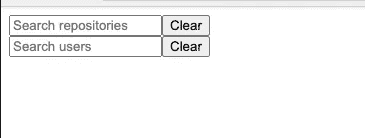
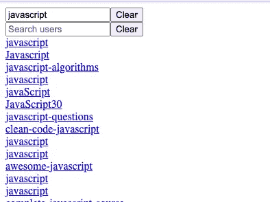

# 如何在 Angular 中自动退订多个可观测量

> 原文：<https://betterprogramming.pub/unsubscribing-multiple-observables-in-angular-46c9c4833ffc>

## 让我们使用异步管道和 RxJS 操作符的力量


来自 [Pixabay](https://pixabay.com/?utm_source=link-attribution&utm_medium=referral&utm_campaign=image&utm_content=4088055) 的 [suju-foto](https://pixabay.com/users/suju-foto-165106/?utm_source=link-attribution&utm_medium=referral&utm_campaign=image&utm_content=4088055) 的图片

angular 中有很多方法可以取消订阅 observables，比如使用异步管道`|`、`unsubscribe`、`take`和 first 操作符。

我通常会尽可能默认使用异步管道，这样我就不用担心退订了。但是有些情况下你不能使用异步管道，你必须`unsubscribe` 观察。

但是，如果我们有多个可观测量，我们将从那里`unsubscribe`呢？

我们可以很容易地取消订阅这些可观的，但这将是很多样板或重复的代码。

然而，我们可以通过使用声明性的方法来最小化代码重复，例如`takeUntil`和`ReplaySubject`。

让我们深入我们的例子:

# 我们的 Web 应用程序示例

*注意，我们可以在我们的 web 应用程序示例中直接使用异步管道。类似于我之前* [*博文*](/4-useful-reactive-programming-implementations-5b17d6fe53d3) *中的* [*Rest API 例子*](/4-useful-reactive-programming-implementations-5b17d6fe53d3#ec67) *。我在这里用 subscribe 作为例子来说明这篇博文的观点。*

我们有一个带有两个 GitHub 搜索框的 web 应用程序，一个用于搜索存储库，另一个用于搜索用户。



作者提供的示例 web 应用程序的屏幕截图。

搜索结果将显示在搜索框下方。



作者提供的示例 web 应用程序的屏幕截图。

当我们在任何搜索框中输入文本后，我们的 web 应用程序将调用 GitHub 搜索 API。要做到这一点，我们需要`subscribe`到我们的`formControl` s `valueChanges` 可观测。

作者在 GitHub 上的源代码示例。

行`this.searchSubject$.next(searchString)`“发出”信号调用 GitHub 搜索 API。

作者的源代码示例。

我们的结果将在模板中呈现。

```
<div *ngFor="let result of results$ | async">
  <div>
    <a [href]="result.html_url" target="_blank">{{
      result.name || result.login
    }}</a>
  </div>
</div>
```

下面给出了`GitHubService` 类:

作者在 GitHub 上的源代码示例。

现在我们知道了我们的示例 web 应用程序是什么，让我们深入研究如何取消订阅`valueChanges` 可观察对象。

# 取消订阅每个可观察对象

我们将首先把我们的可观察对象分配到一个`Subscription`属性中。然后我们将使用那个`Subscription`属性取消订阅。

这里是我们的`Class`酒店，拥有可观的:

```
searchReposSub: Subscription;
searchUsers: Subscription;
```

在`ngOnInit`方法中初始化`valueChanges`订阅。

作者在 GitHub 上的源代码示例。

通过`ngOnDestroy`单独取消订阅观察:

```
ngOnDestroy() {
    this.searchReposSub.unsubscribe();
    this.searchUsersSub.unsubscribe();
}
```

或者我们也可以使用一个`Subscription` 数组取消订阅每个可观察对象:

```
subscriptions: Subscription[];
```

将订阅的观察值推入`subscriptions`数组属性:

作者在 GitHub 上的源代码示例。

通过在`ngOnDestroy` 方法中迭代每个订阅来取消订阅:

```
this.subscriptions.forEach((subscription) => {
   subscription.unsubscribe();
});
```

您可以在 StackBlitz 中运行取消订阅示例:

作者在 StackBlitz 上运行代码示例。

在一个属性数组中跟踪我们的订阅比在多个属性中跟踪要简单得多。

然而，与使用订阅数组相比，我更喜欢另一种方法——使用`takeUntil`管道。

# 使用*取消订阅，直到*和`ReplaySubject`

这是一种更具声明性的方法。如果我们利用了`takeUntil`管道和`ReplaySubject`，我们就不必跟踪类属性中的订阅。

我们将从声明我们的`ReplaySubject`属性开始:

```
private destroyed$: ReplaySubject<boolean> = new ReplaySubject(1);
```

`ReplaySubject(n)`缓存可观察源发出的先前`n`值。所以我们可以使用我们的`destroyed$` `ReplaySubject`在`ngOnDestroy()`中发出一个`unsubscribe` 调用。

```
ngOnDestroy() {
    this.destroyed$.next(true);
    this.destroyed$.unsubscribe();
}
```

我们的订阅将使用`takeUntil`操作符。

在我们的`ngOnInit`:

作者在 GitHub 上的源代码示例。

`takeUntil(this.destroyed$)` 会一直发出我们源可观察的值，直到`destroyed$` 可观察发出一个值。这里可观测的源头是`this.searchReposFormControl.valueChanges`。

您可以在 StackBlitz 中运行`takeUntil`示例:

作者在 StackBlitz 上运行代码示例。

# 结论

尽可能避免手动`unsubscribe`。这可以通过使用异步管道`|`或任何其他 RxJS 操作符(如`take`和`first` )来实现，这些操作符将自动取消订阅您的观察对象。

但是如果你除了使用`unsubscribe`别无选择，就像上面的例子一样。然后用`ReplaySubject` *和*的方法进行`takeUntil`。使用这种方法，您不必跟踪您的订阅。你只需要申报你的`ReplaySubject`财产。然后用那个属性去`unsubscribe` *。*

[](https://blog.ardy.me/membership) [## 通过我的推荐链接加入媒体

### 阅读 Ardy Gallego Dedase(以及媒体上成千上万的其他作家)的每一个故事。您的会员费直接…

blog.ardy.me](https://blog.ardy.me/membership)