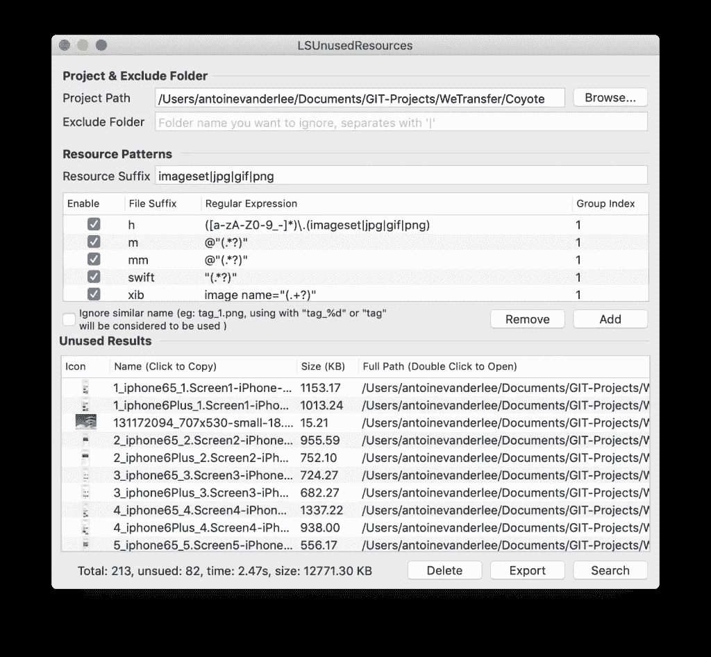
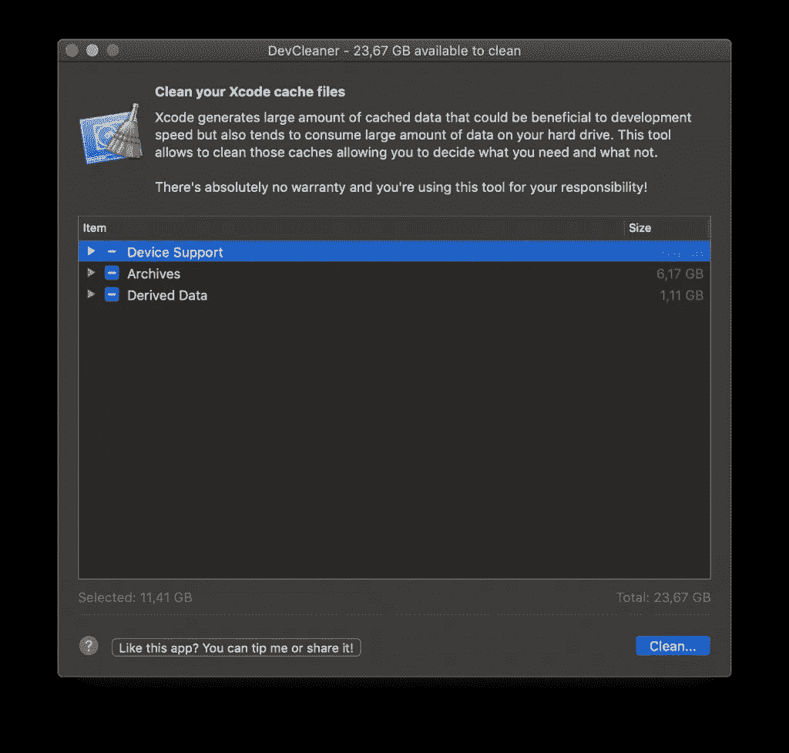

# Xcode 会清理未使用的图像和资源

> 原文：<https://betterprogramming.pub/unused-images-and-resources-clean-up-in-xcode-2fa68b4e202b>

## 如何轻松清理项目中未使用的图像和资源


照片由[克里斯蒂娜·莫里洛](https://www.pexels.com/photo/woman-sitting-while-operating-macbook-pro-1181676/)在[的像素](https://www.pexels.com/photo/woman-sitting-while-operating-macbook-pro-1181676/)上拍摄

未使用的图像可以作为项目中不同迭代的结果而存在。一旦某个功能不再需要并被删除，它并不总是被完全清除。因此，知道如何清理 Xcode 资产是很有用的。

就像我在关于[清理未使用的本地化字符串](https://www.avanderlee.com/xcode/unused-localized-strings/)的博文中一样，我将介绍几个你可以用来清理你的项目的工具:

*   [蜂鸟](https://github.com/onevcat/FengNiao/blob/master/README.md)
*   [LSUnusedResources](https://github.com/tinymind/LSUnusedResources)

不幸的是，很多像[细长](https://www.macupdate.com/v1/app/mac/41546/slender)这样曾经用来做这项工作的工具不再被维护。所以，我们来看看*现在的*都在干嘛！

为此，我将使用我的日常工作项目[通过 WeTransfer](https://collect.wetransfer.com/) 收集。这个项目的资产已经两年没有清理了。

# 使用蜂鸟清理未使用的图像

风鸟是一个命令行工具，大部分是用 Swift 编写的。它是开源的，可以在 Github 上获得。可以通过克隆存储库并运行安装脚本来安装它:

```
> git clone https://github.com/onevcat/FengNiao.git
> cd FengNiao
> ./install.sh
```

使用它非常简单，只需在终端中将目录切换到您的项目文件夹，然后执行 FengNiao:

```
> fengniao
```

它将首先向您显示结果，然后您可以选择删除、忽略或列出未使用的资源。

```
Searching unused file. This may take a while...
218 unused files are found. Total Size: 19.09 MB
What do you want to do with them? (l)ist|(d)elete|(i)gnore
```

列出这些文件表明也检查了依赖项。显然，我们不想关注这些，因为它们不受我们的管理。

```
1.57 KB /Users/antoinevanderlee/Documents/GIT-Projects/WeTransfer/Coyote/Submodules/Rabbit/Submodules/Alamofire/docs/docsets/Alamofire.docset/Contents/Resources/Documents/img/gh.png
```

除了列出依赖项资产，该工具还列出了文档文件夹的图像。因此，我们需要使用一些额外的选项再次运行该工具。

我们可以使用— help 参数列出所有可用的选项。

```
$ fengniao --help
Usage: fengniao [options]
  -p, --project:
      Root path of your Xcode project. Default is current folder.
  --force:
      Delete the found unused files without asking.
  -e, --exclude:
      Exclude paths from search.
  -r, --resource-extensions:
      Resource file extensions need to be searched. Default is 'imageset jpg png gif'
  -f, --file-extensions:
      In which types of files we should search for resource usage. Default is 'm mm swift xib storyboard plist'
  --skip-proj-reference:
      Skip the Project file (.pbxproj) reference cleaning. By skipping it, the project file will be left untouched. You may want to skip ths step if you are trying to build multiple projects with dependency and keep .pbxproj unchanged while compiling.
  --version:
      Print version.
  -h, --help:
      Print this help message.
```

排除选项是我们需要的选项。在查看了为 Collect 列出的所有路径之后，我们发现可以忽略相当多的路径。这会产生以下命令:

```
fengniao --exclude Carthage Pods Submodules Vendor guides fastlane
```

这告诉工具忽略包含依赖项的文件夹，以及我们的文档和浪子文件夹。最终结果包含 44 个要清理的未使用资源:


使用蜂鸟清理未使用的图像

为了验证这些是未使用的资产，我随机挑选了一些，并在 Xcode 中进行了搜索。事实证明，这些资产确实是闲置的，可以清理掉。

再次运行该工具证明了它的预期工作！

```
$ fengniao --exclude Carthage Pods Submodules Vendor guides fastlane
Searching unused file. This may take a while...
😎 Hu, you have no unused resources in path: /Users/antoinevanderlee/Documents/GIT-Projects/WeTransfer/Coyote.
```

# 使用 LSUnusedResources 清理未使用的图像

[LSUnusedResources](https://github.com/tinymind/LSUnusedResources) 是一款 Mac app，做的事情和风鸟一模一样:清理不用的图片和资源。它也是开源的，但是不再维护了。在撰写本文时，最后一次提交已经追溯到一年前。然而，它仍然运行，因此值得一试！

可执行文件可以从 Github 页面下载。它可能会告诉你打开它不安全。如果有，可以用 Control + Open 打开。在使用默认设置运行它之后，它显示了与 FengNiao 几乎相同的结果:



未使用的图像导致 LSUnusedResources

就像我们对 FengNiao 所做的那样，我们现在应该用排除的文件夹再次运行它。我们必须通过用管道符号分隔文件夹来填充资源后缀:

```
Carthage|Pods|Submodules|Vendor|guides|fastlane
```

结果是:

```
Total: 106, unused: 21, time: 1.53s, size: 328.92
```

这些都是未使用的资产，可以使用应用程序中的删除按钮轻松删除。

# 比较结果:蜂鸟还是未使用的资源？

比较这两种结果显示了一些巨大的差异:

```
FengNiao:          44 unused files / Total Size: 440.06 KB
LSUnusedResources: 21 unused files / Total Size: 328.92 KB
```

起初，这似乎主要与 Coyote 中的两个扩展目标有关。FengNiao 正确地检查了这些，但是 LSUnusedResources 似乎忽略了它们。

为了完全确定，我为每个工具创建了一个分支，并比较了变化。这证实了蜂鸟做得更好，找到了更多的闲置资源。

# 清理那些不用的图像总是安全的吗？

肯定不是！在删除资产之前，最好仔细检查一下。有一个常见的例子，资产被使用，但仍然被列为未使用。这是当您基于某些条件建立对资源的引用时。

例如，在 Coyote 中，我们使用以下代码:

```
UIImage(named: "\(iconName)\(iconSize.sizeString)")
```

结果是，所有这些图像都在两个结果中列出，因此在删除图像之前需要手动检查结果。

# 额外收获:清理你的 Xcode 开发者文件

既然你已经开始清理了，那么也清理一下你的 Xcode 开发者文件怎么样？

有一个很棒的工具叫做 [DevCleaner](https://github.com/vashpan/xcode-dev-cleaner) ，它可以很容易地为你删除高达 20GB 的未使用数据。这是我第一次运行它后看到的样子:



使用 DevCleaner 清理 Xcode 开发者文件

要知道这个应用会默认删除你所有旧的 iOS 版本。例如，在我的例子中，它选择了所有的 iOS 11 和 12 设备支持文件，只给我留下了 iOS 13 的设备支持。这显然不是你想要的。因此，仔细选择并根据你的需要进行调整。

# 结论

清理您的项目以删除未使用的图像绝对值得一试。这将使您的项目保持整洁，没有您不再使用的资产。保持警惕，在删除之前手动检查结果。