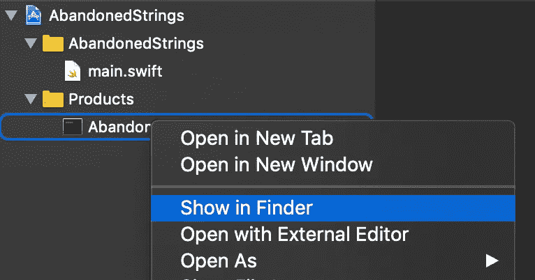
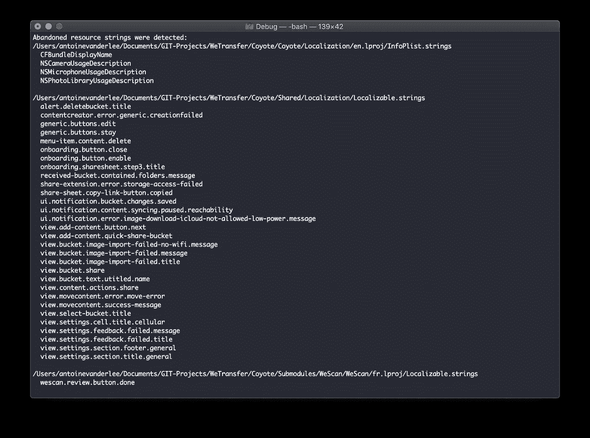

# 从. Strings 文件中清除未使用的本地化字符串

> 原文：<https://betterprogramming.pub/unused-localized-strings-clean-up-from-a-strings-file-4e70dd97b177>

由 [Philip Estrada](https://unsplash.com/@philipestrada) 在 [Unsplash](https://unsplash.com/photos/vJr3t39a0xw) 上拍摄

字符串文件用于 iOS 和 macOS 应用程序中的本地化。这些文件会随着时间的推移而增长，使其难以维护。很容易导致大量未使用的本地化字符串。虽然这不是性能问题，但是保持资源文件的整洁还是不错的。

Xcode 没有为此提供现成的解决方案。然而，我们有一个很好的社区，有很多工具可以解决这个问题。我一头扎进去，看了看 [NSLocalizer](https://github.com/samdmarshall/nslocalizer) 、[弃弦](https://github.com/ijoshsmith/abandoned-strings)，还有[这篇](https://buildingvts.com/clean-ios-localizable-files-8b910413b985)中的博文。在这两个 GitHub 项目中，来自约什·史密斯的项目给出了最好的结果。

在我们开始之前，值得一提的是 Gino Wu 的 Medium 博客文章提供了一种将它集成到 Xcode 构建过程中的好方法。然而，在我看来，这并不是你需要经常集成和运行的东西，因为它会减慢你每次运行的构建过程。不太可能经常出现未使用的字符串，所以偶尔手动运行它就足够了。

因此，让我们深入研究一下废弃的字符串终端工具。

# 废弃的琴弦

运行该命令后，该工具将显示未使用的本地化字符串列表。

## 查找未使用的资源字符串

第一步是从 GitHub 项目创建一个可执行文件。从[github.com/ijoshsmith/abandoned-strings](https://github.com/ijoshsmith/abandoned-strings)下载项目。然后使用 Xcode 构建它，并在 products 文件夹中找到可执行文件。

用于查找未使用的本地化字符串的可执行文件

右键单击可执行文件并选择“在 Finder 中显示”,打开包含该文件的文件夹。这将是您在终端中使用的基本路径。您可以使用`cd`命令来更改终端目录。之后，运行以下命令:

`$ ./AbandonedStrings /Users/your-username/path/to/source/code`

## 移除未使用的本地化字符串

运行命令后，该工具将显示未使用的本地化字符串列表:

运行命令后，结果中未使用的本地化字符串的列表

您可以使用此列表将它们从项目中移除。不幸的是，这仍然是一个手动的过程，如果您有许多未使用的字符串，这将是一个相当大的工作量。但是，如果您更频繁地运行该工具，这种情况会有所改善。

## 结果包括哪些内容？

该工具获取项目中的`.strings`文件，并遍历所有已定义的键。假设字符串文件包含一个名为`home.button.title`的键。该工具将获取该密钥，并验证是否有任何`.h`、`.m`、`.swift`或`.jsbundle`包含引用。如果没有，它将认为该密钥未被使用。

## 还有什么？

虽然这个工具可以很好地保持字符串文件的整洁，但是您必须自己手动运行它，并不时提醒自己运行它。然而，由于您不太可能经常引入未使用的字符串，所以不每天运行它会更好。