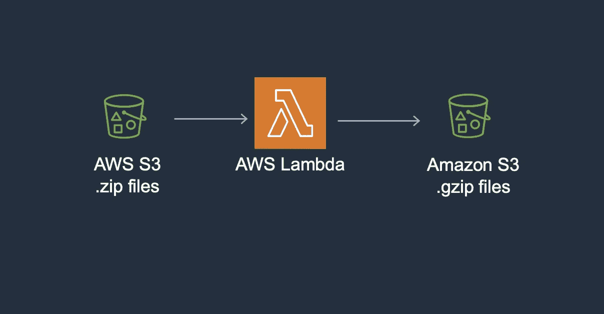
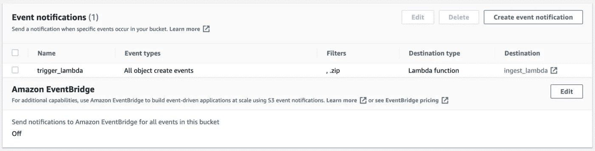

# 用 AWS Lambda 解压和 Gzip 输入的 S3 文件

> 原文：<https://betterprogramming.pub/unzip-and-gzip-incoming-s3-files-with-aws-lambda-f7bccf0099c9>

## 更容易、更快、更好

[AWS 工作流程](http://PPTx for Dark Backgrounds)

不久前，我遇到了一个场景，传入的 S3 文件被压缩。每个压缩文件包含五个文本或 CSV 文件。然而，为了进一步处理，我需要提取压缩的内容并将其转换成 gzipped 格式。因为有大量的文件涌入，手动解压和 gzip 文件似乎是不可能的。

# 自动化

自动化该过程的最佳方式似乎是使用 AWS Lambda 函数。如果您转到 S3 存储桶的属性选项卡，您可以为所有对象“创建”事件(或只是 PutObject 事件)设置一个事件通知。作为目的地，您可以选择 Lambda 函数，在这里您将编写代码来解压缩和 gzip 文件。

S3 时段属性(AWS 自由层)

现在每次有新的。zip 文件添加到您的 S3 桶，lambda 功能将被触发。您还可以向事件通知设置添加前缀，例如，如果您只想在文件上传到 S3 存储桶中的特定文件夹时运行 lambda 函数。

lambda 函数可以是这样的:

当一个事件触发这个 lambda 函数时，该函数将提取导致触发的文件密钥。使用 file 键，我们将把传入的 zip 文件加载到一个缓冲区中，解压缩它，并单独读取每个文件。

在循环中，压缩文件夹中的每个单独的文件将被单独压缩成一个 gzip 格式的文件，然后将被上传到目的地 S3 桶。

如果您想要上传特定文件夹中的文件，您可以更新`final_file_path`参数。同样，你可以根据自己的需要更新`sourcebucketname`和`destination_bucket`等参数。您还可以将 gzipped 文件上传到同一个源桶。

另一种方法是首先将 S3 文件读入/tmp 文件夹，然后解压缩以供进一步处理。但是，如果您同时在 S3 存储桶中获取多个文件，这种方法可能会崩溃。

# λ配置

请注意，默认情况下，Lambda 的超时时间为 3 秒，内存仅为 128 MBs。如果有多个文件进入 S3 存储桶，您应该将这些参数更改为它们的最大值:

超时= 900

内存大小= 10240

# AWS 权限

您用来运行 Lambda 函数的 AWS 角色将需要某些权限。首先，它需要能够访问 S3 来读写文件。以下是主要政策:

" s3:列表桶"

" s3:头部对象"

" s3:GetObject "

" s3:GetObjectVersion "

" s3:PutObject "

您还应该拥有 CloudWatch 访问权限，以便在需要时记录和调试代码。

"日志:创建日志组"

"日志:创建日志流"

"日志:上传事件"

通过 Terraform 复制类似的工作流程也非常简单。我将在我的下一篇文章中写下它！:)