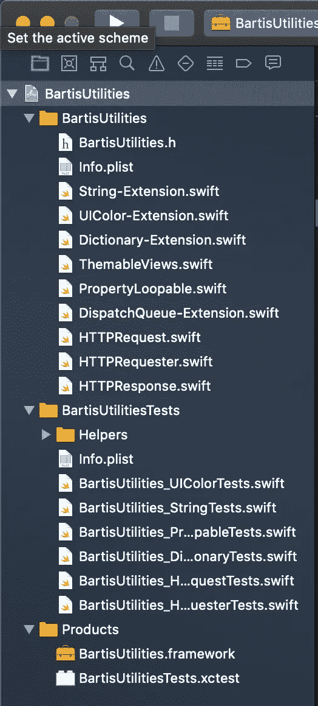
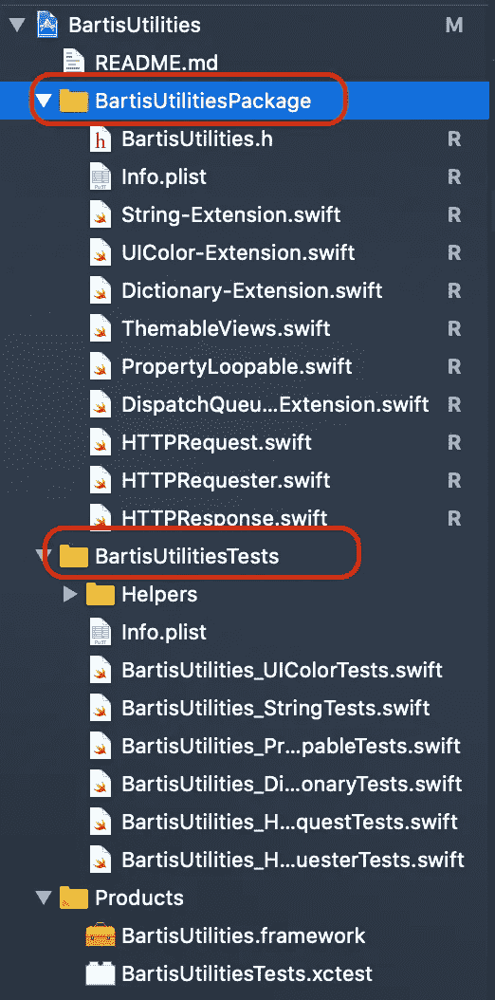
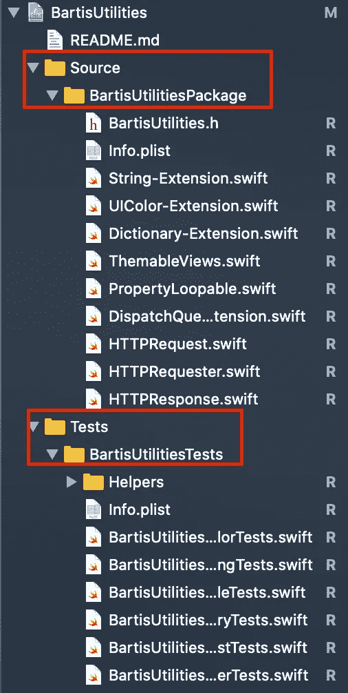
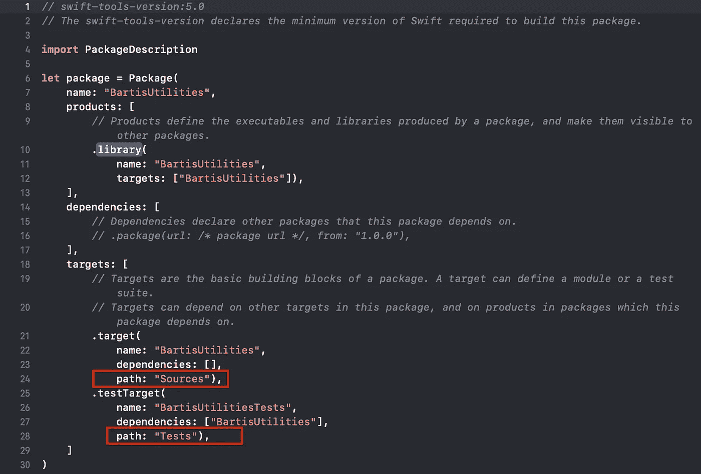

# 如何更新您现有的 iOS 框架，以便与 Swift Package Manager 配合使用

> 原文：<https://betterprogramming.pub/update-your-existing-ios-framework-to-swift-package-fa8128323b33>

## 椰子，迦太基-> SPM


照片由[马修·施瓦茨](https://unsplash.com/@cadop?utm_source=unsplash&utm_medium=referral&utm_content=creditCopyText)在 [Unsplash](https://unsplash.com/s/photos/abstract?utm_source=unsplash&utm_medium=referral&utm_content=creditCopyText) 拍摄

在过去的几年里，我一直在管理一个由我创建的 iOS 框架，其中包含一些我在整个项目中一直重复使用的小工具。这没什么大不了的，但对我来说，这是创建、更新、记录和测试框架的一个很好的练习。

这个框架在 [GitHub](https://github.com/trusk89/BartisUtilities) 上可以作为 BartisUtilities 获得(请原谅我的自恋)。我看不出有必要将它作为 Cocoapod 或 Carthage 项目发布，因为我主要使用它的片段，只有一个个人项目完全导入它。这对于单个项目来说没有问题，在 Xcode 中构建一个新版本的框架，并在使用它的项目中替换它。但是如果我必须在多个项目中完成，这将是一个麻烦。

进入 [Swift 包管理器](https://swift.org/package-manager/)。当然，这并不新鲜，但正如我们在今年的 WWDC 上看到的，直接从 Xcode 11 创建 Swift 包变得非常容易。

现在，这是一个非常简单明了的过程，不超过 30 分钟，所以让我们开始吧。

当然，你需要 [Xcode 11](https://developer.apple.com/xcode/) 和一个现有的 iOS 框架。

1.  首先，我们来看看现有的项目结构。



现有项目结构

您可以看到它主要分为两组:实际的源代码和单元测试的源代码。在实际的文件夹中也有一个`README.md`，但是它没有被导入到项目中。让我们现在就开始吧，因为这是 Swift 包所要求的。


导入的 README.md

2.为了让我们的生活更容易，如果每个人都有可能的话，我喜欢按照苹果官方文档[中的描述来组织这个项目，通过重命名组来包含真正的单词*包*和*测试*。](https://developer.apple.com/documentation/swift_packages/creating_a_swift_package_with_xcode)



然后把他们移到一个`Sources` 和`Tests`组。



提示:您可能需要更新项目设置中的`Info.plist`路径。

2.现在我们的结构已经准备好了，让我们生成清单。当然，我们可以基于 Apple 的样本手动创建它，但是当我们可以使用 Swift toolchain 来为我们创建时，我们为什么要这样做呢？

在项目的根目录下打开一个终端窗口并运行

`swift package init — type library`

您应该会看到如下输出:

```
Alex@Maculetz BartisUtilities % swift package init — type library
Creating library package: BartisUtilities
Creating Package.swift
Creating Sources/
Creating Sources/BartisUtilities/BartisUtilities.swift
```

当您查看您的项目时，您应该看到`Package.swift`已经出现在聚会上。

3.答:现在，是时候关闭我们现有的 Xcode 了，因为我们要生成一个新的`.xcodeproj`。

在同一个终端窗口中，运行

`swift package generate-xcodeproj`

您应该会看到如下所示的成功输出:

```
Alex@Maculetz BartisUtilities % swift package generate-xcodeproj
generated: ./BartisUtilities.xcodeproj
```

让我们打开新项目看一看。

首先您会注意到，现在您的根目录中的所有文件夹都映射到 Xcode 项目。在我的例子中，它还将`SampleApp`添加到项目和所有 Jazzy 生成的文档中。这对我来说不是问题，但是如果对你来说是，你可以像平常一样清理你的项目结构。


3.b .在这一步，如果您在生成新的`.xcodeproj`时遇到问题(就像我第一次做的那样)，在清单文件的`targets`组中添加源文件的路径。



4.构建新创建的方案 `**MyProject-Package**` **。**

5.测试新创建的方案`MyProject-Package`。

如果构建和测试一切顺利，我们就进入最后一部分:发布。

6.提交。用力。为您的当前版本创建标签。

就是这样！

您现在可以进入另一个项目，在项目导航器中点击该项目，选择 Swift 包，并点击 **+** 。现在像这样粘贴`.git`网址:[https://github.com/trusk89/BartisUtilities.git](https://github.com/trusk89/BartisUtilities.git)

然后点击“下一步”,直到导入完毕。