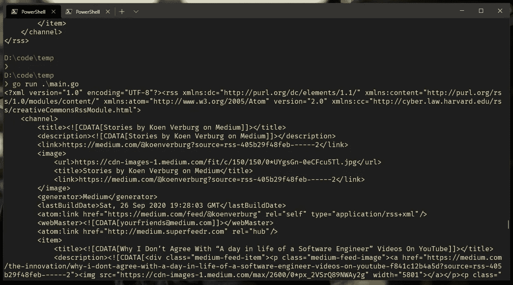
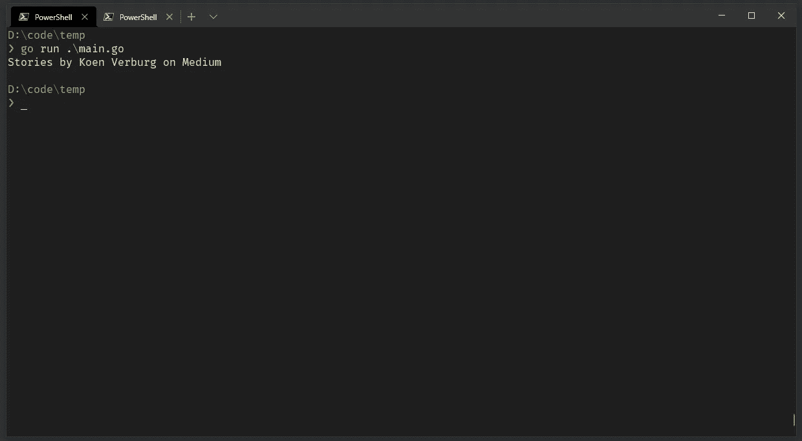
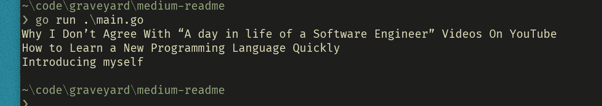
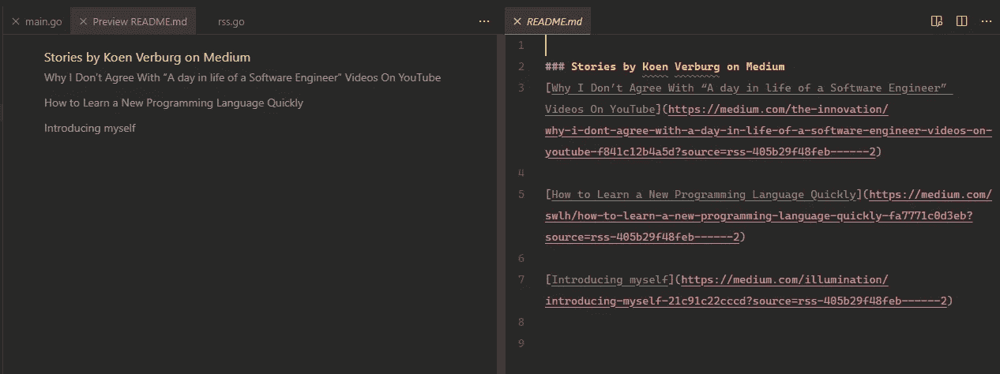

# 使用 Go 自动用您最新的媒体文章更新您的 GitHub 个人资料自述文件

> 原文：<https://betterprogramming.pub/update-your-github-profile-readme-with-you-latest-medium-article-automatically-using-go-e6d303109164>

## 自动化小事情的一步一步的指南


Joshua Aragon 在 [Unsplash](https://unsplash.com?utm_source=medium&utm_medium=referral) 上拍摄的照片。

您的 GitHub 简介 Readme 已经取得了很大的进步，但是还缺少一些东西:当然是您最新的 Medium 文章。在本教程中，我将带您了解如何使用 [Go](https://golang.org/) 脚本进行设置。

# 要求

您需要在您的计算机上安装 Go 版本 1.x。如果你没有任何围棋知识，我建议你看看布莱恩·迪克伊岑的这篇文章。

# 入门指南

我们将创建一个脚本来获取我们最新的媒体文章，并将它们写出到一个减价文件中。首先，我们需要一个数据源。Medium 提供了一个 RSS 提要，这非常适合我们的用例。我们可以使用下面的 URL 获取此提要。请务必将用户名改为您的用户名:

```
https://medium.com/feed/@koenverburg
```

创建一个文件夹或通过终端访问 GitHub profile Readme 存储库。

现在，让我们通过运行以下命令来初始化 Go 模块:

```
go mod init medium
```

创建一个名为`main.go`的新文件，并粘贴以下样板代码:

```
package mainfunc main() {}
```

现在让我们从启动请求开始。将以下代码粘贴到 main 函数中。不要忘记更改用户名:

在第一行中，我们从 Medium 向 RSS 提要发出 HTTP `get`请求。`get`函数返回一个元组、响应和`err`。最好先检查错误，然后继续响应。

在错误检查之后，我们推迟了`response.Body.Close()`。这样，当我们完成时，客户端将被关闭。然后我们把`response.Body`给`ioutil.ReadAll`。这是因为主体是一个字节流，我们想要读取它的全部。这也将返回一个元组，我们将首先在其上检查任何错误。然后我们将继续处理主体，并使用`string`函数将其打印到字符串中。

运行该命令将得到以下输出:



XML 输出的屏幕截图。

查看 URL 提要的输出，我们看到了 XML。我们必须把它转换成结构，这样我们就可以使用 Go 编程语言的强类型特性。

在名为`structs`的文件夹中创建一个名为`rss.go`的新文件，并粘贴以下代码:

回到主函数。让我们删除这一行，因为我们不需要它:

```
fmt.Println(string(body))
```

并替换为以下内容:

这里，我们使用 XML 包，我们将根据`rss`变量解组主体，变量是`Rss`结构类型。封送处理对你来说可能是个新名词。将其视为从一种数据格式到另一种数据格式的转换操作。在维基百科上了解更多关于这个话题的信息。

如果一切顺利，将会输出以下内容:



RSS 源标题的屏幕截图。

好了，现在我们有了所有的强类型，让我们使用下面的循环来获取最新的文章:

```
for i := 0; i < 3; i++ {
	fmt.Println(rss.Channel.Item[i].Title)
}
```

这将输出以下内容:



输出截图:循环浏览最新文章

在这一点上，我们有我们的最新文章，但它不是在降价格式。让我们把它改成 markdown。将上述`for`回路替换为以下回路:

这里，我们创建一个字符串数组类型的变量`items`。然后我们进入循环，使用下面的格式创建格式化字符串:`[<text>](<link>)`。这是一个 HTML 中锚标签的标记表示。我们在循环的每次迭代中添加标题和链接。

输出将如下所示:


输出截图:markdown 格式

让我们把内容写到一个 markdown 文件中，这样我们就可以看到整个脚本的运行。将这部分代码粘贴到我们刚刚创建的循环下面:

这里，我们正在创建一个新文件。你注意到元组和错误检查的模式了吗？如果是这样，很好！现在到了有趣的部分:将我们的模板与文件合并。我们使用`io.WriteString`来做到这一点。这个方法也将返回一个 tuple，但是在这里，我们不关心输出，所以我们将变量`_`赋给它。这意味着它没有被使用。

如果您运行此程序，您将拥有一个包含您最新文章的新自述文件。



VScode 的屏幕截图:左侧为降价预览，右侧为原始降价

就是这样。我们已经完成了脚本部分。现在是自动化部分。

创建一个`.github/workflows`文件夹和一个`cron.yml`。这就是奇迹发生的地方。该脚本将按一定的时间间隔运行。它将检查您的代码，运行`main.go`文件，并将更改提交给 repo！

```
name: cron on:
  push:
    branches:
      - master
  schedule:
    - cron: "5 5 * * *"jobs:
  build:
    runs-on: ubuntu-latest steps:
      - name: Checkout
        uses: actions/checkout@master
        with:
          fetch-depth: 1 - name: Generate
        run: |
          cd ${GITHUB_WORKSPACE}/
          go run main.go - name: Commit
        run: |
          git config user.name "${GITHUB_ACTOR}"
          git config user.email "${GITHUB_ACTOR}@users.noreply.github.com"
          git add .
          git commit -am "feat(auto generate): Update content"
          git push --all -f <https://$>{{ secrets.GITHUB_TOKEN }}@github.com/${GITHUB_REPOSITORY}.git
```

现在你知道如何使用 Go 获得你的最新文章，并以完全自动化的方式将它们写出到 markdown 文件中。最后一步是你把这个推上 GitHub，看看奇迹发生了。祝你好运！

# 结论

感谢您的阅读。在这篇文章中，我谈到了:

*   [戈朗](https://golang.org/)
*   [Go 文档](https://golang.org/doc/)
*   [GitHub 动作](https://github.com/features/actions)
*   [GitHub 简介自述文件](https://docs.github.com/en/free-pro-team@latest/github/setting-up-and-managing-your-github-profile/managing-your-profile-readme)
*   [我的 GitHub 简介自述文件](https://github.com/koenverburg/koenverburg)