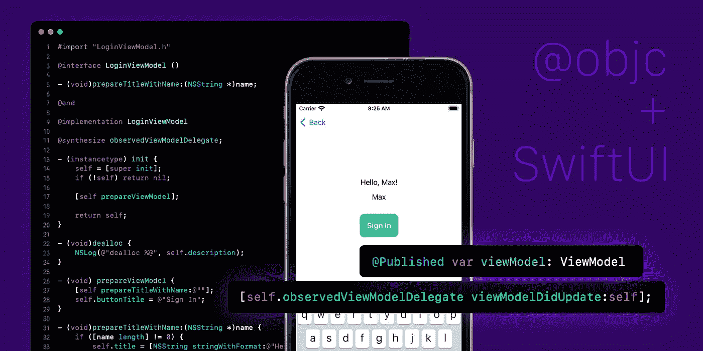
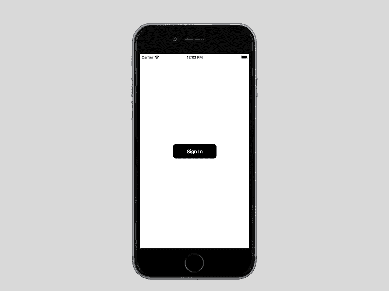
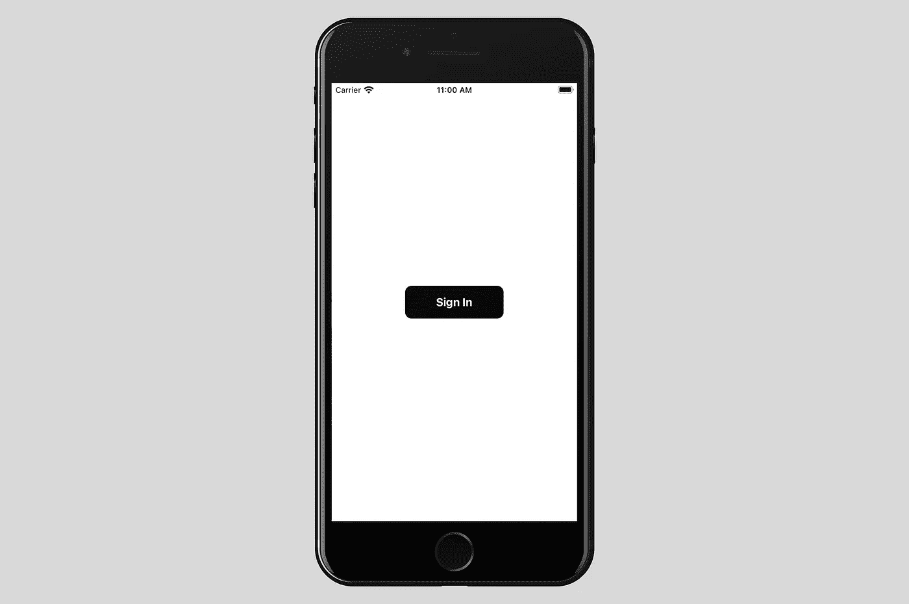
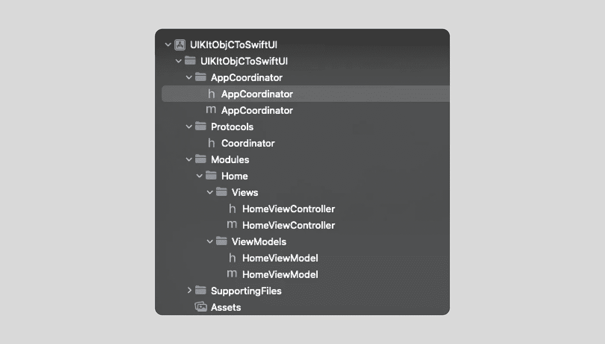
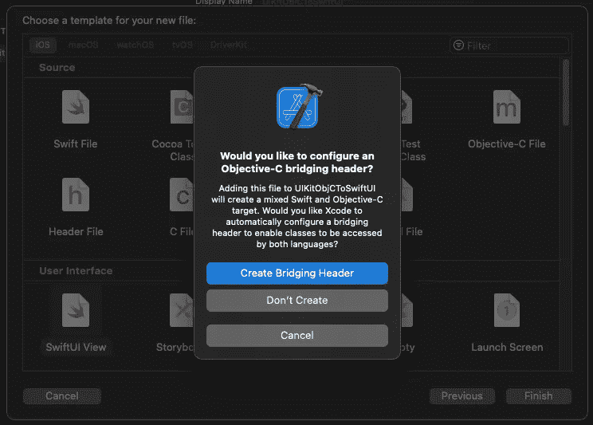
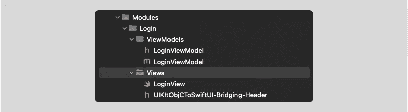
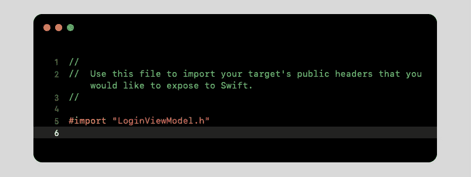
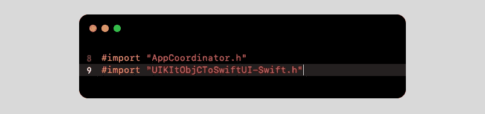
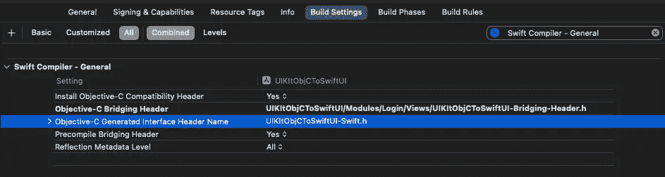

# 使用 MVVM 从 Objective-C 更新 SwiftUI 视图

> 原文：<https://betterprogramming.pub/updating-swiftui-views-from-objective-c-mvvm-9c4f38d6d9c8>

## 探索非标准的情况



在互联网上，在 Apple 文档中，以及在 Medium 上，有大量关于 SwiftUI 的信息，如何从 UIKit 使用它，反之亦然。但是今天，让我们考虑一个在现实生活中并不常见的案例，它有助于反思 iOS 开发中的非标准情况。

任务:从 Objective-C 代码库显示 SwiftUI 视图。此外，当 Objective-C 模型应该是可观察的时，相应的 SwiftUI 应该被更新。

结果:当您从 Home 按下 Sign In 按钮时，View Controller 应该被推送到一个 SwiftUI 视图，其中包含一个标题、文本字段和一个 Sign In 按钮。在编辑文本视图和按下登录按钮时，标题标签应该被更新。



结果呢

# TL；速度三角形定位法(dead reckoning)

[](https://github.com/maxkalik/uikit-objc-to-swiftui) [## GitHub—maxkalik/ui kit-objc-to-swiftui:从 Objective-C MVVM 更新 swift ui 视图

github.com](https://github.com/maxkalik/uikit-objc-to-swiftui) 

# 启动 MVVM+C 项目

从上面的链接克隆项目。存储库有一个 start 文件夹，其中有一个我们将要使用的初始项目。

这个 iOS 应用程序是使用 MVVM +协调员开发的。我同意使用这种架构来解释如何显示 SwitUI 视图并从 Objective-C 更新它们已经有点复杂了，但是我想说，这更像是一种我们需要坚持特定模式的真实情况。别担心，我们现在只有一个屏幕。



主屏幕

项目的结构由几个实体组成:`AppCoordinator`、`Protocols`和 MVVM 模块。`AppCoordinator`只有一个普通的应用协调员。对于协议，我决定在那里存储我们将在项目中使用的所有协议。并且模块组具有屏幕；目前，它只有一个带有黑色登录按钮的主屏幕。



初始项目结构

登录按钮使用了一个典型的协调者代表，我们必须从协调者那里准备显示 SwiftUI 登录视图的解决方案。但是在实现 SwiftUI 视图之前，让我们的任务稍微复杂一点。假设我们已经在 Objective-C 中实现了`LoginViewModel`,并且不允许我们将其重构到 Swift 中。只有`LoginView`应该在 SwiftUI 中实现。


使用 LoginViewModel 的项目结构

好吧。我们来看看`LoginViewModel`。我们有三个`NSString`属性。

`name`属性应该从 SwiftUI TextView 中存储。标题应在文本视图编辑中更改。`buttonTitle`将是“登录”，方法`buttonTap`将改变标题值。没什么疯狂的。

# 桥接 Swift 文件

是时候开始向我们的 Objective-C 项目添加 Swift 文件了。

转到文件新文件 SwiftUI 视图。当将这个文件保存到 Modules/Login/Views/文件夹时，这将更好地保持项目结构。

在这之后，你会被要求创建桥接头，是的，我们需要这个。按创建。



创建桥接标题

您将在视图组中看到两个文件:`LoginViewModel.swift`和`UIKitObjCToSwiftUI-Bridging-Header.h`。



登录模块结构

创建后最初的桥接头将为空。但是我们已经知道我们将要使用`LoginViewModel.h`。所以我们需要导入这个头。



桥接头文件

桥接的最后一步是让我们的 Objective-C 文件看到 Swift 文件。因此，我们需要另一个导入，我们将在`AppCoordinator.m`中这样做。但是过了一会儿。

# SwiftUI 视图和协调界面

目前，我们不使用任何视图模型。我们只需要显示一个带有虚拟数据的纯 SwiftUI 视图。

为了显示 SwiftUI 视图，我们需要使用`UIHostingController`，它将在 Objective-C 世界中扮演`UIViewController`的角色，因此，我们需要创建一个“接口”来连接`AppCoordinator`和 SwiftUI 视图。

是时候过渡一下了，让客观-见斯威夫特。让我们在`AppCoordinator.m`中导入我们的桥接头。



正在导入 UIKitObjCToSwitUI-Swift 标题

对了，别害怕。您会注意到自动完成功能不适用于该邮件头。这个文件的最后一部分应该是`-Swift.h`。如果您对此不确定，请检查:

构建设置 Swift 编译器-通用目标-C 生成的接口标题名称



目标-C 生成的接口题头名称

让我们在 AppCoordinator 中使用所有这些部分，以便更新`(void)showLogin`方法:

运行构建。如果你做的都正确，在主视图控制器上点击登录按钮后，你会看到一个 SwiftUI 视图。

# Objective-C 视图模型和视图模型接口

我们需要使我们的视图模型在 SwiftUI 视图中可见，并且应该更新登录视图的标题。一个`Implementation`将有点类似于`Coordinator`接口，但是有一些额外的增强。

为了统一我们的“可观察”解决方案，我们需要几个协议:`ObservableNSObject`和`ObservableNSObjectDelegate`。代码如下:

ObservableNSObject 和 ObservableNSObjectDelegate

诀窍是使用这些协议来实现所有 Objective-C 模块的一致性，这将在 SwiftUI 和`viewModelDidUpdate`方法中使用。对于视图模型中属性或方法的每次更新，他们都会这样做。

```
@interface LoginViewModel : NSObject <ObservableNSObject>
```

在`LoginViewModel.m`中，更新这些方法:

因为我们准备了要更新的视图模型，所以让我们创建我们的视图模型接口，如下所示:

主要技巧是使用`ObservableNSObjectDelegate`更新已发布的`viewModel`。让我们使用这个视图模型界面来更新我们的`LoginView`。我称之为可观察的。

当然，我们需要更新`Coordinator`界面。如您所见，`SwiftUIViewModelInterface`就像 Objective-C 视图模型和 SiwftUI 视图之间的中间件。

`AppCoordinator` `showLogin`也应该用`LoginViewModel`更新。当然，理想情况下，看到 SwiftUI 对象会很酷，但是 Objective-C 只看到 UIKit 的东西。

就是这样。运行 build，您可以看到它是如何工作的。您可以在项目资源库的`final`文件夹中找到结果:[https://github . com/maxkalik/ui kit-objc-to-swift ui/tree/master/final](https://github.com/maxkalik/uikit-objc-to-swiftui/tree/master/final)

# 包扎

在我看来，这个任务最好的部分是非标准的情况，我相信你很可能不会遇到这种情况。但是在 Objective-C 中使用 SwiftUI 的问题是存在的，为什么不尝试回答一下呢？

我称之为——一项不舒服的任务。意思是这种任务让你很困惑，你一开始不知道具体怎么做这个。他们迫使你跳出框框思考，这会让你更专业。

```
**Want to Connect?**Don't hesitate to follow me on [Twitter](https://twitter.com/maxkalik).I appreciate any suggestions or comments regarding my research and articles.
```