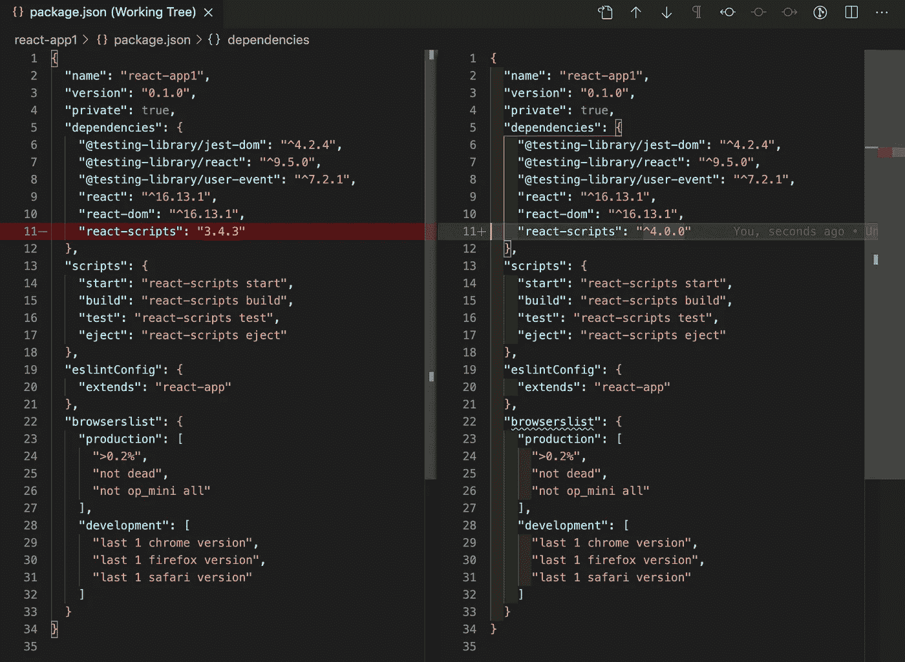
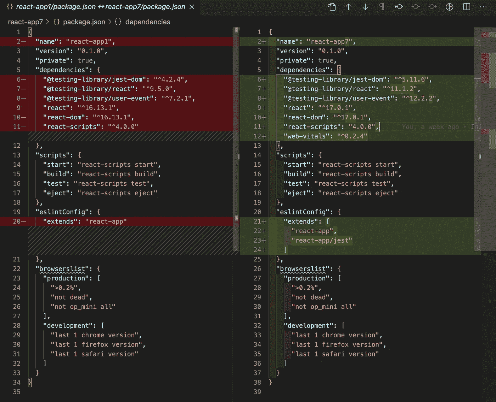
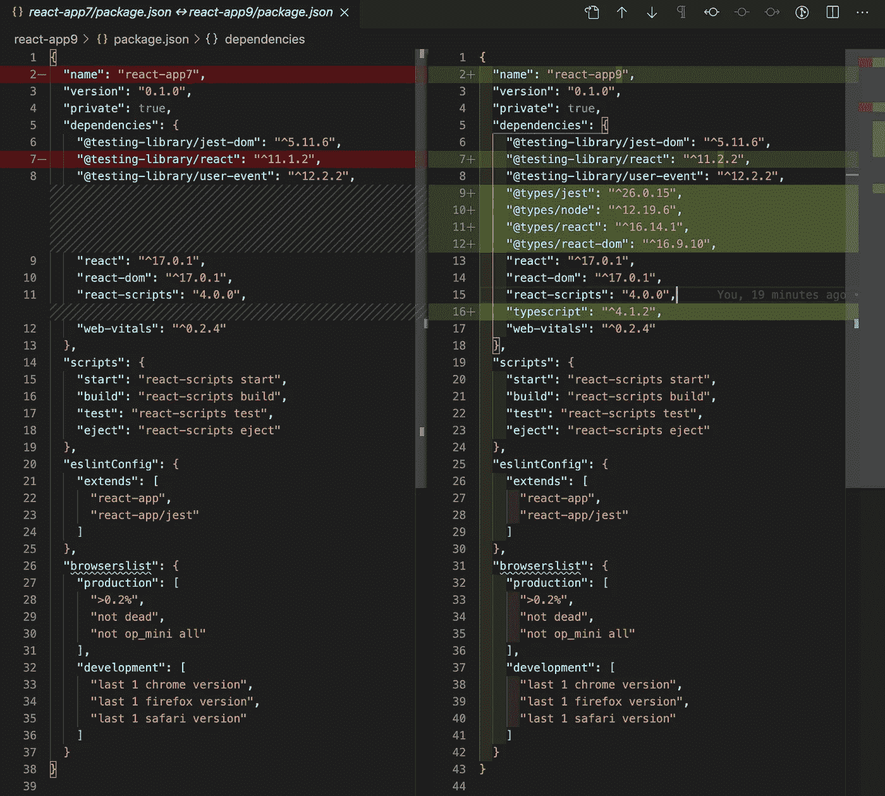
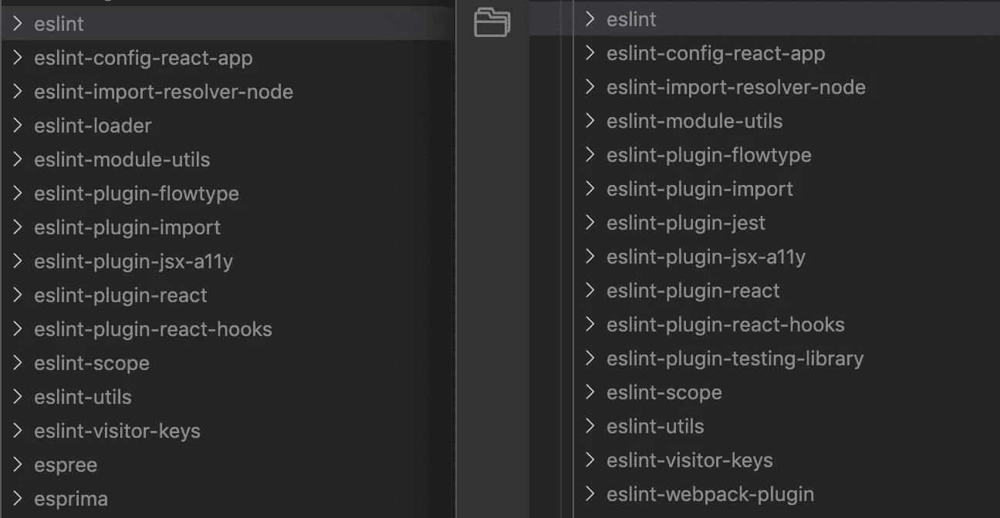
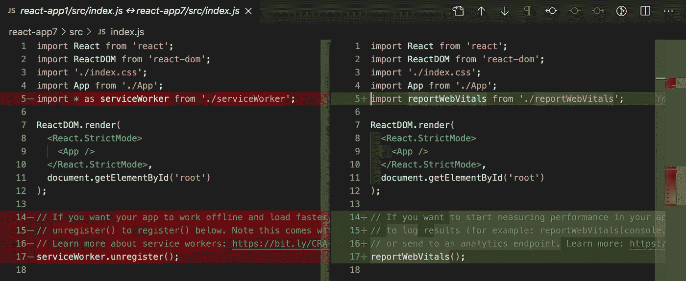
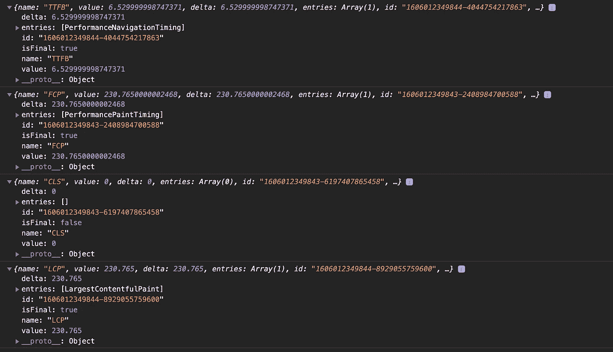

# 将基于 Create React App 的项目升级到版本 4 (CRA 4)

> 原文：<https://betterprogramming.pub/upgrade-create-react-app-based-projects-to-version-4-cra-4-d7962aee11a6>

## 关于如何将基于 Create React App 的项目升级到最新版本的深入指南


作者照片。

[创建 React 应用](https://medium.com/better-programming/10-fun-facts-about-create-react-app-eb7124aa3785)是搭建 React 项目的快捷方式。可以通过命令`npx create-react-app <project name>`轻松生成。然后您就有了 React 项目的最新包和执行环境。方便有效。

新鲜的东西都很棒。

随着时间的推移，会有新版本的 Create React 应用程序具有新的功能和改进。然后呢？

在本文中，我们将使用 Create React App 4 (CRA 4)作为一个示例，来浏览升级基于 Create React App 的项目的过程。

# 升级反应脚本

[官方文档](https://create-react-app.dev/docs/updating-to-new-releases/)建议运行以下命令进行升级:

```
npm install --save react-scripts@latest
```

`react-scripts`包括脚本和配置。通过运行这个命令，我们将`react-scripts`从版本`3.4.3`顺利升级到版本`4.0.0`。

下面是`package.json`的区别:



是的，我们升级了`react-scripts`的版本。然而，如果将`package.json`与新安装的 Create React App 4 的`package.json`进行比较，还有更多事情需要注意:



# 升级 React 版本

最明显的区别是 React 版本。`react`和`react-scripts`保持`^16.13.1`，而最新的 Create React App 则在`^17.0.1`有。

我们必须手动更新`package.json`的[依赖关系](https://medium.com/better-programming/package-jsons-dependencies-in-depth-a1f0637a3129)中的 React 版本:

```
"dependencies": {
  "react": "^17.0.1",
  "react-dom": "^17.0.1",
  ...
}
```

通过执行`npm i`安装 React 17。

我们在另一篇文章的[中介绍了 React 17。这个版本没有新特性，但是`react@17.0.1`提供了延迟加载和深度集成多个版本的 React 的能力。这个*无功能*比任何功能都大，这是一个允许现代新应用与现有传统应用共存的范例的垫脚石。](https://medium.com/better-programming/6-steps-to-create-a-multi-version-react-application-1c3e5b5df7e9)

除了这一根本性的变化，还有其他变化包括:

*   React 16 在底层的`document`级别附加事件处理程序。React 17 将它们附加到呈现 React 树的根 DOM 容器:

```
const rootNode = document.getElementById('root');
ReactDOM.render(<App />, rootNode);
```

有了这一改变，将由一个版本管理的 React 树嵌入到由不同版本的 React 管理的树中是安全的。它还可以更容易地将 React 嵌入到用其他技术构建的应用程序中。

*   React 提供了对新 JSX 变换的支持。有了新的转换，使用 JSX 不需要导入 React。它还编译包大小略有减少的输出。

这个例子来自官方文档:

```
import React from 'react';

function App() {
  return <h1>Hello World</h1>;
}
```

上面的代码被转换为:

```
import React from 'react';

function App() {
  return React.createElement('h1', null, 'Hello world');
}
```

通过新的转换，它变成了:

```
// Inserted by a compiler (don't import it yourself!)
import {jsx as _jsx} from 'react/jsx-runtime';

function App() {
  return _jsx('h1', { children: 'Hello world' });
}
```

`src/App.js`中的以下代码不再需要第 1 行:

# 升级 TypeScript 版本

如果使用 TypeScript，可以通过运行以下命令来创建新项目:

```
npx create-react-app --template typescript <project name>
```

下面是 JavaScript 的 Create React App `package.json`和 TypeScript 的 Create React App `package.json`的区别:



TypeScript 支持 4.1.0 及更高版本中的新 JSX 变换。TypeScript 的 Create React 应用程序中有一个未解决的 bug:

```
TypeError: Cannot assign to read only property 'jsx' of object '#<Object>
```

你得先去掉`tsconfig.json`，然后执行`npm start`。新生成的`tsconfig.json`作品。

# 升级 ESLint

从`react-scripts@3.4.3`到`react-scripts@4.0.0`版本，ESLint 从版本 6 更新到版本 7。



Jest 和 React 测试库的新规则已经添加。通过升级`react-scripts`执行`package.json`中的 ESLint 配置。不需要额外的步骤。

```
"eslintConfig": {
  "extends": [
    "react-app",
    "react-app/jest"
  ]
},
```

# 升级 Jest 和测试库

从`react-scripts@3.4.3`到`react-scripts@4.0.0`版本，Jest 从 24 版本更新到 26 版本。不需要额外的步骤。

但是，升级不包括升级测试库。我们必须在`package.json`中手动进行更改:

```
"dependencies": {
  "[@testing](http://twitter.com/testing)-library/jest-dom": "^5.11.6",
  "[@testing](http://twitter.com/testing)-library/react": "^11.2.2",
  "[@testing](http://twitter.com/testing)-library/user-event": "^12.2.2",
  ...
}
```

通过执行`npm i`安装测试库包。

# 采用快速刷新

[快速刷新](https://github.com/facebook/create-react-app/pull/8582)已取代 React 热加载器。它在热重装期间保留组件状态。

这是改装过的`src/App.js`:

我们看到以下用户界面，并在输入字段中键入`aaa`:


然后在第 8 行，更改`Random Text`并保存。`aaa`的状态保持不变，与热重装无关。

是不是很酷？

# PWA/工具箱改进

创建 React App 4 开关到 Workbox 的 InjectManifest 插件。这允许对服务人员进行更多的控制。此 GitHub 页面提供了变更的详细信息。这是对 PWAs 的增强。

当比较每个`src/index.js`时，我们看到`serviceWorker`已被移除。PWA 模板已被移至他们自己的[库](https://github.com/cra-template/pwa)。



# 网络生命支持

从上面`src/index.js`的对比中，我们也看到`reportWebVitals`被加入。

[Web Vitals](https://github.com/GoogleChrome/web-vitals) 是谷歌 Chrome 团队的一个库，旨在捕捉网页的用户体验。Create React App 4 支持即时可用的 Web 生命体征。但是，对于升级后的项目，需要在`package.json`中手动安装`web-vitals`:

```
"dependencies": {
  ...
  "web-vitals": "^0.2.4"
}
```

添加完依赖关系后，执行`npm i`。

这是改装过的`src/index.js`。第 17 行向`console.log`函数发送报告:

以下是控制台上显示的一些测量值:



我们已经在 Chrome DevTools 的 [Lighthouse](https://medium.com/better-programming/lighthouse-a-performance-and-optimization-tool-for-webpages-e0b4eeaef3e4) 上使用了这些指标。现在，Create React App 4 提供了一个直接从应用程序测量它们的选项。

*   到达第一个字节的时间(TTFB):它测量浏览器接收页面内容的第一个字节的时间。
*   First Contentful Paint (FCP):它测量从页面开始加载到页面内容的任何部分呈现在屏幕上的时间。
*   累积布局偏移(CLS):它衡量视觉稳定性——页面上的元素是否以用户意想不到的方式移动，并可能干扰他们的交互。
*   最大内容绘制(LCP):它测量感知的加载速度，因为它标记了页面加载时间线中页面主要内容可能已经加载的点。

# 结论

Create React App 4 为我们提供了新的功能和性能改进。

如果您已有 Create React App 3 项目，请按照上述说明升级到 Create React App 4。

目前，最新的 Create React App 在版本 5，跟随[这篇文章](/an-in-depth-guide-for-create-react-app-5-cra-5-b94b03c233f2)升级到 Create React App 5。

感谢阅读。我希望这有所帮助。你可以在这里看到我的其他媒体出版物。