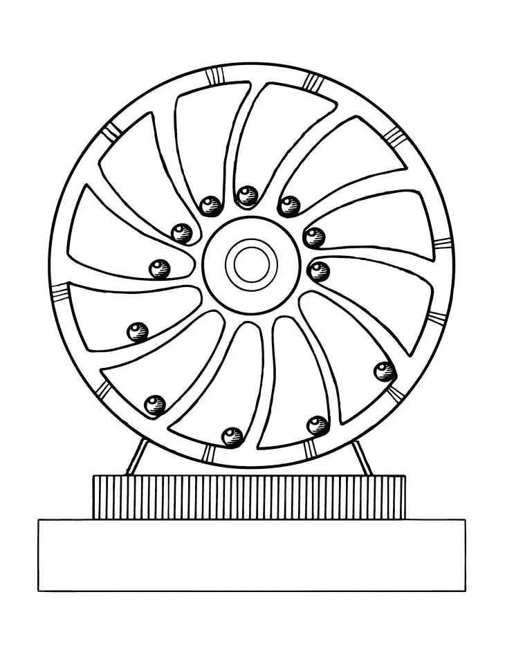
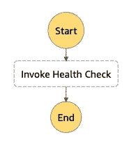
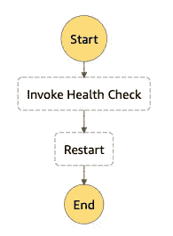

# 使用自动延续的 AWS Step 函数升级您的 Cron 作业

> 原文：<https://betterprogramming.pub/upgrade-your-cron-job-with-a-self-perpetuating-aws-step-function-a1eb2b9b53cd>

## 一个简单的过程来检查谷歌是否在工作

[Firmbee.com](https://unsplash.com/@firmbee?utm_source=medium&utm_medium=referral)在 [Unsplash](https://unsplash.com?utm_source=medium&utm_medium=referral) 上拍照

在我在 Intuit 的团队中，我们建立了一个完全在无服务器平台上运行的微服务主机。这些服务之一需要持续执行相对简单的功能。

这是一个非常常见的需求(想想应用程序健康检查)，直到几年前还通常使用 cron 作业或“while True”循环来实现。然后，像 AWS Lambda 或 ECS 这样的无服务器功能出现了，它允许您在不维护底层基础设施的情况下调度和运行功能。

直到最近，这正是我们实现它的方式。我们有一个 CloudWatch 警报，计划每隔几分钟运行一次特定的 lambda，一切都很顺利。在某种程度上，添加了新的约束，作业变得相当复杂，导致它有不同的运行时和重叠的执行。因此，我的团队决定转向一种新的架构，以消除这些重叠。

在本文中，我们将详细介绍如何使用 AWS Step 函数和 Lambda 创建自动触发下一次迭代的流程。

*本文假设读者对上述 AWS 服务有基本的了解。如果你对其中一些不熟悉，这里有一些有用的链接:*

*   [使用 Lambda 函数和 Amazon Cloudwatch 事件用 AWS 构建一个简单的调度任务](https://medium.com/thelorry-product-tech-data/building-a-simple-scheduled-task-with-aws-using-lambda-function-and-amazon-cloudwatch-event-e92e5e2418cf)
*   [使用 AWS 步骤功能构建无服务器工作流程](https://medium.com/appgambit/building-a-serverless-workflow-using-aws-step-functions-32ea31a59385)

# 运行简单的流程

为了简单起见，我们将描述一个非常基本的过程，并回顾关键的概念和要求。

**谷歌健康检查**

例如，让我们创建一个运行状况检查，每 5 分钟“ping”一次 google.com，以确保它正常运行。

首先，我们将创建一个 lambda 函数，当它被触发时，将向 google.com 发送一个 http 请求，并记录它是否收到 OK 或某种形式的错误或意外响应。

接下来，我们将使用一个阶跃函数来触发这个 lambda。最初，它将是一个简单的状态机，触发 lambda 函数，然后终止。

阶跃函数 DAG

为了部署这两种资源，我们将把它们包装在一个 CloudFormation 模板中。

现在我们有一个运行健康检查的 lambda 和一个触发 lambda 的 step 函数。

我们缺少的最后一点是确保它按计划运行。我们将通过让 step 函数等待 5 秒钟，然后触发自身的新执行来实现这一点

等待..什么？

乍一看，这似乎有点绕弯。"为什么不安排一个单一的云监视警报呢？"你可能会问。

在某些情况下，确认没有重叠的迭代是很重要的(想象一下调用一个有严格限制的服务)。如果流程运行时变化，这可能很难维护，因此您可能更喜欢让每个迭代由前一个触发。

好吧，这是有道理的，但为什么不让我们的步骤函数运行一个无限循环，而不是触发一个新的执行呢？不幸的是，在*一次执行*中，阶跃函数被限制为 25，000 个事件。这意味着最终，执行将达到该限制并停止。
让每次执行触发下一次执行，允许我们保持并发功能的稳定水平，同时也让流程一旦开始就无限期地运行。

# 如何从内部重新启动阶跃函数

以下是更新后的步骤功能描述。注意，当 lambda 函数结束时，我们运行同一个 step 函数的新执行，从而开始流程的下一次迭代。

阶跃函数 DAG

# 包扎

最后，您拥有一个完全在 AWS 无服务器架构上运行的工作的、调度的进程。您可能想要添加一些故障保护、日志记录、监控等。—为这部作品做准备的所有细节。

我们还没有讨论的另一个元素是如何触发 step 函数的第一次执行。有几种方法可以做到这一点，包括手动和自动，但我想我会把它留给另一篇文章。