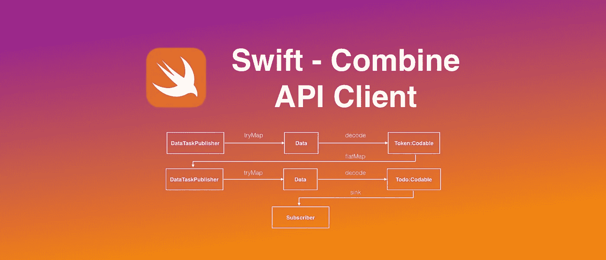
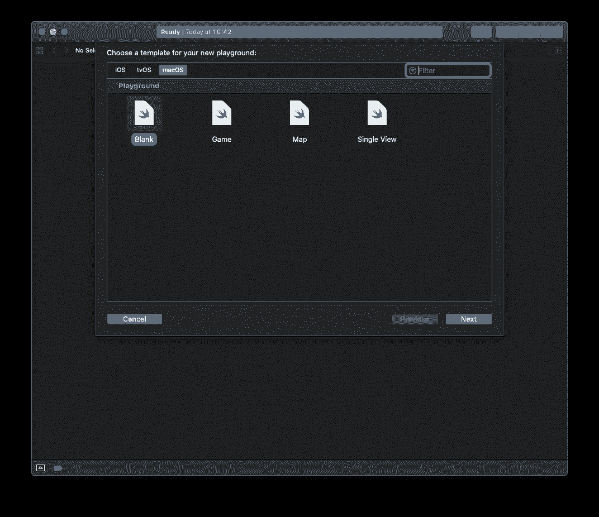

# 使用 Combine 升级您的 Swift API 客户端

> 原文：<https://betterprogramming.pub/upgrade-your-swift-api-client-with-combine-4897d6e408a0>

## 使用 Combine API 和`URLSession`实现一个数据发布器，以及如何将其用作 API 客户端



> “Combine 框架提供了一个声明性的 Swift API，用于随时处理值。这些值可以表示多种异步事件。Combine 声明发布者公开可以随时间变化的值，并声明订阅者从发布者接收这些值。[苹果开发者文档。](https://developer.apple.com/documentation/combine)

苹果在新的 iOS 13 和 [Xcode](https://developer.apple.com/xcode/) 11 中发布的新 [Combine 框架](https://developer.apple.com/documentation/combine)相当隐晦……本文展示了如何使用 Combine API 和`URLSession`实现数据发布器，以及如何将其用作 API 客户端。

本文回答了以下问题:

*   如何使用 Combine 获得 API 响应？
*   你的老客户端 API 和带 Combine 的新客户端 API 有什么区别？
*   使用 Combine 从 API 中检索数据有什么好处？
*   有什么方法可以将我的旧 API 升级为 Combine ready？
*   如何用 Combine 管理嵌套 API 调用？

# 让我们用 Vapor 和 Docker 启动一个演示 API

我们想要一个可以在 Mac 上用 Swift Playgrounds 测试的 API。第一步是获得一个工作的演示 API。

我喜欢 Swift，那么我们为什么不用 [Vapor](https://vapor.codes) 来运行我们的测试 API 和服务器端 Swift 应用呢？

如果你不知道如何安装，请按照这里的说明。然后，在 Mac 上打开一个终端，键入以下内容:

```
vapor new demo-api --template=auth-template
```

你可以尝试使用`vapor run`来运行这个应用，但目前，macOS 15 beta 和 Xcode 11 beta 运行起来不太可靠。

为了确保 Vapor 应用程序能够以正确的 Swift 版本运行，我们将使用 [Docker](https://www.docker.com/) 来构建和运行它。如果你还没有安装 Docker，从这里[安装到你的 Mac 上](https://www.docker.com/products/docker-desktop)，然后用 Vapor 代码运行 Docker 容器:

```
cd demo-apicp web.Dockerfile Dockerfiledocker build . -t demo-api:latest
```

使用下一个命令，您将创建您的 REST API，它监听`8080`端口:

```
docker run -p 8080:80 --env ENVIRONMENT=DEV demo-api:latest
```

如果一切顺利，您应该会看到以下消息:`Server starting on [http://0.0.0.0:80](http://0.0.0.0:80)`

让终端保持 Docker 打开，并检查 API 的工作情况。打开新的终端窗口并键入:

输出应该是:

```
{"id":1,"email":"user@example.com","name":"user"}
```

太好了，你做到了！您已经在演示 API 中添加了第一个用户。

# 我们的旧 API 客户端看起来像什么？

首先，你需要用 Xcode 11(目前是 beta 4)为 Mac 创建一个新的空白平台。



为其命名，并复制/粘贴以下代码:

[https://gist . github . com/b 20 e 96 cc 1950 c 9d 60 Fe 91 da 9 e 1122722 . git](https://gist.github.com/b20e96cc1950c9d60fe91da9e1122722.git)

旧客户端已经使用`dataTask`函数实现，必须在闭包内使用。

运行操场，检查你现在已经创建了`user2`。

# 如何使用 Combine 获得 API 响应

现在，添加以下代码行，使用 Combine 获得相同的结果:

[https://gist . github . com/9 F3 e 5637 FB 48d 15d 607d 5666790 a04b 6 . git](https://gist.github.com/9f3e5637fb48d15d607d5666790a04b6.git)

已经使用`dataTaskPublisher`功能实现了新的客户端。它返回一个*发布者*。

要使用它，需要*订阅*。接收功能是一个*用户*。

# 当我们解码有效载荷时，两个 API 调用之间的区别

一个好的应用程序客户端提供接收到的原始数据和内部`class` es 和`struct` s 之间的映射。`Codable`协议使得将原始 JSON 数据转换成`struct` / `class`数据变得容易。

[https://gist . github . com/11c 05181 b8a 33343 a 0925 e 719 e 99 a4 AE . git](https://gist.github.com/11c05181b8a33343a0925e719e99a4ae.git)

老客户(`dataTask`):

*   完成处理程序很容易使用，但是在嵌套调用的情况下变得不可读。

新客户端(`dataTaskPublisher`):

*   写起来有点难，但是作为一个管道读起来很容易。嵌套调用可以流水线化。

# 将旧 API 升级为组合就绪的途径

使用`Future`，我们可以将旧的`dataTask`转换为发布者。

[https://gist . github . com/efb 5 FB 59 c7d 0296911944 FCC 8 e 7 DC 2 AC . git](https://gist.github.com/efb5fb59c7d0296911944fcc8e7dc2ac.git)

# 使用组合的完整 API 客户端定义

这里是用`dataTaskPublisher`实现的完整 API。以后会用到。

[https://gist . github . com/66bd 76060 c 7397 af 6 ce 9973 ab 73 aa 153 . git](https://gist.github.com/66bd76060c7397af6ce9973ab73aa153.git)

# 发布者实现

`DataTaskPublisher`现在被流水线化，以获得具有解码的`struct`的发布者。

定义了一个`validate`函数来验证`response.statusCode`。

管道:

```
DataTaskPublisher—(tryMap with validate)→Data-(decode)→AnyPublisher
```

[https://gist . github . com/2 ff 5 ce 8c 284 f 0e 3 abdfb 71823384 EDF 4 . git](https://gist.github.com/2ff5ce8c284f0e3abdfb71823384edf4.git)

# 使用您的 Combine API

是时候对接收器订户使用 publish 了。

[https://gist . github . com/89b 99 add 2246 ad 828070411 e 6271 b7b 6 . git](https://gist.github.com/89b99add2246ad828070411e6271b7b6.git)

# 合并出版商

在前面的例子中，登录后接收到一个`Token`。

要发布一个`Todo`，我们需要用它作为`postTodo`的参数。

在这里，我将向您展示这两个调用是如何流水线化的。

管道:

```
[AnyPublisher]-(map)-(flatMap)->[AnyPublisher]
```

[https://gist . github . com/5072d 81 B2 d73 f 385d 07 AC 317 e 657 de 53 . git](https://gist.github.com/5072d81b2d73f385d07ac317e657de53.git)

仅此而已！感谢阅读全文，我希望你喜欢它。

这里完整的[游乐场项目](https://github.com/Andrea-Scuderi/CombineDemoAPIPlayground.git)

# 清除

完成后别忘了停止你的 Docker 镜像！

```
docker ps -aCONTAINER ID        IMAGE               COMMAND                  CREATED             STATUS                       PORTS                  NAMES16edf993e50f        demo-api:latest     "/bin/sh -c './Run s…"   3 hours ago         Exited (255) 3 minutes ago   0.0.0.0:8080->80/tcp   elastic_poitras
```

上面的代码会给出 Docker 容器的列表。

获取容器名，在我的例子中是`16edf993e50f`。

```
docker stop 16edf993e50f
```

移除图像:

```
docker rm 16edf993e50f
```

# 参考

 [## 结合

### Combine 框架提供了一个声明性的 Swift API，用于随时处理值。这些值可以代表许多…

developer.apple.com](https://developer.apple.com/documentation/combine)  [## 结合实践- WWDC 2019 -视频-苹果开发者

### 扩展您对 Combine 的了解，Combine 是 Apple 新的统一声明式框架，用于处理随时间变化的值。学习…

developer.apple.com](https://developer.apple.com/videos/play/wwdc2019/721) [](https://developer.apple.com/videos/play/wwdc2019/712/) [## 网络进步，第一部分- WWDC 2019 -视频-苹果开发者

### 通过在所有平台上利用现代网络框架，跟上新的和不断发展的网络协议和标准…

developer.apple.com](https://developer.apple.com/videos/play/wwdc2019/712/)  [## 使用联合收割机

### 我们编程的系统中有许多部分可以被看作是异步的信息流——事件…

heckj.github.io](https://heckj.github.io/swiftui-notes/) [](https://theswiftdev.com/2018/11/15/docker-loves-swift-and-vapor/) [## Docker 喜欢 Swift & Vapor - The.Swift.Dev

### 了解如何在 Docker 容器中运行 Swift & Vapor。你对 Docker 完全陌生吗？这篇文章只是为了…

theswiftdev.com](https://theswiftdev.com/2018/11/15/docker-loves-swift-and-vapor/)