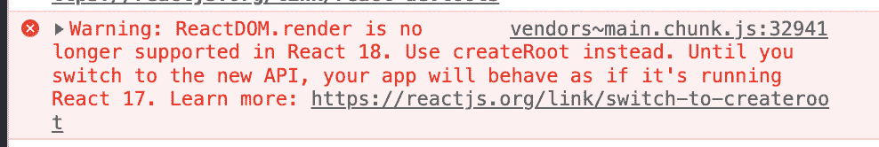
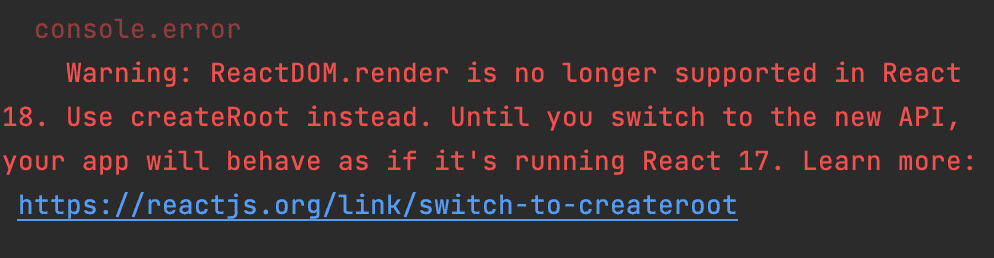

# 升级到 React 18 并不难。下面是怎么做的。

> 原文：<https://betterprogramming.pub/upgrading-to-react-18-isnt-that-hard-here-s-how-to-do-it-bf054418b782>

## 迁移变得简单

照片由 [Ignacio Amenábar](https://unsplash.com/@amenabarladrondeguevara?utm_source=medium&utm_medium=referral) 在 [Unsplash](https://unsplash.com?utm_source=medium&utm_medium=referral) 上拍摄

我们看到许多人和公司在从 React 库的早期版本迁移到最新版本 React18 时遇到了问题，并认为很难将我们的微前端应用程序从 React16 升级到 React18，以及所有的测试。

*事实证明，没有那么难。事实上，这很简单！*

我们做得很快，没有弄坏任何东西。我们将整个应用程序迁移到最新的 React、反冲和测试库版本，没有遇到任何问题。

在本文中，我们将分析我们为了轻松迁移到新版本的库而采取的措施。

# React18 有什么新内容？

React-dom API 正在改变。这是问题最快的答案。

这篇文章并不打算深入研究 React18，因为在这个版本问世之前，很多东西都受到了限制或被否决，其他功能也只是一些小变化(如`renderToPipeableStream`或`useEffect`或`StrictMode`)。

当然，从我们的角度来看，我们正在反映所有这些变化，(React16 代码库)，我们已经在使用功能组件来更容易地使用钩子，例如`useEffects`。

# 通过几个简单的步骤迁移到 React18

*再说一遍，这是我们的亲身经历。对于其他人或在其他环境中可能会有所不同。*

首先，我们需要清理所有旧的依赖项，并通过 npm 审计检查其他依赖项的安全问题。它总是关于节点模块。

在这个“预挂钩”之后，我们验证了官方的 [React changelogs](https://reactjs.org/blog/2022/03/29/react-v18.html) ，然后升级了 React 包，并开始获得我们计划看到的错误，例如 ReactDom 包更改了它的 API:

即使在 test env 中，错误也如下所示:

通过分析这些错误，我们更改了不推荐使用的 render 方法，并更新了`testing-library/react`,仍然可以成功运行单元测试。

由于我们已经在使用功能组件，所以`useEffect`的微小变化不会影响我们，但我们添加了最新的`StrictMode`来验证这一点(它仅在开发模式下可用)。

React 版本中的另一个主要变化与`Suspense`的用法和它的树有关，现在总是一致的。我们没有遇到任何问题。

最后，我们需要将反冲 JS 升级到最新版本，以支持最新的 React 版本。否则，应用程序会在到达第一个状态时崩溃。

我们开始了，我们刚刚完成了迁移。

我们需要升级这几样东西来完成所有微前端应用的迁移过程。

由于我们的远见卓识，带来了我们正在使用的最新版本的软件包，这一过程变得很容易，而不用担心需要做的时间、努力和无聊的事情。

# 要点:总是升级你的依赖和方法

正如我所说，我们是从 React16 中的代码库迁移过来的。

*每当发布新的主要版本时，你们中有多少人会更新依赖项？*

减少迁移过程中的工作和困难的一个好方法是在 sprint 期间安排一个“升级任务”作为微小的工作负载，以避免可能导致大量时间浪费的批量升级。

当然，我们需要时间来进行更新，但是更新一些东西而不是一个完整的代码库更容易控制。

*“好的，但是我的经理/项目经理不让我安排这些维护任务！”*

不幸的是，我听到很多人都遇到了这个问题。与您的经理交谈，让他们了解更新技术堆栈的重要性，并说明这有利于安全。

*“我讨厌升级或审计我的依赖项。这很无聊，也很难完成。”*

这个时期不应该存在于好的环境中。

当然，审计和更新依赖关系并不有趣，但这是我们工作和职责的一部分。

*做一个更好的开发者，升级你的依赖。*