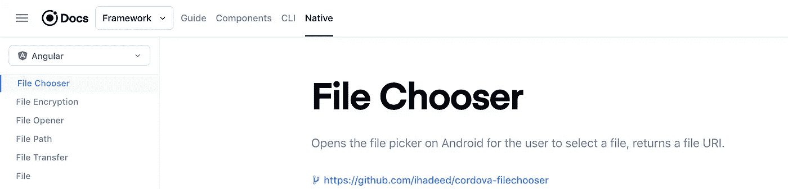

# 如何在 Ionic/Angular 应用程序中上传文件

> 原文：<https://betterprogramming.pub/upload-files-in-ionic-angular-apps-784f0c382eb0>

## 这涵盖了一种相当受支持的将本地文件加载到 Ionic 应用程序的跨浏览器方法

照片由[凯利·麦克林托克](https://unsplash.com/@kelli_mcclintock?utm_source=medium&utm_medium=referral)在 [Unsplash](https://unsplash.com?utm_source=medium&utm_medium=referral) 上拍摄

当使用设备的文件系统时，方法的选择通常取决于您的用例。

例如，如果您需要“写入”用户文件系统的能力，您肯定希望利用一种具有有效用户权限的方法来做到这一点，对于 [Ionic](https://ionicframework.com/) 应用程序，这将意味着 [Cordova](https://cordova.apache.org/) 或 [Capacitor](https://capacitor.ionicframework.com/docs/plugins/) 插件以及为其设置的请求访问用户文件系统的有效权限。

Ionic framework 网站上列出的至少有六个[插件可供选择。哪个才是真正符合你需求的？](https://ionicframework.com/docs/native/file-chooser)

https://www.ionicframework.com

实际上，我们通常只需要对用户的文件系统有“读取”权限，并允许他们上传文件(比如图片)。

在这个特定的用例中，我们可以依赖 web 标准并利用浏览器的文件阅读器 API，它最近在所有现代浏览器中获得了相当好的支持。

# 模板代码

让我们创建一个标准的`<ion-button>`并将类型为`“file”`的`<input>`元素添加到其中。我们还可以利用`accept`属性来声明我们允许用户上传哪些 [MIME 类型](https://developer.mozilla.org/en-US/docs/Web/HTTP/Basics_of_HTTP/MIME_types/Common_types):

模板端实现

请注意，我们还向 input 元素添加了一个(change)事件监听器，而不是按钮本身的(click)监听器。

`ion-button`将被点击，除非我们阻止用户事件的传播，否则我们的 input 元素将捕获它，因此我们可以在下面的 TypeScript 代码中处理它。

# 打字稿代码

让我们创建一个方法，使用文件读取器来获取作为“blobs”的文件:

这样，我们的应用程序获得了 blob，我们可以创建一个内部对象 URL，并使用它通过``或`<ion-img>`元素来呈现图像(请注意，您需要使用 Angular 中的 [DOMSanitizer 来“净化”这样的 URL)。](https://angular.io/api/platform-browser/DomSanitizer)

文件阅读器也支持[数据 URL](https://developer.mozilla.org/en-US/docs/Web/API/FileReader/readAsDataURL) ，我们可以这样重新编写方法:

使用上面的代码是有益的，因为每个平台(Android、Safari、Windows)都有自己的“原生”UX，供用户指向要上传的文件。

同时，对于这个“读取”用例，我们不必引入和处理任何外部插件。

感谢您的阅读！