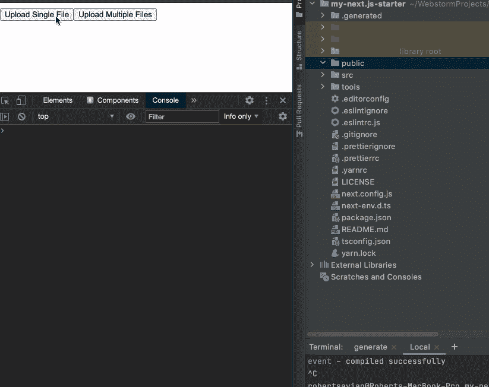

# 使用 API 路由将文件上传到 Next.js

> 原文：<https://betterprogramming.pub/upload-files-to-next-js-with-api-routes-839ce9f28430>

## 如何使用 React、next-connect、Multer 和 axios 将文件上传到 Next.js 应用程序

由 [SpaceX](https://unsplash.com/@spacex?utm_source=unsplash&utm_medium=referral&utm_content=creditCopyText) 在 [Unsplash](https://unsplash.com/?utm_source=unsplash&utm_medium=referral&utm_content=creditCopyText) 上拍摄的照片

我将简要介绍如何使用 React 和 [Next.js API routes](https://nextjs.org/docs/api-routes/introduction) 上传文件。在本文中，我将假设您熟悉添加 npm 包和使用下一个的[。js，并且您之前已经创建了一个 API 路由。](https://nextjs.org/)

下面是一个 Next.js API 路由的简单示例。

下一个 API 路线

为了使向 API 路径添加中间件变得更容易，我们将使用 [next-connect](https://github.com/hoangvvo/next-connect) 库。

# 下一步-连接

next-connect 是 Next.js、Micro 或 Node.js HTTP 服务器的路由器和中间件层。它将使方法路由和添加中间件更加容易。

添加了 next-connect 库之后，我们可以将上面的 API 路由代码重构为下面的 next-connect 格式。语法非常类似于 [Express.js](https://expressjs.com/en/starter/basic-routing.html) 。

下一个连接 api 路由

现在我们已经更新了 Next.js API 路径，我们可以将 [Multer](https://github.com/expressjs/multer) 中间件库添加到 next-connect 中，为我们处理文件上传。

# 穆尔特

Multer 是一个节点中间件，用于处理多部分/表单数据，主要用于上传文件。

添加 Multer 库之后，让我们将它添加到上面的 API route 代码中。阅读下面例子中的注释，了解我们如何将 Multer 添加到 next-connect 中。

*   查看第 6–11 行，我们创建一个 Multer 实例，并提供一个 config 对象来设置[存储类型](https://github.com/expressjs/multer#storage)。我们将`destination`设置为`public/uploads`，这样上传的文件就可以被 Next.js 应用公开访问。`destination`可以是一个字符串或一个函数。当`destination`是一个函数时，你负责创建目录结构。对于`filename`，我们使用一个函数从上传的文件中获取原始名称。
*   查看第 16 & 19 行，我们在做`upload.array(‘theFiles’)`时创建了实际的中间件。**注意:**我们在上面的例子中使用了`.array()`，它允许我们上传多个文件，但是 Multer 有其他的方法，比如`.single()`，只上传一个文件。阅读文件，看看哪一个最适合你的情况。最后，我们将创建的中间件传递给`apiRoute.use()`，next-connect 将在 API 路径中使用它。

这就是设置 Multer 的基本实现，但是还有一个步骤来完成我们的文件上传 API 路径。

# **Next.js API 路由配置**

我们不能忘记最后一步。默认情况下，Next.js 会自动解析 API 请求体。我们需要禁用正文解析，这样我们就可以将正文作为一个流来上传文件。

每个 API 路由可以导出一个`config`对象来改变默认配置。

下面，注意`export default apiRoute;`后面的`config`对象。这就是我们如何使用 Next.js [自定义配置](https://nextjs.org/docs/api-routes/api-middlewares#custom-config)对象来禁用主体解析。

Next.js API 路由配置主体解析器

## 最终 API 路由代码

以下是使用 Next.js API 路径上传文件所需的所有代码:

# React 和 axios

为了完成 Next.js 中的文件上传，我们需要创建一些 React 组件，并使用 [axios](https://github.com/axios/axios) 发出文件上传请求。

下面是一个动画，展示了我们的应用程序将如何允许我们使用上面创建的 Next.js API 路径上传单个或多个文件。

在我们进入 React 代码之前，让我们看看我们应该如何设置 axios 来处理上传文件，同时给我们一种方法来显示正在上传的文件的进度。

## axios

axios 是一个基于 promise 的 HTTP 客户端，用于浏览器和节点。

在向您展示 React 和 axios 之前，我想强调一下 axios 代码本身。

*   第 3 行我们需要用`content-type`的`multipart/form-data`来设置请求头，这样 API 将知道如何处理接收到的数据。
*   第 4–6 行是我们获取正在上传的文件的进度状态的地方。
*   第 9 行是对我们上面创建的`‘/api/uploads’` API 路由的`POST`请求。我们传递`formData`和`config`对象来完成这个请求。

## 反应

下面是 React 页面组件中的 axios 代码。注意到`onChange`被传递给了`UiFileInputButton`组件。`UiFileInputButton`组件负责创建我们传递给`onChange`方法的`[FormData](https://developer.mozilla.org/en-US/docs/Web/API/FormData)`对象，该方法将向我们的 API 路由发出上传请求。

需要指出的重要一点是`‘theFiles’`的`uploadFileName`值。如果您查看 API 路由代码，您也会在`upload.array(‘theFiles’)`中看到该值。这是字段名，React 和 API route 需要有相同的值才能工作。

下面的 TypeScript `UiFileInputButton`文件只是包装了一个[文件输入](https://developer.mozilla.org/en-US/docs/Web/HTML/Element/input/file)和一个按钮。我想指出的一个主要部分是`onChangeHandler`代码。查看第 22–28 行，您会看到我们从`event.target.files`获取给我们的文件，并将它们附加到一个`FormData`对象，因此父代码只需要处理请求的`FormData`。

# 结论

我已经简要介绍了使用 React 和 Next.js API 路由上传文件所需的代码。这对我来说是一个实验，我还没有将代码部署到任何托管解决方案中。现在，该由您来研究如何将这些代码用于 React/Next.js 应用程序的生产了。

查看我的[示例分支](https://github.com/codeBelt/my-next.js-starter/tree/upload)来看看这段代码是如何工作的。

# 后续步骤

*   了解更多关于 [Multer](https://github.com/expressjs/multer) 的信息
*   了解更多关于[下一个连接](https://github.com/hoangvvo/next-connect) ( [Next.js API 路由使用下一个连接](https://youtu.be/TvCu_oK083U))
*   了解更多关于 [axios](https://github.com/axios/axios) 的信息

如果你喜欢这篇文章，请分享它，阅读我的其他[文章](https://medium.com/@robertsavian)和/或用我下面的推荐链接注册 Medium。谢谢！

 [## 通过我的推荐链接加入 Medium—Robert S(代码带)

### 作为一个媒体会员，你的会员费的一部分会给你阅读的作家，你可以完全接触到每一个故事…

medium.com](https://medium.com/@robertsavian/membership) 

-