# 在 Rails 和 React 应用程序中将文件直接上传到 AWS

> 原文：<https://betterprogramming.pub/uploading-files-directly-to-aws-in-a-rails-react-app-9188f4eb6f7e>

## 我希望在自己实施之前有一个指导

图片由 [kreatikar](https://pixabay.com/users/kreatikar-8562930/) 在 [Pixabay](https://www.needpix.com/photo/1605341/upload-online-internet-files-cloud-technology-network-data-computer) 上拍摄

自从我的上一篇文章以来，我已经构建了两个全栈 Rails/React 应用程序，其中一个是爱好/激情项目， [ShowJunkie](https://showjunkie.herokuapp.com) (演示登录:`guest@showjunkie.com`，密码:`ShowJunkiePerson`)，另一个是我的个人作品集(今天讨论的主题)。

因此，我决定冒险重写我的个人作品集，为了更好地满足我的好奇心，我决定将我的项目图片直接上传到 AWS，并将链接存储在我的 Postgres 数据库中，供我的客户端 React 应用程序参考。

嗯，我成功了——但不是没有无数次击掌庆祝，无数次质疑我作为开发人员的技能。为了避免其他人再次经历我的最后两天，我决定写这篇指南。

事不宜迟，我给你一个你需要的指南:

*   设置 AWS 存储桶
*   生成一个预先设计好的 URL，用于 Rails API 的上传，并将其发送到 React 应用程序
*   使用 React 应用程序将图像上传到 AWS
*   将图像链接存储在数据库中，以便以后在应用程序中引用

那为什么呢？为什么直接上传到你的 AWS S3 桶，而不是先上传到你的 Rails 应用程序，然后再上传到 AWS S3 桶？答案是*你的用户。*可以节省大量的时间，直接提升你的用户对你的应用的体验。

想想看，如果您采取后一种方式，即先上传到您的 Rails 应用程序，然后再发送到存储桶，首先，您会给服务器增加一倍的工作量，给用户增加一倍的等待时间——更不用说上传中途失败并需要重启的可能性了。太可怕了。

解决办法？充当中间人的 AWS S3 铲斗。我们一直在谈论的这个桶是什么？把它想象成一个存在于网络上的文件夹。它可以有许多子文件夹，可以保存无限的智慧，或者说，文件。我们开始吧，好吗？

# **第一步**

第一个合乎逻辑的步骤将是前往 [AWS](https://portal.aws.amazon.com/billing/signup#/start) ，创建一个帐户(不要担心——他们提供 12 个月的免费层，你可以用来练习)，并登录控制台。注册表单如下所示:

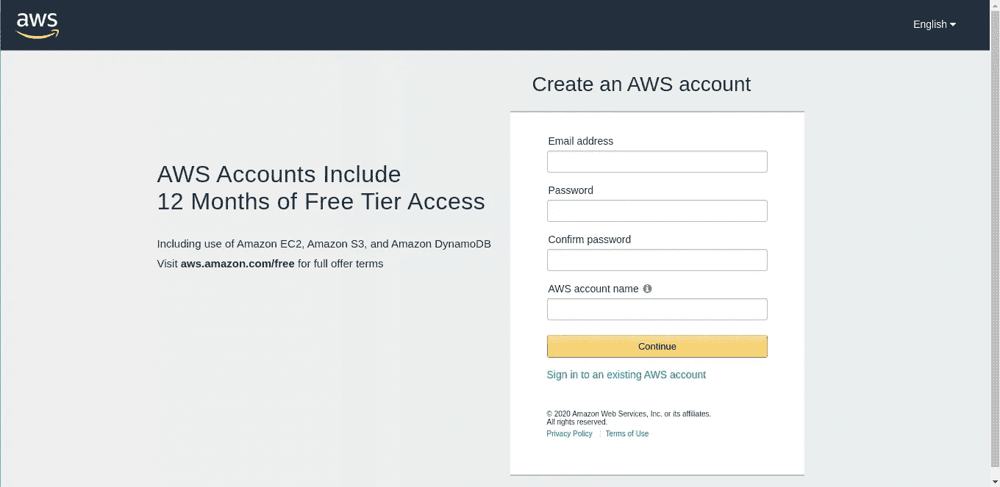

注册后，使用您的凭证登录控制台，您会发现自己在如下屏幕所示的位置:

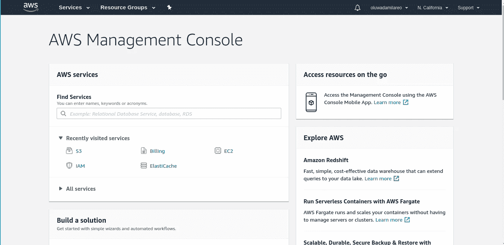

单击导航中的服务下拉菜单，并在搜索框中键入`S3`，如下所示:

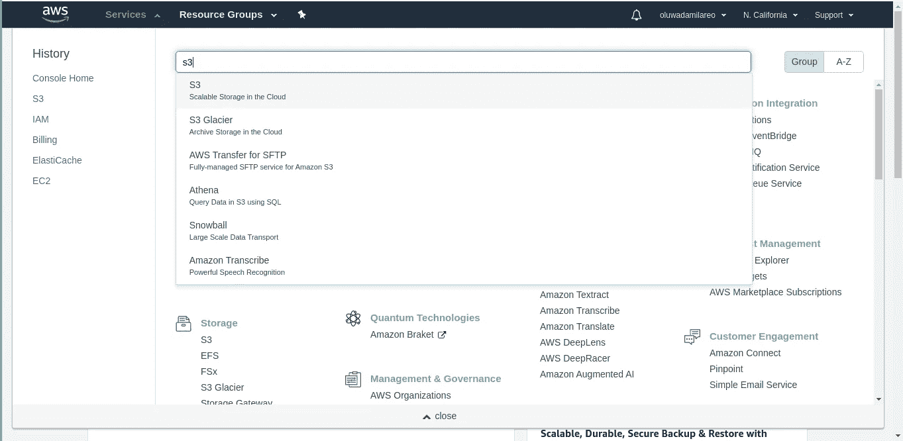

选择顶部的 S3 选项，它将带您到 S3 管理控制台，在那里我们将配置您自己的 S3 桶。正如你在下图中看到的，我有一个非常活跃的 Rails API。

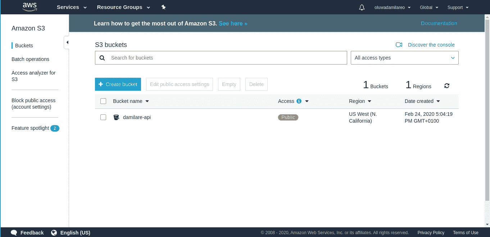

创建一个存储桶，并按照提示进行操作。在“配置选项”面板中，您不必勾选任何框，只需转到“设置权限”在这里，取消选中“ *all* public access”框(一旦你确定你需要它或者你的应用程序将正确运行它，你就可以打开它)。移动到预览窗格，并创建 bucket。没那么糟，对吧？

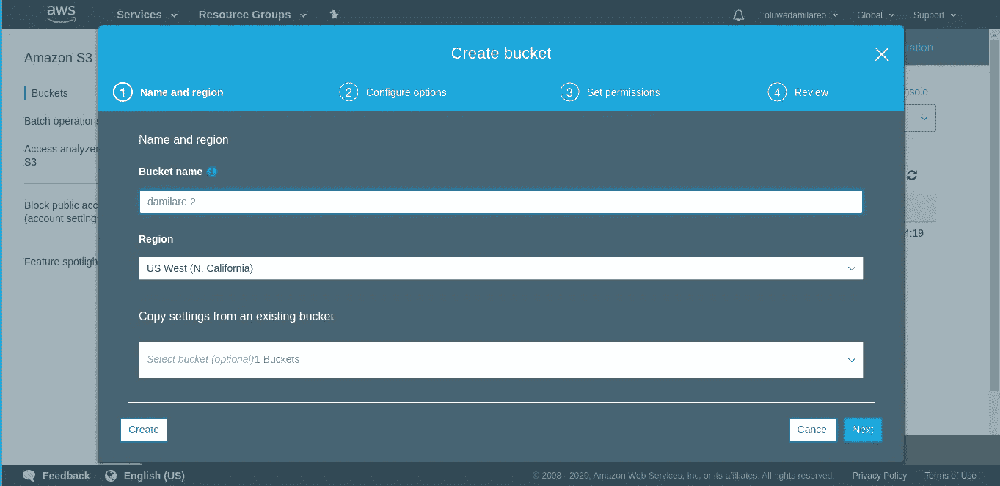

创建一个桶看起来像什么

# 第二步

通过单击列表中的存储桶，为您的存储桶生成一个策略。单击“permissions”选项卡，滚动到底部，点击“policy generator”链接，这将带您来到这里:

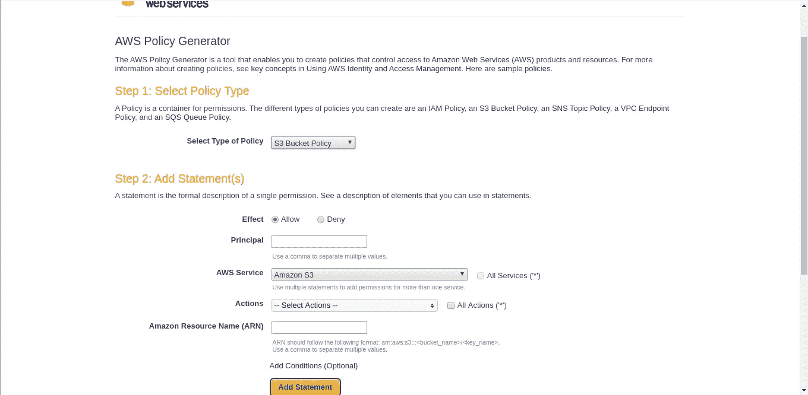

请记住，在“选择保单类型”下拉列表中选择 S3 桶装保单。你的本金会采取以下格式:`arn:aws:iam::${YOUR_ACCOUNT_ID_HERE}:root`。

您可以在 AWS 控制台的“帐户设置”下的“我的帐户”部分的顶部找到您的帐户 ID。您可以在单击“Bucket policy editor”旁边的策略生成器时找到您的 ARN:

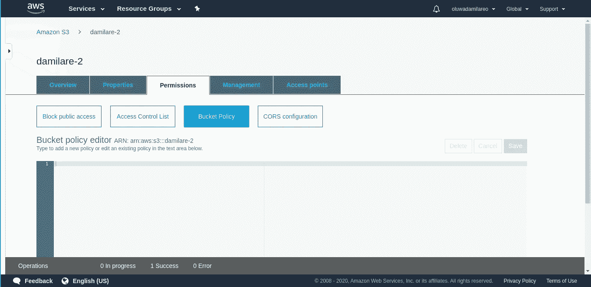

通过选择动作下拉菜单中的`GetObject`和`PutObject`完成策略。然后，单击“生成策略”，复制策略，并将其粘贴到上图的窗口中。

将`/*`添加到资源值的末尾(它引用您的整个 bucket 目录—记住 *bucket* 是天空中文件夹的一个别出心裁的名字)，否则在尝试保存策略时，您会得到这个错误`Action does not apply to any resource(s) in statement`。保存政策，你就可以继续前进了。该策略应该如下所示:

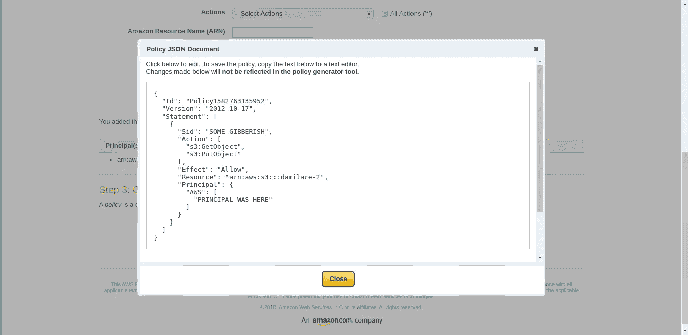

示例 S3 时段的生成策略

# 第三步

移至“访问控制列表”(ACL)选项卡，在“公共访问”下，启用如下图所示的选项。同样，当你完成后，如果你确定你的应用程序在有/没有这些权限的情况下都能正常运行，你可以随时更改这些权限。

移至“CORS 配置”选项卡，粘贴我在下图中输入的 [CORS](https://developer.mozilla.org/en-US/docs/Web/HTTP/CORS) 配置:

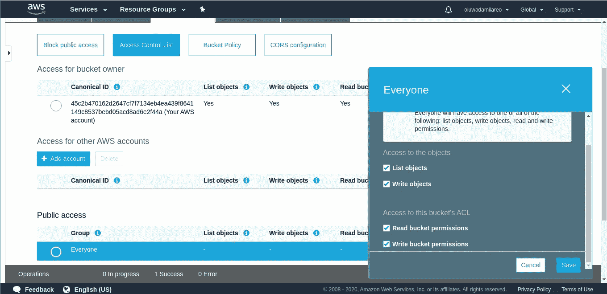

通过 ACL 启用对您的存储桶的公共访问

CORS 构型

一定要把第二个`CORSRule`中的`[www.yourdomain.com](http://www.yourdomain.com)`替换成你自己的网址，或者如果你的网址不需要的话，删除那个`CORSRule`。在我继续之前，请注意`http://`和`https://`是故意的，不，这不是我的强迫症。我注重细节，但事实并非如此——这种实施工作取决于他们的存在。我艰难地找到了答案。

# 第四步

在导航栏中，单击下拉菜单中的用户名，并在此选择“我的安全凭证”。我们将添加一个用户，并为该用户创建策略。此用户的凭据将用于登录您的 URL，请密切关注。

在该页面左侧的菜单中，选择“Users”，创建一个用户，并授予该用户编程访问权限。点击下一步，点击“直接附加现有策略”标签，搜索`s3`，选择“AmazonS3FullAccess”。跳过可选标签，查看并创建用户。

整个流程应该如下所示:

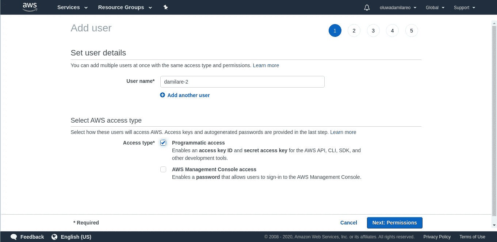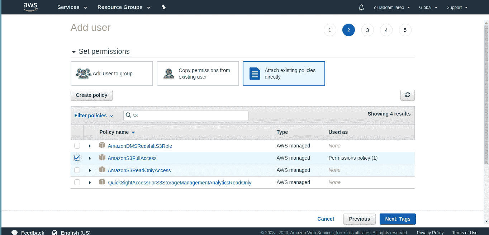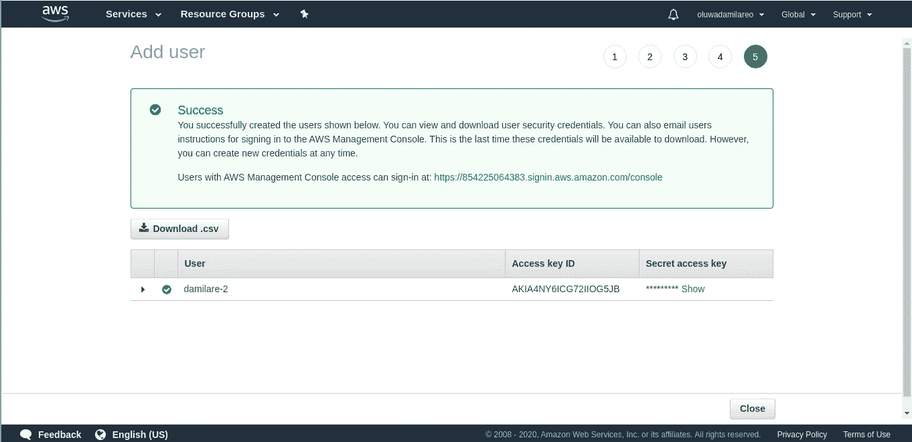

用户凭据

复制上面窗口中的访问密钥 ID 和秘密访问密钥，并系好安全带——好戏即将开始。

# 第五步

将`gem 'aws-sdk'~2`添加到 Rails 应用程序的 Gemfile 中，并在终端中运行`bundle`。

使用上图中最后一步的凭证，在你的 Rails 应用程序的配置目录中创建一个`.local_env.yml`，并添加你的凭证，如下图所示。

**注意:**记得把这个文件加到你的`gitignore`里，否则后果自负！

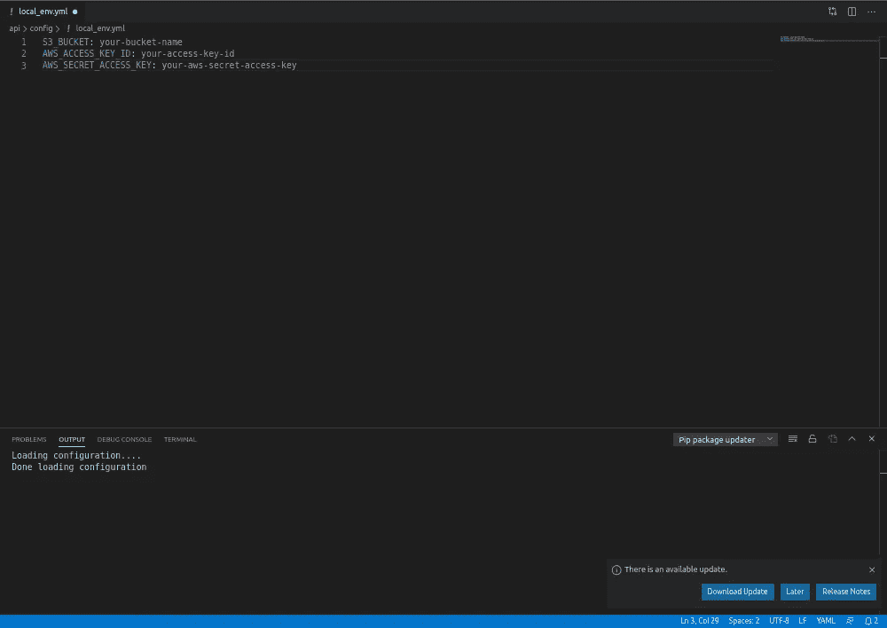

。本地 _ 环境. yml

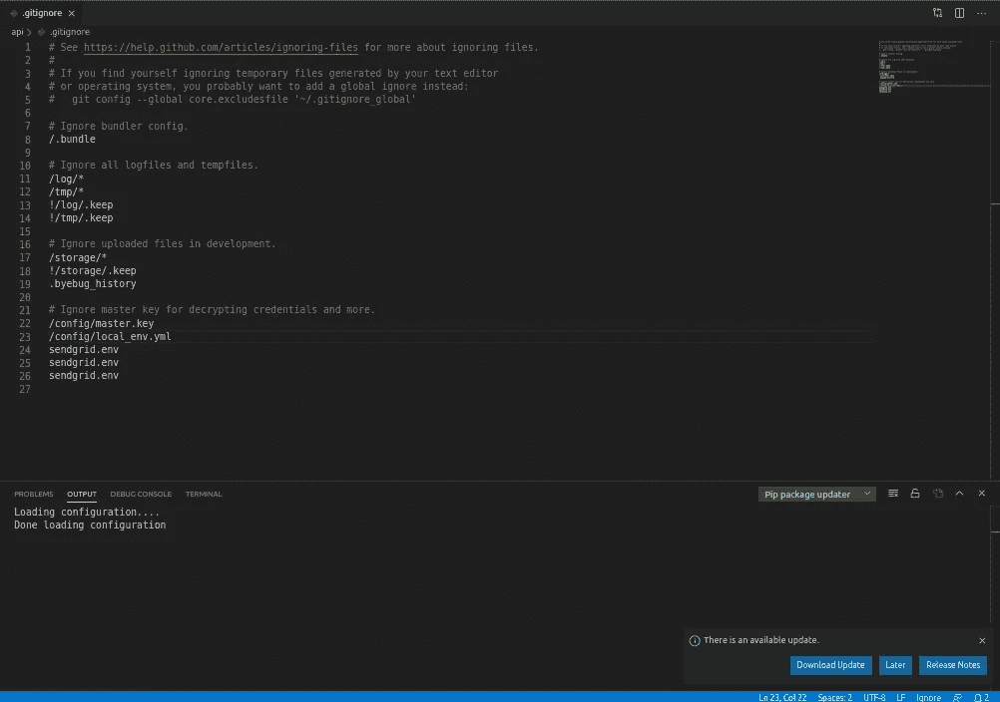

。git ignore with/config/local _ env . yml

接下来，我们需要在我们的 Rails 配置中加载`local_env.yml`,这样我们就可以访问凭证来创建我们的 AWS 配置。将下面的代码片段放入 API 模块和`Application`类的`application.rb`中。

加载 local_env.yml 以允许您在本地访问 Rails 应用程序中的凭证

接下来，如果您已经在 Heroku 上运行了您的应用程序，您可能还想通过在 CLI(您的命令行/终端)中运行以下命令来设置凭证。

# 第六步

接下来，在`/config/initializers`中创建一个名为`aws.rb`的文件，并将下面的代码片段添加到您的文件中。请务必在这里交叉检查您的铲斗区域[。](https://docs.aws.amazon.com/general/latest/gr/rande.html)

现在，我们已经准备好运行我们的`Aws`对象。您的凭证是通过您的`ENV`变量引用的——正如您在上面的代码片段中看到的。

# **第 7 步**

为您将从 React 应用程序查询的端点设置一个控制器，以获取您的签名 URL。我叫我的`s3_uploads_controller.rb`。将下面的代码片段放到控制器中，不要忘记更新您的 routes 文件。

生成并返回签名的 URL 和`get URL`的控制器动作

从本质上讲，这个控制器动作做了两件事:生成一个签名的 URL，并用同一个键组合一个`get_url`,这样我们以后可以引用我们的图像。

它通过我编写的自定义方法`json_response`返回一个 JSON 对象，其中包含我们客户端应用程序的两个 URL，可以在下面的代码片段中看到。

`random_path`是为了防止我在不久的将来上传两个同名文件。

`Filename`、`filetype`和`directory`都是我们将从 React 应用程序发送的参数。

`presigned_url method`采取一个动作、键、桶名、ACL 和内容类型。还记得我们 AWS 帐户的操作和 ACL 设置吗？冬天来了。请注意`acl`和`content_type`——它们对这个实现的完美运行至关重要。如果你像我一样是一个 TDD 迷，你可以为此编写测试，如果你不是，我建议你以批判的眼光看待你的开发过程和 TDD 的概念——它将真正拯救你的生命

自定义 json_response 方法

# 第八步

现在，我们将在 React 应用程序中查询我们的端点，获取签名者 URL，并在我们的 bucket 中将一幅漂亮的图像上传到 AWS S3。

首先，我们需要一个文件表单元素，如果你还没有的话。接下来，我们需要一个函数来处理文件何时被选中，并可能将它存储在我们的状态中。接下来，我们将文件发送给处理上传的方法。下面我将向您展示所有三个片段。

请注意，我们正在访问元素的`.files`属性，而不是`value`属性，并通过`[0]`获取第一个文件。只关心`if`块中的代码。

接下来，我们期待已久的函数！

所以我使用 Redux 动作来更新和创建我的投资组合项目。看一眼`updateProkect`。忽略`auth_token` ——我传入表单和文件，并返回一个异步函数，如果有文件要上传，该函数将调用`uploadToAWS`。

请注意，我写了一些自定义对象和方法，比如`API`和`APIHelpers.projectImagePath()`。API 是我的基本 Axios 对象，后者是我编写的一个助手，用于在我的应用程序中一致地返回图像的路径，因为我可能会在许多地方使用它。它们取决于你自己的决定和方法。请参见以下内容:

在`uploadToAWS`内部，我查询了我在`/upload`在 Rails 应用程序中创建的 API 端点。我还传入文件名、`fileType`和目录的参数，就像我们设置 Rails 控制器来接收它们一样。`headers`不是强制性的——我用它们来通过`JWT`认证我的用户，但是如果你不需要认证，这对你来说可能并不重要。

我继续析构从 Rails 应用程序接收的数据。还记得`get_url`和`post_url`吗？我没疯。另外，请注意 options 变量中的内容类型和 ACL。注意到它们与 Rails 控制器方法中的完全相同了吗？这是*必须的。*

最后，我使用 Axios 发布带有选项的文件，将`get_url`返回给`updateProject`，并将表单发送到我的 Rails 数据库，并将 URL 作为我的`image_url`，我可以用它在我的应用程序上显示图像。

# 没错。

我们做到了——咻！希望这对某个人有帮助，至少给一个人省点麻烦。我很乐意听到任何人对此有其他方法或任何建议/纠正！也就是说，我希望您的实现一切顺利！下次见，再见！