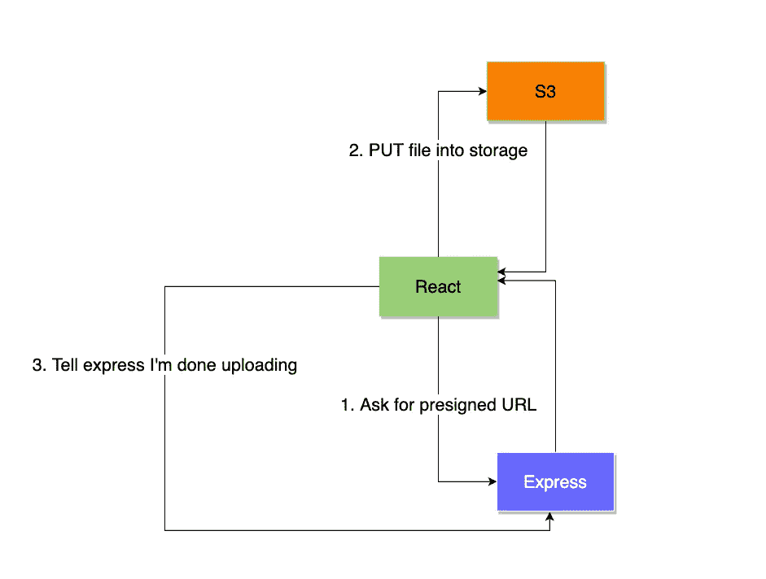
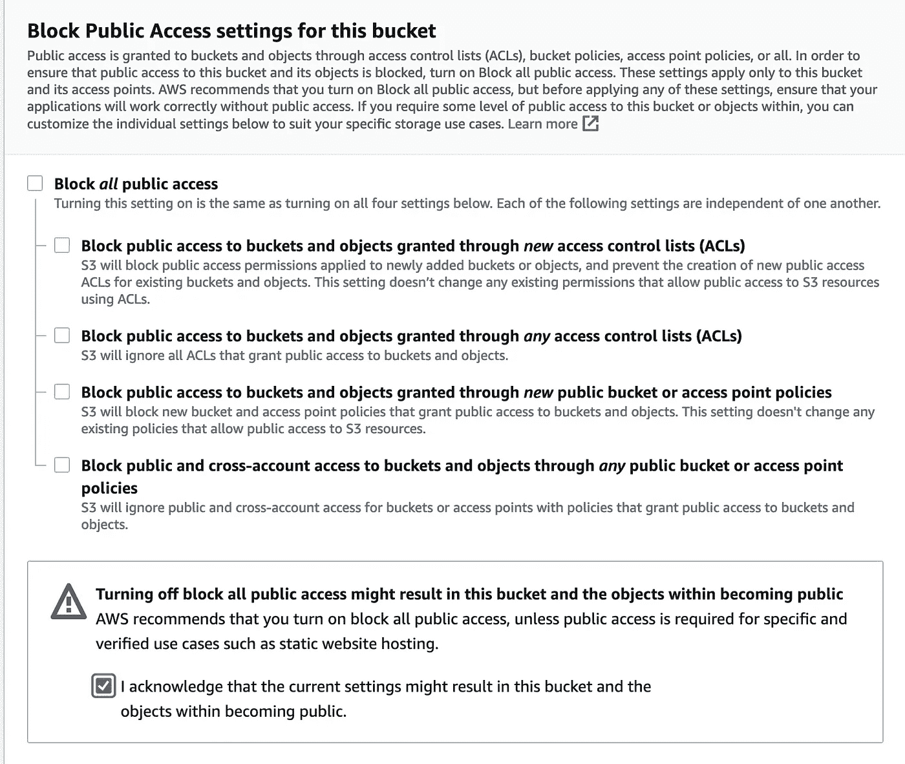
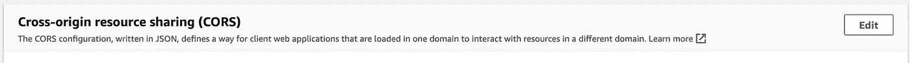
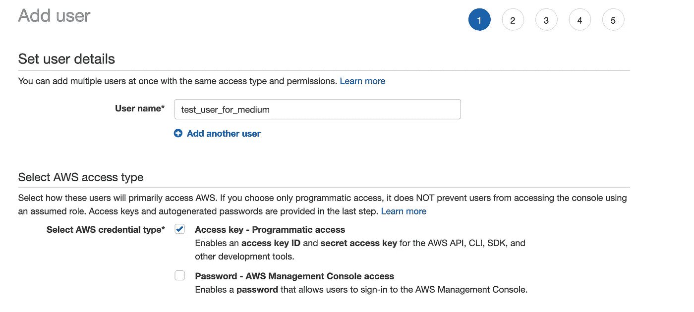

# 使用 Express 和 React 将文件上传到 S3

> 原文：<https://betterprogramming.pub/uploading-files-to-s3-using-express-and-react-7da0e7a91596>

## 这一宝贵功能的简要指南


照片由[亨特·哈里特](https://unsplash.com/@hharritt?utm_source=medium&utm_medium=referral)在 [Unsplash](https://unsplash.com?utm_source=medium&utm_medium=referral) 上拍摄

# 目标

我想要一个系统，在那里我可以:
1。使用 HTML `input`在我的电脑上选择一个 CSV 文件
2。使用 Express 服务器
3 生成预先指定的 URL。将来自 React 的 CSV 文件放入 S3
4。使用 Express 服务器成功上传后，阅读文件内容

这个想法是，我希望我的服务器处理来自用户的 CSV 文件，但是我还希望保存该文件的副本以供审计。出于这个原因，我将介绍 S3 的持久性。在我的文件服务器文件夹的根目录下有一个我用来测试的示例 CSV 文件:[https://github . com/jdister 1/file-upload-S3/blob/master/file server/upload . CSV](https://github.com/jdister1/file-upload-s3/blob/master/fileserver/upload.csv)

# 放弃

为了实现这一点，我创建了一些 AWS 资产(S3 bucket 和 IAM account ),仅供演示之用。我让事情变得更加开放，以使这篇文章能够如我所愿。为了描述架构设置，我没有进行安全配置。

# 高层架构

在高层次上，设置将是与我们的服务器 React 和 S3 的来回舞蹈:
1。用户选择带有`input`元素
2 的文件。点击提交按钮
3。用文件名
4 向`/begin-upload`发布请求。服务器使用 aws-sdk 生成使用此文件名的预签名 URL，并返回到前端。也返回一个`uploadID`
5。前端直接向 S3 发出上传文件
6 的上传请求。用`uploadID`前端发布/完成上传

视觉上，这个想法是这样的:



# 步骤 1:配置测试 S3 存储桶

在这一节中，我们将创建一个具有公共访问权限的测试 S3 桶，并将 CORS 配置为允许我们的前端与之对话。我不是说这是文件存储的生产就绪/安全设置，但出于演示目的，它将允许我们与 S3 对话。

创建一个存储桶并记下地区(例如:us-east-2)。此外，在配置过程中，确保关闭“阻止所有公共访问”:



创建后，转到存储桶->权限->跨来源资源共享，然后单击编辑:



使用以下 JSON 允许所有来源的 CORS

# 步骤 2:为测试目的设置 IAM 帐户

对于这个测试，我将在 I am 中创建一个 Admin 帐户，稍后我们将在 express 中使用它来配置 aws-sdk。

您可以通过在 AWS 控制台中转到 IAM 并添加一个用户来做到这一点。选择凭据类型作为编程访问:



授予他们管理员访问权限(出于演示目的)。实际上，您需要附加一个具有正确权限的适当策略。这超出了本文的范围。

记下新用户的访问密钥和秘密访问密钥

# 第三步:前端(反应)

首先用 create react app 配置一个 React 项目

```
npx create-react-app frontend
```

将`App.js`的内容替换为我 GitHub 上的`App.js`文件这里:[https://GitHub . com/jdister 1/react-S3-CSV/blob/master/file app/src/app . js](https://github.com/jdister1/react-s3-csv/blob/master/fileapp/src/App.js)

# 相关反应部分

首先，我们使用一个 HTML `input`和一个附加到处理函数的`onChange`

```
<input type="file" name="file" onChange={changeHandler} />
```

更改处理程序获取事件并将文件对象存储在状态中。它还设置了一个状态布尔值，以有条件地显示提交按钮。

```
const changeHandler = (event) => {setSelectedFile(event.target.files[0]);setIsFilePicked(true);};
```

单击后，提交按钮将协调上面概述的高级架构。

第一个调用是给`/begin-upload`检索一个预先指定的 URL。我们将 POST 主体中的文件类型和名称传递给服务器，并期望得到一个 URL，我们将其存储在`fileLocation`中。

```
method: "POST",headers: { "Content-Type": "application/json" },body: JSON.stringify({fileName: selectedFile.name,fileType: selectedFile.type,}),};fetch("http://localhost:5000/begin-upload", requestOptions)
```

一旦我们有了预先指定的 URL，我们就可以通过将 file 对象作为 PUT 请求的主体来将 CSV 文件直接传递到 S3。重要的是不要尝试使用`FormData`附加文件，因为这会被序列化。

相反，我们将文件对象直接存储在 S3，以便在用户的文件夹中有一个一对一的备份副本，用于历史目的。(更多见此:[https://stack overflow . com/questions/54468419/webkitformboundary-upload-a-file-to-S3-using-axios-formdata](https://stackoverflow.com/a/57689819))。

在我的例子中，这最后一步被称为`tellServerComplete`。这里的想法是前端现在应该告诉我们的服务器文件已经成功上传到 S3。这取决于您的业务规则来决定接下来会发生什么。

在我的示例中，我让我的 express 服务器将该 CSV 拉入内存，读取数据，并将其返回到前端。在实践中，这并不真正有意义，但它证明了所有系统为了演示的目的都在一起正常工作。

`/process-upload`端点将只需要接受一个`uploadID`。我的例子没有数据库，所以值是硬编码的。

最后一步是将`processedData`变量呈现到页面上，以确认我们的系统正在工作。

# 第四步:服务器(快速)

我们需要几个库来安装服务器。即:

```
npm install express cors body-parser csv-parser aws-sdk
```

首先，我们将配置 AWS SDK。使用`AWS.Config`类配置 aws-sdk 客户端，并向其传递我们在上面建立的访问密钥、秘密密钥和区域:

```
AWS.config = new AWS.Config({accessKeyId: "YOUR ACCESS KEY",secretAccessKey: "YOUR SECRET ID",region: "YOUR REGION",signatureVersion: "v4",});app.use(cors());
```

将`signatureVersion`设置为 v4 以生成预签名的 URL 也很重要。更多信息请点击这里:([https://docs . AWS . Amazon . com/Amazon S3/latest/API/bucket-policy-S3-SIG v4-conditions . html](https://docs.aws.amazon.com/AmazonS3/latest/API/bucket-policy-s3-sigv4-conditions.html))

接下来，我们编写`/begin-upload`函数。这个函数将生成预先指定的 URL，并将其返回给 React 应用程序。在生产环境中，我会有一个`Upload`表来存储元数据，但是出于演示的目的，我伪造了一个`uploadID`。

我们使用 aws-sdk 生成预先设计的 URL，如下所示:

```
const s3 = new AWS.S3();const myBucket = "YOUR BUCKET NAME";const myKey = userID + "/" + fileName;const signedUrlExpireSeconds = 60 * 5;const url = s3.getSignedUrl("putObject", {Bucket: myBucket,Key: myKey,ContentType: "multipart/form-data",Expires: signedUrlExpireSeconds,});
```

注意，bucket 名称应该是您在 S3 创建的根文件夹。关键将需要有其余的位置。所以你的变量看起来像这样:

```
myBucket = "bucket-name"
myKey = "12345/upload.csv"
```

最后是`/process-upload`。在实践中，我们希望它使用一个`uploadID` 并在我们的数据库中进行查找。这张唱片会告诉我们在 S3 哪里可以找到。出于演示的目的，我只是硬编码在 S3 的位置，我们将读取。请在此功能中相应替换`myBucket`和`myKey`。

在这个函数中，我们使用 npm 库 csv-parser 将 csv 转换成 JSON，然后返回给服务器。我的业务需求是将 CSV 行保存在我的数据库中，但是您的可能不同。这就是为什么我只是返回 JSON 来证明我们已经解析了文件，并且可以对数据做任何需要做的事情。

csv-parser 需要一个可读的 csv 文件流。他们的文档([https://www.npmjs.com/package/csv-parser](https://www.npmjs.com/package/csv-parser))显示了下面的例子:

```
const csv = require('csv-parser')
const fs = require('fs')
const results = [];fs.createReadStream('data.csv')
  .pipe(csv())
  .on('data', (data) => results.push(data))
  .on('end', () => {
    console.log(results);
    // [
    //   { NAME: 'Daffy Duck', AGE: '24' },
    //   { NAME: 'Bugs Bunny', AGE: '22' }
    // ]
  });
```

我们的服务器无法访问其本地文件系统上的 CSV 文件，因此我们将使用 aws-sdk 的`s3.getObject`([https://docs . AWS . Amazon . com/AWSJavaScriptSDK/latest/AWS/S3 . html # getObject-property](https://docs.aws.amazon.com/AWSJavaScriptSDK/latest/AWS/S3.html#getObject-property))函数将 CSV 文件拉入内存并创建一个读取流:

```
const file = s3.getObject({Bucket: myBucket,Key: myKey,}).createReadStream();let results = [];file.pipe(csv()).on("data", function (data) {results.push(data); *// --> here*}).on("end", () => {res.send({ results: results });console.log("done");});
```

就是这样！CSV 文件现在被转换成 JSON 并返回给 React 应用程序。

# 资源和链接

 [## 类:AWS。S3

### 编辑描述

docs.aws.amazon.com](https://docs.aws.amazon.com/AWSJavaScriptSDK/latest/AWS/S3.html#getObject-property)  [## 亚马逊 S3 签名版本 4 认证特定策略密钥

### 如何使用 AWS 签名版本 4 身份验证特定策略密钥。

docs.aws.amazon.com](https://docs.aws.amazon.com/AmazonS3/latest/API/bucket-policy-s3-sigv4-conditions.html) [](https://www.npmjs.com/package/csv-parser) [## csv 分析器

### 流式 CSV 解析器，旨在实现最高速度以及与 csv-spectrum 测试套件的兼容性。最新…

www.npmjs.com](https://www.npmjs.com/package/csv-parser) 

包含我的代码的公共存储库:

[https://github.com/jdister1/file-upload-s3](https://github.com/jdister1/file-upload-s3)