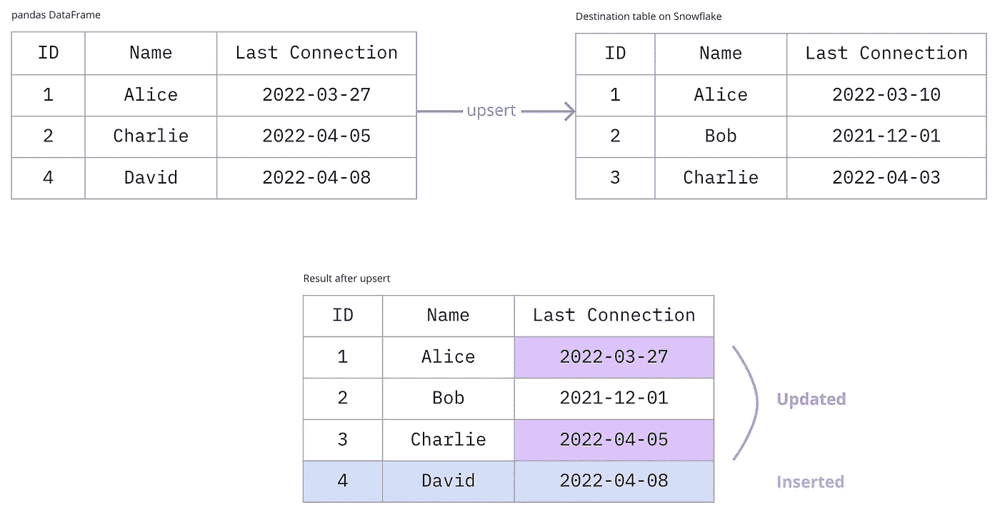

# 将熊猫数据帧上传到雪花

> 原文：<https://betterprogramming.pub/upserting-pandas-dataframes-to-snowflake-d49d2590ff9b>

## 一劳永逸地实现管道自动化。


照片由[亚伦·伯顿](https://unsplash.com/@aaronburden?utm_source=medium&utm_medium=referral)在 [Unsplash](https://unsplash.com?utm_source=medium&utm_medium=referral) 上拍摄

# 什么是 upsert？

upsert 是一个 SQL 语句，它处理表上的插入和更新，通常是批量处理。它需要一个目标表(您正在更新的表)和一个源表或文件(包含更新信息的表或文件)。



在本文中，我们将看看当您用 Python 获得了一个熊猫数据帧时，如何在雪花表上执行 upsert。这一切都是围绕 Transact-SQL 中的`MERGE`命令进行的，您可以在这里找到进一步的文档[。](https://www.mssqltips.com/sqlservertip/1704/using-merge-in-sql-server-to-insert-update-and-delete-at-the-same-time/)

# 如何使用 Python 运行 upsert

我先把它一步一步分解，最后再把它全部汇总起来。如果你只是想阅读代码并进行演绎-改编，你可以跳过这些步骤。

## 创建一个 JSON 文件

你要做的第一件事是将你的数据帧保存为一个雪花可以暂存的文件。CSV 显然看起来像是一个首选的解决方案，但是对于您的数据类型来说，JSON 是一个更安全的选择。任何以字符串形式存储的数字(电话号码是我放弃 CSV 的主要原因)最终都将是一个整数或浮点数，可能用科学符号表示——这是我们在这个房子里最不需要的东西。

为了确保一切顺利运行，JSON 文件必须满足三个条件:

*   它必须面向记录，
*   记录必须按行存储(与列表相反)，
*   日期类型必须存储到秒(相对于毫秒或纳秒)。

为了满足所有这些要求，您可以使用下面一行代码:

```
df.to_json(filename,orient='records',lines=True,date_unit='s')
```

这将为您提供一个漂亮的逐行 JSON 表记录，看起来应该是这样的:


## 在雪花上为 JSON 文件创建一个 stage

阶段是文件的临时存储位置，这些文件包含我们需要复制到表中的数据。理想情况下，您会希望在与您尝试向上插入 JSON 文件的表相同的数据库和模式中创建它。

要创建拟合阶段，只需在雪花工作表上正确设置上下文，然后运行以下代码行:

```
CREATE OR REPLACE STAGE my_stage_name FILE_FORMAT=(TYPE=’JSON’);
```

## 暂存您的 JSON 文件

这只需要一个命令，您可以在终端中从 snowsql 会话运行该命令，也可以在设置好雪花连接后在 Python 中运行该命令(代码在最后给出)。

```
PUT file:///path/to/json_filename @my_stage_name OVERWRITE=TRUE;
```

## 运行合并

将一个暂存文件合并到一个表中并不十分困难，只是语法有点问题。当引用 JSON 文件中的一个“列”时，需要在所有列的前面加上`$1:`。

您可以遵循这个示例，其中列 A 类似于主键，列 B 和 C 包含容易改变的信息(比如“最后更新”时间戳——这就是为什么当合并在列 A 上找到匹配时我们更新它们),而列 D 包含值得插入但不需要更新的信息(比如出生日期)。

在即将到来的自动化中，我将把像 A 列这样的列称为“ID 列”，把像 B 和 C 这样的列称为“更新列”。

# 把所有的放在一起

以下函数中的代码将接受:

*   你的数据框
*   您的`id_columns`(构成主键的列的列表——如果您手头有 ID，可以是一个列的列表)
*   您的`insert_columns`(您想要为不匹配的行插入的所有列的列表)
*   您的`update_columns`(您可能想要更新的所有栏目的列表——参见上面的例子)
*   您的上下文(数据库、方案、表和阶段名)

并运行上面提到的所有步骤，但不包括阶段创建。

它在第 7 行到第 16 行打开一个与 Snowflake 的连接，在第 21 行到第 23 行创建一个 JSON 文件，在第 28 行暂存文件，在第 29 行到第 36 行运行合并，在第 38 行从暂存文件中删除文件，并在第 40 行删除您的本地文件。最后，它在第 43 行正确地关闭了您的雪花连接。第 4、18 和 41 行提供了函数运行时的一些细节。

当然，你需要 Python 的[雪花连接器来建立连接。](https://docs.snowflake.com/en/user-guide/python-connector.html)

负责任地向上插！