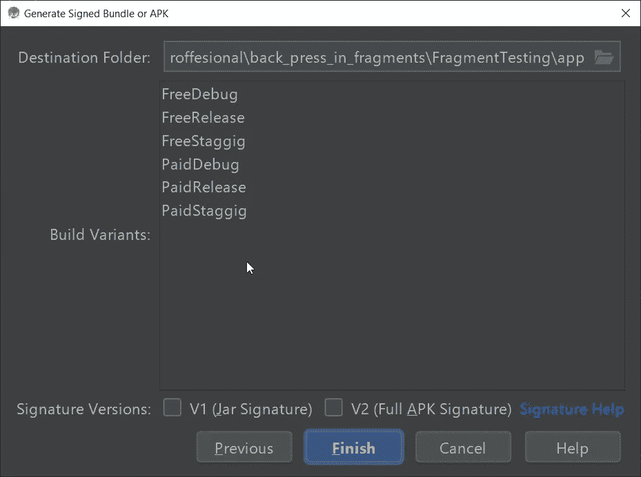

# 使用 Android 构建变体来管理服务器环境

> 原文：<https://betterprogramming.pub/use-android-build-variants-to-manage-server-environments-146125ae31d2>

## 同时构建、运行和部署多个应用

图片由[黑客资本](https://unsplash.com/@hackcapital?utm_source=medium&utm_medium=referral)在 [Unsplash](https://unsplash.com?utm_source=medium&utm_medium=referral)

# 从文章中摘录

到本文结束时，您将学会如何使用构建变体来管理您的服务器的开发、试运行和生产环境。使用这种方法，您不再需要在生成 apk 之前更新任何东西。

**注:**这是一个实验性的方法；如果你有任何改进的建议或者发现了错误，请在评论中告诉我。

# 介绍

默认情况下，Android 使用两种构建类型:调试和发布。当你通过 Android studio 运行一个应用程序时，它会安装调试 APK，当构建签名 APK 时，你可以看到两种构建类型。

如果您已经实现了任何产品风格，您将会看到每种风格的这两种变体。构建类型不同于产品风格。产品风格是应用程序变体的顶级分布，构建类型是每个风格的内部变体。

展示产品风格和构建变体的一个常见用例是免费和付费版本。这里免费和付费是产品风格，而发布和调试是构建变体。最后，您将得到四个构建变体，如下所示:

产品风格是 Android [Gradle](https://gradle.org/) 系统中的一个强大功能，允许你用相同的代码库创建不同的应用程序变体。它提供了灵活性，可以在主模块上维护所有变体中所需的任何内容，并为每种风格创建一个单独的模块来实现独立的代码。要了解更多信息，请阅读以下文章:

 [## Android 产品口味

### 这里是你需要知道的关于产品口味和解决方案的实时问题的一切

sgkantamani.medium.com](https://sgkantamani.medium.com/android-product-flavors-eb526e35f9f1) 

不要混淆产品风格和构建变体；产品风格是应用程序变体的顶级分布，构建类型是每个风格的内部变体。

现在您已经知道了产品风格和构建变体之间的区别，是时候使用构建变体来管理服务器环境了。通常，开发过程包含三个环境:开发、试运行和生产。

**开发:**通常，开发人员在这个环境中构建和测试新的实现。

**试运行:**一旦开发人员完成了实现和测试，他们将转移到试运行阶段，在那里进行主要测试和最终批准以转移生产。

**生产:**如果应用程序获得批准，它将进入生产服务器，最终用户可以在那里使用它。

# 具有构建变体的服务器环境

现在我们知道了什么是构建变体和不同的服务器环境，是时候利用构建变体来生成不同的服务器环境构建了。

通常，开发人员为每个变体维护三组不同的细节。在任何给定时间，只有一组是活动的；我们必须根据生成的构建类型手动更新它。这是我多年来一直遵循的过程，但我不认为这是最好的方法，因为它涉及到每一代构建的手工工作。它有自动化的范围。

我自动化这个过程的想法是维护三个不同的构建变体，为每个服务器环境服务。我们需要在`android`标签中声明构建变量`buildTypes`。这导致了五种构建变体:`release`、 `debug`、`prod`、`stg`和`dev`。看一看:

服务器环境的关键变化之一是基本 URLs 我们可以使用`buildConfigField`特性在每个变体中声明适当的基本 URL。看一看:

我们基本上所做的是，我们已经移除了在生成构建类型时需要做的所有手工工作，并在每个构建类型中使用`buildConfigField`来自动化它们。我们只需要选择所需的构建类型；链接到该构建类型的所有服务器配置都会自动捆绑到生成的 APK 中。

# 实时梯度提示

## 使用 initWith

通常，当你创建一个新的风格时，你要么申请调试，要么启用[progguard](https://www.guardsquare.com/en/products/proguard)规则。默认情况下，调试版本处于调试模式，而发布版本启用了 ProGuard。因此，当您创建一个新的变体时，我们可以使用`initWith`从每个变体中继承适当的属性。

例如，假设在上面的例子中，我们已经为`prod`和`stg`变量应用了 ProGuard 规则，并手动调试了`dev`变量。我们可以通过`initWith`重用发布和调试模式中的规则来增强代码，如下所示:

## 不同的工作流程采用不同的方法

并非所有工作流都有三个环境；可能会有更多的阶段，比如测试环境。我们可以根据需要用尽可能多的`buildConfigFields`创建尽可能多的构建变体。

我们可以为每个变体添加不同的主机名、不同的脸书、Twitter 和其他 API 键，以及不同的 Firebase JSON 配置文件。这使得跟踪不同级别的指标变得更加容易。

目前就这些。希望你学到了有用的东西，感谢阅读。