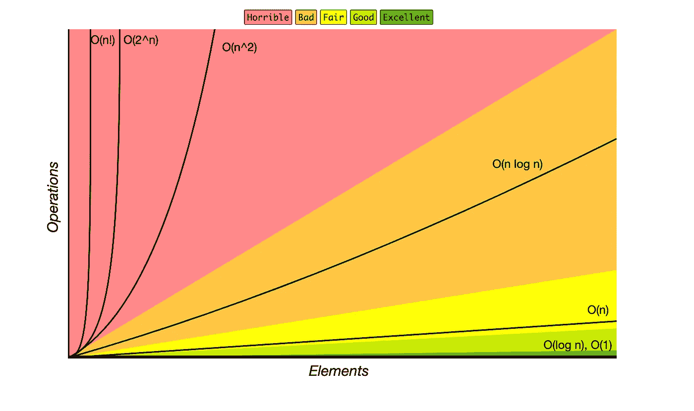
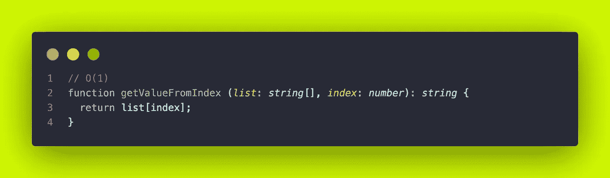
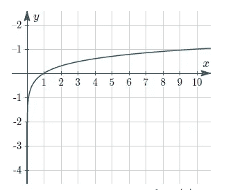
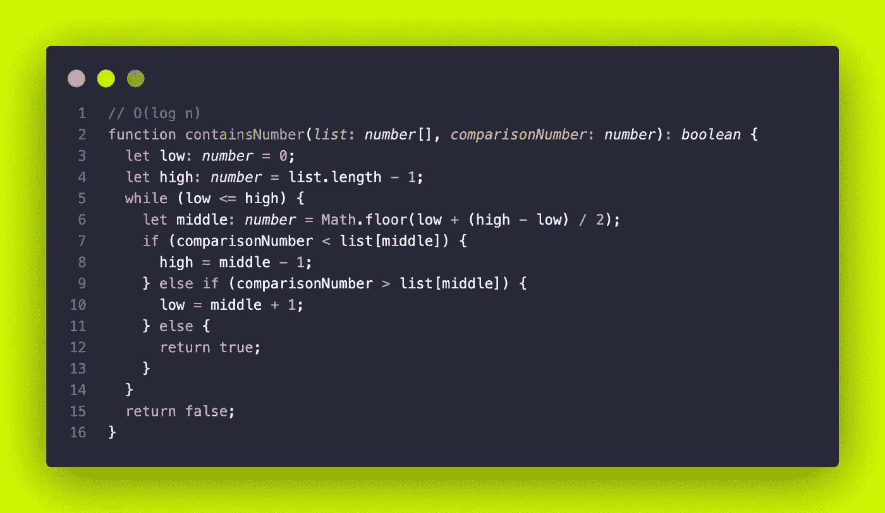
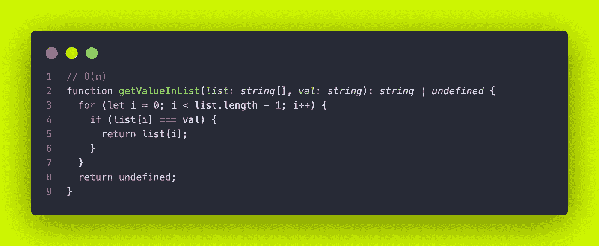
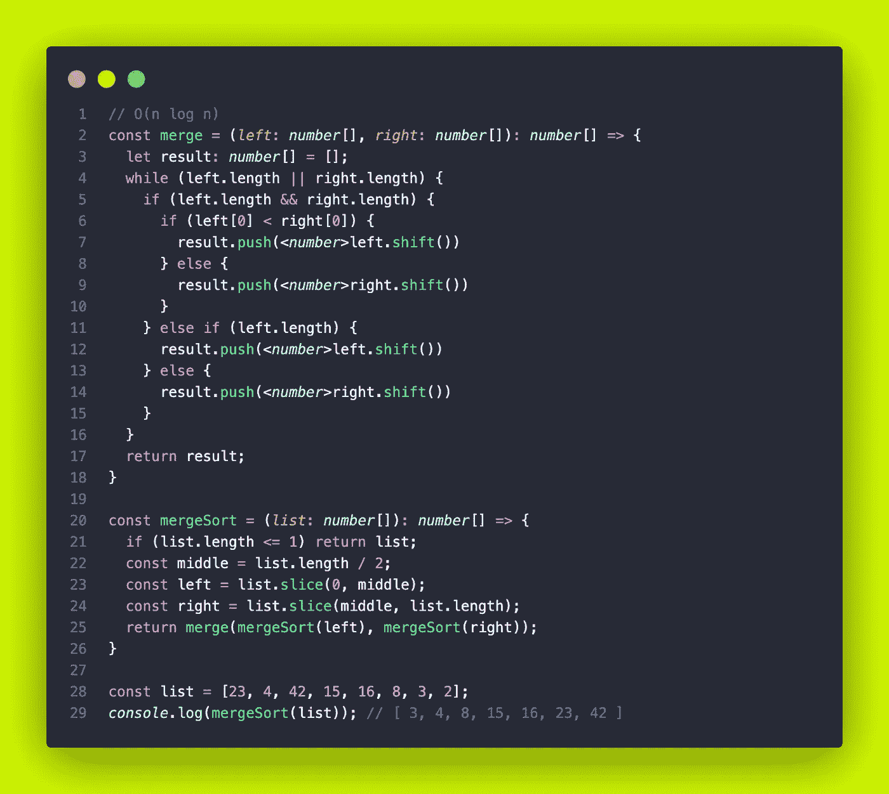
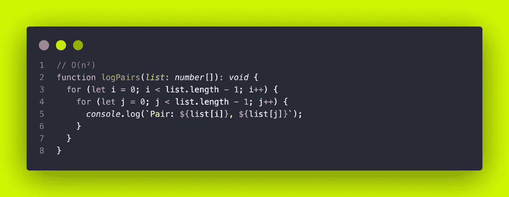
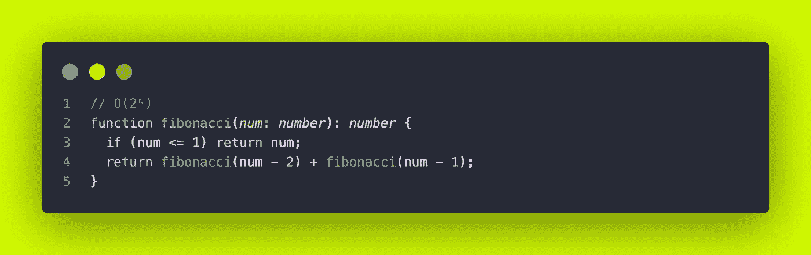
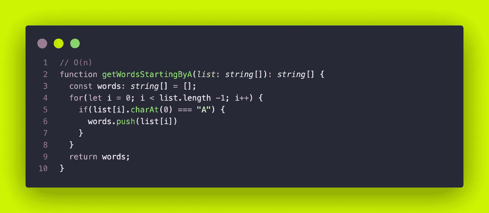

# 使用大 O 符号来设计更好的算法

> 原文：<https://betterprogramming.pub/use-big-o-notation-to-design-better-algorithms-9e5769c2e47b>

## 用代码做大多数事情有多种方式，但有些方式明显比其他方式好

克洛伊·本科·普里尔在 [Unsplash](https://unsplash.com?utm_source=medium&utm_medium=referral) 上的照片

现在是上午 9:00，你五分钟前就到了办公室，刚好有时间去喝一天中的第一杯咖啡。

突然，你的老板过来告诉你他有多饿。你问他你能帮上什么忙。他要和其他饥饿的人开会，他希望你在上午 11 点前做好苹果派

你访问 Recipe Overflow 来寻找苹果派的配方，最后在一个帖子上与人们讨论最佳配方。

你知道做苹果派有不同的方法。一些食谱看起来很容易烹饪，只有三四个步骤和很少的配料，但用户投票否决它们，因为他们说它们不好吃。

有一个食谱有很好的评分，更多的步骤，但人们说这是他们吃过的最好的。你不想让你的老板失望，你挑了那个超级好吃的。

因为有多种方法来烹饪苹果派，所以有多种方法来解决编码问题。一个糟糕的算法会让你的程序变慢。我们如何衡量呢？

代码不能浅尝辄止，这就是大 O 的用武之地。

# 大 O 批注，是为了什么？

> 大 O 符号用于根据算法的运行时间或空间需求如何随着输入大小的增长而增长，通过表示其增长率的上限来对算法进行分类— [维基百科](https://en.wikipedia.org/wiki/Big_O_notation)

简而言之，它有助于判断一种算法是否足以有效地处理大量数据。

*   对于处理少量数据的小型应用程序，可能没有必要使用 Big O，除非代码非常糟糕，否则好的算法和不太差的算法之间的运行时差异对应用程序的影响很小。
*   但是，对于大型应用程序来说，处理大量数据，在编写算法的同时进行这种分析可以使应用程序运行得更快(并使用更少的内存)。

这就是说，理解大 O 是如何工作的是绝对值得的，即使是对于小项目。当你的应用规模扩大时，你会感谢自己的。

# 我们为什么不用时间来衡量效率？

尽管时间通常与复杂性密切相关，但两者不一定完全相同。在具有不同硬件、操作系统和编程语言的不同计算机上处理操作可能会影响结果时间。

还有，时间比数学更难分析。大 O 符号用于查看算法如何扩展。比较两种不同算法的曲线比结果测试时间更容易、更快。

最后，大 O 符号抽象了算法和它处理的数据。它近似于算法在最坏情况下的执行效率。

也就是说，如果你在一个有 100，000 个条目的列表中进行搜索，最糟糕的情况是什么也找不到。仅用时间和真实数据来衡量算法的效率更难，也不相关。

# 它是如何工作的？

Big-O 复杂度图—**【https://www.bigocheatsheet.com/ **

**此图表显示了算法需要处理的运算量，具体取决于输入的大小(元素)。它被分为五个部分，从最高效、*优秀、*到最低效、*糟糕。***

**记数法是这样写的: *O(效率)*任何算法都可以用这个公式来记。不用说，你的算法越绿色越好。红色部分是不惜一切代价要避开的区域！红区的算法扩展性很差。**

**让我们看看这些曲线可以对应哪种算法…**

## **恒定时间复杂度— O(1)**

****

**O(1)时间复杂度**

**不管输入的大小，它总是只做一个操作。**

## **对数时间复杂度— O(log n)**

**这表示一个函数，其复杂度随着输入大小的增加以对数方式增加。**

****

**对数函数的示例**

**这是对数函数的典型形状。**

**横坐标和纵坐标在这里并不重要，注意曲线本身。当输入的大小为 *x* 时，我们可以看到它的伸缩性非常好。**

****

**O(log n)时间复杂度**

**以上是一个[二分搜索法](https://guide.freecodecamp.org/algorithms/search-algorithms/binary-search/)的代码，一个 *O(log n)* 复杂度的算法。**

**二分搜索法算法通过重复地将搜索间隔一分为二来定位排序数组中的项目。**

**由于我们在二分搜索法的每一步中处理搜索用例的一部分，而在另一半上执行搜索操作，这导致最坏情况下的时间复杂度为 *O(log n)* 。**

## **线性时间复杂度— O(n)**

**它表示算法的复杂度，该复杂度与输入大小成正比地线性增加。**

**这方面的一个例子是在列表中搜索一个项目。就像我们刚才做的那样，但不是最佳的方式。**

****

**O(n)时间复杂度**

**在这种情况下，该函数是一个循环。最坏的情况是:它一直循环到列表的末尾。**

**执行时间直接取决于输入的大小，这导致了一个 *O(n)* 。**

## **对数线性时间复杂度— O(n log n)**

**[归并排序](https://guide.freecodecamp.org/algorithms/sorting-algorithms/merge-sort/)、[堆排序](https://guide.freecodecamp.org/algorithms/sorting-algorithms/heap-sort/)、[快速排序](https://guide.freecodecamp.org/algorithms/sorting-algorithms/quick-sort/)是时间复杂度为 *O(n log n)* 的算法。它们以对数线性方式扩展。**

**下面是一个合并排序的例子，一个[分治](https://guide.freecodecamp.org/algorithms/divide-and-conquer-algorithms/)排序算法。它将数组分成两半，递归排序，最后合并排序后的两半。**

**[这里有一个很棒的可视化工具](https://www.hackerearth.com/practice/algorithms/sorting/merge-sort/visualize/)让你亲眼看看。**

****

**O(n log n)时间复杂度**

**我们来解释一下时间复杂度。**

*   ***O(n****log n****)*:递归地将给定数组分成两半，直到大小变为 1。这是`mergeSort`功能。**
*   ***O(****n****log n)*:合并两个排序切片的任务以线性时间运行。这就是`merge`功能。**

## **二次时间复杂度— O(n)**

***O(n )* 表示一种算法，其复杂度与输入大小的平方成正比。**

**下面是一个无用的例子，但很容易理解:**

****

**O(n)时间复杂度**

**循环具有 *O(n)* 复杂度，因此，循环中的循环具有 *O(n) * O(n)* 复杂度，即 *O(n )* 。**

**[冒泡排序](https://guide.freecodecamp.org/algorithms/sorting-algorithms/bubble-sort/)、[插入排序](https://guide.freecodecamp.org/algorithms/sorting-algorithms/insertion-sort/)和[选择排序](https://guide.freecodecamp.org/algorithms/sorting-algorithms/selection-sort/)是 *O(n )* 排序算法的例子。**

## **指数时间复杂度— O(2ᴺ)**

***O(2ᴺ)* 是一个有指数增长的算法。输入数据集每增加一项，运算量就会增加一倍。**

**我发现的一个例子是斐波那契数的递归计算。对于那些不知道的人来说，在[斐波纳契数列](https://en.wikipedia.org/wiki/Fibonacci_number)中，每个数字后面都是前两个数字的总和。**

****

**O(2ᴺ)时间复杂度**

**不要在实际项目中使用上面的代码，这种计算可以用较低的时间复杂度来实现。这只是一个例子。**

**正如我们所看到的，对于每个输入数字，函数递归地调用自己两次，直到数字小于或等于 1。**

# **时间复杂度与空间复杂度**

**到目前为止，我们用大 O 来衡量一个算法的时间复杂度。**

**大 O 也用来衡量*空间复杂度*。空间复杂度是在最坏的情况下，算法需要的工作存储(内存)量的度量。**

**空间复杂度和时间复杂度一样重要。事实上，在某些情况下，您可能需要优先考虑一个而不是另一个(速度或内存)。…**

**这与我们之前看到的逻辑相同，下面是一个小例子…**

****

**O(n)空间复杂度**

**考虑到该函数的最坏情况(所有单词都以字母 A 开始)，`words` `const`将包含 *n* 个单词。因此，空间复杂度将是 *O(n)* 。**

# **结论**

**大 O 帮助我们理解算法如何根据输入的大小进行扩展。**

**它可以用来衡量时间和空间的复杂性，两者都同样重要。**

**大 O 是程序员工具箱里的必备工具。**

**感谢阅读！**