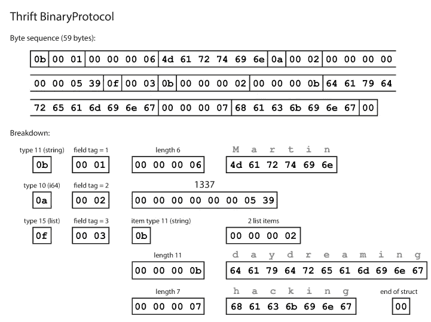
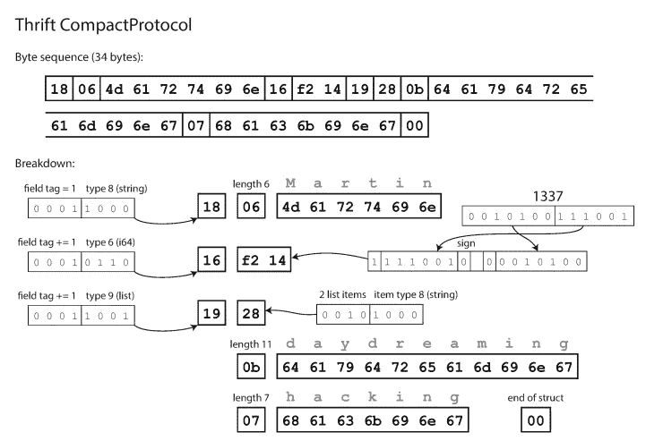
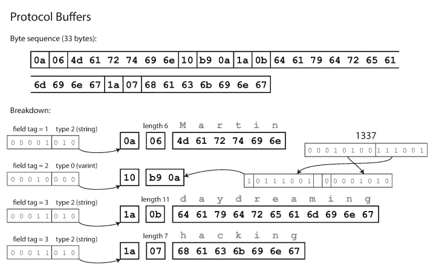
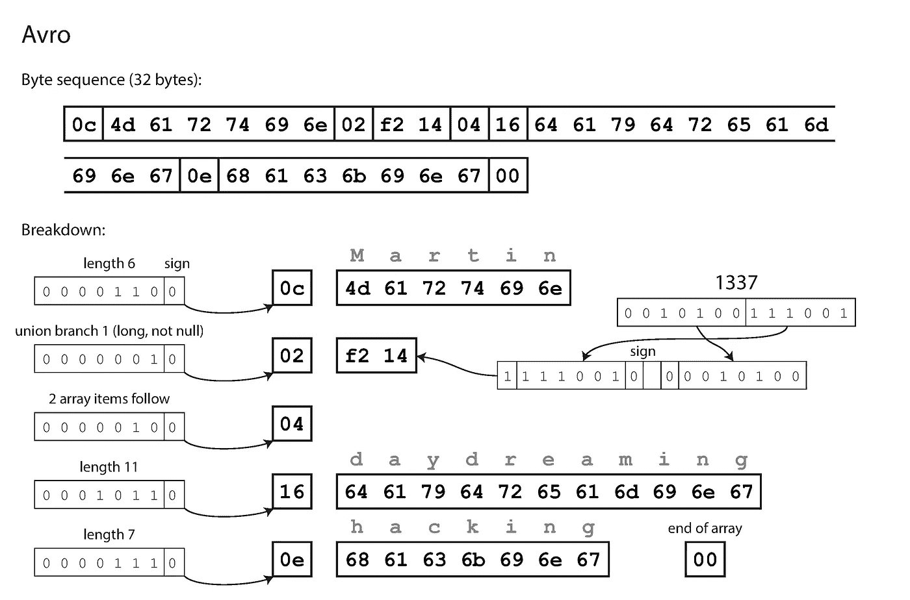
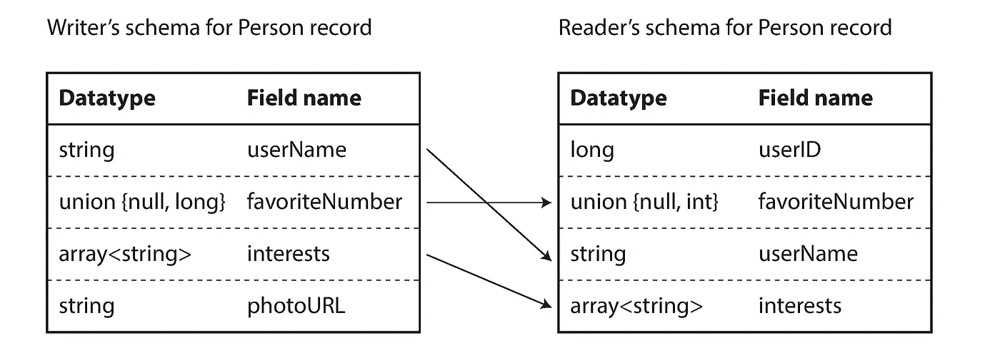

# 使用二进制编码代替 JSON

> 原文：<https://betterprogramming.pub/use-binary-encoding-instead-of-json-dec745ec09b6>

## 用少得多的字节编码相同的数据


克里斯多夫·高尔在 [Unsplash](https://unsplash.com/) 上拍摄的照片。

# 我为什么要在乎？

在内存中，数据以数据结构的形式保存，如对象、列表、数组等。但是，当您想通过网络发送数据或将其存储在文件中时，您需要将数据编码为自包含的字节序列。从内存表示到字节序列的转换称为编码*T5，相反的称为解码*。随着时间的推移，应用程序处理或存储的数据模式可能会发生变化，可能会添加新字段，也可能会删除旧字段。因此，所使用的编码需要同时支持向后(新代码应该能够读取旧代码写入的数据)和向前(旧代码应该能够读取新代码写入的数据)兼容性。**

在本文中，我们将讨论不同的编码格式，二进制编码格式如何优于 JSON、XML，以及它们如何支持模式进化。

# 编码格式的类型

有两种类型的编码格式:

1.  文本格式
2.  二进制格式

# 文本格式

文本格式在某种程度上是人类可读的。一些常见的格式是 JSON、CSV 和 XML。文本格式易于使用和理解，但可能会导致不同的问题:

1.  文本格式可能包含很多歧义。例如，在 XML 和 CSV 中，您无法区分字符串和数字。JSON 可以区分字符串和数字，但是不能区分整数和浮点数，并且不指定精度。这在处理大数时就成了问题。大于 253 的数字的一个例子出现在 Twitter 上，它使用 64 位数字来标识每条推文。Twitter 的 API 返回的 JSON 包含两次 tweet IDs 一次作为 JSON 数字，一次作为十进制字符串——以解决 JavaScript 应用程序不能正确解析数字的问题。
2.  CSV 不包含任何模式，让应用程序来定义每行和每列的含义。
3.  文本格式比二进制编码占用更多空间。例如，由于 JSON 和 XML 是无模式的，所以它们也需要包含字段名。

```
{
    "userName": "Martin",
    "favoriteNumber": 1337,
    "interests": ["daydreaming", "hacking"]
}
```

它的 JSON 编码在去掉所有的空格后消耗了 82 个字节。

# 二进制编码

对于仅在组织内部使用的数据，您可以选择更紧凑或解析速度更快的格式。尽管 JSON 没有 XML 冗长，但与二进制格式相比，它们仍然占用大量空间。在本文中，我们将讨论三种不同的二进制编码格式:

1.  节约
2.  协议缓冲区
3.  Avro

这三者都使用模式提供了高效的、跨语言的数据序列化，并且都有代码生成工具。这三者都通过确保向后和向前的兼容性来支持模式演进。

## 节约和协议缓冲区

节俭是由脸书开发的，协议缓冲是由谷歌开发的。它们都需要模式来对数据进行编码。在 Thrift 中，模式是使用 Thrift 的接口定义语言(IDL)定义的。

```
struct Person {
  1: string       userName,
  2: optional i64 favouriteNumber,
  3: list<string> interests
}
```

协议缓冲区的等效模式是:

```
message Person {
    required string user_name        = 1;
    optional int64  favourite_number = 2;
    repeated string interests        = 3;
}
```

如您所见，两者都为每个字段定义了数据类型和标签号(如`1`、`2`和`3`)。Thrift 有两种不同的二进制编码格式:`BinaryProtocol` 和`CompactProtocol` *。*二进制格式很简单，如下所示，需要 59 个字节对上面的数据进行编码。



使用 Thrift 的二进制协议编码——图片来自设计数据密集型应用程序。

紧凑协议在语义上等同于二进制协议，但是将相同的信息封装在仅仅 34 个字节中。它通过将字段类型和标签号打包在一个字节中来实现这一点。



使用节俭压缩协议编码-图片来自设计数据密集型应用程序。

协议缓冲区也对数据进行编码，类似于 Thrift 的压缩协议，需要 33 个字节对相同的数据进行编码。



使用协议缓冲区编码——图片来自设计数据密集型应用程序。

标签号确保节约和协议缓冲区中的模式进化。如果旧代码试图读取用新模式写入的数据，它将简单地忽略带有新标签号的字段。类似地，新代码可以读取旧模式写入的数据，方法是将丢失的标签号的值设为`null`。

## Avro

Avro 不同于协议缓冲区和节俭。Avro 也使用模式来定义数据。可以使用 Avro 的 IDL 定义模式(便于阅读):

```
record Person {
    string               userName;
    union { null, long } favouriteNumber;
    array<string>        interests;
}
```

或者 JSON(更机器可读):

```
"type": "record",
    "name": "Person",
    "fields": [
        {"name": "userName",        "type": "string"},
        {"name": "favouriteNumber", "type": ["null", "long"]},
        {"name": "interests",       "type": {"type": "array",      "items": "string"}}
    ]
}
```

请注意，每个字段都没有标签号。Avro 编码只需要 32 个字节来编码相同的数据。



使用 Avro 编码—图片来自设计数据密集型应用程序。

正如您在上面的字节序列中所看到的，没有办法识别一个字段(就像在 Thrift 和协议缓冲区中使用标签号)或它的数据类型。这些值只是简单地连接在一起。这是否意味着解码时模式的任何改变都会产生不正确的数据？Avro 的关键思想是，作者和读者的模式不需要相同，但它们需要兼容。当数据被解码时，Avro 的库通过查看两种模式并将数据从作者的模式转换到读者的模式来解决差异。



解决读者和作者模式之间的差异——来自设计数据密集型应用程序的照片。

你必须考虑读者如何知道作者的模式。这取决于使用这种编码的用例。

1.  为了传输大型文件或数据，编写器可以在文件开头包含一次它们的架构。
2.  对于具有单独写入记录的数据库，可以用不同的模式写入每一行。最简单的解决方案是在每个记录的开头包含一个版本号，并保留模式列表。
3.  为了通过网络发送记录，读取器和写入器可以在连接建立时协商模式。

使用 Avro 格式的主要优势之一是它支持动态生成的模式。因为它不使用标记号，所以您可以使用版本控制来保存用不同模式编码的不同记录。

# 结论

在本文中，我们研究了文本和二进制编码格式，同样的数据如何使用 JSON 编码需要 82 个字节，使用 Thrift 和协议缓冲区需要 33 个字节，而使用 Avro 编码只需要 32 个字节。对于在内部服务之间通过网络发送数据，二进制格式提供了几个优于 JSON 的优势。

# 资源

要了解更多关于编码和设计数据密集型应用程序的知识，我强烈推荐阅读 Martin Kleppmann 的书*设计数据密集型应用程序*。