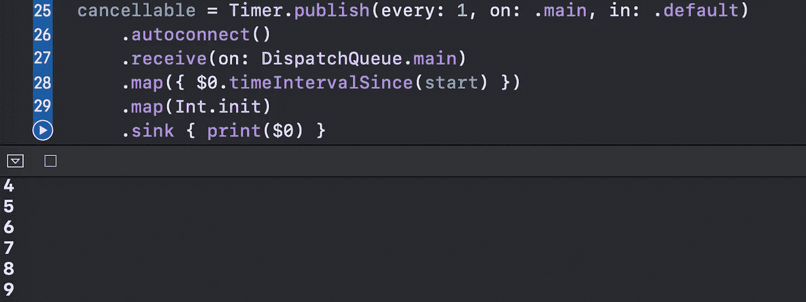
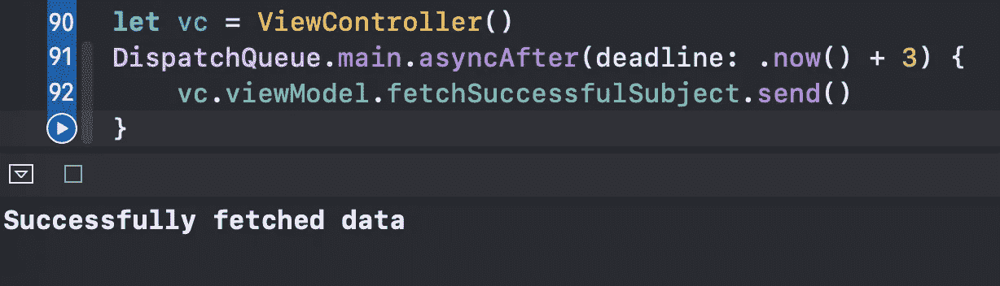

# 使用 Combine 编写更具可读性的 Swift 代码

> 原文：<https://betterprogramming.pub/use-combine-to-write-more-readable-swift-code-9e8e6cf0bf50>

## 摆脱完成处理程序和闭包属性

照片由 [Aditya Joshi](https://unsplash.com/@adijoshi11?utm_source=medium&utm_medium=referral) 在 [Unsplash](https://unsplash.com?utm_source=medium&utm_medium=referral) 上拍摄

在本文中，我们将学习如何通过使用 Combine 使我们的 Swift 代码更加独特和高效。

事不宜迟，我们开始吧。

# 我们开始吧

如果您曾经需要观察键盘事件，那么这段代码可能看起来非常熟悉:

一旦我们收到`keyboardWillShowNotification`，我们简单地在控制台中打印一条消息。通过使用 Combine，我们可以使代码更加简洁，而不需要将那些`nil`值作为参数传递:

要编写异步逻辑，通常需要包含一个转义闭包作为参数:

您可以使用联合收割机的未来:

使用这种方法，您将能够使用各种组合运算符来转换或过滤您的数据。此外，您可以使用`.assign`操作符将结果绑定到一个属性。

在 Combine 之前，您应该编写类似这样的代码来创建一个简单的重复计时器:

使用组合发布器，您可以让它看起来更好:

因此，我们看到每秒钟都在控制台中打印出来:

当遵循 MVVM 设计模式时，您将创建每当给定的异步事件发生时调用的闭包属性:

让我们用联合收割机的`PassthroughSubject`来代替:

我们看到三秒钟后，打印出一条消息:

# 包扎

对更多联合收割机功能感兴趣？我的其他文章可能对你有帮助:

*   [您应该从 Swift Combine 了解的 7 个顺序运算符](https://medium.com/better-programming/7-sequential-operators-you-should-know-from-swift-combine-1775ce3c47c8)
*   [如何在 Swift 5 中创建自己的联合收割机订户](https://medium.com/better-programming/how-to-create-your-own-combine-subscriber-in-swift-5-702b3f9c68c4)
*   [你应该从 Swift Combine 了解的 6 个合并运算符](https://medium.com/better-programming/6-combining-operators-you-should-know-from-swift-combine-17ea69d9dad7)
*   [在 Swift 5 中用组合替换委托](https://medium.com/better-programming/replace-delegation-with-combine-in-swift-5-e4c193655e7b)
*   [Swift:你应该知道的 5 个变换合并运算符](https://medium.com/better-programming/5-transforming-combine-operators-you-should-know-4603fe112d74)

感谢阅读！