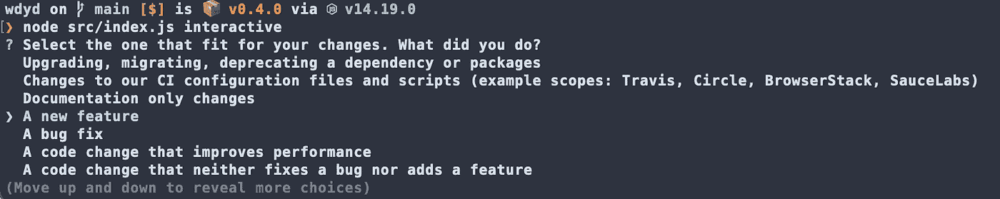
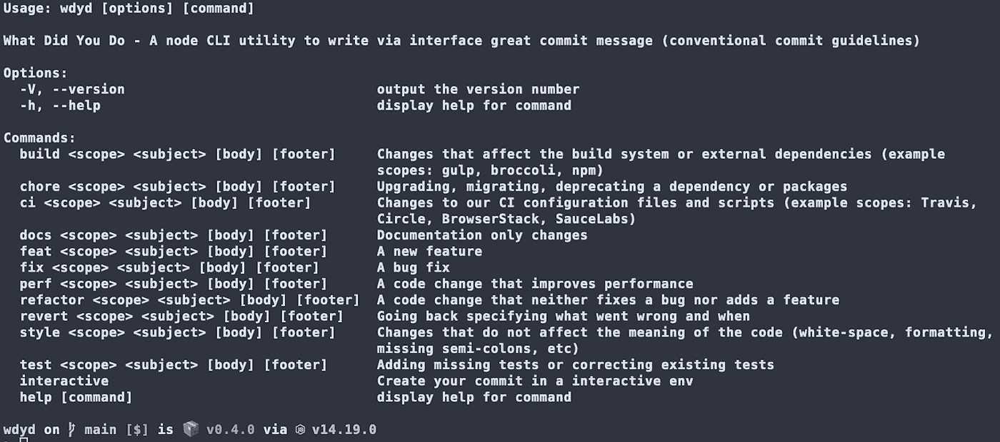

# 使用传统的提交消息来改善团队沟通

> 原文：<https://betterprogramming.pub/use-conventional-commit-messages-to-improve-team-communication-4c7d9cc8f939>

## 使用 wdyd 和其他平台

照片由[久尼尔·费雷拉](https://unsplash.com/@juniorferreir_?utm_source=medium&utm_medium=referral)在 [Unsplash](https://unsplash.com?utm_source=medium&utm_medium=referral) 拍摄

有时，当在团队或开源组织中工作时，您可能会拼错消息或在存储库的提交中出错。这些错误会在大型产品或技术堆栈的代码库中传播。

对我来说，在开发一个项目、一个产品，甚至是开发人员为开发人员编写的实用工具时，在编码方面做到完全透明，并具有交流性和描述性，这真的很重要。

在本文中，我们将讨论常规提交，什么是重要的，以及如何编写一个好的提交消息来完全控制您的代码库。

我已经创建了一个简单的项目来帮助新开发人员/学生在他们自己的或专业的项目中接近传统的提交。

# 什么是常规提交？

拥有可读的人类提交消息是一个规范。它为创建显式提交历史提供了一组简单的规则，方法是声明范围、关联问题/故事/bug，并在提交的主题/消息或页脚中添加一些关键字。

下面是一个提交消息的示例，其中包含描述和中断更改页脚:

> 特点:允许提供的配置对象扩展其他配置

# 为什么要实现传统的提交规则？

在编码中更具描述性会给你带来以下好处:

*   您可以在您的项目上自动生成优秀的变更日志，并从语义上确定版本变动
*   通过使用一些基本的关键字(`feat`、`chore`、`revert`等)，可以更容易地确定团队变化的性质。…)
*   通过使用 hashtags，您可以触发工作流过程(例如关闭问题或故事)
*   让第三方人员更容易加入团队，这样他们就可以在较低的入职成本后开始做出贡献

# Wdyd 如何工作

npm 包 wdyd 是作为一个支持和实用工具创建的，目的是试验传统的提交标准并在您的项目中实现它。对于软件开发行业的新手也比较友好。

节点脚本通过接受有价值的用户输入来复制和格式化消息。它有两种模式:手动和交互式。

要开始安装，您需要使用以下命令全局安装软件包:

> npm i -g wdyd

# 对话方式

通过使用 inquirer 包，用户将被提示一些关于其更改性质的问题，通过选择类型，实用程序将一步一步地创建一个提交消息。对于第一次使用交互模式的人来说，处理这种消息是很容易的。

这些问题将是:

*   选择一个适合您的变化。你做了什么？(强制)
*   你关注的范围是什么？(强制)
*   用命令式的方式描述你的改变(强制性)
*   包括改变的动机，并与之前的行为进行对比
*   页脚应该包含任何关于重大变更的信息，也是引用 GitHub 问题的地方

# 手控式

是为更多的中高级开发人员准备的(是的，没有人应该停止学习)。在这种情况下，您可以运行`*wdyd -h*`来获取关于您可以运行的命令的所有信息。在下图中，您可以看到可以运行的可能命令列表:

您可以运行以下命令:

> wdyd e2e“登录页面测试”“在测试的第 34 个问题之后，我们现在覆盖了 93%的代码”

在您的登录页面上提交一个链接到#34 问题的 e2e 实现。

# 如何编写一个好的提交消息

您可以在[传统提交网站](https://www.conventionalcommits.org/en/v1.0.0/)上获得完整的规范，但是在编写提交消息时，这里有一些重要的提示需要记住。

任何提交都必须有前缀类型，比如`feat`、`fix`或`chore`，以标识变更的上下文。如果你要在你的代码库中引入一个突破性的改变，你需要在类型后面指定一个`!`。

当我们有一条短消息或一个项目范围与提交中所做的所有变更相关时，应该在前缀单词后的括号内插入一个范围，例如:`feat(signin)`或 `fix(product-page)`。

当我们撰写信息时，描述是必不可少的一部分。它应该更具描述性、命令性，并且不要太长。只写一行，像这样:

> *修复:传递可空值时的对象解析问题*

可以在简短描述之后提供更长的提交主体，提供关于代码更改的附加上下文信息，例如:

> 该页面出现致命错误，并阻止了用户导航流程。现在，我们正在记录错误，不再阻塞用户流。

如果您的提交中有任何重大变更，比如弃用或 deps 变更，最好将其作为提交消息的页脚记录下来。使用`BREAKING-CHANGE`将有助于突出我们已经改变的东西。例如:

> 突破性变化:不可空值现在抛出的只是一个警告消息，而不是致命错误。

因此，例如，我们的提交消息应该这样构成:

> 搞定！(产品页面):传递可空值时的对象解析问题
> 
> 该页面返回一个致命错误，阻塞了用户导航流程。现在我们记录错误，不再阻塞用户流。
> 
> 突破性改变:不可空值现在抛出的只是一个警告信息，而不是致命错误。

# 结论

当在团队中工作或与他人合作时，在我们的代码中有指导方针或规则总是好的，特别是在我们的代码库中，以便更好地交流。

传统提交被许多人和公司所接受。这个工具是一个简单的实现，可以帮助其他开发人员理解背后的逻辑，并改善他们团队的沟通。