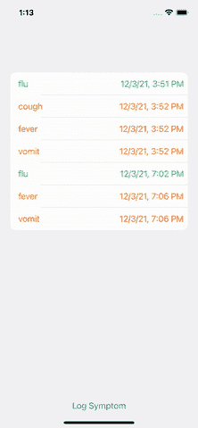
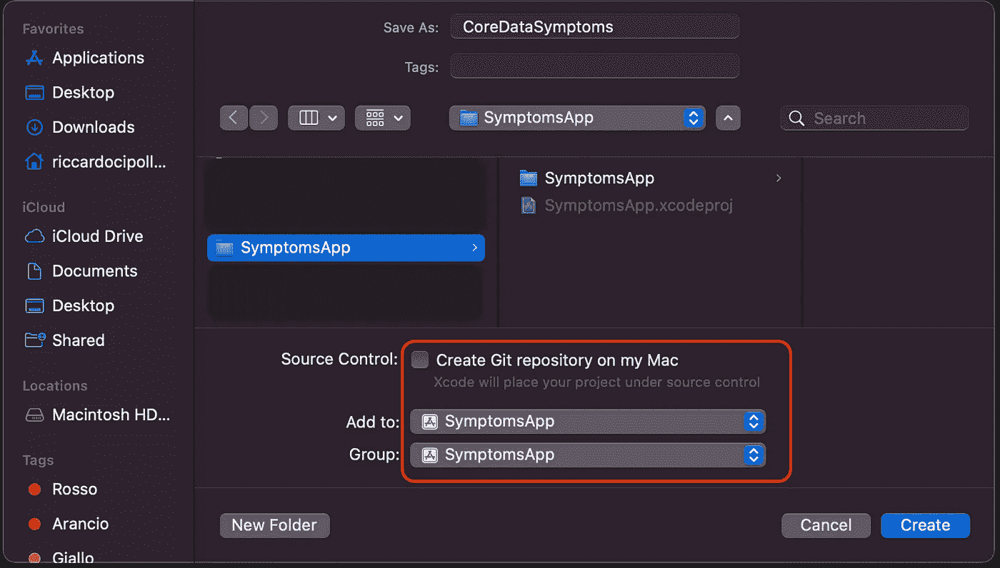
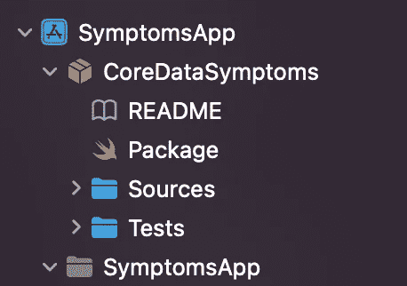
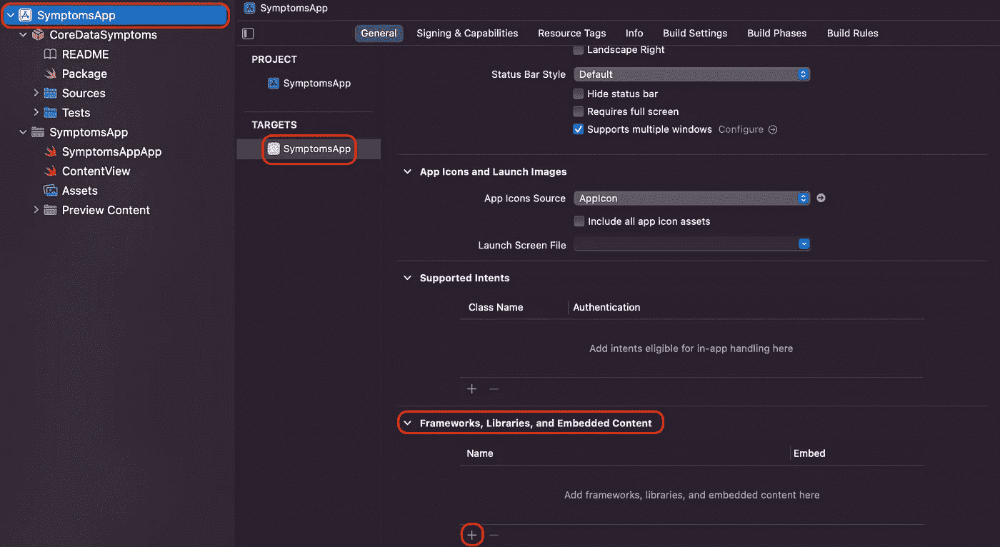
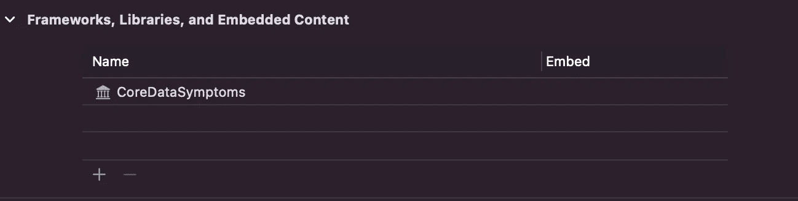
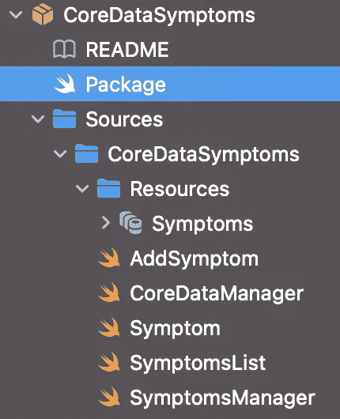
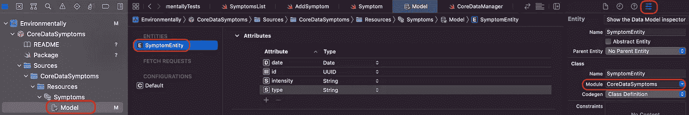

# 如何配置 Swift 包以公开 CoreData

> 原文：<https://betterprogramming.pub/use-coredata-from-an-spm-package-e82c465d5d02>

## 使用 SPM 包中的 CoreData


照片由[费利克斯·拉姆](https://unsplash.com/@feliixlam?utm_source=medium&utm_medium=referral)在 [Unsplash](https://unsplash.com?utm_source=medium&utm_medium=referral) 上拍摄

最近，我一直在帮助*公益*抗击中风[协会维护和改进](https://www.fightthestroke.org/home-eng) [MirrorHR iOS 应用](https://www.fightthestroke.org/mirrorhr-eng)。是一个非营利性协会，其目标是改善有脑瘫儿童的家庭的生活。

`MirrorHR — Epilepsy Research Kit`旨在减少儿童癫痫发作的数量和严重性，帮助家庭更好地跟踪癫痫发作、症状和事件，同时帮助医生更好地识别癫痫发作的潜在触发因素*。*这使得护理人员能够尽早介入处理癫痫发作，减少其影响，并避免家人整天待在医院。

在这几个月里，这款应用的功能和复杂性都有所增加。我们面临的挑战之一是将它分成更小的模块。众所周知，模块化有几个好处:

1.  可读性和可维护性更强的代码库。
2.  它支持并行开发。
3.  模块是隔离的，因此如果一个模块没有改变，它就不会崩溃。
4.  代码构建得更快。

我们提取的模块之一是负责跟踪症状的模块。为了跟踪他们，它利用 CoreData。关于如何使用 Swift 软件包中的 CoreData 的文档非常少，因此值得分享我们为使其工作所做的工作。

# 该应用程序

为了展示将 CoreData 导出到 Swift 包中的流程，我们准备了一个模拟症状跟踪的示例应用程序。这不是真正的`MirrorHR`应用程序，但类似的东西是为本文特别创建的。

该应用程序从 CoreData 数据库加载一些症状，并将其呈现在 SwiftUI 列表中。然后，我们可以添加一个具有强度的新症状。症状的日期对应于记录症状的时刻。



GIF 展示了工作中的示例应用程序。当它开始时，它会显示症状列表。点击`Log Symptom`按钮，出现一张表单。通过点击`Save`按钮，症状被记录。如果我们取消工作表，什么都不会发生。

# 创建主应用程序

作为第一步，让我们专注于创建一个工作应用程序。然后，我们可以专注于在一个单独的包中移动特性。

我们从创建 UI 开始。然后，我们实现了 CoreDataManager 和 SymptomManager。为了简洁起见，我们将只关注每个部分的相关代码。

## 症状列表视图

第一个屏幕是`SymptomList`视图。`View`的完整代码可以在这个[要点](https://gist.github.com/cipolleschi/64e5e57294642c795a3eae6b4818bd86)中探索。该视图的相关部分是数据如何从一个屏幕流向另一个屏幕。

下一个清单只显示了这些部分。

我们可以看到`View`需要一个症状列表和一个闭包来保存一个新症状。组件不知道，也不关心闭包是如何实现的，或者是什么实现了它。`View`必须只在屏幕上显示信息。

当用户点击`Log Symptom`按钮时，我们使用`.sheet`视图修改器呈现一个表单。工作表由`showAddItem`绑定控制，并呈现`AddSymptom` SwiftUI 视图。

为了创建`AddSymptom`视图，我们需要传递一个`saveItem`闭包。我们通过结合两种功能创造了一种新的封闭:

*   我们驳回起诉，
*   我们调用最初的`saveItem`。

这是一个 [**装饰器**](https://en.wikipedia.org/wiki/Decorator_pattern) 模式的匿名实现:`SymptomList`知道如何以及何时必须关闭表单；`AddSymptom`视图只负责添加症状。

## AddSymptom 视图

该视图包含两个`Picker`和一个保存症状的按钮。完整的代码可以在这里找到[，但是我们将只关注最相关的部分。](https://gist.github.com/cipolleschi/a0433e236e0cdabede62cc08dddfb110)

视图需要一个`saveItem`闭合。它还有几个`@State`变量来管理拣选器。当按下`save`按钮时，它创建一个新的症状并调用关闭。

## 核心数据管理器

现在让我们来关注一下`CoreDataManager`。该组件的主要职责是包装 CoreData 的细节，公开一个简单的 API 来存储和检索一个`SymptomEntity`:症状的数据库表示。

> **注:**有关如何实现 CoreData 堆栈的更多信息，请参考官方[文档](https://developer.apple.com/documentation/coredata)。

该清单实现了基本的 CoreData 配置。

1.  该类扩展了`NSPersistentContainer`。
2.  在`init`中，我们从包中检索对象模型文件，创建`NSManagedObjectModel`，初始化容器，并调用初始化函数。
3.  在`initialize`函数中，我们加载持久存储。这一步的失败表明了开发的错误配置:我们希望快速失败，所以一个`fatalError`是可以的。
4.  `CoreDataManager`公开了一个`symptoms()`方法来检索`SymptomsEntity` s
5.  管理器公开一个`saveSymptom(entity:)`方法来保存一个新症状。

## 症状管理器

这是连接`CoreData`和领域模型的类。它将`SymptomEntity`转换为`Symptom`，并隐藏所有的`CoreData`细节。

该类将一个`CoreDataManager`对象作为属性，它发布症状列表，因此其他组件可以监听它。它有几个初始化器:

*   一个接受一个`CoreDataManager`；
*   一个是无参数的。

前者可用于测试类，而另一个用于生产。

在`init`中，它通过从数据库中检索症状来准备由其他元素使用的`Symptoms`数组。最后，它公开了一个`save(symptom:)`方法和一个`refresh`函数来更新症状列表。

> **注意:**在实际应用中，`CoreDataManager`应该利用一个适当的`Storage`抽象。通过这种方式，我们可以将 CoreData 实施替换为利用不同支持的另一种存储。为了简洁起见，我们决定将这些类型结合在一起。可测试性和极端模块化不是本文的重点。

## 症状地图

我们现在有了所有的组件来组装这个应用程序。`SymptomApp.swift`文件的代码是这样的:

应用程序创建一个`symptomsManager`作为`@StateObject`:这样，每当`symptoms` `@Published`属性被更新时，这些变化会自动传播到`SymptomList`视图。

通过传递症状列表来初始化`SymptomList`视图，我们通过调用`symptomsManager`的 save 方法来实现`saveItem`闭包。

# 在 Swift 包中移动症状功能

至此，我们有了一个正常运行的小应用程序。现在让我们将该特性转移到一个专用的包中。

这个过程需要几个不同的步骤。让我们一个一个来看:

## 创建包

首先，让我们创建包。

1.  点击`File` > `New` > `Package`
2.  在对话框中，我们将其命名为`CoreDataSymptoms`。如果您的项目已经由 git 管理，就不要勾选“*创建 git 存储库”*。记得使用**添加到:**和**组:**下拉控件将其添加到适当的项目中。



让我们点击**创建**，等待 Xcode 完成它的工作。

在 project navigator 中，我们应该会看到一个包的图标，带有它的`README`、`Package.swift`文件以及`Sources`和`Tests`文件夹。



## 配置程序包文件

现在是时候更新`Package.swift`文件了。我们希望仅支持 iOS，并希望将我们将在接下来的步骤中创建的`Resources`文件夹中的所有内容添加到包中。更新文件应该如下所示:

重要的行是:

*   第 5 行，我们定义了支持的平台
*   第 15 行，我们决定将包含在`Resource`文件夹中的所有内容`process`。

## 将包添加到应用程序

我们需要将`Package`添加到`SymptomApp`中。否则，我们无法访问包内容。

1.  打开项目导航器(`⌘+1`)并点击项目。
2.  滚动直到我们找到`Frameworks, Libraries, and Embedded Content` 部分
3.  点击`+`按钮
4.  选择`CoreDataSymptoms`库。



在更改结束时，我们应该看到以下设置:



## 移动包源文件夹中的代码

现在，我们可以将文件从应用程序拖放到包中。

所有的源代码必须放在`Source`文件夹中。如果需要，我们可以创建子文件夹来将 UI 从管理器中分离出来。

数据模型应该放在`Resources`文件夹中。

最终的包应该是这样的:



源文件与`Resources`文件夹在同一层，而不是在里面。

## 设置公共修饰符并导入包

如果我们现在尝试构建项目，它将无法编译。将所有源代码移动到一个单独的包中，会对使用它们的其他文件隐藏所有的内部实现。我们需要公开应用程序需要什么。

*   更新`SymptomsManager`。我们需要在下面几行中添加`public`修饰符:

注意,`@Published`属性有一个`private(set)`修饰符。这意味着除了`SymptomsManager`本身，没有人可以更新数组。

*   更新`SymptomsList`视图。这是该包公开的唯一其他组件，应用程序需要它来呈现症状列表。在更新代码时，我们还需要创建一个`public init`。代码如下所示:

*   制作`Symptom`型号`public`。我们最终需要暴露症状模型。这是一个简单的对象模型，因此创建它没有任何风险。数据模型如下:

*   在`SymptomsApp.swift`中增加`import`语句。最后，我们可以`import`这个包来访问它所有的公共成员。

# 运行应用程序

现在应用程序构建完成了，但是如果我们运行它，它就会崩溃。我们遇到了两种必须解决的错误。

## Xcode 找不到数据模型的路径

即使我们将数据模型添加到资源中，Xcode 也找不到它。

发生这种情况是因为我们试图使用`Bundle.main` singleton，但是现在数据模型已经不在`main` `Bundle`中了。

一个 swift 包在`Bundle`类中合成了一个`.module`静态属性来访问正确的包。我们可以用下面一行来更新`CoreDataManager`的`init`:

我们更新了第 5 行，用`Bundle.module`代替`Bundle.main`。

## 由于`NSInvalidArgumentException`导致崩溃

另一个常见问题是下面的异常。

```
Terminating app due to uncaught exception 'NSInvalidArgumentException', reason: 'An NSManagedObject of class 'SymptomsEntity' must have a valid NSEntityDescription.'
```

通常，CoreData 会自动合成代表数据库实体的类。当将模型移动到包中时，在这个过程中出现了错误。我们可以采取不同的措施来解决这个问题。

*   用`⌘+⇧+K`清理项目并重新构建
*   打开`SymptomData`模型，选择`Symptom`实体。在右侧面板中，选择`Data Model Inspector`。在`Class`面板中，手动输入`Module`的名称。在我们的例子中，包的名字是`CoreDataSymptoms`。



*   如果仍然失败，创建一个`SymptomEntity`实体的扩展并覆盖`description`属性，使其返回实体名称。

最后一项更改有助于 CoreData 使用正确的实体名称。

经过这些更改后，应用程序应该能够正确运行，检索以前存储的症状，并允许用户记录新的症状。

# 结论

在今天的文章中，我们探讨了如何将基于 CoreData 的功能从应用程序代码导出到专用的 Swift 包中。这有很多好处，但是加快构建时间对我们来说是最重要的。

在本文中，我们描述了如何构建特性来简化导出过程。在将它移动到另一个包之后，我们只需要添加`import`语句，并创建必需的字段和类型`public`。但是我们不需要改变实际实现的任何东西。

最后，我们描述了如何解决最常见的 CoreData 问题。我们想强调的是，将代码和数据模型移动到不同的包中不会破坏运行时的任何东西。

数据库仍然存储在相同的位置，用于表示实体的模型以相同的方式工作，应用程序仍然能够检索先前存储的症状并存储新的症状。不需要数据迁移，这是一个巨大的解脱。