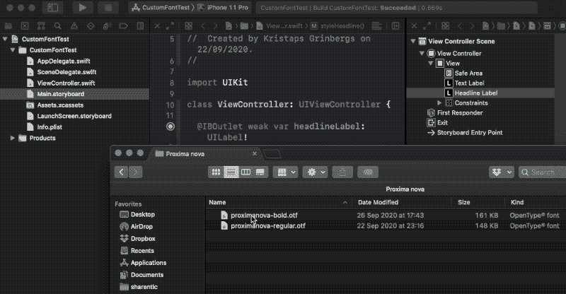
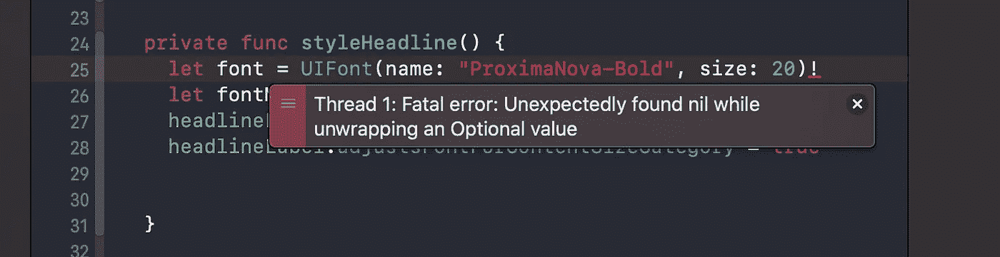
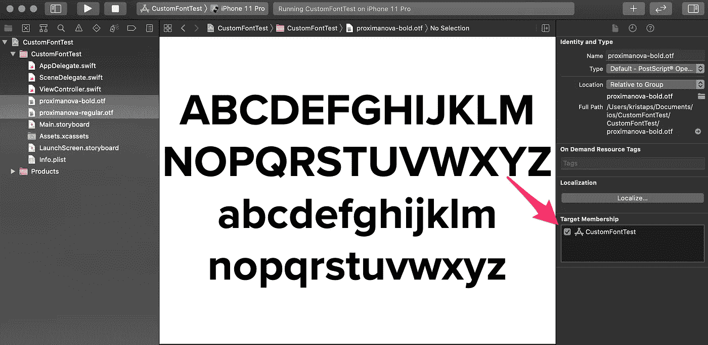
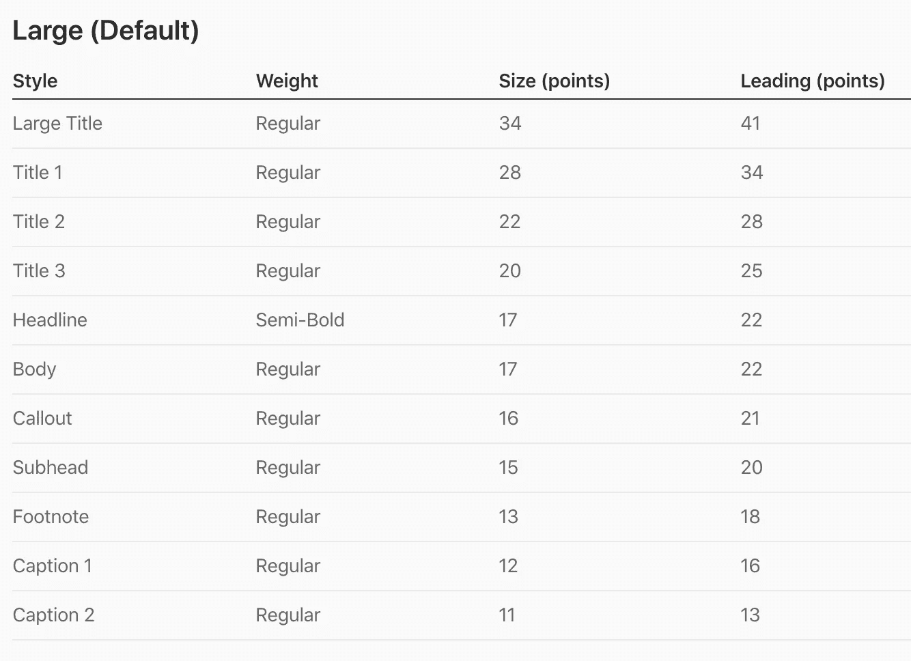
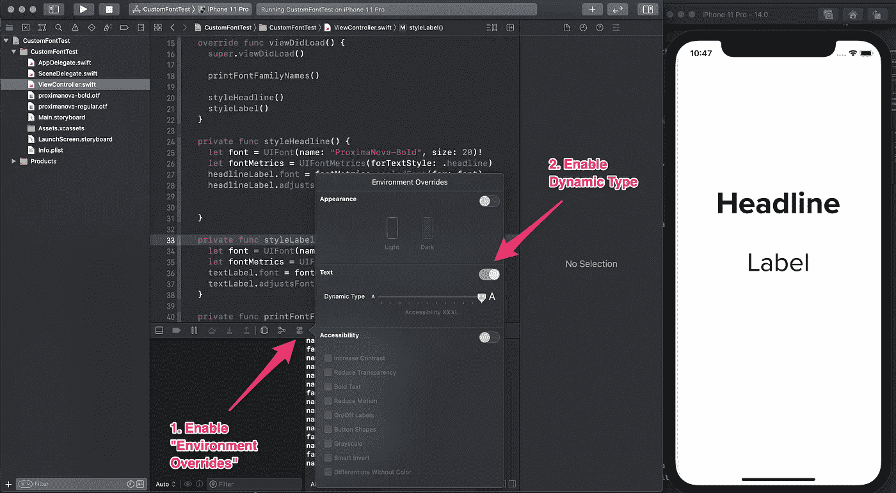

# 如何在 iOS 应用程序中使用动态字体的自定义字体

> 原文：<https://betterprogramming.pub/use-custom-font-with-dynamic-type-in-ios-apps-aeda0b314b12>

## 立即为您的 iOS 应用添加新字体


[NeONBRAND](https://unsplash.com/@neonbrand?utm_source=medium&utm_medium=referral) 在 [Unsplash](https://unsplash.com?utm_source=medium&utm_medium=referral) 上拍照。

不久前，我们用系统字体研究了动态类型。这一次，我们将了解如何在我们的 iOS 应用程序中使用动态字体和自定义字体。苹果提供了很棒的 API 来使我们的应用程序易于访问——即使我们使用自定义字体。

# 向应用程序添加自定义字体

首先，我们需要将自定义字体添加到项目中。这涉及到几个步骤，所以让我们复习一下。

我们需要向 Xcode 应用程序项目添加一个字体文件。目前，True Type 字体(。ttf)和开放式字体(。otf)文件。只需在 XCode 项目中拖放文件。请小心选择要在其中使用该字体的目标:



如果您忘记将字体添加到 Xcode 项目中的特定目标成员中，则在找不到字体文件时会遇到问题:



要解决这个问题，只需选中复选框并将其添加到您的指定目标:



完成之后，转到`Info.plist`文件，用键`Fonts provided by application`添加一个新条目。在那里，我们需要提供一个数组，其中包含我们添加到项目中的所有字体文件。

检查字体文件是否已经添加，我们是否可以使用这段代码来打印所有可用的字体系列和名称:

只要将这段代码粘贴到你的`AppDelegate` `didFinishLaunchingWithOptions`中，当你运行 app 时，它就会在控制台中打印字体家族和名称。

# 对动态类型使用自定义字体

要使用自定义字体的动态类型，我们需要使用`UIFontMetrics`。它是一个实用程序对象，有助于获得根据文本大小和辅助功能设置进行缩放的自定义字体。换句话说，这个类帮助我们显示考虑了用户字体和可访问性设置的自定义字体。

为此，我们需要用具体的大小初始化一个自定义字体的实例。为了确定具体的大小，我们可以使用苹果文档中的动态类型大小[表。](https://developer.apple.com/design/human-interface-guidelines/ios/visual-design/typography/)



假设我们添加了一个具有大标题行为的标签。这意味着我们需要使用 34 号字体。然后我们使用`UIFontMetrics`并为特定的文本样式初始化一个实例。最后，我们使用`scaledFont`函数设置标签的字体，并提供我们的自定义字体:

# 文本大小改变时更新

为了测试一切是如何工作的，我们可以在 Xcode 的环境覆盖中启用文本大小:



如果你改变它，你可以注意到我们的应用程序没有任何变化。要启用自动变更，我们需要设置`adjustsFontForContentSizeCategory`。它表示当设备类别改变时，对象应该自动更新其字体。

```
label.adjustsFontForContentSizeCategory = true
```

现在我们可以进行全面测试，应该会看到我们的标签字体根据文本大小和可访问性设置进行了调整。

# TL；速度三角形定位法(dead reckoning)

用自定义字体支持动态类型听起来可能是一项棘手的任务，但事实并非如此。通过使用`UIFontMetrics`实用程序对象，我们可以根据用户在文本大小或可访问性设置中指定的内容来缩放我们的自定义字体。

# 资源

*   [示例 app](https://github.com/fassko/custom-font-dynamic-type)
*   [用动态类型构建应用](https://developer.apple.com/videos/play/wwdc2017/245/)
*   [如何使用 UIFontMetrics 调整自定义字体的大小](https://www.hackingwithswift.com/example-code/uikit/how-to-resize-a-custom-font-using-uifontmetrics)
*   [使用动态类型的自定义字体](https://useyourloaf.com/blog/using-a-custom-font-with-dynamic-type/)
*   [iOS 字体大小指南](https://learnui.design/blog/ios-font-size-guidelines.html)
*   [向您的应用添加自定义字体](https://developer.apple.com/documentation/uikit/text_display_and_fonts/adding_a_custom_font_to_your_app)
*   [排版——人机界面指南](https://developer.apple.com/design/human-interface-guidelines/ios/visual-design/typography/)