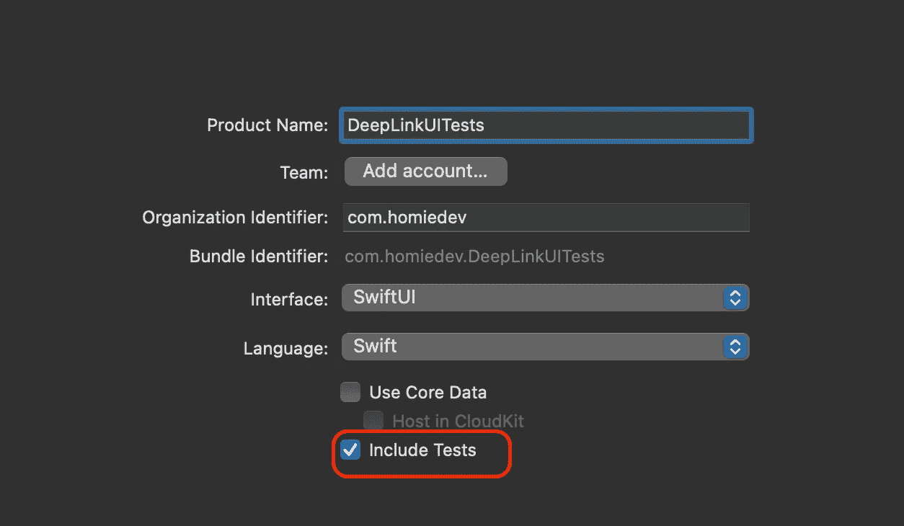
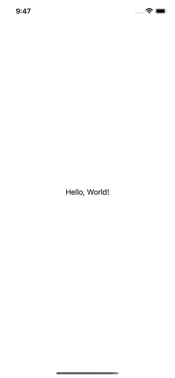
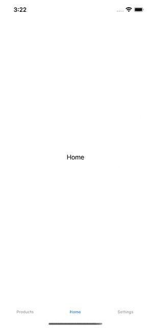

# 使用深层链接来加速你的 UI 测试

> 原文：<https://betterprogramming.pub/use-deep-links-to-speed-up-your-ui-tests-5f84397581b2>

## 避免深度链接测试中不必要的步骤

照片由[卡姆兰·阿卜杜拉耶夫](https://unsplash.com/@thekamranzadeh?utm_source=medium&utm_medium=referral)在 [Unsplash](https://unsplash.com?utm_source=medium&utm_medium=referral) 上拍摄

在上一篇文章中，我们谈到了[深度链接](/scalable-navigation-with-deep-links-in-swiftui-96cea1764994):它们是什么，如何设置，如何在我们的 app 中处理。我们展示的只是一种可能的应用，但它们可以用于许多其他用例。

我最喜欢的深层链接用例之一是加速用户界面测试。如果您熟悉 Xcode UI 测试，您会知道它有一些缺点:

*   编写代码导航到正确的屏幕需要时间。
*   很难正确地编写它(并且 Xcode 记录功能会生成奇怪的代码)。
*   它比正常的测试需要更多的时间来运行。

深度链接主要针对前两点:通过使用深度链接，我们可以直接导航到我们想要测试的屏幕。然后，我们只需要为那个屏幕编写 UITest，允许我们隔离测试。此外，我们还在端到端测试深层链接处理逻辑是否正常工作！

# 设置项目

在**设置深层链接**部分，项目的设置与这里的[所示的](/scalable-navigation-with-deep-links-in-swiftui-96cea1764994)非常相似。

1.  创建一个新的 Xcode 项目，并将其命名为`DeepLinkUITests`
2.  选择`Swift`作为语言，`SwiftUI`作为界面
3.  确保选中`Include Tests`复选框

Xcode 创建完项目后，让我们通过以下方式设置深层链接:

1.  在项目导航器中选择项目( **⌘ + 1** )。
2.  选择**信息**标签。
3.  向下滚动到 **URL 类型**部分。
4.  点击底部的 **+** 按钮。
5.  填写右上角的 **URLSchemes** 字段。

对于这个例子，我使用的是`deeplinkuitest`方案，因此如果我们安装了应用程序，并且我们试图从 Safari 导航到`deeplinkuitest://`，我们将打开这个应用程序。

最后，让我们更新 SwiftUI 代码以接受深层链接并对其做出反应:下面是一个玩具示例，以查看设置是否有效。

## 更新应用程序结构

打开`DeepLinkUITestApp.swift`文件，让我们更新它，如下所示:

在这里，我们添加了一些东西:

1.  一个`@State`变量来选择要显示的文本。
2.  `ContentView`中的一个`text:`参数向其传递文本。
3.  处理深层链接和更新文本的`onOpenURL`修饰符。
4.  在 UITest 中抓取视图的`accessibilityModifier`。

仅仅这样是不行的，因为我们还没有在`ContentView`中绑定文本属性。

## 更新内容视图

打开`ContentView.swift`文件，并按如下方式更新它:

在这个文件中，我们是:

1.  向`ContentView`添加一个变量。
2.  使用`Text`组件中的变量。
3.  更新`ContentView_Previews`以构建项目。

我们现在可以运行应用程序，这是我们在 safari 中测试深层链接时可以观察到的情况。

手动打开深层链接的演示

# 从 UI 测试中打开带有深度链接的应用程序

现在我们有了一个原型，我们可以编写第一个 UI 测试。我们的项目已经有了一个`DeepLinkUITestUITests`文件夹，其中有几个为我们的测试创建框架的文件。

要从深层链接打开应用程序，我们需要模拟我们在视频中手动执行的操作:

1.  我们需要打开 safari
2.  键入深层链接
3.  导航回应用程序。

来自[的 Bruno Rocha](https://twitter.com/rockbruno_) 有一篇关于该主题的很好的[深度文章](https://swiftrocks.com/ui-testing-deeplinks-and-universal-links-in-ios)。强烈建议看一下，了解一下是怎么回事。为了这篇文章，我提取了一个我们可以使用的小工具。

在 UI 测试文件夹中，创建一个新的 Swift 文件，并将其命名为`DeepLinkUtils`。

该文件包含两个`static`函数:`openFromSafari`和`tapIfExists`。

`openFromSafari`是我们用来从 Safari 启动应用程序的主要功能。该功能:

1.  打开`Safari`应用程序并等待其启动。
2.  在 Safari onboarding 中导航，如果这是模拟器第一次启动它。这一步对于进行可靠的测试很重要。
3.  抓取`Address`文本字段，可以在其中输入 URL。
4.  处理键盘启动，如果有的话。
5.  输入深层链接。
6.  与对话框交互以打开深层链接。

`tapIfExists`功能只是一个实用功能，给定一个应用程序和一个按钮名称，检查该按钮是否存在于当前屏幕中，并点击它。

## 第一次测试

我们现在可以编写第一个测试来检查我们的设置是否正确。让我们打开`DeepLinkUITestUITests.swift`文件，用下面的代码填充`testExample`函数:

该测试的工作原理如下:

1.  它会启动我们的应用程序。
2.  它抓取了`ContentView`，并断言初始状态是我们所期望的。
3.  它使用实用程序功能从 Safari 中重新打开应用程序。这将把当前的前台应用从我们的应用切换到 Safari。
4.  它等待我们的应用程序回到前台。
5.  它断言文本现在已经更改。

我们现在可以运行我们的 UI 测试并验证它成功了！

# 编写更复杂的测试

既然我们知道设置工作正常，我们可以尝试构建一个更复杂的示例，实际使用我们的深层链接导航到正确的屏幕并运行测试。

在本例中，我们有一个包含三个选项卡的选项卡栏:主页、产品和设置。该测试检查我们是否可以导航到具有给定描述的特定产品。

通常，没有深层链接的 UI 测试需要:

1.  启动应用程序，
2.  等待它被启动，
3.  抓住 TabBarButton XCUIElement，
4.  点击它，
5.  从列表中抓取产品，
6.  点击它，
7.  断言我们在正确的屏幕上，
8.  开始断言我们想要测试的东西。

这个测试可能会在任何一个步骤中失败，并且需要编写一些(重复的)代码。有了深层的联系，反而会变成这样:

1.  启动应用程序，
2.  等待它被启动，
3.  断言我们在正确的屏幕上，
4.  开始断言我们想要测试的东西。

一半的步骤只是为了这个玩具的例子！你能想象这一招在大 app 里能省多少步骤吗？

## 创建应用程序

我们需要为应用程序编写不同的屏幕。从导航树的底部开始，我们需要一个带有`Product`模型的`ProductView`。

该代码包含一个具有三个属性的`Product`模型:

*   一个`id`，
*   一个`title`，
*   一个`description`。

它还公开了一个静态变量来创建一个产品样本，就这个例子而言。

`ProductView`可以用一个产品的 id 来初始化，它用一个大标题来呈现它的描述。

我们需要的第二个屏幕是一个显示产品列表的`ProductListView`。代码如下所示:

这个视图有一个`products`数组，用来自`Product`模型的`sampleData`初始化。它还有一个`@Binding`变量来跟踪活动链接。可以通过传递一个`productId`来初始化`View`，以强制从复合层中进行选择。

属性在`NavigationView`组件中呈现产品列表。有趣的部分是`NavigationLink`初始化器:通过使用`init(_:destination:tag:selection)`构造函数，我们启用了编程导航。当`selectedProduct`与分配的`tag`匹配时，SwiftUI 会自动导航到合适的`ProductView`。

我们需要的最后一个组件是标签栏。我们可以打开`DeepLinkUITestApp`并更新如下:

该应用程序会跟踪当前选定的选项卡和选定的产品(如果有)。这些状态变量用于以编程方式控制导航。

## 处理深度链接

然后，我们需要处理一个传入的深层链接。我们在主应用程序中使用了`onOpenURL`修改器。代码将如下所示:

`onOpenURL`关闭工作如下:

1.  它从`URL`获取`URLComponents`。
2.  它检查主机是否是已知的选项卡之一。
3.  如果主机是`"products"`，它从`queryItems`中提取`id`。
4.  它等待应用程序导航到选定的选项卡。
5.  它选择合适的产品。

下面的 gif 展示了运行中的代码。

## 编写测试

最后，我们可以在我们的`Product`屏幕上编写 UITest。

在编写测试之前，我们需要添加一些可访问性标识符，以获取我们需要运行断言的`XCUIElement`:

1.  在`DeepLinkUITestApp`中，在`.tag("home")`修饰符下面增加一个`.accessibilityIdentifier("home")`。
2.  在`ProductView`中，在`Text`组件后增加一个`.accessibilityIdentifier(“product_description”)`。

让我们打开`DeepLinkUITestUITests.swift`文件，用下面的代码更新`testExample`函数。

这些测试类似于我们在文章中写的第一个测试:

1.  它会启动应用程序。
2.  它验证初始屏幕是否是预期的屏幕。
3.  它打开来自`Safari`的应用程序。
4.  它等待应用程序回到前台。
5.  它获取`productDescription`元素并断言它的存在及其值。

# 结论

今天我们看了深度链接和 UITests 的一个有趣的应用。我们回顾了如何设置深层链接的应用程序以及 UITests 是如何工作的。我们还探索了如何以编程方式使用`Safari`打开我们的应用程序，我们编写了一个测试来验证这一点。

使用深层链接来写测试可以节省很多时间。此外，我们执行的操作越少，测试就越快:UITests 操作比标准测试指令要重得多。UITest 必须将这些指令从一个进程(ui test)传递到另一个进程(app ),这需要时间。

这种方法还有另一个好处:这是一个端到端的测试，检查我们的深层链接逻辑是否正常工作，我们还需要什么？