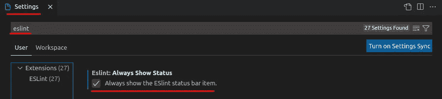
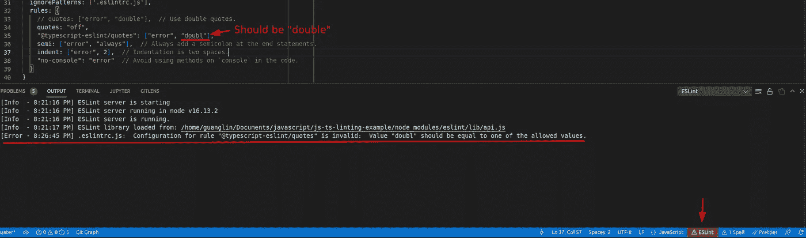
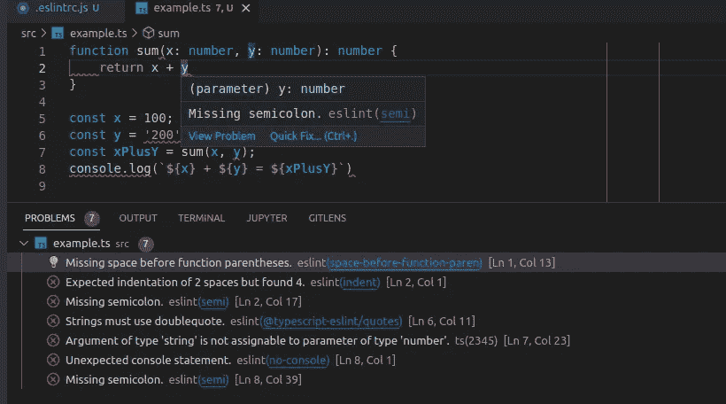

# 如何使用 ESLint 在 JavaScript 和 TypeScript 中编写优雅的代码

> 原文：<https://betterprogramming.pub/use-eslint-to-make-your-javascript-typesript-code-more-professional-1170bbdff32b>

## 使用 ESLint 提高您的 JS/TS 代码质量


照片由猎人从 [Unsplash](https://unsplash.com/photos/MYbhN8KaaEc) 比赛

默认情况下，JavaScript 具有非常灵活的语法。您可以更改变量的类型，对字符串使用单引号和双引号，缩进任意数量的空格，省略结尾的分号，等等。然而，仅仅让一个项目工作是不够的，尤其是如果你在一个团队中工作。我们应该在同一个团队中有一个编码标准，这样代码可以更容易审查和维护。它还可以使您的代码更加专业，这对您作为开发人员的职业生涯有益。 [ESLint](https://github.com/eslint/eslint#eslint) 是实现这一目的的绝佳工具。

类似于 Python 的 [***pylint***](https://lynn-kwong.medium.com/use-black-mypy-and-pylint-to-make-your-python-code-more-professional-b594512f4362) 工具，ESLint 是一个静态代码分析工具，可以用来检查 JavaScript 代码的代码质量和编码风格。曾经有一个 [TSLint](https://palantir.github.io/tslint/) 工具，用于键入脚本代码。然而，现在不推荐使用它，我们也应该对 TypeScript 代码使用 ESLint。

对于初学者来说，ESLint 可能有点难以入门，尤其是如果您想用它来检查 TypeScript 代码的话。在这篇文章中，我们将通过实践教程介绍如何安装和设置 ESLint for JavaScript 和 TypeScript 项目。然后你会对 ESLint 的工作原理有更好的理解，并开始在你的项目中使用它。

# 安装 Node.js

[ESLint 包](https://github.com/eslint/eslint#installation-and-usage)将由节点包管理器 [npm](https://en.wikipedia.org/wiki/Npm_(software)) 安装。因此，为了这篇文章，我们需要在我们的计算机上安装 [Node.js](https://nodejs.org/en/) 。如果你还没有安装 Node.js，可以从 [this lin](https://nodejs.org/en/) k 下载。请注意，最新版本会随着时间的推移而变化，但命令应该是相同的。

## 设置项目文件夹

如果您使用 JS 框架，通常会自动为您创建项目文件夹。但是，让我们从头开始创建项目文件夹，以便稍后介绍的设置可以通用。要初始化 Node.js 项目，请运行以下命令:

根据设置向导输入项目信息。将根据所提供的信息为您创建一个`package.json`文件。由于您的项目可能不是 Node.js 项目，所以可以删除一些样板代码，如`main: index.js`。当 ESLint 安装完成后，我们将更新`scripts`部分。

# 安装 ESLint 并设置配置文件

要安装和设置 ESLint，请运行以下命令:

```
$ **npm init @eslint/config**
```

选择最适合您项目的选项，`package.json`文件将相应更新。对于此演示项目，选择了以下选项:

如果您的项目不使用 TypeScript，您可以在安装过程中跳过 TypeScript。另一方面，如果您的项目是 TypeScript 项目，您也需要安装 TypeScript:

```
$ **npm install --save-dev typescript**
```

在这个阶段，`package.json`文件会是这样的:

要将 ESLint 用于 TypeScript 代码，我们需要一个名为`tsconfig.json`的 TypeScript 配置文件。这个文件通常会由像 Angular 这样的 JS 框架自动生成。如果您想从头开始创建一个`tsconfig.json`文件，运行这个带有`[npx](https://nodejs.dev/learn/the-npx-nodejs-package-runner)`的命令:

```
$ **npx tsc --init**
```

会给你创建一个`tsconfig.json`文件，里面有很多模板代码，大部分都不需要碰。您可以根据自己的需求进行相应的调整。

最后也是最重要的，正如您可能已经注意到的，已经为我们创建了一个名为`***.eslintrc.js***`的配置文件。如果它不是自动创建的，那么你需要手动创建它，并将下面的设置复制到其中。

该文件包含 ESLint 的自定义设置。如果您的项目是一个 JavaScript 项目，如果您不需要任何自定义设置，您可以直接使用它。然而，我们需要[添加一些设置](https://typescript-eslint.io/docs/linting/typed-linting/)才能用来检查我们的类型脚本代码。此外，我们将添加一些[自定义规则](https://eslint.org/docs/latest/rules/)来检查我们的代码。更新后的`.eslintrc.js`文件有以下内容:

重要的是，我们必须在`***overrides***`节下添加对 TypeScript 代码的设置，否则 ESLint 无法同时用于检查 JavaScript 和 TypeScript 代码。

对于规则来说，键是可以在这里[找到的规则名](https://eslint.org/docs/latest/rules/)，值是对应规则的动作。如果该值是一个字符串或数字，那么它就是[错误级别](https://eslint.org/docs/latest/user-guide/getting-started#configuration)。这里的“`error`或`2`意味着违反规则将返回一个错误，退出代码将是 1。如果值是一个数组，那么第一个元素是错误级别，第二个元素是规则的配置。例如，第一条规则规定只能使用双引号，否则将返回错误。

如果您在 IDE 中看到一些警告，说 TypeScript 编译器没有将`.eslintrc.js`包含在任何路径中，那么您可以添加它以进行 linted，或者对于林挺忽略它。忽略它更简单，您只需要像上面演示的那样添加一个名为`ignorePatterns`的新键，或者将它添加到一个名为`[.eslintignore](https://github.com/eslint/eslint/blob/main/.eslintignore)`的文件中。如果您也想 lint 这个文件，您需要将它添加到`tsconfig.config`。如果您想添加`.eslintrc.js`进行链接，请查看[该堆栈溢出讨论](https://stackoverflow.com/questions/63118405/how-to-fix-eslintrc-the-file-does-not-match-your-project-config)。

如果您在`.eslintrc.js`中看到`TS2304:Cannot find name '__dirname'`，您需要运行这个命令来修复它:

```
$ **npm install @types/node --save-dev**
```

## 使用 ESLint 检查 JavaScript 代码

现在已经安装并设置了 ESLint，让我们将这个 JS 文件添加到项目文件夹中，并使用 ESLint 来检查它。这个帖子的所有文件都可以在这个帖子的末尾找到。

这个文件有一些明显的错误和不标准的格式，可以通过 ESLint 检查和修复。

如果您只想让 ESLint 检查代码，请运行以下命令:

```
$ **npx eslint src/example.js**
```

我们将看到可用于修复代码的有用错误:

如果我们希望 ESLint 自动为我们修复代码，我们可以为上面的命令添加`--fix`选项:

```
$ **npx eslint src/example.js --fix**
```

ESLint 可以自动修复大多数外观问题。但是，有些问题需要手动解决。例如，ESLint 不会自动删除`console.log`，您需要自己删除它:

## 使用 ESLint 检查类型脚本代码

现在让我们使用 ESLint 来检查这个用 TypeScript 编写的文件。它与 JavaScript 的内容相同，只是在函数中添加了类型:

检查 TypeScript 代码的命令是相同的。我们可以显式指定扩展名，但这是可选的:

```
$ **npx eslint --ext .ts src/example.ts**
```

将报告类似的错误:

但是，引号中没有检查 TypeScript 代码，这非常奇怪。这其实是[一个已知问题](https://typescript-eslint.io/rules/quotes/)。如果你想为 TypeScript 代码检查引号，你可以根据[这个指令](https://typescript-eslint.io/rules/quotes/)更新规则:

TypeScript 代码的引号问题可以通过[更漂亮的](https://prettier.io/)很容易地解决，这将在后面的[帖子](https://lynn-kwong.medium.com/create-a-pre-commit-git-hook-to-check-and-fix-your-javascript-typescript-code-b04de61834bd)中介绍，用于设置 Git 预提交工作流来自动检查 JS/TS 代码。

# 使用 tsc 检查类型脚本代码

需要注意的是，ESLint 没有报告 [example.ts](https://gist.github.com/lynnkwong/9f8b9fd85e8e96036dd795bf8a936037) 中第 7 行的不一致类型。不幸的是，这就是它的工作方式，因为 ESLint 只报告来自它自己的 linters 的错误，而不报告 TypeScript 编译错误。如果我们想要检查这个例子中显示的类型的 TypeScript 编译错误，我们需要使用`[tsc](https://www.typescriptlang.org/docs/handbook/compiler-options.html)`命令。我们通常将它与`--noEmit`选项一起使用，因为我们只想检查编译错误，不想创建编译后的 JavaScript 文件。

让我们使用`tsc`来检查我们的打字稿代码:

```
$ **npx tsc src/example.ts --noEmit**
```

现在当我们调用`sum`函数时，我们可以在第 7 行看到不一致的类型:

## 在 package.json 中为林挺添加脚本

让我们在`package.json`中添加一些脚本，可以方便地调用这些脚本来检查项目中的所有文件:

注意，我们可以给`eslint`添加文件扩展名，但不能给`tsc`添加。

现在我们可以对项目中的所有文件运行类型检查和林挺了:

```
$ **npm run check-types**
$ **npm run lint**
```

# 在 VS 代码中使用 ESLint

如果你想把 ESLint 添加到一些代码检查管道中，比如 Git 预提交钩子，在命令行上使用 ESLint 是强制性的，这将在[一篇即将发布的文章](https://lynn-kwong.medium.com/create-a-pre-commit-git-hook-to-check-and-fix-your-javascript-typescript-code-b04de61834bd)中介绍。当你编码的时候，你实际上想要 IDE 给你一些实时的反馈，这样你就可以立即修复问题。如果使用 [VS Code](https://levelup.gitconnected.com/some-tips-to-make-your-vs-code-more-efficient-db77ec7071f8) ，可以安装 ESLint 扩展，让它实时检查你的代码。

请注意，ESLint 扩展在您的项目文件夹中共享相同的配置文件。您可以启用 ESLint 状态栏，以便在您的`.eslintrc.js`文件设置不正确时看到错误:



现在，如果您向`.eslintrc.js`引入一些错误，您可以立即看到有用的错误消息:



最后，如果安装并启用了 ESLint 扩展，并且正确设置了`.eslintrc.js`，您可以立即看到 VS 代码中的错误:



VS 代码是 JS/TS 的一个很棒的工具，如果你对 VS 代码的一些默认设置不满意，想让它变得更方便，你可以查看[这篇文章](https://levelup.gitconnected.com/some-tips-to-make-your-vs-code-more-efficient-db77ec7071f8)。

在这篇文章中，我们介绍了如何安装和设置 ESLint 来检查 JavaScript 和 TypeScript 代码的代码质量和编码风格。对于初学者来说，ESLint 可能有点难以入门，尤其是如果您想用它来检查 TypeScript 代码的话。通过这个实践教程，你将会对 ESLint 有一个更好的理解，并且可以开始在你的项目中使用它。在下一篇文章中，我将介绍如何使用 ESLint 和其他一些工具如[beauty](https://github.com/prettier/prettier)、 [lint-staged](https://github.com/okonet/lint-staged) 、 [husky](https://github.com/typicode/husky) 等来自动检查和修复您的 JavaScript/TypeScript 代码。

帖子里介绍的所有代码都可以在[这个 repo](https://github.com/lynnkwong/js-ts-linting-example) 里找到。

## 相关文章:

*   [如何用有角度的材料创建一个简单的对话框](https://javascript.plainenglish.io/how-to-create-a-simple-dialog-box-with-angular-material-8cd68440ddd1)
*   [创建一个预提交 Git 挂钩来自动检查和修复您的 JavaScript/TypeScript 代码](https://lynn-kwong.medium.com/create-a-pre-commit-git-hook-to-check-and-fix-your-javascript-typescript-code-b04de61834bd)