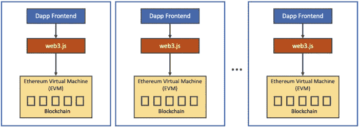
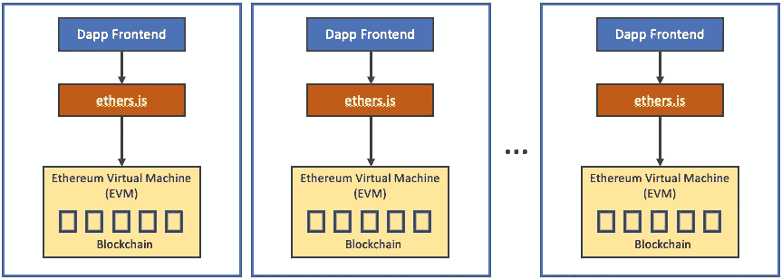
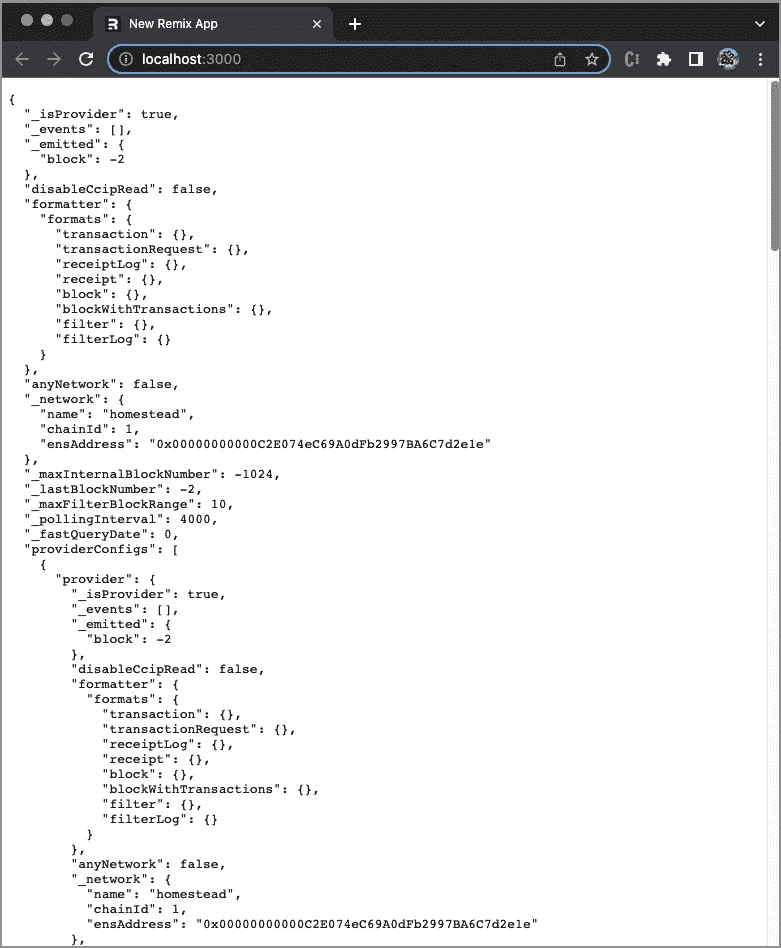
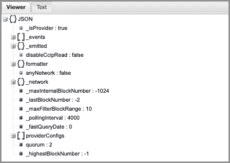

# 使用 Ethers.js 与 Remix 中的以太坊虚拟机进行交互

> 原文：<https://betterprogramming.pub/use-ethers-js-to-interact-with-the-ethereum-virtual-machine-in-remix-a0559fe5a0f1>

## ethers.js 初学者指南


照片由[钟登祥](https://unsplash.com/@dengxiangs?utm_source=unsplash&utm_medium=referral&utm_content=creditCopyText)在 [Unsplash](https://unsplash.com/s/photos/ethereum?utm_source=unsplash&utm_medium=referral&utm_content=creditCopyText) 上拍摄

[Ethers.js](https://github.com/ethers-io/ethers.js) 和 [web3.js](https://github.com/ChainSafe/web3.js) 是两个 JavaScript 库，允许开发者与以太坊区块链进行交互。两者都是开源库，可以为以太坊开发者完成任务。

以下是 ethers.js 和 web3.js 之间的 npm 趋势图:


作者图片

Web3.js 由以太坊基金会建立，有 281 个贡献者。该库已被许多项目广泛采用。我们已经写了[一篇关于如何在 Remix](https://medium.com/p/f4923b18e707) 中使用 web3.js 的文章。



作者图片

在本文中，我们将仔细研究 ethers.js，它最初是由加拿大开发人员 Rick Moore 开发和维护的。目前，它有 14 个贡献者。该库具有较小的包大小，经过了良好的测试、记录和维护。



作者图片

# 工作环境

我们使用全栈 React 框架 [Remix](/end-to-end-guide-to-remix-a-full-stack-web-framework-8dc56eb6a9c7) 作为探索 ethers.js 的基础。

```
% npx create-remix my-remix-app
% cd my-remix-app
```

设置`ethers`，连同`react-json-pretty`:

```
npm i ethers react-json-pretty
```

这些包成为`package.json`中`[dependencies](/package-jsons-dependencies-in-depth-a1f0637a3129)`的一部分:

Remix 工作环境准备探索 ethers.js。

# 提供者、签署者和合同

提供者、签名者和契约是 ether.js 中的三个基本类。它们用于与智能契约进行通信。

## 供应者

Provider 是一个提供以太网连接的类。它提供对区块链及其状态的只读访问。

`ethers`输出的`getDefaultProvider`，可以用来构建提供者。它有两个参数——第一个是`network`,取以下值之一:

*   `homestead` -家园(Mainnet)
*   Ropsten(工作验证测试网)
*   `rinkeby` - Rinkeby(权威验证测试网)
*   `goerli` -格利(clique testnet)
*   `kovan` - Kovan(权威验证测试网)

第二个参数是`options`，它支持以下键/值对:

*   `etherscan` : `ETHERSCAN_API_KEY`
*   `infura` : `INFURA_PROJECT_ID`
*   `alchemy` : `ALCHEMY_API_KEY`
*   `pocket` : `POCKET_APPLICATION_KEY`
*   `ankr` : `ANKR_API_KEY`

在下面的代码中，我们选择了`infura`网络，以及从我们的 web3.js 项目创建的`INFURA_PROJECT_ID`、`57e665ef67b44c4687ad529b8b89397c`、[。](/how-to-use-web3-js-to-interact-with-the-ethereum-virtual-machine-in-remix-f4923b18e707)

或者，我们可以通过从`ethers`导入`provides`来创建一个提供者，并使用相同的参数导入`new providers.InfuraProvider`。

## 签名者

Signer 是一个使用私钥对消息/事务进行签名以授权操作的类。它是用户钱包地址的抽象。它可以被`Wallet`的静态方法实例化。

## 合同

Contract 是一个类，表示以太网上特定契约的连接。

我们可以从`ethers`导入`Contract`，用`new Contract(daiAddress, daiAbi, provider)`创建一个实例。

*   `daiAddress`是以太坊名称服务。我们将其设置为`"dai.tokens.ethers.eth"`。Dai 是一种稳定的币加密货币，旨在使其价值尽可能接近一美元。
*   `daiAbi`指定与应用程序二进制接口(ABI)的协定，该协定描述了它所具有的方法和事件。这些方法用于与链上的契约(受管契约)进行通信，并对数据进行编码和解码。

*   `provider`是以太坊网络的连接。

# 在混合中使用提供者、签署者和合同

我们使用 Remix 作为工作环境。`app/entry.server.jsx`是请求到达服务器时运行的第一段 JavaScript。它只加载必要的数据，但是开发人员需要处理响应。该文件将 React 应用程序呈现为一个字符串/流，作为响应发送给客户端。

这里是修改后的`app/entry.server.jsx`，它创建了一个提供者(第 6 行)、一个签名者(第 11 行)和一个契约(第 33 行)。

这些实例被导入到默认情况下调用的索引路由`app/routes/index.jsx`。

在第 2 行中，`react-json-pretty`被导入为`JSONPretty`，美化了 JSON 数据。该组件用于第 60 行。

在第 3 行中，`utils`，一个实用程序集合，从`ethers`导入。

第 4 行`daiContract`、`provider`、`signer`从`app/entry.server.jsx`导入。

`loader`函数(第 6–56 行)是一个特殊的 API。它被导出以便在渲染之前在服务器上调用。我们用它来显示`signer`、`daiContract`和`provider`的内容。

对于 signer，我们可以查看私钥(第 7 行)、公钥(第 11 行)和地址(第 15 行)。

签名消息可用于各种身份验证方法和链外(不受控制的契约)操作，如有必要，可将其置于链上。

在第 19 行，它签署了一个字符串消息。

在第 31 行，它签署了一个摘要散列。

在第 35 行，它检索联系人姓名。

在第 39 行，它检索符号名。

在第 43 行，它以`BigNumber`格式检索余额，这是一个安全地允许对任何数量的数字进行数学运算的对象。

默认单位为卫，是以太坊的原生加密货币 Ether)的最小面额。以下是不同单位之间的换算率。

```
1 Ether = 10³Finney = 10⁶Szabo = 10⁹Gwei = 10¹²Mwei = 10¹⁵Kwei = 10¹⁸Wei
```

在第 47–53 行，余额由不同的单位格式化。

在第 55 行，用`provider`对象解析`loader`函数。

在第 59 行，调用`useLoaderData`来检索加载的数据`result`。

第 60 行，`JSONPretty`在浏览器上显示`result`。

通过`npm run dev`执行 Remix app，进入浏览器窗口。我们看到一长串的`provider`物体。



作者图片

通过`[http://jsonviewer.stack.hu/](http://jsonviewer.stack.hu/)`折叠`provider`对象:



作者图片

展示了一级道具和方法。

与`web3.js`相比，`ethers.js`中的数据结构更加简洁，不存在循环引用问题。否则，它们完成类似的操作。

# 结论

我们已经展示了如何使用 ethers.js 通过 Infura 与以太坊虚拟机进行交互。

ethers.js 和 web3.js 是两个 JavaScript 库，允许开发人员与以太坊区块链进行交互。在 Web3 开发期间，这两者都呈指数级增长。开发这些 JavaScript 包是为了塑造互联网的未来。

感谢阅读。我希望这有所帮助。如果你有兴趣，可以看看[我的其他媒体文章](https://jenniferfubook.medium.com/jennifer-fus-web-development-publications-1a887e4454af)。